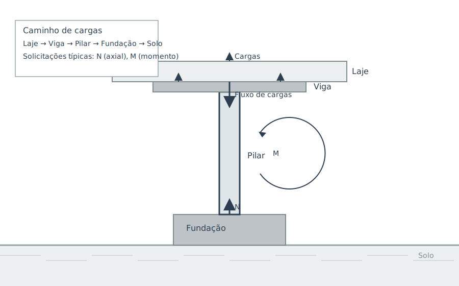

## Aula 1 – Introdução e Tipologia de Pilares

##### Objetivos da aula
- Compreender o papel dos pilares no caminho de cargas e no desempenho global das estruturas.
- Reconhecer tipologias de pilares (posição, seção, esbeltez) e implicações de projeto.
- Introduzir conceitos de flexo‑compressão, excentricidade mínima e efeitos de segunda ordem.

##### Conteúdo da aula (texto base)

**1) Papel do pilar e caminho de cargas**

- O pilar é o elemento vertical que transmite as ações das lajes/vigas à fundação e ao solo.
- Fluxo típico de cargas:
  - Lajes → Vigas → Pilares → Fundação → Solo
- A integridade de cada elo condiciona o desempenho global (rigidez, estabilidade e segurança).
- Em pilares de concreto armado (CA):
  - O concreto resiste, majoritariamente, à compressão
  - A armadura longitudinal e os estribos controlam tração e confinamento

**2) Tipologias de pilares**

- Por posição na planta:
  - Internos: rodeados por vigas/lajes em todas as direções
  - De borda: uma borda livre
  - De canto: duas bordas livres
  - A posição afeta solicitações, detalhamento de nós e o risco de excentricidades acidentais maiores
- Por seção transversal:
  - Retangulares/quadrados: corrente em CA moldado in loco
  - Circulares: vantajosas em flambagem e em ambientes com rotações de direção
  - Seções em L/T: edifícios com paredes estruturais e núcleos
  - A escolha dialoga com arquitetura, cargas e formas
- Por esbeltez:
  - Curtos: efeitos de 2ª ordem desprezíveis
  - Intermediários: $P-\Delta$ moderado
  - Esbeltos: exigem amplificação de esforços
  - A classificação depende do índice de esbeltez (ver item 4)

**3) Ações, combinações e flexo‑compressão**

- Pilares raramente trabalham sob compressão centrada:
  - Excentricidades geométricas e de carregamento introduzem momentos fletores
  - Estado típico: flexo‑compressão normal (um plano) ou oblíqua (dois planos)
  - Exige verificação de resistência e estabilidade
- Além das combinações usuais (peso próprio, sobrecargas, vento etc.):
  - É boa prática considerar excentricidades mínimas de projeto (normativas) para cobrir imperfeições

**4) Esbeltez, comprimento de flambagem e excentricidade mínima**

- Índice de esbeltez:
  - $$
    \lambda = \frac{l_e}{i}, \quad i = \sqrt{\frac{I}{A}}
    $$
  - Onde:
    - $l_e$: comprimento de flambagem (equivalente)
    - $i$: raio de giração
    - $I$: momento de inércia
    - $A$: área da seção
  - Valores pequenos de $\lambda$: pilares “curtos” (2ª ordem desprezível)
  - Valores altos de $\lambda$: necessidade de amplificação ($P-\Delta$) ou verificação de instabilidade
- Comprimento equivalente $l_e$:
  - Depende das condições de engaste/apoio nas extremidades (nós rígidos, semirrígidos, livres)
  - Em pórticos, o nó pilar‑viga costuma reduzir $l_e$ em relação ao comprimento físico
- Excentricidade mínima:
  - Adota‑se uma $e_{\min}$ normativa para contemplar imperfeições/acidentes, mesmo quando as análises indicam compressão “centrada”
  - Consultar critérios da norma aplicável

**5) Modos de ruptura e boas práticas de detalhamento**

- Modos de ruptura comuns:
  - Esmagamento do concreto
  - Flambagem global
  - Instabilidade local da armadura longitudinal (quando mal confinada)
  - Ruptura por flexo‑compressão em seções pouco armadas
- Boas práticas:
  - Cobrimento adequado
  - Estribos/amarração com espaçamentos compatíveis para confinamento e ancoragem
  - Detalhamento do nó pilar‑viga (transferência de esforços)
  - Atenção a ligações com fundações e a efeitos de retração/fluência

**6) Exemplo numérico – classificação de esbeltez (simplificado)**

- Seção retangular 25×40 cm:
  - $A = 0{,}25 \times 0{,}40 = 0{,}10$ m²
  - Momento de inércia em torno do eixo forte:
    - $I \approx \tfrac{b h^3}{12} = \tfrac{0{,}25 \times 0{,}40^3}{12} \approx 1{,}33 \times 10^{-3}$ m⁴
  - Raio de giração:
    - $i = \sqrt{I/A} \approx \sqrt{1{,}33 \times 10^{-3}/0{,}10} \approx 0{,}115$ m
- Suponha $l_e = 3{,}2$ m
- Então:
  - $\lambda = l_e/i \approx 3{,}2/0{,}115 \approx 27{,}8$
- Interpretação de $\lambda$:
  - Pilar “curto” a “intermediário” (dependendo da norma e direção)
  - Efeitos de 2ª ordem moderados
  - Prever $e_{\min}$ e verificar flexo‑compressão com amplificação normativa quando aplicável

##### Pilares em uma estrutura

- Os pilares são elementos estruturais de suma importância em uma edificação.
- Responsáveis por receber as cargas dos pavimentos superiores e transferi-las para as fundações.
- A imagem a seguir ilustra a disposição dos pilares em uma estrutura de concreto armado.

##### Atividade prática

- Dado um pilar 30×50 cm com $l_e = 4{,}0$ m:
  1. Calcule $i$ e $\lambda$ nas duas direções principais e classifique a esbeltez.
  2. Proponha um esquema de plano de vigas e apoios que reduza $l_e$.
  3. Sugira um valor de $e_{\min}$ (conforme norma) e discuta o impacto sobre o dimensionamento.

##### Links suplementares da Aula 1
- Column (Wikipedia): https://en.wikipedia.org/wiki/Column
- Reinforced concrete (Wikipedia): https://en.wikipedia.org/wiki/Reinforced_concrete
- Concrete (Wikipedia): https://en.wikipedia.org/wiki/Concrete
- Euler buckling (general): https://en.wikipedia.org/wiki/Buckling
