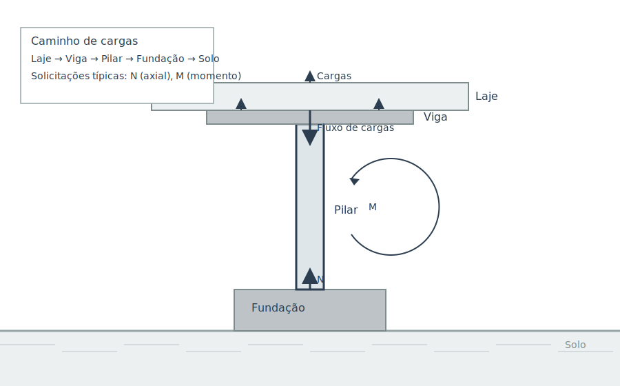

## Aula 3 – Instabilidade e Efeitos de Segunda Ordem

##### Objetivos da aula
- Entender os fenômenos de instabilidade (flambagem) e quando considerar efeitos de 2ª ordem (P‑Δ/P‑δ) em pilares.
- Aplicar critérios práticos: esbeltez, comprimento equivalente, amplificação de esforços e análise de 2ª ordem.
- Discutir boas práticas de projeto/detalhamento para mitigar instabilidade e sensibilidade a imperfeições.

##### Conteúdo da aula (texto base)

**1) Instabilidade: conceitos fundamentais**

- Sob compressão, membros esbeltos podem perder estabilidade lateral antes da resistência à compressão do material.
- O parâmetro “gatilho” é a esbeltez $\lambda$.
- Principais causas:
  - Imperfeições geométricas ou de aplicação de carga
  - Excentricidades
  - Rigidez insuficiente de nós/apoios
  - Manqueira/torção

**2) Carga crítica elástica (referência de Euler)**

- Para uma barra ideal reta, elástica e com extremos conhecidos, a carga crítica elástica é:

  $$
  P_{\mathrm{cr}} = \frac{\pi^2 E I}{l_e^2}
  $$
  $$
  \lambda = \frac{l_e}{i}, \quad i = \sqrt{\frac{I}{A}}
  $$

- Quanto maior $\lambda$, menor $P_{\mathrm{cr}}$ e maior a sensibilidade a imperfeições.
- Em concreto armado, a ruptura geralmente ocorre por flexo-compressão antes de atingir o $P_{\mathrm{cr}}$ ideal.

**3) Comprimento equivalente e condição do pórtico**

- O comprimento equivalente $l_e$ depende de:
  - Condição de engastamento/apoio
  - Travamento de deslocamentos/rotações no nó
- Pórticos contraventados (não-sway): $l_e$ menor
- Pórticos sem contraventamento (sway): $l_e$ maior e maiores exigências de 2ª ordem
- Em projeto, define-se o fator de comprimento $k_l$:
  - $l_e = k_l \cdot l$
  - $k_l$ é estimado por modelos/norma a partir da rigidez relativa de barras e nós

**4) Efeitos de 2ª ordem: $P-\Delta$ e $P-\delta$**

- $P-\Delta$ (global):
  - Amplificação de momentos devido a deslocamentos laterais globais do nó
  - Principal em pórticos sway
- $P-\delta$ (local):
  - Curvaturas locais do elemento aumentam o momento fletor sob força axial
- Critério prático:
  - Quando $\lambda$ excede limites normativos
  - Ou quando o índice de instabilidade global ultrapassa limiar
  - Deve-se considerar 2ª ordem por análise ou amplificação

**5) Métodos de consideração – amplificação ou análise de 2ª ordem**

- **Amplificação normativa:**
  - Multiplicar momentos de 1ª ordem por um fator $\gamma_z$ que capta a instabilidade global e rigidez do pórtico
  - Exemplo: $M_d = \gamma_z M_{d,1}$
  - Consultar expressão da norma vigente
- **Análise de 2ª ordem (geométrica não linear):**
  - Iterativa ($P$–$\Delta$/$P$–$\delta$) com rigidezes atualizadas
  - Necessária quando:
    - Elevada esbeltez
    - Pórticos sway relevantes
    - Grandes deslocamentos
    - Irregularidades

**6) Boas práticas de mitigação**

- Aumentar rigidez:
  - Seção dos pilares
  - Travamentos (contraventamentos/parede de rigidez)
  - Melhorar engastes e nós
- Reduzir imperfeições/excentricidades:
  - Alinhamento
  - Tolerâncias
  - Detalhamento de nós e ligações pilar–viga/fundação
  - Considerar $e_{\min}$ e efeitos de retração/fluência
- Confinamento e detalhamento:
  - Estribos adequados para prevenir instabilidade local das barras
  - Cobrimentos compatíveis

**7) Exemplo numérico – amplificação simplificada**

- Pilar: $30 \times 50$ cm
- Momento de inércia $I$ em torno do eixo mais crítico (estimado)
- $l = 4{,}0\,\text{m}$
- Pórtico sem contraventamento (sway): $l_e \approx l$
- Esforços de 1ª ordem:
  - $N_d = 1200\,\text{kN}$
  - $M_{d,1} = 60$ kN·m
- Índice global indica necessidade de 2ª ordem
- Norma fornece $\gamma_z = 1{,}25$
- Cálculo:
  - $M_d = 1{,}25 \times 60 = 75$ kN·m
- Dimensionar a seção/armadura para $(N_d, M_d)$
- Verificar deslocamentos/estados limites

##### Atividade prática

- Para um pilar $25 \times 40$ cm com $l = 3{,}6\,\text{m}$:
  1. Estime $l_e$ para pórtico não-sway e sway; calcule $\lambda$ e discuta o enquadramento.
  2. Supondo $N_d$ e $M_{d,1}$ fornecidos, adote $\gamma_z$ normativo e obtenha $M_d$; discuta impacto da presença/ausência de contraventamento.
  3. Liste medidas de projeto para reduzir a sensibilidade de 2ª ordem.

##### Links suplementares da Aula 3
- Buckling (Wikipedia): https://en.wikipedia.org/wiki/Buckling
- Column (Wikipedia): https://en.wikipedia.org/wiki/Column
- Second‑order effects (engenharia estrutural – leitura complementar): https://en.wikipedia.org/wiki/Second_moment_of_area
