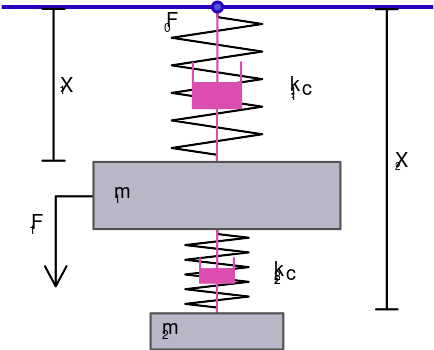
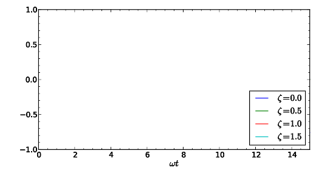
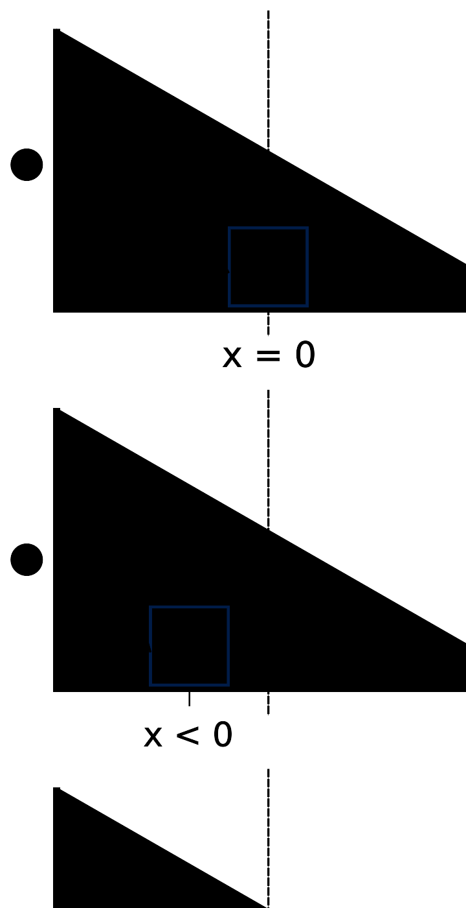
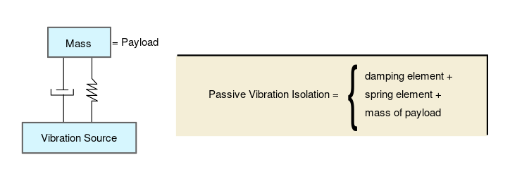
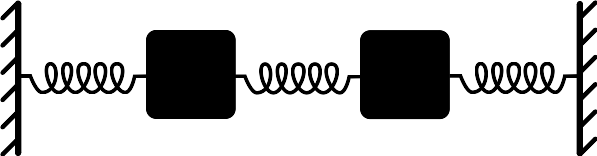
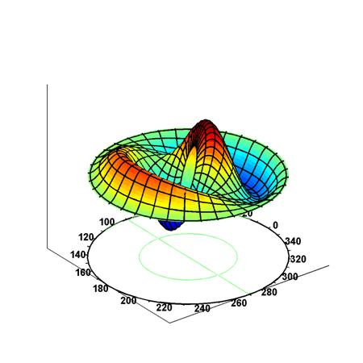
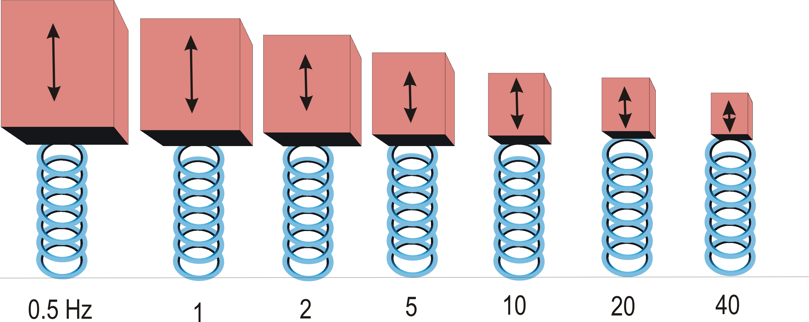
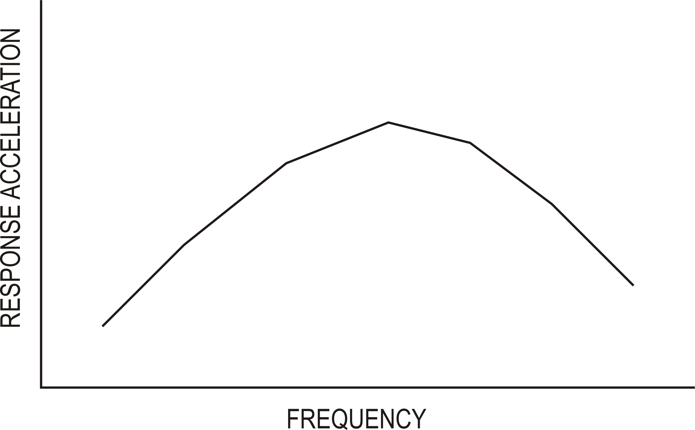
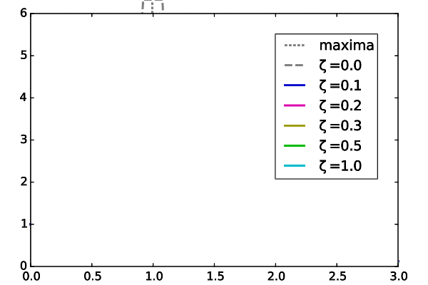
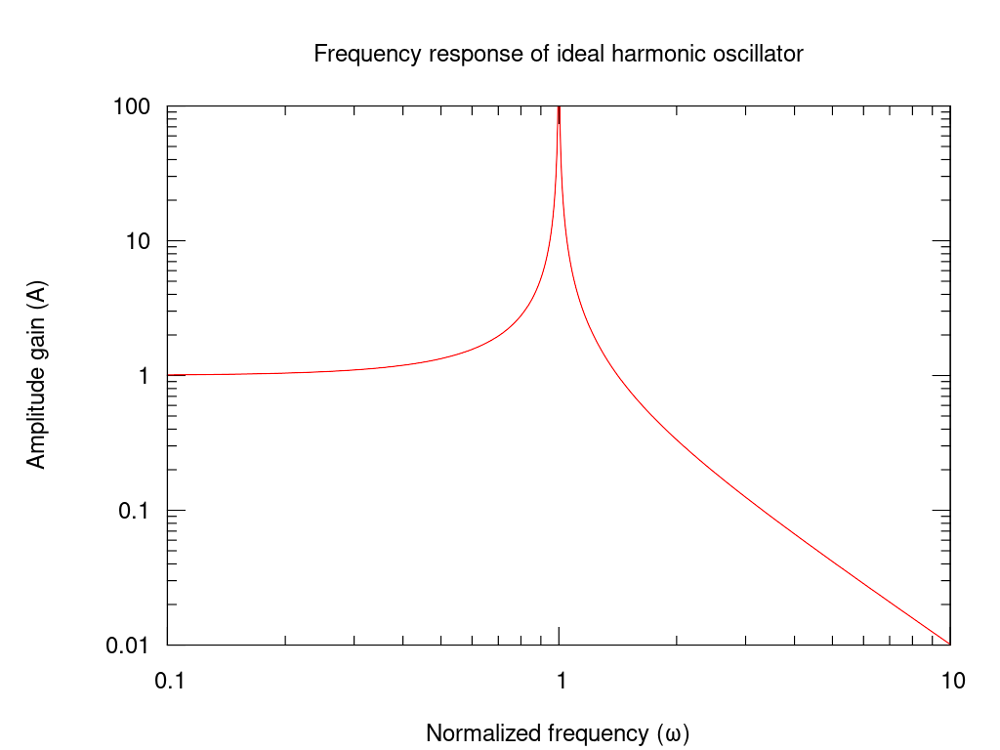

# TEMPLATE DE PRODUÇÃO - MODELO ÁTOMO

# Nome da disciplina: Estruturas de Concreto: Pilares e Solicitações Dinâmicas
# Conteudista: Afonso Cesar Lelis Brandão

## Tabela para uso exclusivo do(a) coordenador(a)

```
Requisitos para um conteúdo UAU Observações
```
Conformidade com o Plano de Aprendizado

Clareza e objetividade

Ortografia e gramática

Recursos visuais atrativos (imagens, gifs, etc.)

```
Data da Validação Nome do(a) Coordenador(a) do curso
```
#### ● VALIDADO ● NÃO VALIDADO ● CANCELADO

```
TEXTO BASE -
TÍTULOS E OBJETIVOS DAS VIDEOAULAS -
QUIZ -
MATERIAL COMPLEMENTAR -
```

# TEXTO BASE

#### Por que essa disciplina é relevante para a sua atuação profissional?
Esta disciplina é de extrema relevância para a engenharia civil moderna, pois capacita o profissional a projetar estruturas que não apenas suportam cargas estáticas (peso próprio, ocupação), mas também resistem com segurança e desempenho a ações dinâmicas. Cargas como ventos, sismos, vibrações de máquinas e até o tráfego de pessoas ou veículos impõem desafios complexos que, se não forem devidamente considerados, podem levar a falhas estruturais catastróficas ou a um desconforto inaceitável para os usuários. Compreender o comportamento dinâmico permite a criação de edificações mais seguras, resilientes, econômicas e confortáveis, alinhadas às exigências de normas técnicas e aos desafios de um ambiente construído cada vez mais ousado e complexo.

### Contribuições para a Atuação Profissional

- **Segurança e Resiliência Estrutural:** Capacidade de analisar e dimensionar estruturas para resistir a terremotos e rajadas de vento, garantindo a estabilidade e a vida útil da edificação.
- **Projetos Otimizados e Econômicos:** Domínio de conceitos como períodos de vibração e amortecimento, permitindo a especificação de sistemas estruturais e dispositivos de controle que otimizam o uso de materiais.
- **Análise de Desempenho e Conforto:** Habilidade para avaliar e mitigar vibrações em pisos de academias, passarelas e edifícios industriais, assegurando o conforto dos usuários e o bom funcionamento de equipamentos sensíveis.
- **Diagnóstico e Reforço Estrutural:** Competência para diagnosticar patologias causadas por fadiga ou ressonância e projetar soluções de reforço para estruturas existentes.

### Exemplos Práticos

- Projeto de edifícios altos em zonas sísmicas ou com forte incidência de ventos.
- Verificação de vibrações em lajes de hospitais que abrigam equipamentos de ressonância magnética ou em edifícios comerciais com academias.
- Dimensionamento de fundações para máquinas industriais de grande porte (prensas, geradores) para isolar a vibração.
- Análise dinâmica de pontes e passarelas para verificar os efeitos da ressonância induzida pelo caminhar de pedestres.

---

#### TEXTO BASE EXPANDINDO HORIZONTES DA VIDEOAULA 1

## Aula 1 – Fundamentos das Vibrações Estruturais

#### 1. Introdução: Cargas Estáticas vs. Dinâmicas

Em engenharia de estruturas, tradicionalmente lidamos com **cargas estáticas**, que são aplicadas de forma lenta e gradual, como o peso próprio da estrutura ou a mobília em um edifício. No entanto, muitas ações importantes são **dinâmicas**: sua magnitude, direção ou ponto de aplicação variam rapidamente no tempo. Exemplos incluem ventos, sismos, explosões e vibrações de máquinas.


A principal diferença é que cargas dinâmicas geram **forças de inércia** (lembre-se da Segunda Lei de Newton, F=ma), que se opõem à aceleração e alteram completamente a resposta da estrutura.

#### 2. O Modelo Fundamental: Sistema Massa-Mola-Amortecedor

Para entender o comportamento dinâmico, simplificamos uma estrutura complexa em um modelo com um único grau de liberdade (1 GDL).



Este modelo é composto por três elementos:

*   **Massa (M):** Representa a inércia da estrutura. Em um edifício, seria a massa concentrada no nível do pavimento.
*   **Mola (Rigidez, k):** Representa a capacidade da estrutura de resistir à deformação. Em um pórtico, seria a rigidez lateral combinada dos pilares.
*   **Amortecedor (Amortecimento, c):** Representa a dissipação de energia da estrutura, que faz com que a vibração diminua e pare. Ocorre por atrito interno no material, interação com elementos não estruturais, etc.

#### 3. Vibração Livre Não Amortecida: A Essência da Estrutura

Vamos analisar o caso mais simples: uma estrutura que é deslocada de sua posição de equilíbrio e solta, sem a ação de forças externas e sem amortecimento (`c=0`). Ela oscilará perpetuamente em um movimento harmônico simples.

Dois parâmetros fundamentais governam esse movimento:

*   **Frequência Natural (ωn):** É a frequência na qual o sistema "prefere" vibrar. Depende apenas da rigidez e da massa. Uma estrutura mais rígida vibra mais rápido, enquanto uma mais pesada vibra mais devagar.
    ```latex
    \omega_n = \sqrt{\frac{k}{M}} \quad (rad/s)
    ```
*   **Período Natural (Tn):** É o tempo que a estrutura leva para completar um ciclo de vibração. É o inverso da frequência.
    
    $T_n = \frac{2\pi}{\omega_n} \quad (s)$
    
O período natural é o "DNA" dinâmico de uma estrutura. Um arranha-céu tem um período longo (vários segundos), enquanto uma estrutura baixa e rígida tem um período curto (frações de segundo).

#### 4. Vibração Livre Amortecida: O Comportamento Real

Na realidade, toda estrutura dissipa energia. O amortecimento faz com que a amplitude da vibração livre diminua com o tempo. A forma como isso acontece depende da **taxa de amortecimento (ζ)**, um valor adimensional que compara o amortecimento real do sistema com o "amortecimento crítico".



*   **Amortecimento Subcrítico (ζ < 1):** O sistema oscila, mas com amplitude decrescente até parar. Este é o caso de 99% das estruturas de engenharia civil.
*   **Amortecimento Crítico (ζ = 1):** O sistema retorna à posição de equilíbrio o mais rápido possível, sem oscilar.
*   **Amortecimento Supercrítico (ζ > 1):** O sistema retorna à posição de equilíbrio lentamente, sem oscilar (ex: um amortecedor de porta).

#### 5. Pontos-Chave da Aula
1.  Cargas dinâmicas geram forças de inércia que são cruciais na análise.
2.  O comportamento dinâmico pode ser entendido pelo modelo simplificado **massa-mola-amortecedor**.
3.  Toda estrutura possui uma **frequência natural (ωn)** e um **período natural (Tn)**, que dependem apenas de sua massa e rigidez.
4.  O **amortecimento (ζ)** é a propriedade que dissipa a energia de vibração.

#### 6. Preparação para a Próxima Aula
Na próxima aula, investigaremos o que acontece quando uma força externa contínua atua sobre a estrutura, introduzindo o conceito de **vibração forçada** e o perigoso fenômeno da **ressonância**.

---

#### VIDEOAULA 1: Aula 1 – Fundamentos das Vibrações Estruturais

## Roteiro para a Videoaula 1 – Fundamentos das Vibrações Estruturais

**(1) Abertura (1 min)**
*   *Professor na tela:* "Olá! O que uma ponte, um arranha-céu e um violão têm em comum? Todos eles vibram! E entender como eles vibram é o que nos permite projetá-los com segurança. Sou Afonso Cesar Lelis Brandão e hoje vamos mergulhar nos fundamentos das vibrações estruturais."

**(2) O que Torna uma Carga "Dinâmica"? (2 min)**
*   *Animação:* Mostrar um bloco sobre uma mola. Primeiro, uma mão empurra o bloco lentamente (carga estática, só há deformação). Depois, a mão dá um toque rápido no bloco (carga dinâmica, o bloco oscila).
*   *Professor:* "A diferença é a **aceleração**. Se a carga causa aceleração, ela gera forças de inércia, e a análise muda completamente. É a diferença entre estacionar um carro na garagem e... bem, bater o carro na parede da garagem."

**(3) O Trio Dinâmico: Massa, Mola e Amortecedor (3 min)**
*   *Animação 3D de um pórtico simples:* A laje se transforma no bloco de **Massa (M)**. Os pilares se transformam em **Molas (k)**. E um pistão de **Amortecedor (c)** aparece ao lado.
*   *Professor:* "Podemos simplificar qualquer estrutura neste trio. A massa é o peso, a rigidez é a resistência dos pilares, e o amortecimento é o 'freio' natural que dissipa a energia."

**(4) A Identidade da Estrutura: Período Natural (4 min)**
*   *Demonstração prática:* Pegar uma régua, prender na mesa e tocá-la para vibrar. "Vejam, ela vibra em uma velocidade própria. Esse é seu **período natural**."
*   *Animação na tela:* Mostrar a fórmula `Tn = 2π * sqrt(M/k)`.
*   *Professor:* "É simples: se eu colocar mais massa na ponta da régua [colocar um clipe], ela vibra mais devagar. Período maior. Se eu encurtar a régua [torná-la mais rígida], ela vibra mais rápido. Período menor. Cada prédio tem seu próprio período natural!"

**(5) O Freio: Amortecimento (2 min)**
*   *Vídeo ou animação:* Mostrar uma porta de shopping com amortecedor (exemplo de amortecimento subcrítico, ela oscila um pouco).
*   *Professor:* "Na vida real, a vibração não dura para sempre. O amortecimento, mesmo que pequeno, a dissipa. Em estruturas de concreto, ele é baixo, em torno de 2% a 5%."

**(6) Encerramento e Próxima Aula (1 min)**
*   *Professor:* "Resumindo: hoje vimos os 3 ingredientes de uma vibração (massa, rigidez, amortecimento) e aprendemos o conceito mais importante: o período natural. Na próxima aula, vamos descobrir o que acontece quando uma força externa 'empurra' a estrutura no seu ritmo preferido. Preparem-se para o fenômeno da **ressonância**."

---

##### Links Suplementares da Aula 1
- Harmonic oscillator (Wikipedia): https://en.wikipedia.org/wiki/Harmonic_oscillator
- Damping (Wikipedia): https://en.wikipedia.org/wiki/Damping
- Mass–spring–damper model (Wikipedia): https://en.wikipedia.org/wiki/Mass%E2%80%93spring%E2%80%93damper_model


#### TEXTO BASE EXPANDINDO HORIZONTES DA VIDEOAULA 2

## Aula 2 – Excitação Harmônica, Ressonância e Amortecimento

#### 1. Força Dinâmica Harmônica: conceito e equação de movimento
Quando uma estrutura sofre a ação de uma força que varia no tempo de forma periódica, dizemos que está sob excitação harmônica. Para um sistema de 1 GDL, a equação diferencial é:

$M\,\ddot u(t) + c\,\dot u(t) + k\,u(t) = p_0\,\sin(\omega t)$

onde $M$ é a massa equivalente, $c$ o amortecimento viscoso, $k$ a rigidez, $p_0$ a amplitude da força e $\omega$ a frequência de excitação.

Definimos ainda:
- Frequência natural: $\omega_n = \sqrt{\tfrac{k}{M}}$ e $f_n = \tfrac{\omega_n}{2\pi}$
- Razão de amortecimento: $\zeta = \tfrac{c}{2\sqrt{kM}}$
- Razão de frequência: $r = \tfrac{\omega}{\omega_n}$



#### 2. Resposta em regime permanente e fator de amplificação
A resposta após o transitório é harmônica com a mesma frequência da excitação, mas com amplitude e fase diferentes. A amplitude $U$ do deslocamento em regime permanente é:

$U = \dfrac{p_0/k}{\sqrt{\big(1-r^2\big)^2 + \big(2\zeta r\big)^2}} \quad\Rightarrow\quad \text{FA} = \dfrac{U}{p_0/k}$

O ângulo de fase $\varphi$ entre a força e o deslocamento é:

$\tan\varphi = \dfrac{2\zeta r}{1-r^2}$

Observações práticas em estruturas de concreto:
- Para $r \ll 1$, o comportamento é quase estático ($\text{FA}\approx 1$).
- Perto de $r=1$ (ressonância), o amortecimento controla a amplitude. Em concreto armado, $\zeta$ típico está entre 2% e 5%.
- Para $r \gg 1$, o deslocamento decai, mas a resposta de aceleração pode crescer.

#### 3. Exemplo numérico aplicado
Considere um pórtico representado por $M=10\,000\ \text{kg}$, $k=2{\times}10^7\ \text{N/m}$ e $\zeta=5\%$. Uma força dinâmica $p_0=10\,000\ \text{N}$ atua com $\omega=\omega_n$.

- $\omega_n = \sqrt{k/M} = \sqrt{2{\times}10^7/10^4} = \sqrt{2000} \approx 44{,}72\ \text{rad/s}$, $f_n\approx 7{,}12\ \text{Hz}$
- Em ressonância ($r=1$), $\text{FA} = \dfrac{1}{2\zeta} = \dfrac{1}{0{,}10} = 10$
- Deslocamento estático $= p_0/k = 10{,}000/2{\times}10^7 = 5{\times}10^{-4}\ \text{m}$
- Deslocamento dinâmico $U = 10 \times 5{\times}10^{-4} = 5{\times}10^{-3}\ \text{m} = 5\ \text{mm}$

Conclusão: um leve amortecimento limita a amplitude, mas perto da ressonância ainda ocorrem deslocamentos significativamente maiores que os estáticos.

#### 4. Excitação por base (sismos e máquinas)
Quando a base se move, como em um sismo, a entrada é um deslocamento de base $y(t)$ e a variável de interesse é o deslocamento relativo $u_r(t)$ da massa em relação à base.

$M\,\ddot u_r + c\,\dot u_r + k\,u_r = -M\,\ddot y(t)$

Ideias-chave:
- Em análise sísmica, trabalhamos com espectros de resposta (deslocamento, velocidade, pseudo-aceleração). O pico de pseudo-aceleração $S_a$ aproxima a força inercial máxima $F\!\_\text{in} \approx M\,S_a$.
- Para máquinas, isoladores (molas e amortecedores) são projetados para operar com $r>\sqrt{2}$ visando reduzir transmissibilidade de forças ao apoio.



#### 5. Vento, desprendimento de vórtices e pilares esbeltos
Além de rajadas aleatórias, o vento pode induzir vibrações por desprendimento periódico de vórtices. A frequência de shedding $f\_s$ é estimada por $f\_s = \mathrm{St}\,\dfrac{U}{D}$, com $\mathrm{St}\approx 0{,}2$ para seções circulares, $U$ a velocidade do vento e $D$ a dimensão característica. Evite $f\_s \approx f_n$ para não excitar ressonância transversal em pilares e mastros.

Medidas de projeto:
- Ajustar rigidez e massa para deslocar $f_n$.
- Aumentar amortecimento com dispositivos ou detalhes construtivos.
- Usar chanfros, aletas ou rugosidade para alterar o escoamento e reduzir $\mathrm{St}$ efetivo.

#### 6. Boas práticas e checklist de projeto
- Identificar $\omega_n$, $\zeta$ e principais fontes de excitação (sismo, vento, máquinas, tráfego).
- Verificar razão $r$ para cenários críticos; se $r\approx 1$, avaliar FA e respostas de deslocamento/aceleração.
- Para equipamentos sensíveis, checar transmissibilidade e adotar isolação quando necessário.
- Considerar limites de conforto ao invés de apenas resistência (vibração de pisos, passarelas, escritórios).

#### 7. Atividade prática sugerida
Monte no software de sua escolha (ou planilha) um modelo 1 GDL. Varie $\zeta$ de 0 a 10% e trace a curva do fator de amplificação $\text{FA}(r)$. Discuta como o pico muda com o amortecimento e relacione com sistemas reais de concreto.

#### 8. Pontos-chave
- A ressonância ocorre quando $\omega\approx\omega_n$ e o amortecimento controla a amplitude máxima.
- Excitação por base (sísmica) acopla a resposta à aceleração do terreno; o uso de espectros facilita o dimensionamento.
- Em pilares esbeltos, verificar efeitos de vento e shedding para evitar vibrações excessivas e fadiga.

---

#### VIDEOAULA 2: Aula 2 – Ressonância e Excitação Harmônica em Estruturas de Concreto

Ressonância e Excitação Harmônica em Estruturas de Concreto

Tempo total estimado: 15 minutos

1) Abertura e retomada (1 min)
- Professor: "Sou Afonso Cesar Lelis Brandão. Hoje vamos entender como forças periódicas interagem com o período natural da estrutura e por que a ressonância é tão crítica."

2) Conceito de excitação harmônica (2 min)
- Slide: Equação $M\ddot u + c\dot u + ku = p\_0\sin(\omega t)$ e definições de $\omega\_n$, $\zeta$, $r$.
- Demonstração: régua ou mola com massa para ilustrar força periódica.

3) Fator de amplificação e fase (4 min)
- Gráfico: $\text{FA}(r)$ para $\zeta=0\%, 2\%, 5\%$.
- Explicar por que deslocamento, velocidade e aceleração têm picos em regiões de $r$ distintas.

4) Exemplo numérico (3 min)
- Cálculo guiado do exemplo do texto: $U=5$ mm em ressonância com $\zeta=5\%$.
- Mensagem: pequenos amortecimentos já evitam amplitudes teoricamente infinitas.

5) Excitação por base e espectros (3 min)
- Quadro: $M\ddot u\_r + c\dot u\_r + ku\_r = -M\ddot y(t)$, ideia de espectros $S\_d$, $S\_v$, $S\_a$.
- Aplicação: como isso se traduz em forças inerciais de projeto.

6) Encerramento (2 min)
- Checklist de projeto. Gancho para próxima aula: "Como analisar vibrações em sistemas multi-grau (pórticos) e evitar problemas de conforto e fadiga?"

##### Links Suplementares da Aula 2
- Forced vibration (Wikipedia): https://en.wikipedia.org/wiki/Forced_vibration
- Resonance (Wikipedia): https://en.wikipedia.org/wiki/Resonance
- Response spectrum (Wikipedia): https://en.wikipedia.org/wiki/Response_spectrum

---

#### TEXTO BASE EXPANDINDO HORIZONTES DA VIDEOAULA 3

## Aula 3 – Sistemas de Múltiplos Graus de Liberdade (MGL): Análise Modal e Superposição

#### 1. Equações de movimento em forma matricial
Estruturas reais (pórticos, treliças, lajes) possuem vários graus de liberdade. No domínio linear, modelamos como:

$\mathbf{M}\,\ddot{\mathbf{u}} + \mathbf{C}\,\dot{\mathbf{u}} + \mathbf{K}\,\mathbf{u} = \mathbf{p}(t)$

onde $\mathbf{M}$ é a matriz de massa, $\mathbf{C}$ a matriz de amortecimento, $\mathbf{K}$ a matriz de rigidez e $\mathbf{u}(t)$ o vetor de deslocamentos generalizados.



#### 2. Autovalores e autovetores: modos próprios
Desprezando o amortecimento para a análise modal clássica ($\mathbf{C}=\mathbf{0}$) e assumindo solução livre $\mathbf{u}(t)=\boldsymbol{\phi}\,e^{i\omega t}$, obtemos o problema de autovalor generalizado:

$(\mathbf{K} - \omega^2\,\mathbf{M})\,\boldsymbol{\phi} = \mathbf{0}$

Cada autovalor $\omega_n^2$ produz uma frequência natural $\omega_n$ e um autovetor $\boldsymbol{\phi}^{(n)}$ (forma modal). Propriedades úteis:
- Ortogonalidade com massa: $\boldsymbol{\phi}^{(m)\!T}\,\mathbf{M}\,\boldsymbol{\phi}^{(n)} = 0$ para $m\neq n$.
- Ortogonalidade com rigidez: $\boldsymbol{\phi}^{(m)\!T}\,\mathbf{K}\,\boldsymbol{\phi}^{(n)} = 0$ para $m\neq n$.
- Normalização por massa unitária: escolher $\boldsymbol{\phi}^{(n)\!T}\,\mathbf{M}\,\boldsymbol{\phi}^{(n)} = 1$.

Visualmente, formas modais representam “padrões” de vibração. Exemplos ilustrativos:





#### 3. Coordenadas modais, fatores de participação e massas modais
Expanda a resposta como combinação dos modos: $\mathbf{u}(t) = \sum\limits_{n=1}^N \boldsymbol{\phi}^{(n)} q_n(t)$. Substituindo nas equações e usando ortogonalidade, desacoplamos o sistema em $N$ EDOs escalares para as coordenadas modais $q_n(t)$.

Fator de participação $\Gamma_n$ mede o quanto a excitação generalizada “projeta” no modo $n$. A massa modal efetiva associada indica a fração de massa total mobilizada por cada modo. Na prática, escolhemos modos até acumular, por exemplo, >90% de massa efetiva em cada direção.

#### 4. Superposição modal e truncamento; combinações SRSS/CQC
Após obter $q_n(t)$ (por resposta harmônica, espectral ou histórico temporal), reconstruímos $\mathbf{u}(t)$ por superposição. Para esforços solicitantes no domínio sísmico (espectro elástico), combina-se contribuições modais via:
- SRSS (square root of sum of squares), adequado para modos bem separados.
- CQC (complete quadratic combination), mais acurado quando há acoplamento/atrito modal por frequências próximas e amortecimento.

Referência visual para espectros de resposta (sísmico):





#### 5. Exemplo numérico resumido (2 GDL)
Considere um sistema de 2 massas ligadas por molas (como no diagrama de osciladores acoplados). Dados $\mathbf{M}=\mathrm{diag}(m,m)$ e $\mathbf{K}=\begin{bmatrix}2k & -k\\-k & k\end{bmatrix}$. Resolva $\det(\mathbf{K}-\omega^2\mathbf{M})=0$ para obter $\omega_1,\omega_2$ e os vetores $\boldsymbol{\phi}^{(1)},\boldsymbol{\phi}^{(2)}$. Em seguida, normalize por massa e calcule $\Gamma_n$ para uma excitação uniforme $\mathbf{p}(t)=[p\;p]^T\sin\omega t$.

Discussão: o primeiro modo tem massas em fase; o segundo, fora de fase. A excitação “uniforme” tende a participar mais do primeiro modo.

#### 6. Conforto em pisos e diretrizes práticas
Além de verificação de resistência, verifique vibração e conforto (aceleração RMS, faixas de frequência) conforme normas e guias de projeto. Em pavimentos de concreto com academias ou escritórios, garanta frequência natural fora das faixas críticas de atividade e avalie amortecimento adicional via elementos não estruturais.

Checklist rápido:
- Extraia $\omega_n$, $\boldsymbol{\phi}^{(n)}$, $\Gamma_n$ e massas modais efetivas.
- Trunque quando a massa efetiva acumulada for suficiente para o fenômeno de interesse.
- Em análise sísmica, use espectro de projeto e combine por SRSS/CQC.
- Para vento/maquinário, cheque transmissibilidade e evite coincidência $f\_\text{força}\approx f_n$ relevante.

#### 7. Atividade prática sugerida
Modele um pórtico 2D simples (2 a 4 GDL) e extraia as duas primeiras frequências e formas modais. Calcule fatores de participação para uma excitação lateral uniforme e estime deslocamento de topo via superposição usando um espectro simplificado.

#### 8. Pontos-chave
- MGL se resolvem eficientemente por análise modal; modos desacoplam a dinâmica.
- Fatores de participação e massas modais guiam truncamento e interpretação física.
- SRSS/CQC são essenciais para combinar respostas modais sob excitação sísmica.

---

#### VIDEOAULA 3: Aula 3 – Análise Modal em Múltiplos Graus de Liberdade e Superposição

Análise Modal em Múltiplos Graus de Liberdade e Superposição

Tempo total estimado: 15–18 minutos

1) Abertura e objetivo (1 min)
- Professor: "Sou Afonso Cesar Lelis Brandão. Hoje vamos entender como decompor estruturas reais em modos e combinar suas respostas com segurança."

2) Equações matriciais e ideia de acoplamento (3 min)
- Slide: $\mathbf{M}\ddot{\mathbf{u}}+\mathbf{K}\mathbf{u}=\mathbf{p}(t)$; diagrama de osciladores acoplados.
- Imagem: osciladores acoplados – https://upload.wikimedia.org/wikipedia/commons/3/3f/Coupled_Harmonic_Oscillator.svg

3) Modos próprios e visualização (4 min)
- Mostrar GIFs/imagens de formas modais: membrana, prato circular, viga em balanço (modos superiores).
- Imagens:
  - https://upload.wikimedia.org/wikipedia/commons/e/e9/Drum_vibration_mode12.gif
  - https://upload.wikimedia.org/wikipedia/commons/c/cc/Mode_Shape_of_a_Round_Plate_with_Node_Lines.jpg
  - https://upload.wikimedia.org/wikipedia/commons/c/cb/Beam_mode_6.gif

4) Coordenadas modais, participação e truncamento (4–5 min)
- Quadro: $\mathbf{u}=\sum \boldsymbol{\phi}^{(n)}q_n(t)$; definição de $\Gamma_n$ e massa modal.
- Regra prática: acumular >90% de massa efetiva; comentar amortecimento modal proporcional.

5) Espectro e combinações SRSS/CQC (3–4 min)
- Imagens: espectro de resposta (deslocamento/velocidade/aceleração).
- Links:
  - https://upload.wikimedia.org/wikipedia/commons/e/e7/Eqresp1.png
  - https://upload.wikimedia.org/wikipedia/commons/e/e2/Eqresp2.png

6) Encerramento e gancho (1 min)
- Professor: "Na próxima, aplicaremos esses conceitos em pilares esbeltos sob ações reais, amarrando critérios de conforto e desempenho estrutural."

---
##### Links Suplementares da Aula 3
- Modal analysis (Wikipedia): https://en.wikipedia.org/wiki/Modal_analysis
- Rayleigh–Ritz method (Wikipedia): https://en.wikipedia.org/wiki/Rayleigh%E2%80%93Ritz_method
- Euler–Bernoulli beam theory (Wikipedia): https://en.wikipedia.org/wiki/Euler%E2%80%93Bernoulli_beam_theory


#### TEXTO BASE EXPANDINDO HORIZONTES DA VIDEOAULA 4

## Aula 4 – Amortecimento, Transmissibilidade e Controle de Vibrações em Pilares

#### 1. Amortecimento: papel físico e efeito na ressonância
O amortecimento dissipa energia e limita amplitudes, especialmente perto da ressonância. Em concreto armado, amortecimentos equivalentes típicos (estruturais) variam entre 2% e 5%, podendo ser maiores com participação de elementos não estruturais.

Visualização de como o amortecimento altera o pico de ressonância:



#### 2. Transmissibilidade e isolação de vibrações
Transmissibilidade (T) é a razão entre a resposta transmitida ao apoio e a excitação. Para um sistema massa–mola–amortecedor submetido a base vibratória, há três regiões:
- r < 1: região de acoplamento (transmissão elevada)
- r ≈ √2: transição
- r > √2: região de isolação (T < 1), melhor com amortecimento bem escolhido

Referência visual de esquema de isolamento e curvas típicas:




#### 3. Vento em pilares esbeltos e desprendimento de vórtices
Pilares/mastros esbeltos podem sofrer vibração transversal por desprendimento periódico de vórtices. A frequência característica pode ser estimada por $f_s = \mathrm{St}\,\tfrac{U}{D}$, com $\mathrm{St}\approx 0{,}2$ para cilindros e $U$ a velocidade do vento. Evite coincidência $f_s \approx f_n$.

Animações e imagens didáticas de rua de vórtices:

[Animação de rua de vórtices de Kármán – link](https://upload.wikimedia.org/wikipedia/commons/b/b4/Vortex-street-animation.gif)

#### 4. Estratégias de controle: aumentar ζ, deslocar f_n, desacoplar a excitação
- Aumentar amortecimento efetivo: dispositivos como TMD (tuned mass damper) e participação de elementos não estruturais.
- Deslocar a frequência natural (rigidez/massa): ajuste geométrico ou de armaduras, adição de massa em dispositivos.
- Desacoplar via isolação: reduzir transmissibilidade entre fonte e estrutura/base.

Exemplos visuais de soluções:

[Tuned Mass Damper do Taipei 101 – link](https://upload.wikimedia.org/wikipedia/commons/1/15/Taipei_101_Tuned_Mass_Damper.png)

[Isoladores de base instalados (exemplo real) – link](https://upload.wikimedia.org/wikipedia/commons/d/de/Base_isolators_under_the_Utah_State_Capitol.jpg)

#### 5. Diretrizes práticas para pilares de concreto
- Verificar esbeltez e frequências naturais (modo transversal predominante) e comparar com faixas de vento dominante e atividades internas.
- Considerar amortecimento adicional em ambientes com fontes vibratórias (máquinas, academias). Projetar TMDs ou dispositivos simples onde aplicável.
- Avaliar conforto (aceleração pico/RMS) além de resistência; documentar hipóteses de amortecimento.
- Para vento transversal, estudar mitigação por aletas/estrias helicoidais, chanfros e detalhes de seção que desordenem vórtices.

#### 6. Atividade prática sugerida
Para um pilar isolado modelado como viga engastada-livre, estime $f_n$ do primeiro modo a partir de $EI$ e $m$ lineares. Com $U$ de vento estimado, calcule $f_s$ por Strouhal e discuta risco de coincidência. Proponha uma solução (aumentar $\zeta$, alterar $f_n$ ou ambas) e estime seu impacto qualitativamente nas amplitudes.

#### 7. Pontos‑chave
- Amortecimento controla picos de resposta e melhora conforto.
- Transmissibilidade orienta o projeto de isolamento; r>√2 favorece isolação.
- Em pilares esbeltos, mitigar desprendimento de vórtices e evitar $f_s \approx f_n$.

---

#### VIDEOAULA 4: Aula 4 – Amortecimento, Transmissibilidade e Controle de Vibrações em Pilares

Amortecimento, Transmissibilidade e Controle de Vibrações em Pilares

Tempo total estimado: 15–18 minutos

1) Abertura (1 min)
- Professor: "Sou Afonso Cesar Lelis Brandão. Vamos ligar conceitos de ressonância a medidas de projeto: amortecimento, transmissibilidade e controle em pilares."

2) Amortecimento e pico de ressonância (3–4 min)
- Slide: efeito de ζ no pico; imagem da envoltória de ressonância.
- Link: https://upload.wikimedia.org/wikipedia/commons/7/77/Mplwp_resonance_zeta_envelope.svg

3) Transmissibilidade e isolação (4 min)
- Quadro: regiões r<1, r≈√2, r>√2 ; trade-off de ζ.
- Imagens: https://upload.wikimedia.org/wikipedia/commons/9/90/Passvib1.svg e https://upload.wikimedia.org/wikipedia/commons/8/8f/Harmonic_oscillator_gain.svg

4) Vento e vórtices em pilares (3–4 min)
- Conceito de shedding e Strouhal; riscos de fadiga e conforto.
- Animação: https://upload.wikimedia.org/wikipedia/commons/b/b4/Vortex-street-animation.gif

5) Soluções de controle (3–4 min)
- Exemplos: TMD (Taipei 101) e isoladores de base.
- Imagens: https://upload.wikimedia.org/wikipedia/commons/1/15/Taipei_101_Tuned_Mass_Damper.png e https://upload.wikimedia.org/wikipedia/commons/d/de/Base_isolators_under_the_Utah_State_Capitol.jpg

6) Encerramento (1 min)
- Professor: "Na sequência, integramos os conceitos em estudos de caso e checklist de verificação para projeto de pilares em concreto sob ações dinâmicas reais."

---
##### Links Suplementares da Aula 4
- Vibration isolation (Wikipedia): https://en.wikipedia.org/wiki/Vibration_isolation
- Tuned mass damper (Wikipedia): https://en.wikipedia.org/wiki/Tuned_mass_damper
- Vortex shedding (Wikipedia): https://en.wikipedia.org/wiki/Vortex_shedding


# AVALIAÇÕES

## Quiz Não Avaliativo (V/F)

1) Em um sistema sem amortecimento, sob excitação harmônica com razão de frequência r=1, a amplitude teórica de deslocamento tende ao infinito.
- Resposta correta: Verdadeiro
- Explicação: Para ζ=0 e r→1, o fator de amplificação FA→∞ na formulação clássica do oscilador harmônico.

2) Para garantir isolação vibratória, basta operar com r>1, independentemente do amortecimento.
- Resposta correta: Falso
- Explicação: A região efetiva de isolação ocorre tipicamente para r>√2; o amortecimento influencia a transmissibilidade e o desempenho.

## Atividade Verificadora (Dissertativa)

- Questão: Considere um pilar esbelto modelado como viga engastada-livre com frequência natural fundamental f_n. Em um ambiente com vento médio U, estime a frequência de desprendimento de vórtices f_s=St·U/D e discuta o risco de ressonância quando f_s≈f_n. Proponha duas intervenções (uma visando aumentar ζ e outra visando deslocar f_n) e explique os efeitos esperados na resposta de deslocamento e aceleração.
- Resposta esperada: O estudante deve comparar f_s e f_n, reconhecer o risco de vibração transversal em ressonância quando coincidem e sugerir medidas como: incrementar amortecimento estrutural efetivo (ζ) por dispositivos ou detalhes construtivos; alterar rigidez/massa para deslocar f_n; incluir estrias/aerodinâmica na seção para desfazer vórtices. Deve mencionar que maior ζ reduz picos de FA/aceleração, e que variar EI ou m desloca a faixa crítica.

---

# MATERIAL COMPLEMENTAR

## Direto da Fonte

- Texto provocativo: Aprofunde a base teórica dos modelos de 1 e múltiplos GDL e conecte com análise espectral sísmica antes de dimensionar os pilares.
- Livro: Dinâmica de Estruturas (Anil K. Chopra)
- Capítulos: 1–3 (conceitos básicos, SDOF, MDOF) e capítulo sobre espectros de resposta
- Link: https://biblioteca-a.read.garden/viewer/9786556901633/91
- Acesso: plataforma Brightspace (BV Professor) – usuário: professor.conteudista – senha: unifecaf2023

## Para Mergulhar

- Filme: Dream Big – Engineering Our World (2017). Uma visão inspiradora do impacto da engenharia nas cidades e estruturas.
- Série: Megastructures – Taipei 101. Episódio com foco em controle de vibrações e TMD.
- Livro: BLEVINS, R. D. Flow-Induced Vibration. 2. ed. New York: Van Nostrand Reinhold, 1990. Excelente referência para vibrações induzidas por escoamento.
- Blog: Practical Engineering – conteúdos acessíveis sobre engenharia de estruturas e dinâmica. Link: https://practical.engineering/blog

## Podcast

- Texto provocativo: Ouça uma conversa prática sobre vibrações em estruturas reais e critérios de conforto.
- Podcast/Vídeo: Acoplando Ideias
- Episódio: VIBRAÇÃO MECÂNICA: O FANTASMA DAS INDÚSTRIAS
- Link: https://www.youtube.com/watch?v=j-sA4L2w-3E

## Artigo Científico

- Texto provocativo: Panorama do controle estrutural e do uso de amortecedores ajustados em edifícios altos.
- Link: https://doi.org/10.1061/(ASCE)0733-9399(1997)123:9(897)
- Referência ABNT: HOUSNER, G. W.; et al. Structural control: past, present, and future. Journal of Engineering Mechanics, ASCE, v. 123, n. 9, p. 897–971, 1997.

---

# Referências

- Harmonic oscillator (Wikipedia): https://en.wikipedia.org/wiki/Harmonic_oscillator
- Damping (Wikipedia): https://en.wikipedia.org/wiki/Damping
- Mass–spring–damper model (Wikipedia): https://en.wikipedia.org/wiki/Mass%E2%80%93spring%E2%80%93damper_model
- Forced vibration (Wikipedia): https://en.wikipedia.org/wiki/Forced_vibration
- Resonance (Wikipedia): https://en.wikipedia.org/wiki/Resonance
- Response spectrum (Wikipedia): https://en.wikipedia.org/wiki/Response_spectrum
- Modal analysis (Wikipedia): https://en.wikipedia.org/wiki/Modal_analysis
- Euler–Bernoulli beam theory (Wikipedia): https://en.wikipedia.org/wiki/Euler%E2%80%93Bernoulli_beam_theory
- Vibration isolation (Wikipedia): https://en.wikipedia.org/wiki/Vibration_isolation
- Tuned mass damper (Wikipedia): https://en.wikipedia.org/wiki/Tuned_mass_damper
- Kármán vortex street (Wikipedia): https://en.wikipedia.org/wiki/K%C3%A1rm%C3%A1n_vortex_street
- Vortex shedding (Wikipedia): https://en.wikipedia.org/wiki/Vortex_shedding

Imagens citadas (Commons/Wikipedia):
- Drum vibration mode (GIF): https://commons.wikimedia.org/wiki/File:Drum_vibration_mode12.gif
- Mode shape of a round plate: https://commons.wikimedia.org/wiki/File:Mode_Shape_of_a_Round_Plate_with_Node_Lines.jpg
- Coupled harmonic oscillators (SVG): https://commons.wikimedia.org/wiki/File:Coupled_Harmonic_Oscillator.svg
- Cantilever beam mode 2 (GIF): https://commons.wikimedia.org/wiki/File:Cantilevered_Euler-Bernoulli_beam_excited_at_mode_2_resonance.gif
- Beam mode 6 (GIF): https://commons.wikimedia.org/wiki/File:Beam_mode_6.gif
- Response spectrum figures: https://commons.wikimedia.org/wiki/File:Eqresp1.png e https://commons.wikimedia.org/wiki/File:Eqresp2.png
- Resonance envelope vs damping: https://commons.wikimedia.org/wiki/File:Mplwp_resonance_zeta_envelope.svg
- Harmonic oscillator gain: https://commons.wikimedia.org/wiki/File:Harmonic_oscillator_gain.svg
- Vortex street animation (GIF): https://commons.wikimedia.org/wiki/File:Vortex-street-animation.gif
- Taipei 101 Tuned Mass Damper: https://commons.wikimedia.org/wiki/File:Taipei_101_Tuned_Mass_Damper.png
- Base isolators under the Utah State Capitol: https://commons.wikimedia.org/wiki/File:Base_isolators_under_the_Utah_State_Capitol.jpg
