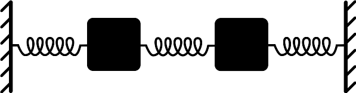

## Aula 3 – Sistemas de Múltiplos Graus de Liberdade (MGL): Análise Modal e Superposição

#### 1. Equações de movimento em forma matricial
Estruturas reais (pórticos, treliças, lajes) possuem vários graus de liberdade. No domínio linear, modelamos como:

$\mathbf{M}\,\ddot{\mathbf{u}} + \mathbf{C}\,\dot{\mathbf{u}} + \mathbf{K}\,\mathbf{u} = \mathbf{p}(t)$

onde $\mathbf{M}$ é a matriz de massa, $\mathbf{C}$ a matriz de amortecimento, $\mathbf{K}$ a matriz de rigidez e $\mathbf{u}(t)$ o vetor de deslocamentos generalizados.

#### 2. Autovalores e autovetores: modos próprios
Desprezando o amortecimento para a análise modal clássica ($\mathbf{C}=\mathbf{0}$) e assumindo solução livre $\mathbf{u}(t)=\boldsymbol{\phi}\,e^{i\omega t}$, obtemos o problema de autovalor generalizado:

$(\mathbf{K} - \omega^2\,\mathbf{M})\,\boldsymbol{\phi} = \mathbf{0}$

Cada autovalor $\omega_n^2$ produz uma frequência natural $\omega_n$ e um autovetor $\boldsymbol{\phi}^{(n)}$ (forma modal). Propriedades úteis:
- Ortogonalidade com massa: $\boldsymbol{\phi}^{(m)\!T}\,\mathbf{M}\,\boldsymbol{\phi}^{(n)} = 0$ para $m\neq n$.
- Ortogonalidade com rigidez: $\boldsymbol{\phi}^{(m)\!T}\,\mathbf{K}\,\boldsymbol{\phi}^{(n)} = 0$ para $m\neq n$.
- Normalização por massa unitária: escolher $\boldsymbol{\phi}^{(n)\!T}\,\mathbf{M}\,\boldsymbol{\phi}^{(n)} = 1$.

Visualmente, formas modais representam “padrões” de vibração. Exemplos ilustrativos:

#### 3. Coordenadas modais, fatores de participação e massas modais
Expanda a resposta como combinação dos modos: $\mathbf{u}(t) = \sum\limits_{n=1}^N \boldsymbol{\phi}^{(n)} q_n(t)$. Substituindo nas equações e usando ortogonalidade, desacoplamos o sistema em $N$ EDOs escalares para as coordenadas modais $q_n(t)$.

Fator de participação $\Gamma_n$ mede o quanto a excitação generalizada “projeta” no modo $n$. A massa modal efetiva associada indica a fração de massa total mobilizada por cada modo. Na prática, escolhemos modos até acumular, por exemplo, >90% de massa efetiva em cada direção.

#### 4. Superposição modal e truncamento; combinações SRSS/CQC
Após obter $q_n(t)$ (por resposta harmônica, espectral ou histórico temporal), reconstruímos $\mathbf{u}(t)$ por superposição. Para esforços solicitantes no domínio sísmico (espectro elástico), combina-se contribuições modais via:
- SRSS (square root of sum of squares), adequado para modos bem separados.
- CQC (complete quadratic combination), mais acurado quando há acoplamento/atrito modal por frequências próximas e amortecimento.

Referência visual para espectros de resposta (sísmico):

#### 5. Exemplo numérico resumido (2 GDL)
Considere um sistema de 2 massas ligadas por molas (como no diagrama de osciladores acoplados). Dados $\mathbf{M}=\mathrm{diag}(m,m)$ e $\mathbf{K}=\begin{bmatrix}2k & -k\\-k & k\end{bmatrix}$. Resolva $\det(\mathbf{K}-\omega^2\mathbf{M})=0$ para obter $\omega_1,\omega_2$ e os vetores $\boldsymbol{\phi}^{(1)},\boldsymbol{\phi}^{(2)}$. Em seguida, normalize por massa e calcule $\Gamma_n$ para uma excitação uniforme $\mathbf{p}(t)=[p\;p]^T\sin\omega t$.

Discussão: o primeiro modo tem massas em fase; o segundo, fora de fase. A excitação “uniforme” tende a participar mais do primeiro modo.

#### 6. Conforto em pisos e diretrizes práticas
Além de verificação de resistência, verifique vibração e conforto (aceleração RMS, faixas de frequência) conforme normas e guias de projeto. Em pavimentos de concreto com academias ou escritórios, garanta frequência natural fora das faixas críticas de atividade e avalie amortecimento adicional via elementos não estruturais.

Checklist rápido:
- Extraia $\omega_n$, $\boldsymbol{\phi}^{(n)}$, $\Gamma_n$ e massas modais efetivas.
- Trunque quando a massa efetiva acumulada for suficiente para o fenômeno de interesse.
- Em análise sísmica, use espectro de projeto e combine por SRSS/CQC.
- Para vento/maquinário, cheque transmissibilidade e evite coincidência $f\_\text{força}\approx f_n$ relevante.

#### 7. Atividade prática sugerida
Observe um edifício ou estrutura de concreto em seu cotidiano (pode ser o prédio da faculdade, um viaduto, passarela, etc.). Identifique situações em que vibrações podem ser percebidas (ex: pessoas caminhando em passarelas, veículos passando em pontes, máquinas funcionando em lajes). Anote:
- O tipo de estrutura observada e o local.
- O que pode causar vibração naquele elemento (tráfego, vento, máquinas, etc.).
- Se é possível perceber vibrações (pelo tato, objetos tremendo, ruídos, etc.).
- Discuta, com base no conteúdo da aula, por que algumas estruturas vibram mais que outras e como fatores como massa, rigidez e amortecimento podem influenciar essa percepção.
Se possível, tire uma foto (opcional) e anexe ao seu relatório.

#### 8. Pontos-chave
- MGL se resolvem eficientemente por análise modal; modos desacoplam a dinâmica.
- Fatores de participação e massas modais guiam truncamento e interpretação física.
- SRSS/CQC são essenciais para combinar respostas modais sob excitação sísmica.
