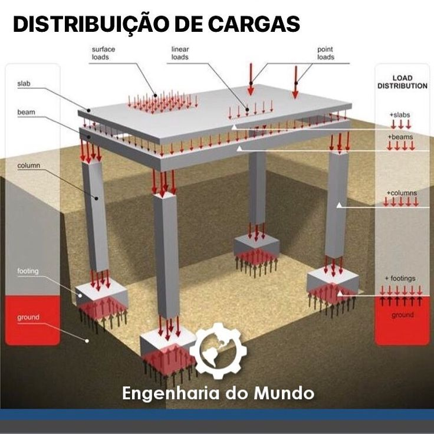

## Aula 13 – Interação Estrutura-Pavimento

##### Objetivos da aula

- Entender a interação entre pilares/estrutura, fundações e pavimentos de piso em obras industriais
- Compreender a transmissão de cargas e movimentos: estrutura → fundação → pavimento, e implicações no desempenho
- Detalhar juntas (serradas, de dilatação/movimentação) e soluções de interface (chumbadores, chapas de base)

##### Conteúdo da aula (texto base)

#### 1. Introdução: Obras Industriais e suas Complexidades

Em **obras industriais**, a interação entre estrutura e pavimento representa um dos aspectos mais críticos do projeto. Diferentemente de edificações convencionais, os pavimentos industriais devem suportar cargas elevadas, tráfego intenso de equipamentos e integrar-se harmoniosamente com os sistemas estruturais.

Esta aula aborda os principais desafios de **compatibilização entre pilares, fundações e pavimentos de piso**, focando em soluções práticas para minimizar problemas de desempenho e durabilidade.

#### 2. Características dos Pavimentos Industriais

##### 2.1. Piso Industrial: Conceitos Fundamentais

**Definição e Função:**

- **Laje sobre o terreno** (slab-on-grade)
- Suporte direto para operações industriais
- Interface crítica entre estrutura e solo

**Solicitações Típicas:**

- Tráfego de **empilhadeiras** e equipamentos pesados
- **Cargas estáticas** de prateleiras e estocagem
- **Cargas concentradas** de máquinas e equipamentos
- **Cargas dinâmicas** de pontes rolantes

##### 2.2. Sistema Estrutural Integrado

**Componentes Principais:**

- **Pilares** (aço ou concreto armado)
- **Fundações** (sapatas, blocos ou estacas)
- **Pavimento de piso** em concreto armado
- **Interfaces críticas** entre elementos

#### 3. Transmissão de Cargas: Fluxo Estrutural

##### 3.1. Sequência de Transmissão de Esforços

**Fluxo Principal:**

1. **Ações na superestrutura**
   - Peso próprio da estrutura
   - Equipamentos e instalações
   - Pontes rolantes e sistemas de movimentação
   - Cargas acidentais

2. **Transmissão pelos pilares**
   - Esforços axiais (compressão/tração)
   - Momentos fletores
   - Esforços cortantes

3. **Fundações como elemento de transição**
   - Distribuição de esforços no solo
   - Compatibilização de recalques
   - Interface com pavimento adjacente

##### 3.2. Efeitos no Pavimento Adjacente

**Problemas Potenciais:**

- **Acomodações diferenciais** entre estrutura e pavimento
- **Recalques diferenciados** nas bordas livres
- **Concentração de tensões** próximo às bases dos pilares
- **Fissuração por incompatibilidade** de movimentos

**Soluções de Compatibilização:**

- Especificação adequada do **módulo de reação do subleito (k)**
- Camadas granulares de **regularização e distribuição**
- **Reforço localizado** em zonas críticas:
  - Faixas sob rodas de equipamentos
  - Corredores de tráfego intenso
  - Perímetros de bases de pilares

#### 4. Sistema de Juntas: Controle e Movimentação

##### 4.1. Tipos de Juntas

**Juntas Serradas (Controle de Fissuração):**

- **Função:** Induzir fissuração controlada
- **Profundidade:** h/4 a h/3 da espessura
- **Espaçamento:** 24 a 30 vezes a espessura da laje
- **Execução:** Serra diamantada nas primeiras 24h

**Juntas de Dilatação:**

- **Função:** Acomodar movimentos térmicos e de retração
- **Características:** Descontinuidade total da laje
- **Localização:** Interfaces críticas e grandes vãos
- **Selagem:** Material flexível e impermeável

##### 4.2. Diretrizes de Posicionamento

**Critérios de Layout:**

- **Relação com pilares:**
  - Evitar juntas passando por bases de pilares
  - Manter distância mínima de 600 mm do centro do pilar
  - Considerar influência de cargas concentradas

- **Continuidade funcional:**
  - Preservar rotas de tráfego
  - Minimizar impacto em operações
  - Facilitar manutenção e limpeza

- **Transferência de carga:**
  - Uso de **dowels/pinos** quando necessário
  - Barras de transferência em juntas de construção
  - Reforço adicional em bordas livres

#### 5. Interface Pilar-Pavimento: Detalhamento Crítico

##### 5.1. Bases Metálicas e Chumbadores

**Componentes do Sistema:**

- **Chapa de base** em aço estrutural
- **Chumbadores** (barras roscadas ou parafusos)
- **Graute de alta resistência** para regularização
- **Arruelas de pressão** para distribuição

**Considerações de Projeto:**

- **Folgas de montagem:**
  - Permitir ajustes durante instalação
  - Evitar imposição de esforços indesejados ao pavimento
  - Prever tolerâncias executivas

- **Isolamento estrutural:**
  - Juntas perimetrais ao redor das bases
  - Separação entre movimentos da estrutura e do pavimento
  - Material compressível de preenchimento

##### 5.2. Reforços Localizados

**Estratégias de Reforço:**

- **Aumento da espessura** na região da base
- **Armadura adicional de distribuição**
- **Fibras de aço** ou poliméricas no concreto
- **Camadas de regularização** com concreto de alta resistência

**Detalhes Construtivos:**

- Transição gradual entre espessuras
- Ancoragem adequada da armadura adicional
- Controle de fissuração por retração
- Drenagem superficial adequada

#### 6. Exemplo Numérico: Verificação de Rigidez

##### 6.1. Dados do Problema

Considere um corredor de tráfego junto à base de um pilar com as seguintes características:

**Parâmetros do Sistema:**

- Módulo de reação do subleito: $k = 40 \text{ MN/m}^3$
- Carga de roda: $P = 25 \text{ kN}$
- Espessura do piso: $h = 200 \text{ mm}$
- Módulo de elasticidade do concreto: $E = 30 \text{ GPa}$
- Coeficiente de Poisson: $\nu = 0{,}2$

##### 6.2. Cálculo do Raio de Rigidez Relativa

O **raio de rigidez relativa** caracteriza a distribuição de tensões na laje:

$
\ell = \left( \frac{E \cdot h^3}{12 \cdot k \cdot (1-\nu^2)} \right)^{1/4}
$

**Substituindo os valores:**

$
\ell = \left( \frac{30 \times 10^9 \times (0{,}2)^3}{12 \times 40 \times 10^6 \times (1-0{,}2^2)} \right)^{1/4}
$

$
\ell = \left( \frac{30 \times 10^9 \times 0{,}008}{12 \times 40 \times 10^6 \times 0{,}96} \right)^{1/4}
$

$
\ell = \left( \frac{240 \times 10^6}{460{,}8 \times 10^6} \right)^{1/4} = (0{,}521)^{1/4} = 0{,}85 \text{ m}
$

##### 6.3. Interpretação dos Resultados

**Significado Físico:**

- Área de influência de cargas concentradas
- Raio de **0,85 m** indica distribuição localizada
- Necessidade de reforço em área de aproximadamente **2,3 m²** ao redor da carga

#### 7. Atividade Prática: Layout Industrial

##### 7.1. Desenvolvimento do Projeto

**Tarefa:** Desenvolva o plano de juntas para uma nave industrial simplificada

**Dados da Estrutura:**

- Dimensões: 40 m × 60 m
- Pilares: malha 10 m × 10 m
- Pavimento: espessura 200 mm
- Tráfego: empilhadeiras de 3 t

**Etapas do Desenvolvimento:**

1. **Análise da geometria**
   - Identificar eixos principais da estrutura
   - Mapear rotas de tráfego prioritárias
   - Localizar equipamentos fixos

2. **Definição das juntas serradas**
   - Espaçamento: 5 a 6 metros (25 a 30 × espessura)
   - Alinhamento com malha estrutural
   - Evitar interferência com bases de pilares

3. **Posicionamento das juntas de dilatação**
   - Divisão da laje em painéis máximos de 25 × 25 m
   - Interfaces com diferentes estruturas
   - Juntas perimetrais junto a pilares

4. **Especificação dos reforços**
   - Faixas de tráfego: armadura adicional
   - Perímetro de pilares: espessura majorada
   - Juntas: detalhes de selagem e transferência

##### 7.2. Notas de Manutenção

**Inspeção Periódica:**

- Verificação de selantes nas juntas
- Monitoramento de fissuração
- Limpeza de detritos em juntas

**Manutenção Preventiva:**

- Renovação de selantes a cada 2-3 anos
- Reparo de pequenas fissuras
- Limpeza e proteção superficial

#### 8. Pontos-Chave da Aula

1. **Integração sistêmica:** A interação estrutura-pavimento requer visão integrada do comportamento conjunto
2. **Transmissão de esforços:** O fluxo de cargas estrutura → fundação → pavimento deve ser cuidadosamente analisado
3. **Sistema de juntas:** Juntas serradas e de dilatação são essenciais para controle de fissuração e acomodação de movimentos
4. **Interface crítica:** A região de base dos pilares exige detalhamento especial e reforços localizados
5. **Manutenção preventiva:** Inspeção e manutenção adequadas garantem desempenho a longo prazo

#### 9. Preparação para a Próxima Aula

Na próxima aula, abordaremos **"Métodos Construtivos e Tecnologias Inovadoras"**, explorando técnicas avançadas de execução, uso de aditivos especiais e tecnologias emergentes em pavimentação industrial.

##### Links suplementares da Aula 13

- [Concrete slab (Wikipedia)](https://en.wikipedia.org/wiki/Concrete_slab)
- [Expansion joint (Wikipedia)](https://en.wikipedia.org/wiki/Expansion_joint)
- [Anchor bolt (Wikipedia)](https://en.wikipedia.org/wiki/Anchor_bolt)
- [Industrial flooring (Wikipedia)](https://en.wikipedia.org/wiki/Polished_concrete)
