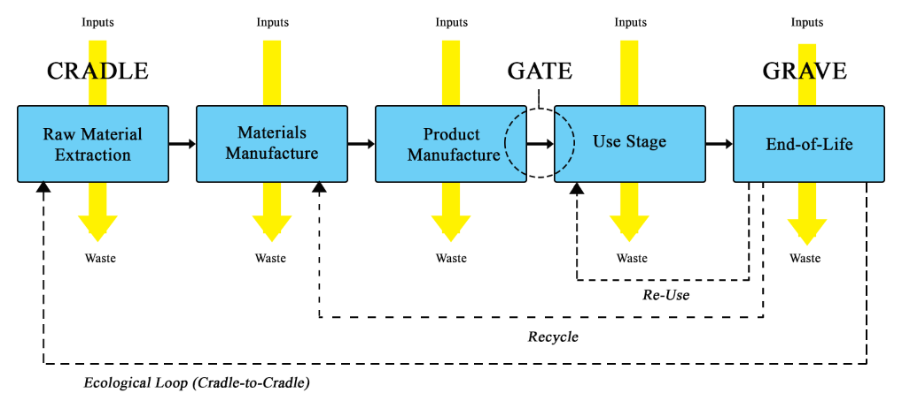

## Aula 16 – Normatização e Avaliação de Desempenho

##### Objetivos da aula

- Dominar o panorama normativo brasileiro (ABNT/DNIT) e internacional (AASHTO/ASTM/EN) aplicado a estruturas de concreto e pavimentação.
- Compreender os sistemas de certificação ambiental (LEED, AQUA-HQE, BREEAM) e suas aplicações em infraestrutura.
- Aplicar metodologia de Avaliação de Ciclo de Vida (ACV/LCA) para quantificação de impactos ambientais em projetos estruturais.

##### Conteúdo da aula (texto base)

#### 1. Introdução: A Era da Sustentabilidade na Engenharia Estrutural

A engenharia de estruturas e pavimentação evoluiu de uma abordagem puramente técnico-econômica para uma visão integrada que considera **desempenho ambiental, social e econômico**. Hoje, um projeto de estrutura de concreto ou pavimento não pode mais ignorar o impacto do ciclo de vida completo: desde a extração de matérias-primas até a demolição e destinação final.

Esta mudança de paradigma é impulsionada por marcos normativos nacionais e internacionais, certificações ambientais rigorosas e ferramentas científicas como a **Avaliação de Ciclo de Vida (ACV)**. Para o engenheiro moderno, dominar estes instrumentos é essencial para entregar soluções competitivas e responsáveis.

#### 2. Panorama Normativo Brasileiro: ABNT e DNIT

##### 2.1. Normas ABNT para Estruturas de Concreto

O conjunto normativo da **ABNT (Associação Brasileira de Normas Técnicas)** estabelece requisitos técnicos e de sustentabilidade para projetos estruturais:

**Normas Fundamentais:**

- **NBR 6118** (Projeto de estruturas de concreto): Define critérios de durabilidade, classes de agressividade ambiental e vida útil de projeto (VUP).
- **NBR 15575** (Desempenho de edificações habitacionais): Estabelece critérios de desempenho estrutural, durabilidade e sustentabilidade.
- **NBR 12655** (Concreto de cimento Portland): Especifica controle tecnológico incluindo aspectos ambientais.

A **NBR 6118** introduz o conceito de **classes de agressividade ambiental** (CAA I a IV), que impactam diretamente o projeto:

$
\text{VUP} = f(\text{CAA}, \text{tipo estrutura}, \text{importância})
$

Onde VUP (Vida Útil de Projeto) varia de 50 anos (estruturas correntes) a 100+ anos (obras especiais).

##### 2.2. Normas DNIT para Pavimentação

O **DNIT (Departamento Nacional de Infraestrutura de Transportes)** regulamenta pavimentação rodoviária com foco crescente em sustentabilidade:

**Principais Normas:**

- **DNIT 031/2006 ES**: Pavimentos flexíveis - Concreto asfáltico
- **DNIT 049/2013 ES**: Pavimentos de concreto simples
- **DNIT 141/2010 ES**: Pavimentação - Base de brita graduada

#### 3. Normas Internacionais de Referência

##### 3.1. AASHTO (American Association of State Highway and Transportation Officials)

As normas **AASHTO** são referência mundial para projetos rodoviários, especialmente em **dimensionamento mecanístico-empírico**:

- **AASHTO T 307**: Determinação do módulo resiliente de solos e materiais granulares
- **AASHTO M 325**: Especificações para concreto de alta performance

##### 3.2. ASTM International

As normas **ASTM** definem métodos de ensaio e especificações de materiais:

- **ASTM C39**: Resistência à compressão de corpos de prova cilíndricos
- **ASTM C496**: Resistência à tração indireta (ensaio brasileiro)

##### 3.3. Eurocódigos (EN)

Os **Eurocódigos** oferecem abordagem unificada europeia com ênfase em **confiabilidade estrutural**:

- **EN 1992** (Eurocode 2): Projeto de estruturas de concreto
- **EN 206**: Concreto - Especificação, desempenho, produção e conformidade

#### 4. Certificações Ambientais em Infraestrutura

##### 4.1. LEED (Leadership in Energy and Environmental Design)

O sistema **LEED** do US Green Building Council possui categorias específicas para infraestrutura:

**LEED v4 Infrastructure:**

- **Materiais e Recursos (MR)**: Uso de materiais reciclados, regionais e de baixo impacto
- **Qualidade Ambiental (EQ)**: Controle de poluição durante construção
- **Localização e Transporte (LT)**: Redução de impactos do transporte de materiais

**Exemplo prático:** Um pavimento de concreto pode conquistar pontos LEED através de:

- Uso de **30% de adições minerais** (escória, cinza volante) - 2 pontos MR
- **Agregados reciclados regionais** (<100km) - 1 ponto MR
- **Gestão de resíduos de construção** (>75% desviados de aterro) - 2 pontos MR

##### 4.2. AQUA-HQE (Alta Qualidade Ambiental)

Adaptação brasileira da certificação francesa **HQE**, focada em **qualidade ambiental do edifício**:

**14 Categorias de Desempenho:**

1. **Relação do edifício com seu entorno**
2. **Escolha integrada de produtos, sistemas e processos construtivos**
3. **Canteiro de obras com baixo impacto ambiental**
4. **Gestão da energia**
5. **Gestão da água**

##### 4.3. BREEAM (Building Research Establishment Environmental Assessment Method)

Pioneiro britânico em avaliação ambiental, com categoria específica **BREEAM Infrastructure**:

**Créditos para Estruturas:**

- **Mat 03**: Especificação responsável de materiais estruturais
- **Was 01**: Estratégia de gestão de resíduos de construção
- **Mat 05**: Estruturas de concreto com baixo carbono

#### 5. Metodologia de Avaliação de Ciclo de Vida (ACV/LCA)

A **ISO 14040** e **ISO 14044** definem a metodologia ACV como ferramenta científica para quantificação de impactos ambientais.

##### 5.1. Estrutura Metodológica da ACV

**Fase 1: Objetivo e Escopo**
Define a unidade funcional e fronteiras do sistema. Para um pavimento:

- **Unidade funcional**: "1 km de pavimento duplo durante 50 anos"
- **Fronteiras**: "Berço ao túmulo" incluindo materiais, construção, uso e fim de vida

**Fase 2: Inventário de Ciclo de Vida (ICV)**
Quantifica entradas (energia, materiais) e saídas (emissões, resíduos):

$
\text{ICV}_{total} = \sum_{i=1}^{n} \text{ICV}_i \times \text{Quantidade}_i
$

**Fase 3: Avaliação de Impacto (AICV)**
Converte o inventário em categorias de impacto:

$
\text{Impacto}_j = \sum_{i=1}^{n} \text{ICV}_i \times \text{FI}_{i,j}
$

Onde $\text{FI}_{i,j}$ é o fator de impacto da substância $i$ na categoria $j$.

**Fase 4: Interpretação**
Análise de contribuições, sensibilidade e consistência dos resultados.

##### 5.2. Indicadores Ambientais Chave

**Mudanças Climáticas:**

- **GWP (Global Warming Potential)**: kg CO₂-eq
- Horizontal de tempo: 100 anos (IPCC AR5)

**Esgotamento de Recursos:**

- **ADP elementos**: kg Sb-eq (antimônio equivalente)
- **ADP combustíveis**: MJ (energia primária)

**Eutrofização:**

- **Aquática**: kg PO₄³⁻-eq
- **Terrestre**: mol N-eq

#### 6. Exemplo Numérico: ACV de Pavimento de Concreto vs. Asfáltico

Considere a comparação de duas soluções para uma via urbana de 1 km:

##### Alternativa A: Pavimento de Concreto

- Placa de concreto: 25 cm, $f_{ck}$ = 35 MPa
- Base granular: 15 cm
- Vida útil: 40 anos

##### Alternativa B: Pavimento Flexível

- Revestimento asfáltico: 5 cm (CBUQ)
- Base asfáltica: 10 cm
- Base granular: 25 cm
- Vida útil: 20 anos (1 recapeamento)

**Cálculo das Emissões de CO₂:**

Pavimento de concreto:
$
\text{CO}_2 = V_{concreto} \times \rho_{concreto} \times \text{FE}_{concreto}
$
$
\text{CO}_2 = (1000 \times 3{,}5 \times 0{,}25) \times 2400 \times 0{,}34 = 714 \text{ t CO}_2\text{-eq}
$

Pavimento asfáltico (incluindo recapeamento):
$
\text{CO}_2 = (V_{CBUQ} \times \text{FE}_{asfalto} + V_{base} \times \text{FE}_{base}) \times 2
$
$
\text{CO}_2 = [(525 \times 0{,}28) + (875 \times 0{,}15)] \times 2 = 556 \text{ t CO}_2\text{-eq}
$

**Análise:** O pavimento flexível apresenta menor impacto inicial, mas considerando manutenções ao longo de 40 anos, o pavimento rígido pode ser mais vantajoso.

#### 7. Atividade Prática: Matriz de Conformidade Normativa

Desenvolva uma **matriz de requisitos** para um projeto de estrutura de concreto armado (edifício de 15 pavimentos em ambiente urbano):

**Passo 1:** Identifique normas aplicáveis

- NBR 6118, NBR 15575, NBR 12655
- Códigos municipais de obras
- Eventuais normas internacionais (cliente/financiador)

**Passo 2:** Mapeie requisitos de certificação

- LEED BD+C ou AQUA-HQE
- Categorias prioritárias: Materiais, Energia, Água, QEI

**Passo 3:** Elabore escopo de ACV simplificada

- Unidade funcional: "1 m² de área construída em 50 anos"
- Fronteiras: A1-A3 (materiais) + B4 (manutenção) + C1-C4 (fim de vida)
- Indicadores: GWP, ADP, eutrofização

**Passo 4:** Compare duas soluções estruturais

- Sistema convencional (lajes maciças + vigas)
- Sistema otimizado (lajes protendidas + pilares esbeltos)

#### 8. Pontos-chave da Aula

1. O panorama normativo evoluiu de critérios puramente técnicos para **abordagens integradas de sustentabilidade**.
2. **NBR 6118** e **NBR 15575** estabelecem requisitos de durabilidade e desempenho que impactam diretamente o projeto estrutural.
3. Certificações como **LEED**, **AQUA-HQE** e **BREEAM** oferecem marcos de referência para projetos sustentáveis.
4. A **metodologia ACV** permite quantificação científica de impactos ambientais, essencial para tomada de decisão.
5. A integração entre **normatização**, **certificação** e **ACV** define o estado da arte em engenharia estrutural sustentável.

#### 9. Integração com Projetos Futuros

Na próxima etapa de sua carreira, considere que projetos de infraestrutura cada vez mais exigirão:

- **Compliance normativo** rigoroso (nacional e internacional)
- **Certificações ambientais** como diferencial competitivo
- **Quantificação de impactos** através de ACV/LCA
- **Otimização multi-objetivo** (técnica, econômica, ambiental)

##### Links suplementares da Aula 16

- [Life Cycle Assessment (ISO 14040)](https://en.wikipedia.org/wiki/Life-cycle_assessment)
- [ABNT - Catálogo de Normas](https://www.abnt.org.br/)
- [DNIT - Normas e Manuais](https://www.gov.br/dnit/pt-br)
- [LEED Rating System](https://www.usgbc.org/leed)
- [AQUA-HQE Brasil](https://vanzolini.org.br/aqua/)
- [BREEAM International](https://www.breeam.com/)
