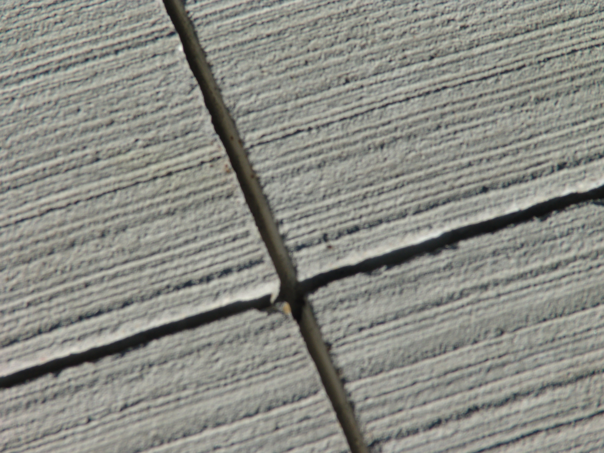
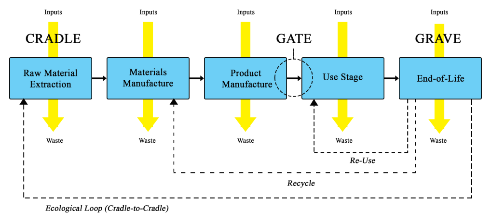

# TEMPLATE DE PRODUÇÃO - MODELO ÁTOMO

# Nome da disciplina: Estruturas de Concreto: Pilares e Solicitações Dinâmicas
# Conteudista: Afonso Cesar Lelis Brandão

## Tabela para uso exclusivo do(a) coordenador(a)

```
Requisitos para um conteúdo UAU            Observações
```
Conformidade com o Plano de Aprendizado

Clareza e objetividade

Ortografia e gramática

Recursos visuais atrativos (imagens, gifs, etc.)

```
Data da Validação        Nome do(a) Coordenador(a) do curso
```
#### ● VALIDADO ● NÃO VALIDADO ● CANCELADO

```
TEXTO BASE -
TÍTULOS E OBJETIVOS DAS VIDEOAULAS -
QUIZ -
MATERIAL COMPLEMENTAR -
```

# TEXTO BASE

#### Por que esta unidade é relevante para a sua atuação profissional?
Esta unidade final consolida a visão do engenheiro de estruturas moderno, que não apenas projeta elementos isolados, mas integra sistemas complexos (estrutura-fundação-pavimento), utiliza ferramentas computacionais avançadas e incorpora os princípios de sustentabilidade e análise de ciclo de vida em suas decisões. Dominar esses temas é o que diferencia um projetista comum de um profissional preparado para os desafios do futuro da construção civil.

### Contribuições para a atuação profissional
- Capacidade de projetar e detalhar a complexa interação entre a estrutura de um edifício, suas fundações e os pavimentos industriais, evitando patologias comuns.
- Habilidade para utilizar softwares de modelagem computacional (FEM) para análises mais realistas e otimizadas.
- Conhecimento para especificar materiais mais sustentáveis, como concretos com adições minerais e agregados reciclados, reduzindo o impacto ambiental dos projetos.
- Competência para realizar análises de ciclo de vida (ACV), comparando diferentes soluções de projeto com base em métricas de sustentabilidade.
- Visão crítica sobre a aplicação de normas técnicas e os requisitos de certificações ambientais como LEED e AQUA-HQE.

### Exemplos práticos
- Detalhamento de juntas de isolamento em um piso industrial ao redor das bases de pilares para evitar a transferência de esforços e o surgimento de fissuras.
- Modelagem em software de elementos finitos da interação de uma sapata com o solo para uma previsão mais acurada dos recalques e seu efeito no pavimento adjacente.
- Especificação de um concreto com 30% de substituição de cimento por cinza volante para a laje de um centro de distribuição, visando a obtenção de pontos na certificação LEED.
- Comparativo via ACV entre uma solução de pavimento rígido e uma de pavimento flexível para uma via de acesso, considerando as fases de construção, manutenção e fim de vida.

---

#### TEXTO BASE EXPANDINDO HORIZONTES DA VIDEOAULA 1

## Aula 13 – Interação Estrutura-Pavimento

##### Objetivos da aula
- Entender a interação entre pilares/estrutura, fundações e pavimentos de piso em obras industriais.
- Compreender a transmissão de cargas e movimentos: estrutura → fundação → pavimento, e implicações no desempenho.
- Detalhar juntas (serradas, de dilatação/movimentação) e soluções de interface (chumbadores, chapas de base).

##### Conteúdo da aula (texto base)

1) Obras industriais: pilares + pavimentos de piso
- Piso industrial como laje sobre o terreno (slab-on-grade) suportando tráfego de empilhadeiras, prateleiras e cargas estáticas; pilares (aço/concreto) transmitindo ações à fundação.
- Interfaces críticas: região de base de pilares (chapa de base/arruela de pressão, chumbadores) e juntas do piso; necessidades distintas de movimentação e detalhamento.

2) Transmissão de cargas: estrutura → fundação → pavimento
- Esquema de fluxo: ações na superestrutura (peso próprio, equipamentos, pontes rolantes) → pilares → blocos/sapatas/estacas → interação com solo → efeitos no pavimento adjacente (acomodações diferenciais, recalques, bordas livres).
- Compatibilização: especificar módulo de reação/subleito (k), camadas granulares e reforço local (faixas sob rodas, corredores de tráfego) para limitar deformações diferenciais junto a bases de pilares.

3) Juntas de dilatação e movimentação estrutural
- Juntas serradas (serrilhadas/serradas) para controle de fissuração do piso; juntas de dilatação para acomodar variações térmicas, retração e movimentos estruturais.
- Diretrizes: posicionamento das juntas em relação a pilares e fundações; continuidade funcional (selantes, cargas de roda), transferência de carga (pinos/dowels quando aplicável), e selagem contra infiltrações.



4) Interface pilar–piso: base, chumbadores e detalhes
- Bases metálicas com chumbadores: prever folgas/movimentos sem impor esforços indesejados ao piso; prever juntas de isolamento perimetrais no piso junto a pilares/revestimentos.
- Mitigação: reforço local do piso (espessura/armadura de distribuição, fibras), juntas de isolamento, planos de manutenção (selantes, inspeção de trincas).

5) Exemplo numérico (verificação simplificada)
- Dados: corredor de tráfego junto a base de pilar; $k=40$ MN/m³; carga de roda $P=25$ kN; espessura do piso $h=200$ mm; concreto $E=30$ GPa, $\nu=0{,}2$. Estime o raio de rigidez relativa (Winkler/Westergaard) para avaliação qualitativa de sensibilidade a bordas:

$
\ell = \left( \dfrac{E\,h^3}{12\,k(1-\nu^2)} \right)^{1/4}
$

Substituindo: $\ell = \left( \dfrac{30\times 10^9\,(0{,}2)^3}{12\,\cdot 40\times 10^6\,\cdot (1-0{,}04)} \right)^{1/4} \approx \left( \dfrac{30\times 10^9\,\cdot 8\times 10^{-3}}{12\cdot 40\times 10^6\cdot 0{,}96} \right)^{1/4}$ → $\ell$ da ordem de dezenas de cm, indicando influência de bordas/quinas. Ajustar detalhamento (espessura/junta/apoio) conforme verificação detalhada.

##### Atividade prática
- Em uma planta de layout industrial (simplificada), posicione pilares e defina o plano de juntas do piso (serradas e de dilatação), indicando:
  - Distâncias entre juntas, juntas de isolamento em torno dos pilares e selantes.
  - Faixas reforçadas de tráfego e critérios de transferência de carga quando aplicável.
  - Notas de inspeção/manutenção (selagem e reparo de trincas).

##### Links suplementares da Aula 13
- Concrete slab (Wikipedia): https://en.wikipedia.org/wiki/Concrete_slab
- Expansion joint (Wikipedia): https://en.wikipedia.org/wiki/Expansion_joint
- Anchor bolt (Wikipedia): https://en.wikipedia.org/wiki/Anchor_bolt
- Industrial flooring (referência geral): https://en.wikipedia.org/wiki/Polished_concrete

---

#### VIDEOAULA 13: Aula 13 – Interação Estrutura-Pavimento

## Roteiro para a Videoaula 13 – Interação Estrutura-Pavimento

**(1) Abertura (1 min)**
*   *Professor na tela:* "Olá! Sou Afonso Cesar Lelis Brandão. Hoje vamos conectar duas áreas que muitas vezes são tratadas de forma separada: a estrutura de um edifício e o seu pavimento. Em obras industriais, essa conexão é crítica e pode ser a causa de muitos problemas se não for bem projetada. Vamos entender essa interação."

**(2) O Sistema Integrado: Estrutura, Fundação e Piso (3 min)**
*   *Animação:* Mostrar um pilar de um galpão, sua sapata e o piso industrial ao redor. Setas indicam o caminho das cargas do pilar para a fundação e como o recalque da fundação afeta o piso.
*   *Professor:* "Em um galpão industrial, o pilar descarrega na sua fundação, que por sua vez se apoia no solo. O piso, ao lado, também se apoia no mesmo solo. Se a fundação do pilar recalca, ela 'puxa' o piso para baixo, criando degraus e fissuras. Por isso, precisamos pensar nesse sistema de forma integrada."

**(3) Juntas: A Chave para a Compatibilidade (4 min)**
*   *Professor:* "A solução para compatibilizar os movimentos da estrutura e do piso está nas juntas. Temos as juntas serradas, que controlam a retração do concreto do piso, e as juntas de isolamento, que são fundamentais ao redor dos pilares. Elas criam uma separação, permitindo que o pilar e o piso se movam de forma independente."
*   *Imagens:* Mostrar detalhes de juntas de isolamento ao redor de pilares e a aplicação de selantes.

**(4) Detalhes Construtivos da Interface (3 min)**
*   *Animação:* Zoom na base de um pilar, mostrando a chapa de base, os chumbadores e a junta de isolamento preenchida com material compressível.
*   *Professor:* "O detalhe da ligação do pilar com a fundação e sua relação com o piso é crucial. A chapa de base e os chumbadores devem ser projetados para fixar o pilar, mas a junta de isolamento ao redor garante que o piso não fique 'colado' no bloco de fundação, evitando a transmissão de esforços indesejados."

**(5) Encerramento (2 min)**
*   *Professor na tela:* "Lembrem-se: a interação estrutura-pavimento é um jogo de compatibilização de movimentos. Um bom projeto de juntas e um detalhamento cuidadoso da base dos pilares são essenciais para a durabilidade e o bom desempenho de um piso industrial."
*   *Professor:* "Na próxima aula, vamos ver como os computadores nos ajudam a simular e a prever esses comportamentos. Até lá!"

---

#### TEXTO BASE EXPANDINDO HORIZONTES DA VIDEOAULA 2

## Aula 14 – Modelagem Computacional

##### Objetivos da aula
- Reconhecer o papel de softwares de análise estrutural (SAP2000, ANSYS, TQS) na verificação e projeto.
- Conhecer programas para dimensionamento/análise de pavimentos (APSDS, EverFE) e suas hipóteses.
- Modelar, em alto nível, a interação solo–estrutura/pavimento e interpretar resultados.

##### Conteúdo da aula (texto base)

1) Softwares de análise estrutural (visão geral)
- SAP2000/TQS: análise de pórticos/lajes; modelos lineares/PNL; combinações de carregamentos; detalhamento; interoperabilidade BIM.
- ANSYS (FEM geral): análise linear/não linear, contato, térmico–estrutural; utilidade para nós especiais (apoios, chapas de base, juntas) e macro‑modelos.
- Boas práticas: discretização (malha), condições de contorno realistas, calibração de materiais, verificação de sensibilidade.

2) Programas para pavimentos (mecanístico–empíricos/FEM)
- APSDS/EverFE: cálculo de respostas (tensões/deformações/deflexões) em camadas e placas em base elástica; verificação de fadiga ($\varepsilon_t$) e trilha de roda ($\varepsilon_z$).
- Entradas críticas: módulos (função de temperatura/frequência), espessuras, pressão de contato; MR do subleito; confiabilidade.
- Saídas: mapas de tensões/deformações, fatores de dano ($N_f$, $N_d$), recomendações de espessura.

[Triangulação de elementos finitos (malha 2D) – link](https://upload.wikimedia.org/wikipedia/commons/thumb/d/d1/Finite_element_triangulation.svg/640px-Finite_element_triangulation.svg.png)

3) Interação solo–estrutura/pavimento (conceitos)
- Abordagens: (a) fundação como molas (Winkler), (b) meios contínuos (FEM), (c) subleito não linear; quando cada uma é apropriada.
- Interfaces: contato com atrito, juntas com/sem transferência de carga, molas de base; consideração de recalques diferenciais.
- Validação: comparar com soluções analíticas (Westergaard/Burmister) e dados de campo (deflexões, IRI, desempenho).

4) Exemplo orientado (workflow)
- Definir um caso simples (pórtico + base + piso). No SAP/TQS, modelar o pórtico e extrair reações em bases. Em software de pavimento (APSDS/EverFE), simular o piso (placa sobre base elástica) com carregamento equivalente e verificar $\varepsilon_t$, $\varepsilon_z$. Ajustar espessuras/juntas.

##### Atividade prática
- Monte um modelo simplificado (esboço): elemento de placa (piso) com $h$ inicial e $k$ estimado; compare respostas entre (i) placa em Winkler e (ii) FEM multicamadas (quando disponível). Registre diferenças e implicações de projeto.

##### Links suplementares da Aula 14
- Finite element method (Wikipedia): https://en.wikipedia.org/wiki/Finite_element_method
- Concrete slab (Wikipedia): https://en.wikipedia.org/wiki/Concrete_slab
- Mechanistic–empirical pavement design: https://en.wikipedia.org/wiki/Mechanistic%E2%80%93empirical_pavement_design

---

#### VIDEOAULA 14: Aula 14 – Modelagem Computacional

## Roteiro para a Videoaula 14 – Modelagem Computacional

**(1) Abertura (1 min)**
*   *Professor na tela:* "Olá! Sou Afonso Cesar Lelis Brandão. Projetar estruturas e pavimentos complexos 'na mão' é coisa do passado. Hoje, temos ferramentas computacionais poderosas que nos permitem simular o comportamento das nossas obras antes mesmo de construí-las. Vamos conhecer algumas delas."

**(2) Softwares de Análise Estrutural (3 min)**
*   *Vídeo:* Screencast rápido mostrando a interface do SAP2000 e do TQS, com um modelo de pórtico sendo analisado.
*   *Professor:* "Para a análise da superestrutura, usamos softwares como o SAP2000 ou o TQS. Eles nos permitem modelar os pilares, vigas e lajes, aplicar os carregamentos e obter os esforços e deslocamentos. São ferramentas essenciais para o dia a dia do engenheiro de estruturas."

**(3) Softwares para Pavimentos (3 min)**
*   *Vídeo:* Screencast mostrando a interface de um software de análise de pavimentos, como o EverFE ou similar, com as camadas do pavimento e o cálculo de tensões.
*   *Professor:* "Para os pavimentos, temos softwares específicos que implementam os métodos de dimensionamento que vimos, como o mecanístico-empírico. Eles calculam as tensões e deformações críticas no pavimento e nos ajudam a verificar a vida de fadiga e a deformação permanente."

**(4) A Interação Solo-Estrutura no Computador (4 min)**
*   *Animação:* Mostrar três formas de modelar o solo: como molas de Winkler, como um meio contínuo em um software de elementos finitos, e com modelos não-lineares.
*   *Professor:* "O grande desafio na modelagem é representar o solo, que é um material complexo. A forma mais simples é usar molas, o modelo de Winkler. Para análises mais refinadas, usamos o Método dos Elementos Finitos (FEM), que nos permite simular o comportamento do solo de forma muito mais realista e analisar a interação com a estrutura."
*   *Imagem:* Mostrar um mapa de tensões de uma análise de elementos finitos de uma fundação.

**(5) Encerramento (2 min)**
*   *Professor na tela:* "As ferramentas computacionais são incríveis, mas lembrem-se: elas são apenas ferramentas. A interpretação dos resultados e a tomada de decisão continuam sendo do engenheiro. É a nossa capacidade de julgar e de entender os modelos que faz a diferença."
*   *Professor:* "Na próxima aula, vamos falar sobre como tornar nossas obras mais sustentáveis. Até lá!"

---

#### TEXTO BASE EXPANDINDO HORIZONTES DA VIDEOAULA 3

## Aula 15 – Sustentabilidade e Materiais Alternativos

##### Objetivos da aula
- Conhecer adições minerais (sílica ativa, cinza volante, escória) e seus efeitos no concreto.
- Avaliar materiais reciclados em pavimentos (RAP, RCD, agregados alternativos) e limitações.
- Discutir pegada de carbono: concreto vs. asfalto e estratégias de mitigação.

##### Conteúdo da aula (texto base)

1) Adições minerais em concreto
- Sílica ativa (microsílica): refina porosidade, aumenta resistência e durabilidade (menor permeabilidade); atenção a trabalhabilidade e calor de hidratação.
- Cinza volante (fly ash): pozolânica; substituição parcial de cimento (tipicamente 10–30%); melhora trabalhabilidade e durabilidade, ganho de resistência tardio.
- Escória granulada de alto-forno (GGBFS): substituição parcial (até 50%+ em alguns casos); reduz calor, melhora durabilidade (sulfatos/cloretos), cores mais claras.

2) Materiais reciclados e agregados alternativos
- RAP (Reclaimed Asphalt Pavement): reaproveitamento por fresagem; em ligantes/asfalto quente, ajustar dosagem/ligante; em bases tratadas, avaliar módulo e fadiga.
- RCD (resíduos de construção e demolição): uso como agregado reciclado em concreto não estrutural/bases; controlar contaminações, absorção e módulo.
- Agregados alternativos: escórias siderúrgicas, resíduos industriais inertes; atenção a expansão/potencial de reatividade.


3) Pegada de carbono: concreto vs. asfalto
- Concreto: emissões concentradas no clínquer; ganhos com substituições (CV, GGBFS, calcário moído), cura otimizada, cimentícios LC3.
- Asfalto: emissões no ligante e temperatura; ganhos com asfalto morno (WMA), alto teor de RAP, aditivos, melhor manutenção para prolongar ciclo de vida.
- Abordagem de ciclo de vida (LCA): produção, transporte, construção, uso (albedo/rolling resistance), manutenção e fim de vida; decidir com base no contexto.

4) Exemplo orientado (estimativa simples de CO2)
- Concreto A: 300 kg de cimento/m³ (0,85 t CO2/t cimento) → ~255 kg CO2/m³.
- Concreto B: 30% de CV (substitui 90 kg de cimento) → ~178 kg CO2/m³ (redução ~30%). Discutir trade‑offs (resistência inicial/durabilidade/curva térmica).

##### Atividade prática
- Proponha um traço de concreto com substituição por CV/GGBFS e estime a redução de CO2/ m³. Para um pavimento flexível, proponha teor de RAP e estratégias (WMA) e discuta os impactos em desempenho e emissões.

##### Links suplementares da Aula 15
- Fly ash (Wikipedia): https://en.wikipedia.org/wiki/Fly_ash
- Ground granulated blast-furnace slag: https://en.wikipedia.org/wiki/Ground_granulated_blast-furnace_slag
- Reclaimed asphalt pavement (em Road surface): https://en.wikipedia.org/wiki/Road_surface

---

#### VIDEOAULA 15: Aula 15 – Sustentabilidade e Materiais Alternativos

## Roteiro para a Videoaula 15 – Sustentabilidade e Materiais Alternativos

**(1) Abertura (1 min)**
*   *Professor na tela:* "Olá! Sou Afonso Cesar Lelis Brandão. A construção civil tem um grande impacto no nosso planeta. Mas como podemos reduzir esse impacto? Hoje vamos falar sobre sustentabilidade, materiais alternativos e como podemos projetar estruturas e pavimentos mais 'verdes'."

**(2) O Concreto Verde: Adições Minerais (4 min)**
*   *Vídeo/Animação:* Mostrar o processo de produção de cimento e, em seguida, a adição de sílica ativa, cinza volante e escória de alto-forno.
*   *Professor:* "A produção de cimento é uma das maiores fontes de emissão de CO2 na indústria da construção. Uma das formas mais eficazes de reduzir esse impacto é substituir parte do cimento por adições minerais, como a cinza volante (um resíduo de termoelétricas) ou a escória de alto-forno (um resíduo da produção de aço). Esses materiais não só reduzem a pegada de carbono, como também podem melhorar a durabilidade do concreto."

**(3) Reciclando o Pavimento: RAP e RCD (3 min)**
*   *Vídeo:* Mostrar uma máquina de fresagem de asfalto e o material fresado (RAP) sendo incorporado em uma nova mistura asfáltica.
*   *Professor:* "E o que fazemos com os pavimentos antigos? Jogamos fora? Não! Podemos reciclá-los. O RAP, ou 'Reclaimed Asphalt Pavement', é o asfalto fresado que pode ser reutilizado em novas misturas. Da mesma forma, os Resíduos de Construção e Demolição (RCD) podem ser processados e usados como agregados em bases de pavimentos."

**(4) A Pegada de Carbono: Concreto vs. Asfalto (3 min)**
*   *Gráfico:* Comparar a pegada de carbono do ciclo de vida de um pavimento de concreto e de um de asfalto, mostrando as contribuições de cada fase (produção, construção, uso, manutenção).
*   *Professor:* "Afinal, quem é mais sustentável: o concreto ou o asfalto? A resposta não é simples e depende de uma análise de ciclo de vida completa. O concreto tem uma alta emissão na produção do cimento, mas pode ter uma vida útil mais longa e uma superfície mais clara, que reflete mais o calor. O asfalto tem emissões no ligante e na aplicação a quente, mas é 100% reciclável."

**(5) Encerramento (2 min)**
*   *Professor na tela:* "A engenharia sustentável não é apenas sobre usar materiais reciclados. É sobre pensar no ciclo de vida completo da obra, desde a extração da matéria-prima até a sua demolição e reaproveitamento. É um desafio complexo, mas fundamental para o futuro da nossa profissão."
*   *Professor:* "Na nossa última aula, vamos ver como as normas e as certificações nos guiam nesse caminho da sustentabilidade. Até lá!"

---

#### TEXTO BASE EXPANDINDO HORIZONTES DA VIDEOAULA 4

## Aula 16 – Normatização e Avaliação de Desempenho

##### Objetivos da aula
- Mapear normas e diretrizes nacionais (ABNT, DNIT) e internacionais aplicáveis à infraestrutura e pavimentação.
- Reconhecer certificações de sustentabilidade (LEED, AQUA‑HQE, BREEAM) e critérios relevantes.
- Introduzir Avaliação de Ciclo de Vida (ACV/LCA) aplicada à infraestrutura.

##### Conteúdo da aula (texto base)

1) Panorama normativo (Brasil e exterior)
- ABNT (ex.: NBR 6118, 6120, 6122, 7181/7182 – geotecnia; 15575 – desempenho; 16697 – cimento; 15961 – agregados) e DNIT (pavimentação rígida/flexível, ensaios, controle).
- Diretrizes internacionais (AASHTO, ASTM, EN normas europeias): quando consultar e como compatibilizar com práticas nacionais.

2) Certificações de sustentabilidade em infraestrutura/edificações
- LEED, AQUA‑HQE, BREEAM: categorias de pontos (materiais, energia, água, resíduos, transporte), documentação e comissionamento; oportunidades em pavimentos (RAP, WMA, albedo, drenagem) e estruturas (adições, durabilidade, manutenção).

3) Avaliação de Ciclo de Vida (ACV/LCA) aplicada
- Fases: objetivo/escopo, inventário (LCI), avaliação de impactos (LCIA), interpretação; fronteiras do sistema (do berço ao túmulo/ao portão/uso).
- Indicadores: GWP (CO2e), energia incorporada, acidificação, eutrofização; aplicação em comparativos concreto vs. asfalto e cenários de manutenção.



4) Exemplo orientado (estrutura+pavimento)
- Definir cenário A (concreto com CV/GGBFS) e B (asfalto com WMA+RAP). Em alto nível, estimar diferenças de GWP para 1 km de via (produção+execução) e discutir como a frequência de manutenção muda o resultado no ciclo de vida.

##### Atividade prática
- Escolha uma obra‑tipo (via urbana/industrial) e elabore uma matriz de requisitos normativos (ABNT/DNIT) e de certificação (LEED/AQUA/BREEAM) aplicáveis. Esboce um plano de ACV (objetivo/escopo, fronteiras, dados necessários) para comparar duas soluções.

##### Links suplementares da Aula 16
- Life‑cycle assessment (Wikipedia): https://en.wikipedia.org/wiki/Life-cycle_assessment
- ABNT (site): https://www.abnt.org.br/
- DNIT (normas): https://www.gov.br/dnit/pt-br
- LEED (USGBC): https://www.usgbc.org/leed

---

#### VIDEOAULA 16: Aula 16 – Normatização e Avaliação de Desempenho

## Roteiro para a Videoaula 16 – Normatização e Avaliação de Desempenho

**(1) Abertura (1 min)**
*   *Professor na tela:* "Olá! Sou Afonso Cesar Lelis Brandão. Chegamos à nossa última aula. Hoje vamos amarrar tudo o que vimos, falando sobre as regras do jogo: as normas técnicas, as certificações de sustentabilidade e como podemos medir o desempenho das nossas obras ao longo de todo o seu ciclo de vida."

**(2) As Regras do Jogo: Normas ABNT e DNIT (3 min)**
*   *Imagens:* Mostrar as capas de algumas normas importantes da ABNT (NBR 6118, NBR 15575) e do DNIT.
*   *Professor:* "Ninguém projeta da sua cabeça. Seguimos as normas técnicas, que são o consenso da comunidade técnica sobre as melhores práticas. No Brasil, a ABNT dita as regras para edificações e materiais, enquanto o DNIT é a referência para as obras rodoviárias. Conhecer e aplicar as normas é a base da nossa responsabilidade profissional."

**(3) O Selo Verde: Certificações de Sustentabilidade (4 min)**
*   *Imagens:* Mostrar os logos das certificações LEED, AQUA-HQE e BREEAM.
*   *Professor:* "Além das normas obrigatórias, temos as certificações de sustentabilidade, como o LEED e o AQUA. Elas são como um 'selo verde' que atesta que uma obra foi projetada e construída com base em critérios de eficiência energética, uso racional da água, gestão de resíduos e escolha de materiais de baixo impacto. Elas são um grande diferencial no mercado."

**(4) Medindo o Impacto Total: Avaliação de Ciclo de Vida (ACV) (3 min)**
*   *Animação:* Mostrar o diagrama de uma Análise de Ciclo de Vida (ACV), desde a extração da matéria-prima ("berço") até a demolição e descarte ("túmulo").
*   *Professor:* "Para comparar de forma justa o impacto ambiental de diferentes soluções, usamos a Avaliação de Ciclo de Vida, ou ACV. Ela quantifica os impactos em todas as fases da vida de um produto ou obra, como a pegada de carbono, o consumo de energia e de água. É a ferramenta mais completa para a tomada de decisão em projetos sustentáveis."

**(5) Encerramento (2 min)**
*   *Professor na tela:* "Normas, certificações e ACV são as ferramentas que nos permitem ir além do projeto básico e entregar obras mais seguras, duráveis e sustentáveis. Espero que esta disciplina tenha despertado em vocês a paixão pela engenharia de estruturas e pavimentos e a consciência da nossa responsabilidade como engenheiros."
*   *Professor:* "Foi um prazer estar com vocês. Sucesso na jornada profissional e até a próxima!"

---

# AVALIAÇÕES

## Quiz Não Avaliativo (V/F)

1) Juntas de isolamento ao redor de pilares em pisos industriais servem para garantir a transferência de carga entre o pilar e o piso.
- Resposta correta: Falso
- Explicação: Juntas de isolamento servem para *separar* o piso dos elementos estruturais, permitindo movimentos independentes e *evitando* a transferência de esforços indesejados que poderiam causar fissuras.

2) A adição de cinza volante (fly ash) ao concreto, em substituição parcial ao cimento, tem como única vantagem a redução da pegada de carbono do material.
- Resposta correta: Falso
- Explicação: Além de reduzir a pegada de carbono, a cinza volante melhora a trabalhabilidade do concreto no estado fresco e pode aumentar sua durabilidade e resistência a ataques químicos no estado endurecido.

## Atividade Verificadora (Dissertativa)

- Questão: Você é o engenheiro responsável por projetar um novo centro de distribuição. O projeto contempla uma grande área de piso de concreto armado para suportar tráfego intenso de empilhadeiras e altas estantes de armazenagem. Descreva, de forma sucinta, sua abordagem para o projeto, considerando os seguintes três aspectos:
    1.  **Interação Estrutura-Pavimento:** Quais os principais cuidados e detalhes construtivos que você adotaria na interface entre os pilares da estrutura e o piso de concreto?
    2.  **Sustentabilidade:** Que materiais ou estratégias você poderia empregar para reduzir o impacto ambiental do concreto do piso?
    3.  **Avaliação de Desempenho:** Como você utilizaria a Avaliação de Ciclo de Vida (ACV) para comparar sua solução de piso de concreto com uma alternativa em pavimento asfáltico?
- Resposta esperada: O aluno deve abordar os seguintes pontos:
    1.  **Interação:** Mencionar a necessidade de juntas de isolamento (ou de movimentação) ao redor de todos os pilares e elementos fixos. Detalhar que essas juntas devem ser preenchidas com material compressível (como isopor ou espuma de polietileno) para permitir movimentos diferenciais (recalques) sem transmitir tensões ao piso.
    2.  **Sustentabilidade:** Citar o uso de adições cimentícias suplementares (SCMs) como cinza volante (fly ash) ou escória de alto-forno (GGBFS) para substituir parcialmente o cimento Portland, reduzindo a pegada de CO2. Poderia também mencionar o uso de agregados reciclados (RCD) na camada de base ou sub-base.
    3.  **ACV:** Explicar que a ACV seria usada para quantificar e comparar os impactos ambientais (GWP, consumo de energia, etc.) de ambas as soluções (concreto vs. asfalto) em todas as fases do ciclo de vida: extração de matérias-primas, produção, transporte, construção, uso (incluindo manutenção e efeitos como resistência ao rolamento) e fim de vida (demolição e reciclagem).

---

# MATERIAL COMPLEMENTAR

## Direto da Fonte

- Texto provocativo: [Inserir]
- Livro: [Inserir]
- Capítulos: [Inserir]
- Link: https://biblioteca-a.read.garden/viewer/9786556901633/91
- Acesso: plataforma Brightspace (BV Professor) – usuário: professor.conteudista – senha: unifecaf2023

## Para Mergulhar

- **Guia de Projeto:** *Concrete industrial ground floors: a guide to design and construction (TR34)*. Publicado pela Concrete Society, o TR34 é a principal referência técnica mundial para o projeto de pisos industriais de concreto, detalhando desde a análise de cargas até o projeto de juntas e a especificação de planicidade.
  - **Link:** [The Concrete Society (UK)](https://www.concrete.org.uk/publications/books/concrete-industrial-ground-floors.aspx)

- **Tutorial de Software:** *SAP2000 Training For Beginners*. Uma playlist completa no YouTube que ensina os fundamentos do SAP2000, um dos softwares de análise estrutural mais utilizados no mundo. Ideal para quem quer começar a modelar estruturas.
  - **Link:** [Playlist no YouTube](https://www.youtube.com/playlist?list=PLXS2g37bUIi_cI6M-S2dJ-iJ5tM8iV1v)

- **Documentário:** *Sustainable materials: is there a concrete solution?* por The Economist. Um documentário que explora o enorme impacto ambiental da indústria do cimento e as inovações que buscam tornar o concreto, o material mais consumido do mundo, mais sustentável.
  - **Link:** [Vídeo no YouTube](https://www.youtube.com/watch?v=K-mD_8iAcs)

- **Vídeo Explicativo:** *What Is a Life Cycle Assessment (LCA)?* por Civil Engineering Explained. Um vídeo curto e didático que explica os conceitos fundamentais da Avaliação de Ciclo de Vida (ACV) e como ela é aplicada na construção civil para avaliar e comparar o impacto ambiental de diferentes materiais e soluções de projeto.
  - **Link:** [Vídeo no YouTube](https://www.youtube.com/watch?v=Z7qB9e_fz6U)

## Podcast

- Texto provocativo: Aprofunde-se na aplicação prática da Análise de Ciclo de Vida (ACV) e como ela está moldando o futuro da construção sustentável.
- Podcast/Vídeo: Building Sustainability Podcast
- Episódio: Life Cycle Analysis (LCA), Environmental Product Declarations (EPD) & Embodied Carbon for construction with Jane Anderson
- Link: https://www.youtube.com/watch?v=s-9-R8v5-xA

## Artigo Científico

- Texto provocativo: Veja um estudo de caso real que quantifica os benefícios ambientais do uso de adições cimentícias em pavimentos de concreto através da Análise de Ciclo de Vida.
- Link: https://doi.org/10.1016/j.jclepro.2018.08.183
- Referência ABNT: LI, J.; ZHANG, Q.; LIU, C.; ZHANG, J. Life cycle assessment of concrete pavement containing supplementary cementitious materials: a case study in China. Journal of Cleaner Production, v. 197, p. 1-11, 2018.
