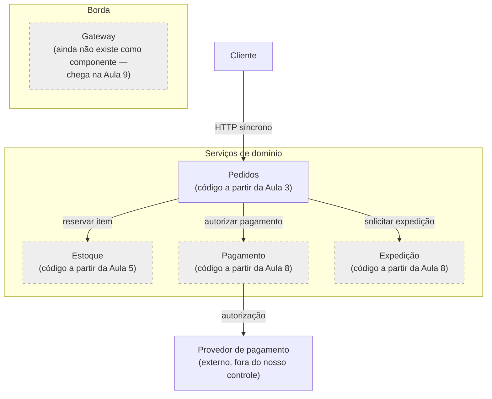
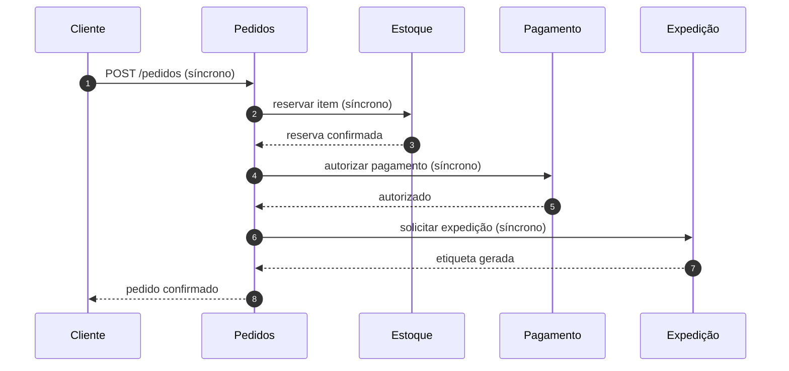

# Arquitetura — visão da Aula 2

Nesta aula a NexaOrder ganha forma visual. Os diagramas evoluem ao longo do projeto —
compare este arquivo com a versão da Aula 10 (arquitetura orientada a eventos) e da
Aula 16 (plataforma completa) para ver a mesma arquitetura amadurecer.

## Visão de componentes

As caixas tracejadas ainda não existem como código nesta aula. Isso é deliberado: o
diagrama descreve a arquitetura **alvo**, e o código a alcança de forma incremental.
Compare este diagrama com o `services/` de cada aula seguinte para ver a lacuna
diminuir.

## Sequência do caminho feliz — decisão síncrona por enquanto

Este é o desenho da Aula 2, ainda inteiramente síncrono. O roteiro da Aula 2 mostra
o custo desse encadeamento: a disponibilidade do fluxo é o produto das disponibilidades
de cada etapa, e a latência é a soma. Este diagrama é substituído por um baseado em
eventos na Aula 10 — guarde-o para comparar.

## Decisão registrada

Ver `docs/adr/0002-comunicacao-sincrona-inicial.md`: por que o projeto começa com
comunicação síncrona mesmo sabendo do seu custo, e qual evidência dispara a migração
para eventos.
