# Unidade 1 — Fundamentos, comunicação, tempo e falhas

Disciplina: Distributed Systems Engineering  
Professor-conteudista: Afonso Cesar Lelis Brandão  
Prazo de produção: 16 de agosto de 2026

## Relação da unidade com a atuação profissional

Sistemas digitais utilizados por bancos, hospitais, indústrias, plataformas de comércio eletrônico e empresas de logística dependem de componentes executados em diferentes máquinas e regiões. Para o usuário, a experiência pode parecer a de um único sistema. Nos bastidores, porém, serviços, bancos de dados, filas, caches e aplicações precisam cooperar por uma rede sujeita a atrasos, interrupções e concorrência. A engenharia de sistemas distribuídos transforma essa complexidade em decisões explícitas de arquitetura.

Esta unidade estabelece a base necessária para compreender por que um sistema distribuído não pode ser tratado como uma simples extensão de um programa executado em uma única máquina. Você analisará comunicação por rede, concorrência, ausência de relógio global e falhas parciais, relacionando esses fenômenos a decisões que aparecem no cotidiano de profissionais de desenvolvimento, arquitetura, dados, nuvem, DevOps, SRE e segurança.

Ao dominar esses fundamentos, o profissional passa a formular perguntas melhores: o que acontece se uma resposta demorar mais do que o esperado? Repetir uma requisição é seguro? Como saber qual evento ocorreu primeiro? Uma instância indisponível significa que todo o serviço falhou? Qual requisito justifica distribuir o sistema? Essas perguntas permitem prevenir perda de dados, cobranças duplicadas, indisponibilidade em cascata e arquiteturas caras que não entregam o benefício esperado.

## O que você verá nesta unidade

A Unidade 1 apresenta o vocabulário e os modelos usados ao longo da disciplina. Na Aula 1, você compreenderá o que caracteriza um sistema distribuído e quais compromissos surgem quando uma aplicação passa a utilizar vários processos ou nós. Na Aula 2, estudará os principais mecanismos de comunicação, comparando APIs, RPC e mensageria. Na Aula 3, analisará concorrência, relógios e ordenação de eventos. Por fim, na Aula 4, examinará modelos de falha e estratégias de recuperação.

O fio condutor será a NexaOrder, uma plataforma fictícia de pedidos, pagamentos e expedição. Inicialmente simples, ela precisará atender mais usuários e integrar novos serviços sem perder confiabilidade. Cada decisão será observada tanto pelo benefício que oferece quanto pelos problemas que introduz.

## Aula 1 — Pensar distribuído: conceitos, propriedades e compromissos

### Situação-problema: quando crescer deixa de ser apenas adicionar servidores

A NexaOrder começou como uma aplicação instalada em um único servidor. A interface, as regras de negócio e o banco de dados estavam próximos, compartilhando o mesmo ambiente. Com o aumento das vendas, a equipe criou novas instâncias da aplicação e separou catálogo, estoque, pagamento e expedição. A mudança elevou a capacidade de atendimento, mas trouxe comportamentos inesperados: dois clientes conseguiram comprar o último item; uma cobrança foi processada mesmo após a interface informar erro; e o painel de operações exibiu estados diferentes para o mesmo pedido.

Esses incidentes não decorrem necessariamente de programação descuidada. Eles revelam propriedades inerentes à distribuição. Ao separar componentes, a equipe trocou chamadas locais previsíveis por comunicação por rede, introduziu cópias de dados e permitiu que operações ocorressem simultaneamente em máquinas com percepções diferentes do estado global.

O desafio desta aula é compreender o que mudou e construir um modelo mental capaz de orientar as próximas decisões.

### O que é um sistema distribuído?

Um sistema distribuído é formado por componentes computacionais autônomos que se comunicam por uma rede e coordenam suas ações para oferecer um serviço ou alcançar um objetivo comum. Cada componente possui estado e execução próprios. Não existe, por definição, uma memória global instantaneamente compartilhada nem um relógio perfeito acessível a todos.

Essa definição destaca quatro elementos:

1. **Pluralidade de componentes:** há mais de um processo, máquina virtual, contêiner, dispositivo ou nó participante.
2. **Autonomia:** cada participante executa e pode falhar independentemente.
3. **Comunicação:** a cooperação ocorre por mensagens transmitidas por uma rede.
4. **Coordenação:** o resultado depende da combinação das ações dos participantes.

Um sistema pode ser distribuído mesmo quando seus componentes estão no mesmo datacenter. A distância física influencia a latência e a probabilidade de certos eventos, mas o aspecto determinante é a separação entre os participantes e a comunicação não instantânea. Da mesma forma, executar várias funções dentro do mesmo processo não cria, por si só, um sistema distribuído.

Considere uma compra na NexaOrder. O serviço de pedidos registra a intenção do cliente; o serviço de estoque reserva o item; o serviço de pagamento solicita autorização; e o serviço de expedição prepara o envio. Para o cliente, há uma única operação: “comprar”. Para a arquitetura, há uma sequência de mensagens, estados intermediários e possíveis falhas.

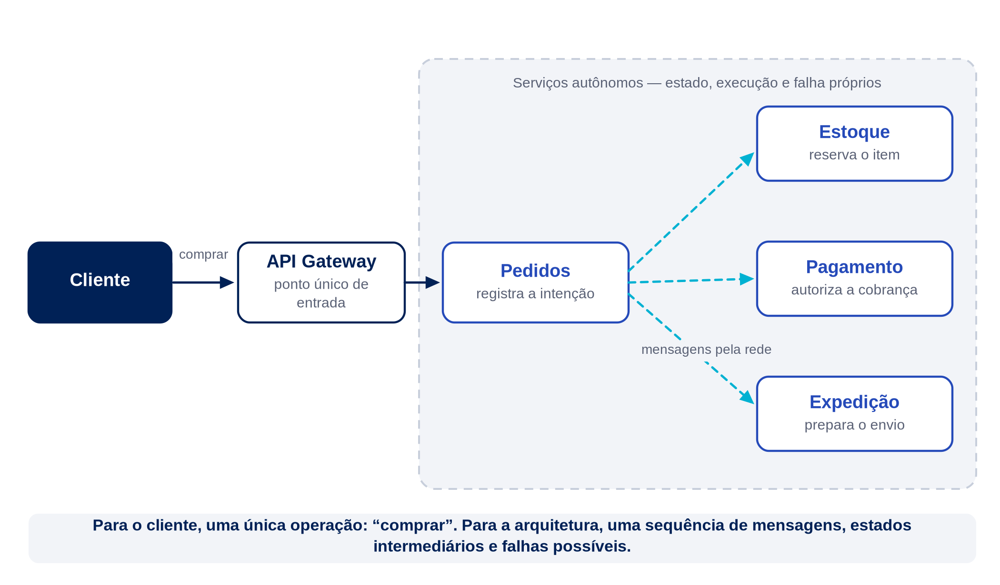

> **Figura 1 — Arquitetura distribuída da NexaOrder.** Fonte: elaboração própria — Afonso Cesar Lelis Brandão, *Distributed Systems Engineering*, 2026 (CC BY 4.0). **Texto alternativo:** Diagrama mostra um cliente enviando uma compra a um gateway, que se comunica com quatro serviços independentes conectados por rede.

### Por que distribuir?

Distribuir um sistema não é um objetivo isolado. É uma resposta a requisitos que uma arquitetura centralizada não atende de forma satisfatória. Entre as motivações mais frequentes estão escalabilidade, disponibilidade, proximidade geográfica, isolamento de responsabilidades, integração entre organizações e uso eficiente de recursos.

#### Escalabilidade

Escalabilidade é a capacidade de sustentar crescimento de carga sem degradação incompatível com os objetivos do serviço. O aumento pode ocorrer em número de usuários, requisições, volume de dados, regiões atendidas ou complexidade funcional.

Há duas estratégias básicas:

- **escala vertical:** aumentar CPU, memória, armazenamento ou capacidade de uma máquina;
- **escala horizontal:** aumentar o número de instâncias ou nós que compartilham o trabalho.

A escala vertical tende a ser operacionalmente simples, mas encontra limites físicos e econômicos. A escala horizontal amplia a capacidade por paralelismo, porém exige distribuição de requisições, tratamento de concorrência, replicação e coordenação.

Se uma instância da NexaOrder processa 200 requisições por segundo e a campanha de vendas exige 800, quatro instâncias parecem suficientes em uma estimativa ideal. Entretanto, a relação raramente é perfeitamente linear. O banco de dados pode tornar-se gargalo, o balanceamento possui custo e parte da carga exige coordenação.

Uma estimativa inicial pode ser expressa por:

$$
N = \left\lceil \frac{\lambda_{\text{pico}}}{C_{\text{instância}} \times U_{\text{alvo}}} \right\rceil
$$

em que:

- $N$ é o número mínimo estimado de instâncias;
- $\lambda_{\text{pico}}$ é a taxa de chegada no pico;
- $C_{\text{instância}}$ é a capacidade medida de uma instância;
- $U_{\text{alvo}}$ é a utilização operacional desejada.

Para $\lambda_{\text{pico}} = 800$ requisições por segundo, $C_{\text{instância}} = 200$ e $U_{\text{alvo}} = 0{,}70$:

$$
N = \left\lceil \frac{800}{200 \times 0{,}70} \right\rceil
= \left\lceil 5{,}71 \right\rceil = 6
$$

A margem evita planejar o serviço para operar continuamente no limite. A conta não substitui teste de carga, mas transforma uma decisão intuitiva em hipótese verificável.

#### Disponibilidade e tolerância a falhas

Várias instâncias podem manter um serviço acessível quando uma delas falha. Isso só ocorre se a redundância não compartilhar o mesmo ponto de falha e se houver mecanismo capaz de desviar o tráfego. Duas instâncias no mesmo host físico não protegem contra a falha desse host. Duas instâncias em zonas distintas aumentam a independência, mas também ampliam latência, custo e complexidade de dados.

Disponibilidade pode ser expressa como a proporção de tempo em que o serviço cumpre sua função:

$$
A = \frac{\text{tempo operacional}}{\text{tempo total observado}}
$$

Uma disponibilidade de 99,9% permite aproximadamente 43 minutos de indisponibilidade em um período de 30 dias. Já 99,99% reduz essa margem para cerca de 4 minutos e 19 segundos. Cada “nove” adicional tende a exigir investimentos maiores em redundância, automação, observabilidade e recuperação.

#### Distribuição geográfica

Posicionar recursos próximos aos usuários pode reduzir latência e atender exigências de residência de dados. Contudo, manter cópias em regiões diferentes exige decidir quando uma atualização se torna visível, como conflitos serão resolvidos e o que deve acontecer durante uma interrupção entre regiões.

#### Autonomia organizacional

Serviços separados podem permitir que equipes implantem e evoluam partes do produto de maneira independente. Esse benefício depende de limites bem definidos. Se toda mudança exigir coordenação simultânea entre diversas equipes, a arquitetura será distribuída tecnicamente, mas continuará fortemente acoplada do ponto de vista organizacional.

### Propriedades que mudam o raciocínio

#### Concorrência

Em um sistema distribuído, diferentes componentes trabalham ao mesmo tempo. A concorrência permite desempenho e capacidade, mas cria disputas sobre recursos compartilhados. Se dois pedidos leem “uma unidade disponível” antes de qualquer reserva ser confirmada, ambos podem tentar consumir o mesmo item.

Não basta perguntar se uma operação está correta isoladamente. É necessário analisar quais interleavings — diferentes ordens possíveis de execução — preservam as invariantes de negócio.

#### Ausência de estado global instantâneo

Cada componente observa mensagens que já chegaram até ele. Como a transmissão consome tempo, dois componentes podem ter visões diferentes e ambas serem coerentes com suas observações locais. Um painel pode indicar “pagamento pendente” enquanto o serviço de pagamento já registrou “aprovado”, mas a atualização ainda não foi recebida.

Isso não significa que qualquer divergência seja aceitável. O projeto deve definir quais estados podem divergir, por quanto tempo e com qual mecanismo de convergência.

#### Falhas parciais

Em uma aplicação local, a falha do processo costuma ser claramente percebida. Em um sistema distribuído, um componente pode estar funcionando enquanto outro está indisponível. Uma mensagem atrasada e um serviço parado podem produzir o mesmo sintoma para quem espera uma resposta: silêncio.

Essa ambiguidade é fundamental. Após um timeout na autorização de pagamento, a NexaOrder não sabe automaticamente se a operação:

- não chegou ao provedor;
- chegou, mas ainda não foi processada;
- foi processada e a resposta se perdeu;
- continua em execução;
- falhou antes de produzir efeito.

Repetir a solicitação sem proteção pode criar cobrança duplicada. Desistir imediatamente pode abandonar uma compra válida. A solução exigirá idempotência, identificação de operações, consulta de estado e reconciliação — temas retomados nas aulas seguintes.

#### Heterogeneidade

Sistemas distribuídos frequentemente combinam linguagens, sistemas operacionais, bancos de dados, protocolos e versões diferentes. Contratos de interface, formatos de serialização e compatibilidade tornam-se parte do sistema. Uma alteração considerada local pode interromper consumidores ainda não atualizados.

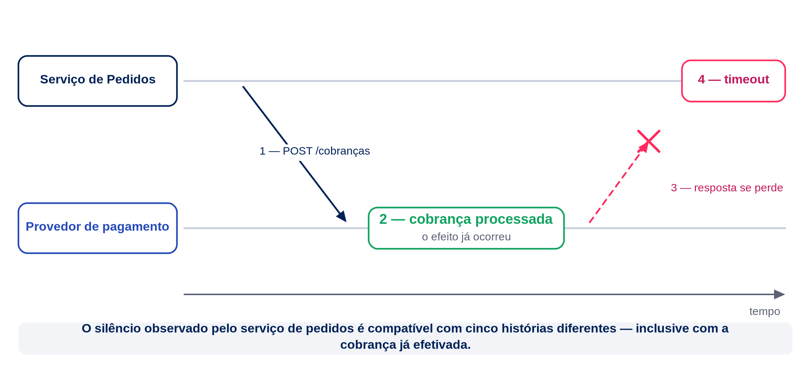

> **Figura 2 — Linha do tempo de uma falha ambígua.** Fonte: elaboração própria — Afonso Cesar Lelis Brandão, *Distributed Systems Engineering*, 2026 (CC BY 4.0). **Texto alternativo:** Linha do tempo evidencia que o pagamento foi processado, mas a resposta se perdeu, levando o serviço solicitante a observar apenas o timeout.

### Transparência: útil para o usuário, perigosa para o projeto

Um objetivo comum é oferecer a impressão de um sistema único e coerente. Essa transparência pode esconder localização, replicação, migração ou falha de componentes. Para o usuário, é desejável não precisar saber qual servidor processou uma requisição.

Para o engenheiro, porém, esconder completamente a distribuição é perigoso. Uma chamada remota difere de uma chamada local:

- possui latência maior e variável;
- pode falhar sem que o destino tenha falhado;
- pode produzir efeito sem retornar confirmação;
- depende de serialização;
- atravessa limites de segurança;
- pode ser repetida;
- exige compatibilidade de contrato.

O projeto deve simplificar a experiência externa sem apagar, no raciocínio interno, as características da rede.

### Métricas que não devem ser confundidas

#### Latência

Latência é o tempo necessário para concluir uma operação ou observar uma resposta. Em produção, médias isoladas escondem casos ruins. Percentis são mais informativos: p95 de 300 ms significa que 95% das observações foram concluídas em até 300 ms; os 5% restantes demoraram mais.

#### Throughput

*Throughput* é a quantidade de trabalho concluída por unidade de tempo, como pedidos por segundo. Aumentar concorrência pode elevar o throughput até que algum recurso sature. Depois desse ponto, filas crescem e a latência pode aumentar rapidamente.

#### Disponibilidade

Disponibilidade indica se o serviço consegue atender. Um endpoint pode responder e ainda estar funcionalmente indisponível, por exemplo, se devolve erro para quase todas as compras. Por isso, indicadores precisam representar a experiência relevante para o negócio.

#### Confiabilidade

Confiabilidade envolve produzir resultados corretos de maneira sustentada. Um sistema que responde rapidamente, mas duplica cobranças, não é confiável. Desempenho e correção precisam ser avaliados em conjunto.

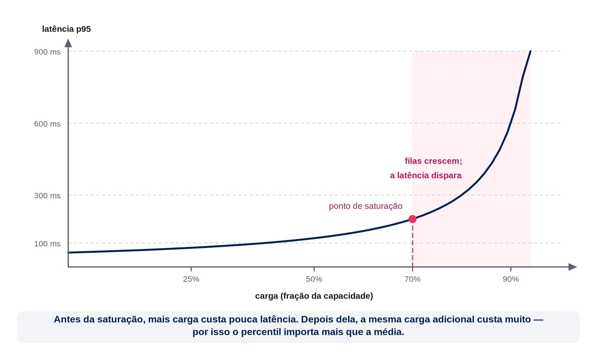

> **Figura 3 — Carga versus latência.** Fonte: elaboração própria — Afonso Cesar Lelis Brandão, *Distributed Systems Engineering*, 2026 (CC BY 4.0). **Texto alternativo:** Gráfico relaciona carga e latência; a latência cresce lentamente até o ponto de saturação e depois aumenta de forma abrupta.

### Estilos arquiteturais iniciais

#### Cliente-servidor

Clientes solicitam operações e servidores fornecem recursos ou serviços. O modelo é simples e permanece presente mesmo em arquiteturas complexas. Seu limite aparece quando um único servidor concentra capacidade ou disponibilidade.

#### Arquitetura em camadas

Responsabilidades são organizadas em apresentação, aplicação, domínio e dados, ou variações semelhantes. Camadas ajudam a separar interesses, mas não exigem distribuição física. Separar cada camada por rede deve ser uma decisão justificada, pois acrescenta latência e modos de falha.

#### Peer-to-peer

Participantes podem atuar simultaneamente como clientes e servidores. O estilo reduz dependência de um ponto central e aparece em compartilhamento de arquivos, redes de conteúdo e algumas bases distribuídas. Descoberta, confiança e consistência tornam-se desafios relevantes.

#### Serviços

Capacidades de negócio são expostas por contratos. Serviços podem evoluir e escalar separadamente, desde que possuam coesão e baixo acoplamento. Dividir um sistema sem observar esses limites cria um “monólito distribuído”: muitas chamadas de rede, mas pouca autonomia.

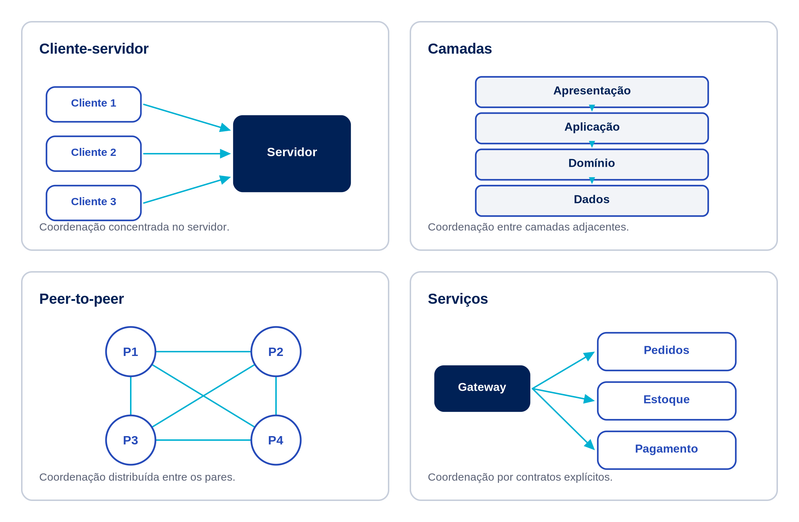

> **Figura 4 — Estilos arquiteturais iniciais.** Fonte: elaboração própria — Afonso Cesar Lelis Brandão, *Distributed Systems Engineering*, 2026 (CC BY 4.0). **Texto alternativo:** Quatro pequenos diagramas comparam a organização e o fluxo de comunicação dos estilos arquiteturais apresentados.

### Decisão arquitetural: benefício, custo e evidência

Uma decisão madura não afirma apenas que “microsserviços escalam” ou que “a nuvem garante disponibilidade”. Ela conecta:

1. **requisito:** qual problema precisa ser resolvido;
2. **decisão:** qual mecanismo será adotado;
3. **compromisso:** qual custo ou risco é introduzido;
4. **evidência:** como o resultado será medido.

Para a NexaOrder:

- requisito: processar 800 pedidos por segundo no pico;
- decisão: manter múltiplas instâncias sem estado atrás de um balanceador;
- compromisso: sessões locais deixam de ser confiáveis e o banco pode tornar-se gargalo;
- evidência: teste de carga com p95 inferior ao objetivo e falha controlada de uma instância.

Esse formato reduz escolhas baseadas apenas em tendência tecnológica.

### Pausa para reflexão

Uma empresa possui um sistema interno utilizado por 30 funcionários. A aplicação processa poucas solicitações, opera em horário comercial e pode ficar indisponível por alguns minutos sem impacto grave. A equipe propõe dividi-la imediatamente em 20 microsserviços, adotar mensageria, múltiplos bancos e Kubernetes.

Reflita:

1. quais requisitos justificariam essa distribuição?
2. quais custos operacionais seriam introduzidos?
3. que alternativa intermediária preservaria modularidade sem multiplicar falhas de rede?
4. quais métricas deveriam ser coletadas antes de decidir?

Uma resposta tecnicamente madura pode recomendar um monólito modular inicialmente. Engenharia distribuída também consiste em reconhecer quando não distribuir.

### Atividade prática

Elabore um registro de decisão arquitetural para a NexaOrder.

1. Selecione um requisito: capacidade, disponibilidade ou expansão geográfica.
2. Descreva o estado atual da aplicação.
3. Proponha uma decisão de distribuição.
4. Liste pelo menos três benefícios esperados.
5. Liste pelo menos três custos ou riscos introduzidos.
6. Defina duas métricas e um experimento de validação.
7. Represente a solução em um diagrama simples.

O resultado deve caber em uma página e permitir que outra pessoa compreenda por que a decisão foi tomada.

### Síntese da aula

- Sistemas distribuídos combinam componentes autônomos que coordenam ações por mensagens.
- A distribuição deve responder a requisitos concretos.
- Escalabilidade horizontal, disponibilidade e autonomia trazem benefícios, mas introduzem coordenação e novos modos de falha.
- Concorrência, ausência de estado global instantâneo e falhas parciais mudam o raciocínio de projeto.
- Latência, throughput, disponibilidade e confiabilidade medem dimensões diferentes.
- Chamadas remotas não devem ser tratadas como chamadas locais.
- Toda decisão arquitetural deve explicitar requisito, mecanismo, compromisso e evidência.

### Roteiro da Videoaula 1 — “Seu sistema cresceu; por que ele ficou menos previsível?”

O roteiro falado completo, com narração pronta para gravação, marcações de edição e fontes, está no arquivo `roteiros_20min.md` desta unidade, usando a decomposição da NexaOrder como demonstração central.

### Referências da aula

- COULOURIS, George et al. *Distributed Systems: Concepts and Design*. 5. ed. Boston: Addison-Wesley, 2011.
- KLEPPMANN, Martin. *Designing Data-Intensive Applications*. Sebastopol: O’Reilly Media, 2017.
- TANENBAUM, Andrew S.; VAN STEEN, Maarten. *Distributed Systems*. 4. ed. [S. l.]: distributed-systems.net, 2023.

## Aula 2 — Comunicação entre processos: APIs, RPC e mensageria

### Situação-problema: quando a chamada deixa de ser local

Depois de decompor a NexaOrder em serviços de pedidos, estoque, pagamento e expedição, a equipe manteve o hábito herdado da aplicação monolítica: cada etapa do fluxo de compra chamava a etapa seguinte e esperava a resposta antes de prosseguir. O serviço de pedidos chamava o de estoque; o de estoque, aprovado, acionava o de pagamento; o de pagamento, aprovado, acionava o de expedição. Enquanto o volume de pedidos era baixo, o encadeamento funcionava de forma previsível.

Quando o tráfego cresceu, o comportamento mudou. Uma lentidão momentânea no provedor de pagamento não afetava apenas o serviço de pagamento: o serviço de estoque ficava com uma conexão aberta esperando resposta, o serviço de pedidos esperava o estoque, e o cliente via a tela de carregamento por vários segundos. Em alguns casos, o cliente cancelava e tentava novamente, gerando dois pedidos para o mesmo carrinho. Em outros, a resposta chegava depois que a interface já havia expirado, e o pedido ficava “pendente” apesar de ter sido processado.

A equipe passou a discutir duas perguntas centrais: quando faz sentido esperar uma resposta antes de continuar, e quando faz sentido apenas registrar a intenção e seguir em frente? Essas perguntas não têm resposta universal — dependem do contrato entre os serviços, da tolerância a atraso e da forma como falhas serão tratadas. Esta aula constrói o vocabulário necessário para tomar essa decisão de forma consciente: comunicação síncrona e assíncrona, APIs HTTP, RPC, mensageria, e os mecanismos que tornam chamadas de rede mais seguras — *timeouts*, retentativas, *backoff*, *jitter*, idempotência e correlação.

### Comunicação síncrona e assíncrona

Na comunicação **síncrona**, quem solicita uma operação aguarda a resposta antes de continuar. O modelo é fácil de raciocinar: uma chamada, um resultado, controle de fluxo linear. O custo aparece quando o encadeamento é longo: se pedidos chama estoque, que chama pagamento, que chama expedição, a latência percebida pelo cliente tende a se aproximar da soma das latências do caminho crítico. Em um modelo simplificado no qual todas as etapas são obrigatórias e suas falhas são independentes, a disponibilidade do fluxo é o produto das disponibilidades individuais; dependências compartilhadas e falhas correlacionadas exigem medição conjunta. Um serviço lento penaliza todos os que dependem dele de forma síncrona.

Na comunicação **assíncrona**, quem solicita a operação não aguarda o resultado final. Ele registra a intenção — por exemplo, publicando uma mensagem — e segue em frente. O resultado, quando existir, chega por outro canal: uma notificação, um evento subsequente, uma consulta posterior de status. Esse modelo reduz o acoplamento temporal entre os participantes: o serviço de pagamento pode estar temporariamente indisponível sem impedir que o pedido seja aceito para processamento posterior.

Nenhum dos dois modelos é superior em abstrato. Comunicação síncrona é adequada quando o cliente precisa de uma resposta imediata para decidir o próximo passo — por exemplo, confirmar se um item ainda está disponível antes de mostrar a tela de pagamento. Comunicação assíncrona é adequada quando o resultado pode ser processado posteriormente sem bloquear quem o solicitou — por exemplo, gerar a nota fiscal ou notificar o centro de distribuição.

### HTTP e APIs orientadas a recursos

Grande parte da comunicação síncrona entre serviços da NexaOrder ocorre por *APIs* HTTP orientadas a recursos. Nesse estilo, cada entidade relevante do domínio — um pedido, uma reserva de estoque, uma cobrança — é representada por um recurso identificado por uma URI, e as operações sobre esse recurso são expressas por verbos HTTP: `GET` para consulta, `POST` para criação, `PUT` ou `PATCH` para atualização, `DELETE` para remoção.

Uma requisição `POST /pedidos` cria um novo pedido e devolve um identificador; uma requisição subsequente `GET /pedidos/{id}` permite consultar o estado atual sem repetir a criação. Os códigos de status HTTP comunicam a semântica do resultado: a faixa 2xx indica sucesso, a 4xx indica erro do cliente (dado inválido, recurso inexistente), e a 5xx indica erro do servidor. Essa convenção evita que cada equipe invente seu próprio vocabulário de erro.

Em uma API projetada segundo a restrição **sem estado** (*stateless*) do estilo REST, cada requisição contém as informações necessárias para ser interpretada; o servidor não depende de contexto de sessão mantido entre requisições. Essa é uma decisão arquitetural da API, não uma garantia automática do protocolo HTTP, que também pode transportar interações com estado de sessão. Quando adotada, a restrição facilita o balanceamento entre múltiplas instâncias, pois qualquer instância pode atender qualquer requisição. O contrato da API também precisa definir formato de dados — JSON é comum, mas não obrigatório —, versionamento e comportamento esperado diante de campos desconhecidos.

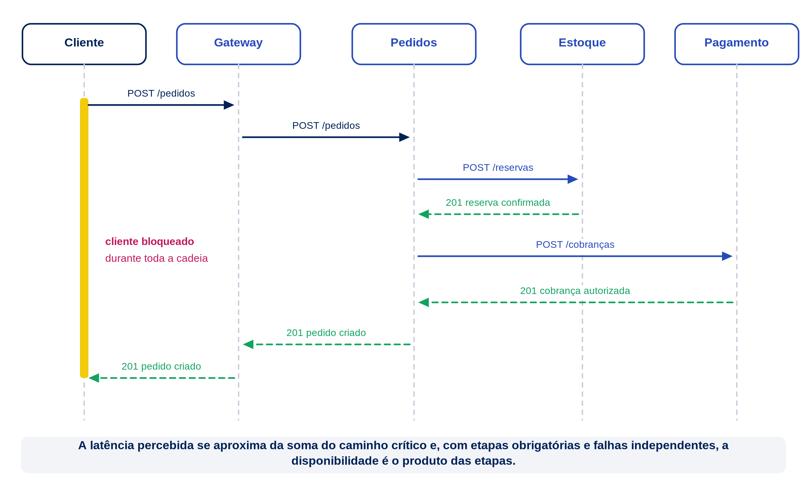

> **Figura 5 — Fluxo HTTP síncrono do pedido.** Fonte: elaboração própria — Afonso Cesar Lelis Brandão, *Distributed Systems Engineering*, 2026 (CC BY 4.0). **Texto alternativo:** Diagrama de sequência mostra chamadas HTTP encadeadas e bloqueantes entre cliente, pedidos, estoque e pagamento até a resposta final.

### RPC e contratos de interface

*Remote Procedure Call* (RPC) é outro estilo de comunicação, mais próximo de uma chamada de função do que de uma manipulação de recursos. Neste exemplo, ele é usado no modo síncrono de requisição e resposta: o desenvolvedor invoca algo como `estoque.reservarItem(pedidoId, itemId, quantidade)`, e um mecanismo de geração de código transforma essa chamada em uma mensagem de rede, envia ao serviço de estoque, aguarda a resposta e a devolve como se fosse um valor de retorno local. Tanto HTTP quanto tecnologias de RPC também podem sustentar interações assíncronas; síncrono e assíncrono descrevem o contrato de interação, não uma propriedade exclusiva do protocolo.

Essa aparência de chamada local é conveniente, mas perigosa se levada ao pé da letra — é exatamente a transparência que a Aula 1 identificou como útil para quem usa o sistema e arriscada para quem o projeta. Uma chamada RPC pode falhar de formas que uma chamada local nunca falha: a rede pode estar indisponível, a mensagem pode se perder, a resposta pode não retornar mesmo que a operação remota tenha sido concluída. Tratar `estoque.reservarItem(...)` como equivalente a uma chamada de função ordinária esconde justamente as decisões que esta unidade discute.

O valor de RPC está no contrato explícito de interface: uma definição formal dos métodos disponíveis, dos tipos de parâmetro e de retorno, e dos erros possíveis. Esse contrato, geralmente descrito em uma linguagem de definição de interface (IDL), permite gerar automaticamente código de cliente e servidor compatível, reduzindo divergências manuais entre quem implementa cada lado.

### Serialização e evolução de esquema

Toda comunicação entre processos exige transformar dados em memória em uma sequência de bytes transmissível — a *serialização* — e o processo inverso no destino. O formato escolhido (textual, como JSON, ou binário) afeta legibilidade, tamanho da mensagem e desempenho, mas o problema mais relevante para a engenharia de sistemas distribuídos não é o formato em si: é a **evolução do esquema**.

Serviços independentes são implantados em momentos diferentes. Quando o serviço de pedidos passa a enviar um novo campo `canalVenda` na mensagem de criação de pedido, o serviço de estoque, ainda na versão anterior, precisa continuar funcionando sem esse campo. Da mesma forma, se uma versão futura do estoque deixar de exigir um campo antes obrigatório, pedidos antigos que ainda o enviam não podem ser rejeitados.

Algumas práticas reduzem o risco de quebra:

- adicionar campos novos como opcionais, com valor padrão bem definido quando ausentes;
- evitar remover ou renomear campos que consumidores existentes ainda utilizam;
- versionar o contrato de forma explícita quando uma mudança for incompatível;
- testar a compatibilidade entre versões de produtor e consumidor antes da implantação.

Ignorar esses cuidados transforma uma alteração aparentemente local — um novo campo em uma mensagem — em uma interrupção distribuída, sentida por serviços que a equipe de pedidos talvez nem saiba que existem.

### Filas, publicação-assinatura e eventos

A comunicação assíncrona normalmente passa por um intermediário — um *broker* de mensagens — que recebe, armazena temporariamente e entrega mensagens, desacoplando o tempo de vida do produtor do tempo de vida do consumidor. Dois padrões são comuns:

- **Fila (ponto a ponto):** cada mensagem é entregue a um único consumidor entre os que competem por ela. Útil para distribuir trabalho, como processar reservas de estoque em paralelo por múltiplas instâncias do mesmo serviço.
- **Publicação-assinatura (*pub-sub*):** cada mensagem publicada em um tópico é entregue a todos os assinantes interessados, independentemente uns dos outros. Útil para notificar múltiplos serviços sobre um mesmo acontecimento sem acoplar o produtor a essa lista.

Essa segunda categoria se conecta ao conceito de **evento**: um registro de algo que já aconteceu, como `PedidoCriado` ou `PagamentoAprovado`. Um evento difere de um **comando**, que expressa uma solicitação de ação futura, como `ReservarEstoque`. Ao publicar `PedidoCriado`, o serviço de pedidos não determina quem reagirá nem como; o serviço de estoque, o de análise de fraude e um futuro serviço de recomendação podem todos assinar o mesmo evento sem que o serviço de pedidos precise conhecê-los.

Essa independência é o principal benefício da mensageria orientada a eventos: novos consumidores podem ser adicionados sem alterar o produtor. O custo é a perda de uma resposta imediata e síncrona — quem publica um evento não sabe, no mesmo instante, se e como os assinantes reagirão.

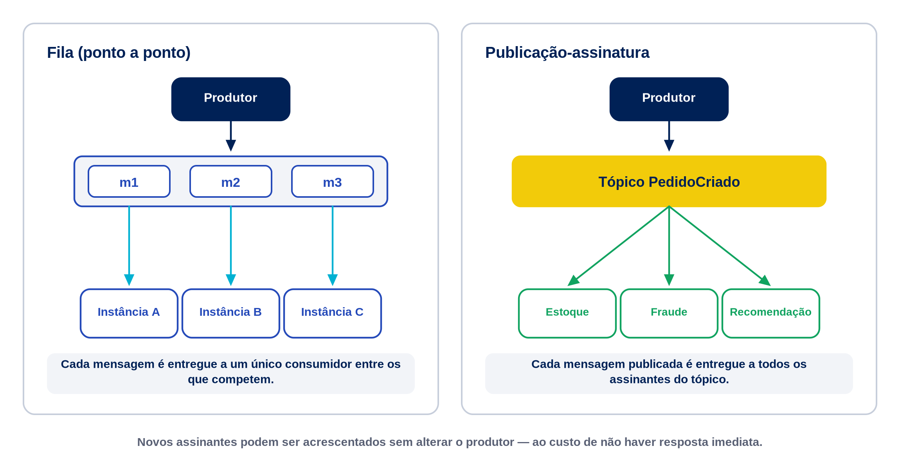

> **Figura 6 — Fila versus publicação-assinatura.** Fonte: elaboração própria — Afonso Cesar Lelis Brandão, *Distributed Systems Engineering*, 2026 (CC BY 4.0). **Texto alternativo:** Comparação visual entre o padrão de fila, em que cada mensagem vai a um único consumidor, e o padrão de publicação-assinatura, em que cada mensagem é entregue a todos os assinantes do tópico.

### Timeouts, retries, backoff e jitter

Toda chamada de rede precisa de um limite de espera — um ***timeout***. Sem ele, uma dependência lenta pode reter recursos indefinidamente e propagar lentidão por todo o fluxo, como ocorreu no incidente descrito na situação-problema. Como discutido na Aula 1, um *timeout* não prova que a operação falhou; apenas indica que a resposta não chegou dentro do prazo tolerado.

Diante de um *timeout* ou de outra falha **transitória e retentável**, uma estratégia possível é a retentativa (*retry*). Ela só deve ser aplicada quando ainda houver prazo no orçamento da operação e quando repetir a chamada for seguro — por ser naturalmente idempotente ou por usar uma chave de idempotência. Erros permanentes, como validações 4xx, prazo já esgotado ou sinais de sobrecarga podem exigir falha imediata ou controle de admissão, e não uma nova tentativa. Retentar sem cuidado pode agravar uma sobrecarga: se um serviço já está lento por excesso de carga, receber uma nova onda de tentativas de todos os clientes ao mesmo tempo tende a piorar a situação — um efeito conhecido como *thundering herd*.

Duas técnicas mitigam esse risco:

- ***Backoff* exponencial:** cada nova tentativa espera um intervalo maior que a anterior, dando tempo para o serviço sobrecarregado se recuperar antes da próxima onda de requisições.
- ***Jitter*:** um componente aleatório é somado ao intervalo de espera, evitando que múltiplos clientes, sincronizados pelo mesmo evento de falha, retentem exatamente no mesmo instante.

Uma formulação comum para o intervalo de espera antes da tentativa $n$ combina as duas técnicas:

$$
t_n = \min(t_{\text{base}} \times 2^{n},\ t_{\text{máx}}) + U(0, t_{\text{jitter}})
$$

em que $t_{\text{base}}$ é o intervalo inicial, $t_{\text{máx}}$ é um teto para o crescimento exponencial, e $U(0, t_{\text{jitter}})$ é um valor aleatório uniforme entre zero e um limite de aleatoriedade.

Para $t_{\text{base}} = 200\,\mathrm{ms}$ e $t_{\text{máx}} = 5000\,\mathrm{ms}$, o componente exponencial (sem o *jitter*) evolui assim:

$$
n = 0 \Rightarrow 200\,\mathrm{ms}; \quad
n = 1 \Rightarrow 400\,\mathrm{ms}; \quad
n = 2 \Rightarrow 800\,\mathrm{ms}; \quad
n = 3 \Rightarrow 1600\,\mathrm{ms}; \quad
n = 4 \Rightarrow 3200\,\mathrm{ms}
$$

Sem o teto $t_{\text{máx}}$, a espera de índice $n=5$ — a sexta da sequência iniciada em $n=0$ — seria de $6{,}4\,\mathrm{s}$; com ele, o crescimento é limitado a partir de determinado ponto, evitando esperas impraticáveis para quem aguarda uma resposta. O *jitter* soma alguns milissegundos ou segundos aleatórios a cada um desses valores, espalhando as tentativas no tempo mesmo quando muitos clientes falharam simultaneamente.

Nenhuma dessas técnicas resolve, por si só, o problema da retentativa: se a operação já produziu efeito no destino, repeti-la pode causar duplicação. Essa é a função da idempotência.

### Idempotência e correlação de requisições

Uma operação é **idempotente** quando executá-la mais de uma vez produz o mesmo efeito que executá-la uma única vez. Consultar o estado de um pedido é naturalmente idempotente. Criar um pedido, sem cuidado adicional, não é: enviar o mesmo `POST /pedidos` duas vezes, por causa de uma retentativa após *timeout*, pode gerar dois pedidos distintos.

Uma forma comum de tornar a criação idempotente é associar à requisição uma **chave de idempotência**: um identificador gerado pelo cliente antes do primeiro envio e reutilizado em toda retentativa da mesma operação. O serviço de pedidos registra as chaves já processadas; ao receber uma chave repetida, devolve o resultado da primeira execução em vez de criar um novo pedido.

Um segundo mecanismo, complementar, é o **identificador de correlação**: um identificador que acompanha uma operação lógica através de múltiplas chamadas, mensagens e retentativas, mesmo quando ela atravessa vários serviços. Enquanto a chave de idempotência evita duplicar efeito, o identificador de correlação permite reconstruir, depois, o caminho completo de uma operação — recurso que se tornará central quando a disciplina tratar de observabilidade, na Unidade 4, mas que já deve ser previsto no desenho de qualquer contrato de comunicação.

### Comparando dois fluxos de criação de pedido na NexaOrder

Considere as duas alternativas que a equipe da NexaOrder avalia para a criação de um pedido.

No **fluxo síncrono encadeado**, o serviço de pedidos chama o de estoque, aguarda a reserva; chama o de pagamento, aguarda a autorização; chama o de expedição, aguarda a confirmação; e só então devolve uma resposta final ao cliente. A vantagem é que o cliente recebe, em uma única resposta, a confirmação completa. A desvantagem é que a latência percebida soma as latências de todas as etapas, e a indisponibilidade de qualquer uma delas indisponibiliza o fluxo inteiro.

No **fluxo orientado a eventos**, o serviço de pedidos registra a intenção de compra, publica `PedidoCriado` e devolve imediatamente ao cliente o status “processando”. O estoque consome esse evento e, se a reserva for bem-sucedida, publica `EstoqueReservado`; somente então o pagamento tenta a autorização e publica `PagamentoAprovado`; a expedição reage apenas a essa aprovação e, ao concluir, publica `PedidoEnviado`. Falhas geram eventos próprios e podem acionar compensações. Consumidores independentes, como análise de fraude ou recomendação, podem reagir diretamente a `PedidoCriado`, mas efeitos com pré-condições de negócio preservam a sequência causal. O serviço de pedidos consome os eventos de progresso para atualizar o estado consultado pelo cliente.

O segundo fluxo reduz o acoplamento temporal e melhora a resiliência a lentidão pontual de uma dependência, mas introduz complexidade: é preciso rastrear em que etapa o pedido está, tratar eventos fora de ordem (tema da próxima aula) e comunicar ao cliente um estado que não é mais binário — sucesso ou falha imediatos — mas uma progressão. Não existe resposta universalmente correta; a escolha depende de quanto a experiência do cliente tolera uma confirmação não imediata e de quanto a equipe está disposta a investir em rastreamento assíncrono.

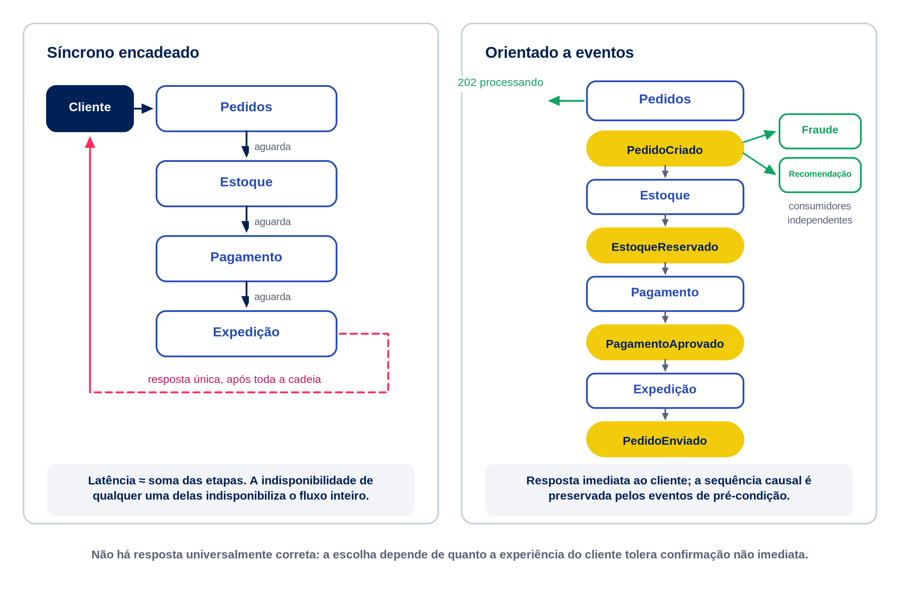

> **Figura 7 — Dois fluxos de criação de pedido.** Fonte: elaboração própria — Afonso Cesar Lelis Brandão, *Distributed Systems Engineering*, 2026 (CC BY 4.0). **Texto alternativo:** Diagrama comparativo mostra, à esquerda, uma cadeia de chamadas síncronas bloqueantes e, à direita, uma cadeia assíncrona que respeita as pré-condições de estoque, pagamento e expedição, sem bloquear a resposta inicial ao cliente.

### Atividade prática

Modele o contrato do evento `PedidoCriado` para a NexaOrder.

1. Liste os campos obrigatórios e opcionais da mensagem, indicando tipo de dado.
2. Inclua um campo de chave de idempotência e um campo de identificador de correlação, justificando cada um.
3. Descreva uma mudança futura de esquema (por exemplo, adicionar um campo `canalVenda`) e explique como ela pode ser introduzida sem quebrar consumidores existentes.
4. Escolha quais reações podem ser independentes e quais devem aguardar um evento que comprove sua pré-condição; justifique, em especial, por que a expedição não deve começar antes da aprovação do pagamento.
5. Descreva uma política limitada de *retry* com *backoff* e *jitter* para falhas transitórias ao publicar o evento, incluindo orçamento máximo de tentativas e a garantia de idempotência necessária.

Documente as decisões em meia página, como se fossem apresentadas à equipe de arquitetura.

### Síntese da aula

- Comunicação síncrona simplifica o raciocínio, mas soma latências e propaga indisponibilidade ao longo da cadeia de chamadas.
- Comunicação assíncrona reduz o acoplamento temporal, ao custo de uma resposta não imediata e de maior complexidade de rastreamento.
- APIs HTTP orientadas a recursos e RPC são estilos de comunicação com contratos e ênfases diferentes; neste curso, os exemplos usam requisição e resposta síncronas, mas os protocolos não impõem esse único modelo.
- A evolução de esquema exige compatibilidade entre versões de produtores e consumidores implantados em momentos distintos.
- Filas distribuem trabalho entre consumidores concorrentes; publicação-assinatura notifica múltiplos assinantes independentes sobre um mesmo evento.
- *Timeout* limita a espera; *retry* com *backoff* e *jitter* deve ser reservado a falhas transitórias, dentro de um orçamento e com operações seguras ou idempotentes.
- Idempotência torna retentativas com efeitos colaterais seguras; identificadores de correlação tornam a operação rastreável através das tentativas e dos serviços.

### Roteiro da Videoaula 2 — “Esperar ou seguir em frente? O dilema da comunicação distribuída”

O roteiro falado completo, com narração pronta para gravação, marcações de edição e fontes, está no arquivo `roteiros_20min.md` desta unidade, comparando o fluxo síncrono encadeado e o fluxo orientado a eventos da NexaOrder.

### Referências da aula

- BIRRELL, Andrew D.; NELSON, Bruce Jay. Implementing remote procedure calls. **ACM Transactions on Computer Systems**, v. 2, n. 1, p. 39-59, 1984. DOI: 10.1145/2080.357392.
- COULOURIS, George et al. *Distributed Systems: Concepts and Design*. 5. ed. Boston: Addison-Wesley, 2011.
- KLEPPMANN, Martin. *Designing Data-Intensive Applications*. Sebastopol: O’Reilly Media, 2017.

## Aula 3 — Concorrência, relógios e ordenação de eventos

### Situação-problema: qual evento aconteceu primeiro?

Depois de migrar parte do fluxo da NexaOrder para comunicação orientada a eventos, a equipe de operações passou a observar um novo tipo de incidente. O painel que acompanha os pedidos ordena os eventos recebidos por carimbo de hora (*timestamp*) físico de cada servidor de origem. Em um episódio específico, o evento `ReservaCancelada` — originado no serviço de estoque, motivado por *timeout* do cliente — apareceu no painel antes do evento `PagamentoAprovado` — originado no provedor de pagamento. A equipe concluiu que o cancelamento havia ocorrido primeiro e estornou automaticamente o pagamento.

Mais tarde, a equipe descobriu que o relógio do servidor que processava as confirmações de pagamento estava atrasado em relação ao relógio do servidor de estoque. A ordem exibida no painel não refletia necessariamente a ordem real dos acontecimentos — refletia apenas a ordem dos carimbos de hora, gerados por relógios que não estavam sincronizados de forma perfeita.

O incidente expõe um problema estrutural, não um defeito pontual de configuração: em um sistema distribuído, não existe um relógio único e compartilhado capaz de ordenar eventos originados em processos diferentes com precisão absoluta. Esta aula constrói as ferramentas conceituais para raciocinar sobre tempo, ordem e causalidade sem depender cegamente de relógios físicos: a relação *happened-before*, os relógios lógicos de Lamport e os relógios vetoriais.

### Ausência de um relógio global

Em um único processo, instruções ocorrem em uma sequência total, e comparar “antes” e “depois” é trivial: basta observar a ordem de execução. Em um sistema distribuído, cada processo possui seu próprio relógio local, e não existe um sinal instantâneo e compartilhado que sincronize perfeitamente todos eles. A rede introduz atraso variável entre o envio e a chegada das mensagens, e não é possível eliminar essa variação completamente.

Isso significa que perguntas aparentemente simples — “o pagamento foi recusado antes ou depois de o estoque ser reservado?” — não podem ser respondidas apenas comparando os carimbos de hora registrados de forma independente em cada máquina. Um carimbo de hora físico reflete o relógio local de quem o gerou, e relógios locais divergem.

### Relógios físicos, desvio e sincronização

Relógios físicos de computadores comuns não marcam o tempo com precisão perfeita: cada um sofre um **desvio** (*drift*) em relação ao tempo real, causado por variações no oscilador de *hardware*. Protocolos de sincronização de tempo por rede reduzem essa divergência periodicamente, mas não a eliminam entre sincronizações sucessivas.

Se a última sincronização deixa uma diferença residual entre os relógios limitada por $ε$, o desvio máximo após um intervalo $T$ pode ser estimado por:

$$
\delta_{\text{máx}} \leq ε + 2 \rho T
$$

em que $\rho$ é a taxa máxima de desvio de cada relógio em relação ao tempo real. O fator $2$ aparece porque, no pior caso, um relógio adianta enquanto o outro atrasa. A parcela $ε$ representa a incerteza ou diferença residual logo após a sincronização.

Para isolar apenas o crescimento por *drift*, suponha $ε=0$, $\rho = 50$ partes por milhão ($0{,}00005$) e $T = 3600\,\mathrm{s}$ (uma hora sem nova sincronização):

$$
\delta_{\text{máx}} \leq 0 + 2 \times 0{,}00005 \times 3600 = 0{,}36\,\mathrm{s} = 360\,\mathrm{ms}
$$

Nesse cenário idealizado, o crescimento pode chegar a $360\,\mathrm{ms}$ entre dois servidores, suficiente para inverter, em um painel que ordena eventos por carimbo físico, dois acontecimentos separados por menos tempo. Na prática, some-se o limite residual $ε$. Reduzir o intervalo entre sincronizações diminui a parcela de *drift*, mas não elimina a possibilidade de inversão para eventos suficientemente próximos.

### A relação *happened-before*

Diante da impossibilidade de confiar apenas em relógios físicos, Leslie Lamport propôs uma relação lógica, chamada ***happened-before*** (denotada $\rightarrow$), que ordena eventos com base em causalidade observável, não em tempo de relógio. A relação é definida por três regras:

1. Se $a$ e $b$ ocorrem no mesmo processo e $a$ é executado antes de $b$, então $a \rightarrow b$.
2. Se $a$ é o envio de uma mensagem e $b$ é o recebimento dessa mesma mensagem, então $a \rightarrow b$.
3. Se $a \rightarrow b$ e $b \rightarrow c$, então $a \rightarrow c$ (transitividade).

Dois eventos que não estão relacionados por nenhuma dessas regras, direta ou transitivamente, são chamados **concorrentes**: nenhum dos dois pode ter causado o outro, porque não existe cadeia de causalidade observável entre eles. Essa noção de concorrência não depende de proximidade no tempo físico — depende exclusivamente de haver ou não um caminho causal, por execução local ou por troca de mensagens, entre os dois eventos.

### Relógios lógicos de Lamport

Para tornar a relação *happened-before* operacional, Lamport propôs um mecanismo simples: cada processo mantém um contador inteiro, chamado **relógio lógico**, incrementado segundo três regras:

1. Antes de cada evento interno ou de envio, o processo incrementa seu contador em 1 e usa o novo valor como carimbo do evento.
2. Ao enviar uma mensagem, o processo inclui o carimbo atribuído ao evento de envio.
3. Ao receber uma mensagem com contador $C_{\text{msg}}$, o processo ajusta seu contador para $\max(C_{\text{local}}, C_{\text{msg}}) + 1$.

Esse esquema garante que, se $a \rightarrow b$, então o carimbo lógico de $a$ é menor que o de $b$. A recíproca não é garantida: dois eventos concorrentes podem receber carimbos lógicos diferentes, mesmo sem relação causal entre eles — o relógio de Lamport ordena, mas não distingue causalidade de coincidência.

Considere uma sequência simplificada envolvendo os serviços de Pedidos (Pd), Estoque (Es) e Pagamento (Pg), cada um com seu próprio contador, inicialmente em zero:

| Evento | Processo | Ação | Contador antes | Contador depois |
|---|---|---|---|---|
| 1 | Pd | cria o pedido (evento local) | 0 | 1 |
| 2 | Pd | incrementa e envia “reservar item” a Es, anexando 2 | 1 | 2 |
| 3 | Es | recebe a mensagem ($C_{\text{msg}}=2$) | 0 | $\max(0,2)+1=3$ |
| 4 | Es | incrementa e envia “reserva confirmada” a Pd, anexando 4 | 3 | 4 |
| 5 | Pd | recebe a confirmação ($C_{\text{msg}}=4$) | 2 | $\max(2,4)+1=5$ |

O evento 5 recebeu carimbo $5$, maior que o carimbo $2$ do evento 2 que iniciou essa troca e que o carimbo $4$ do envio imediatamente anterior, respeitando $a \rightarrow b \Rightarrow C(a) < C(b)$. Se, paralelamente, o serviço de Pagamento tivesse alcançado o carimbo $5$ apenas por eventos internos, sem trocar mensagem alguma com Pedidos ou Estoque, o empate numérico não indicaria relação causal entre os eventos — seria apenas coincidência de contagem. Por isso, o relógio de Lamport sozinho não basta para detectar concorrência.

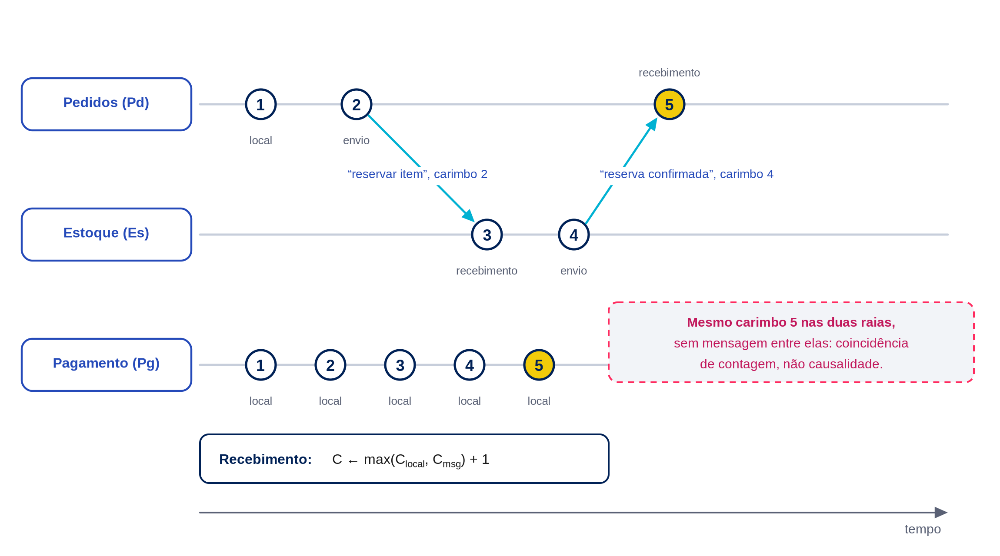

> **Figura 8 — Linha do tempo dos relógios lógicos de Lamport.** Fonte: elaboração própria — Afonso Cesar Lelis Brandão, *Distributed Systems Engineering*, 2026 (CC BY 4.0). **Texto alternativo:** Diagrama de raias mostra os relógios lógicos de Pedidos, Estoque e Pagamento evoluindo por eventos locais e mensagens trocadas, evidenciando como o recebimento de mensagem ajusta o contador local.

### Relógios vetoriais

Para superar a limitação do relógio de Lamport — distinguir causalidade real de coincidência numérica — usa-se o **relógio vetorial**. Em vez de um único contador, cada processo mantém um vetor com uma posição para cada processo do sistema. Ao ocorrer um evento local, o processo incrementa apenas sua própria posição no vetor; ao enviar uma mensagem, anexa o vetor completo; ao receber, atualiza cada posição do vetor local para o maior valor entre o próprio e o recebido, e então incrementa sua própria posição.

Dois eventos $a$ e $b$, com vetores $V(a)$ e $V(b)$, estão relacionados por *happened-before* se todas as posições de $V(a)$ forem menores ou iguais às de $V(b)$ (com ao menos uma estritamente menor), ou vice-versa. Se nenhuma dessas comparações for verdadeira — nenhum vetor domina o outro —, os eventos são genuinamente **concorrentes**, e o relógio vetorial permite afirmar isso com certeza, ao contrário do relógio de Lamport.

Suponha vetores na ordem (Pedidos, Estoque, Pagamento). Um evento de cancelamento de reserva no Estoque, motivado por *timeout* do cliente, ocorre com vetor $(2, 3, 0)$. Um evento de aprovação de pagamento, motivado pelo provedor, ocorre com vetor $(2, 1, 2)$. Comparando posição a posição: a primeira posição empata, a segunda é maior no cancelamento, a terceira é maior na aprovação. Nenhum vetor domina o outro — os dois eventos são concorrentes, ou seja, nenhum causou o outro, e o sistema precisa de uma regra de negócio explícita para decidir qual prevalece, já que a ordem causal, por si só, não resolve o conflito.

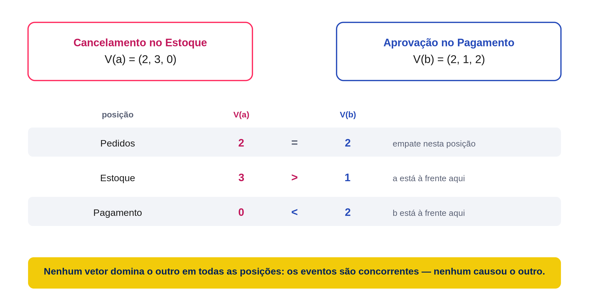

> **Figura 9 — Comparação de dois relógios vetoriais concorrentes.** Fonte: elaboração própria — Afonso Cesar Lelis Brandão, *Distributed Systems Engineering*, 2026 (CC BY 4.0). **Texto alternativo:** Comparação posição a posição de dois relógios vetoriais evidencia que nenhum dos dois eventos precede causalmente o outro, caracterizando concorrência.

### Ordem total, ordem parcial e causalidade

A relação *happened-before* define uma **ordem parcial**: alguns pares de eventos são comparáveis (um precede o outro), mas outros são concorrentes e, portanto, incomparáveis por critérios causais. Uma **ordem total**, em contraste, compara todo par de eventos — como ocorre naturalmente dentro de um único processo, ou como pode ser imposta artificialmente por um mecanismo externo, como um serviço de sequenciamento central ou uma extensão do relógio lógico que usa o identificador do processo como critério de desempate.

Impor uma ordem total sobre eventos genuinamente concorrentes não recupera a causalidade perdida: apenas escolhe, de forma arbitrária mas determinística, uma posição relativa para eventos que, do ponto de vista causal, poderiam ter ocorrido em qualquer ordem. Essa escolha é útil quando o sistema precisa de uma decisão única e consistente — por exemplo, definir qual de duas atualizações concorrentes “vence” — mas não deve ser confundida com a afirmação de que um evento realmente causou o outro.

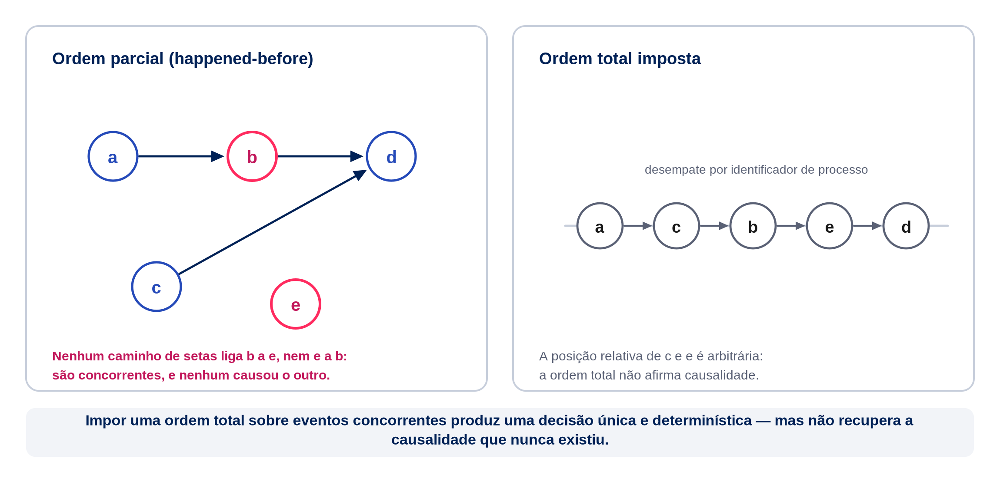

> **Figura 10 — Ordem parcial versus ordem total.** Fonte: elaboração própria — Afonso Cesar Lelis Brandão, *Distributed Systems Engineering*, 2026 (CC BY 4.0). **Texto alternativo:** Comparação entre um grafo de ordem parcial, com eventos concorrentes sem relação direta, e uma linha única de ordem total, evidenciando que a ordem total não recupera relações causais inexistentes.

### Conflitos concorrentes em estoque e pagamento

O incidente da situação-problema pode agora ser reformulado com precisão. O cancelamento da reserva de estoque e a aprovação do pagamento eram eventos **concorrentes**: nenhum dos dois foi causado pelo outro, e nenhuma quantidade de sincronização de relógio físico eliminaria essa concorrência, porque ela é estrutural — os dois eventos ocorreram em processos diferentes, sem troca de mensagem entre si antes de acontecerem.

Diante de eventos concorrentes que afetam o mesmo pedido, a NexaOrder precisa de uma **política de resolução de conflito** definida a priori, não descoberta em produção. Alternativas possíveis incluem: priorizar sempre o cancelamento sobre a aprovação (mais conservador, evita cobrar por um item indisponível, mas pode gerar estorno desnecessário); priorizar sempre a aprovação sobre o cancelamento (mais otimista, pode gerar cobrança para item que não será enviado); ou tratar a concorrência como caso excepcional, suspendendo o pedido para revisão manual ou automatizada. Qualquer uma dessas escolhas é legítima; o erro está em não escolher e deixar a ordem de chegada acidental decidir o resultado.

### Pausa para reflexão

O painel de operações da NexaOrder ordena os eventos recebidos por carimbo de hora físico de cada servidor de origem. Em um incidente, o evento “ReservaCancelada” (originado no serviço de Estoque, motivado por *timeout* do cliente) aparece no painel três segundos *antes* do evento “PagamentoAprovado” (originado no provedor de pagamento). A equipe de operações conclui que o cancelamento ocorreu primeiro e decide estornar o pagamento automaticamente. Mais tarde, descobre-se que o relógio do servidor de pagamento estava atrasado em relação ao relógio do servidor de estoque.

Reflita:

1. A conclusão da equipe de operações — “o cancelamento ocorreu primeiro” — está logicamente garantida pelos dados disponíveis?
2. Que informação, se registrada nos eventos, permitiria decidir corretamente se os dois eventos são causalmente relacionados ou apenas concorrentes?
3. Mesmo com relógios vetoriais, o sistema saberia qual dos dois eventos deveria prevalecer, ou apenas saberia que ambos são concorrentes?
4. Que política de negócio a NexaOrder deveria adotar diante de um cancelamento e uma aprovação concorrentes para o mesmo pedido?

Não existe uma única resposta correta para a quarta pergunta; existe, porém, uma resposta *ausente* que caracteriza um sistema mal projetado: não ter pensado sobre o cenário antes de ele acontecer em produção.

### Atividade prática

Construa carimbos de hora lógicos (Lamport) para a seguinte sequência de eventos da NexaOrder, envolvendo os serviços de Pedidos (Pd), Estoque (Es) e Expedição (Ex), todos iniciando com contador zero. Antes de cada evento interno ou de envio, incremente o contador e use o novo valor como carimbo; no recebimento, aplique $\max(C_{\text{local}}, C_{\text{msg}})+1$.

1. Pd registra a criação do pedido (evento local).
2. Pd envia ao Es a solicitação de reserva, anexando seu contador.
3. Es recebe a solicitação e ajusta seu contador.
4. Es registra, localmente, a baixa no estoque físico (evento local, após o recebimento).
5. Es envia a confirmação de reserva a Pd, anexando seu contador atualizado.
6. Pd recebe a confirmação e ajusta seu contador.
7. Pd envia a Ex a solicitação de expedição, anexando seu contador.
8. Ex recebe a solicitação e ajusta seu contador.

Para cada evento, calcule o contador resultante, indique qual regra do relógio de Lamport foi aplicada (evento local, envio ou recebimento) e identifique, ao final, dois eventos da sequência que sejam concorrentes entre si — caso existam — justificando com base na definição de *happened-before*.

### Síntese da aula

- Não existe relógio global instantâneo em um sistema distribuído; relógios físicos de máquinas diferentes divergem por desvio acumulado.
- A relação *happened-before* ordena eventos por causalidade observável — execução sequencial local ou troca de mensagens — não por tempo de relógio.
- Relógios lógicos de Lamport garantem que causalidade implica ordem numérica crescente, mas não distinguem concorrência de coincidência.
- Relógios vetoriais permitem identificar com certeza quando dois eventos são concorrentes, comparando vetores posição a posição.
- *Happened-before* define uma ordem parcial; ordens totais podem ser impostas artificialmente, sem recuperar causalidade real.
- Eventos concorrentes que afetam o mesmo dado — como estoque e pagamento — exigem uma política de resolução de conflito definida antecipadamente.

### Roteiro da Videoaula 3 — “Qual evento aconteceu primeiro? A pergunta que o relógio não responde sozinho”

O roteiro falado completo, com narração pronta para gravação, marcações de edição e fontes, está no arquivo `roteiros_20min.md` desta unidade, construindo, ao vivo, os relógios lógicos de um trecho do fluxo da NexaOrder.

### Referências da aula

- LAMPORT, Leslie. Time, clocks, and the ordering of events in a distributed system. **Communications of the ACM**, v. 21, n. 7, p. 558-565, 1978. DOI: 10.1145/359545.359563.
- COULOURIS, George et al. *Distributed Systems: Concepts and Design*. 5. ed. Boston: Addison-Wesley, 2011.
- TANENBAUM, Andrew S.; VAN STEEN, Maarten. *Distributed Systems*. 4. ed. [S. l.]: distributed-systems.net, 2023.

## Aula 4 — Modelos de falha e desenho para recuperação

### Situação-problema: quando lentidão vira colapso

Depois de analisar a causalidade entre eventos e definir políticas para os casos realmente concorrentes na Aula 3, a equipe da NexaOrder enfrentou um novo tipo de incidente durante uma campanha de vendas: o provedor externo de pagamento não ficou indisponível — apenas passou a responder devagar. Como o serviço de pedidos chamava o pagamento de forma síncrona, sem limite de recursos dedicados a essa chamada, as conexões disponíveis para o pagamento se esgotaram rapidamente. O problema não parou por aí: o mesmo conjunto de conexões era usado para atender consultas de pedidos já existentes, sem relação alguma com o pagamento. Em poucos minutos, clientes que apenas queriam consultar o status de uma compra antiga também deixaram de receber resposta.

Nenhuma linha de código do serviço de pedidos continha erro. A degradação de uma única dependência externa, sem qualquer mecanismo de contenção, se espalhou por partes do sistema que não tinham relação direta com o problema original. A equipe passou a se perguntar: como conter o raio de impacto de uma falha antes que ela vire um colapso mais amplo?

Esta aula constrói o vocabulário para nomear precisamente os modos de falha de um sistema distribuído e apresenta padrões de desenho — *circuit breaker*, *bulkhead* e degradação graciosa — que contêm essa propagação.

### Modelos de falha: parada, omissão, temporização e comportamento arbitrário

Nem toda falha tem a mesma forma. Distinguir os modelos ajuda a escolher a proteção correta para cada situação:

- **Falha de parada (*crash*):** o componente para de funcionar e permanece parado; não emite mais respostas, mas também não emite respostas incorretas. É o modelo mais benigno e o mais comum em infraestrutura bem operada.
- **Falha de omissão:** o componente deixa de enviar ou de receber algumas mensagens, mas continua funcionando para as demais. Pode ocorrer por perda de pacotes, fila cheia ou descarte seletivo sob sobrecarga.
- **Falha de temporização:** o componente responde corretamente, mas fora do prazo esperado — tipicamente tarde demais. É o modelo relevante para o incidente do provedor de pagamento lento descrito na situação-problema.
- **Falha de comportamento arbitrário (bizantina):** o componente produz respostas incorretas, inconsistentes ou até maliciosas, sem seguir seu protocolo esperado. É o modelo mais difícil de tratar e o mais raro em ambientes controlados por uma única organização; torna-se relevante em sistemas que atravessam fronteiras de confiança, como integrações com múltiplos parceiros externos.

A maior parte da engenharia cotidiana de sistemas como a NexaOrder lida com os três primeiros modelos. Presumir, por padrão, que qualquer dependência externa pode falhar por parada, omissão ou temporização — e desenhar para isso — cobre a maioria dos incidentes reais sem exigir o custo de proteção contra comportamento arbitrário.

### Falha parcial e detectores de falha

A Aula 1 apresentou a falha parcial como uma marca distintiva dos sistemas distribuídos: um componente pode estar funcionando enquanto outro está indisponível, e quem espera uma resposta muitas vezes não consegue distinguir, apenas pelo silêncio, qual dessas situações está ocorrendo.

Um **detector de falhas** é o mecanismo — implícito ou explícito — que um componente usa para decidir se trata outro componente como indisponível. Detectores reais não são perfeitos: um detector pode declarar um componente indisponível quando ele apenas está lento (falso positivo) ou pode demorar a perceber uma indisponibilidade real (falso negativo). Existe uma tensão direta entre agilidade e precisão: detectar rapidamente aumenta o risco de falsos positivos; esperar mais reduz falsos positivos, mas atrasa a reação a falhas reais.

Para a NexaOrder, um detector de falhas pode ser tão simples quanto contar falhas consecutivas de uma chamada ao provedor de pagamento, ou tão elaborado quanto combinar taxa de erro, latência e resultado de verificações de saúde periódicas (*health checks*). O importante é reconhecer que qualquer detector é uma estimativa, não uma certeza — e o restante do desenho de resiliência deve considerar essa incerteza.

### Particionamento de rede

Um **particionamento de rede** ocorre quando um subconjunto de componentes perde a capacidade de se comunicar com outro subconjunto, embora cada lado continue funcionando internamente. Do ponto de vista de um observador de um dos lados, o outro lado parece indisponível; do ponto de vista do outro lado, o primeiro é que parece indisponível. Nenhum dos dois está, tecnicamente, “caído” — ambos continuam operando, apenas isolados um do outro.

Esse cenário é particularmente perigoso quando ambos os lados continuam aceitando escrita de forma independente — por exemplo, se réplicas do serviço de estoque em duas zonas de disponibilidade perderem a comunicação entre si e cada uma continuar aceitando reservas para os mesmos itens, acreditando ser a única responsável. O resultado — conhecido informalmente como *split-brain* — é uma divergência de estado que precisa ser reconciliada depois, muitas vezes com perda ou conflito de dados. Estratégias de tolerância a partição, replicação e consenso serão aprofundadas na Unidade 2; nesta aula, o essencial é reconhecer que particionamento não é uma falha completa de um lado, mas uma ruptura na comunicação entre lados que continuam vivos.

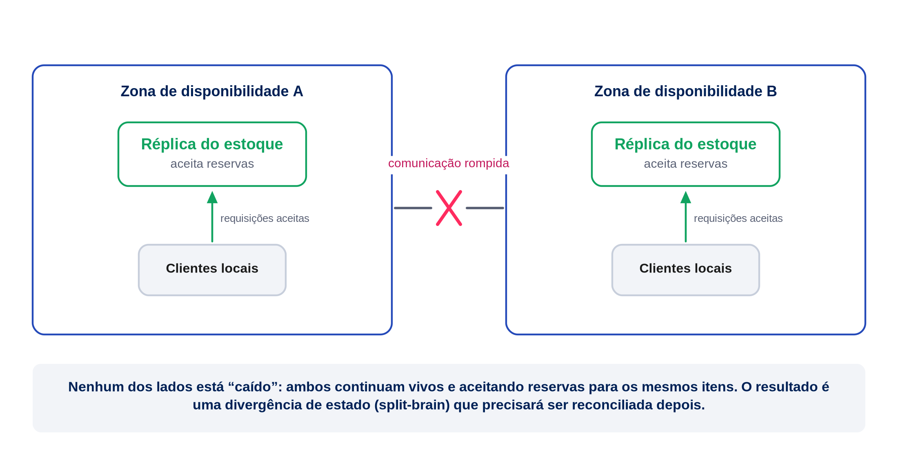

> **Figura 11 — Particionamento de rede entre zonas.** Fonte: elaboração própria — Afonso Cesar Lelis Brandão, *Distributed Systems Engineering*, 2026 (CC BY 4.0). **Texto alternativo:** Diagrama mostra duas zonas isoladas por um rompimento de rede, cada uma seguindo operante e aceitando requisições sem saber do estado da outra.

### Redundância e isolamento

Redundância — manter mais de uma instância de um componente — só protege contra falhas se as instâncias não compartilharem o mesmo ponto de falha e se houver mecanismo de desvio de tráfego, ponto já discutido na Aula 1 em relação à disponibilidade. Esta aula acrescenta um segundo princípio: **isolamento**. Não basta ter redundância entre instâncias do mesmo serviço; é preciso impedir que a degradação de uma dependência se propague para partes do sistema que não dependem diretamente dela.

No incidente da situação-problema, o serviço de pedidos usava o mesmo conjunto de conexões e threads para chamar o provedor de pagamento e para atender requisições de consulta de pedidos existentes. Quando o pagamento ficou lento, todas as conexões disponíveis ficaram ocupadas esperando respostas de pagamento, e não sobrou capacidade para atender consultas — que nada tinham a ver com pagamento. A ausência de isolamento transformou uma degradação pontual em uma indisponibilidade ampla.

### *Timeout* como decisão, não como prova de falha

Retomando a Aula 1: um *timeout* não é uma prova de que a operação falhou; é uma decisão de que a espera deixou de valer a pena. Essa distinção tem consequência prática direta: o valor do *timeout* deve ser escolhido deliberadamente, equilibrando dois riscos.

Um *timeout* muito curto trata operações lentas, mas ainda válidas, como se tivessem falhado — desperdiçando trabalho já em andamento e, se seguido de retentativa, potencialmente duplicando efeito. Um *timeout* muito longo mantém recursos presos por mais tempo, ampliando o risco de esgotamento de conexões e propagação de lentidão, como ocorreu na situação-problema desta aula. Não existe um valor universalmente correto; o valor apropriado depende da latência típica observada na operação, da criticidade da resposta imediata e do custo de manter o recurso ocupado enquanto se espera.

### Circuit breaker

O padrão ***circuit breaker*** (disjuntor) formaliza a decisão de deixar de tentar uma dependência que está falhando repetidamente, evitando desperdiçar recursos em chamadas com alta probabilidade de falhar. O padrão opera em três estados:

- **Fechado:** chamadas fluem normalmente para a dependência; o disjuntor monitora a taxa de falhas.
- **Aberto:** ao ultrapassar um limite de falhas, o disjuntor passa a rejeitar chamadas imediatamente, sem sequer tentar a dependência, por um intervalo definido.
- **Semiaberto:** decorrido o intervalo, o disjuntor permite um número limitado de chamadas de teste; se forem bem-sucedidas, volta ao estado fechado; se falharem, retorna ao estado aberto.

A condição de abertura costuma ser expressa como uma taxa de erro sobre uma janela de chamadas recentes:

$$
\text{taxa de erro} = \frac{\text{chamadas com falha}}{\text{total de chamadas na janela}}
$$

Se a NexaOrder define um limite de $50\%$ de falhas em uma janela das últimas $20$ chamadas ao provedor de pagamento, e observa $12$ falhas nessa janela:

$$
\text{taxa de erro} = \frac{12}{20} = 0{,}60 = 60\%
$$

Como $60\%$ excede o limite de $50\%$, o disjuntor abre, e as chamadas seguintes ao provedor de pagamento são rejeitadas imediatamente pelo próprio serviço de pedidos — sem esperar o *timeout* de rede — liberando recursos para atender outras operações, como consultas de pedidos existentes, exatamente o isolamento que faltou no incidente original.

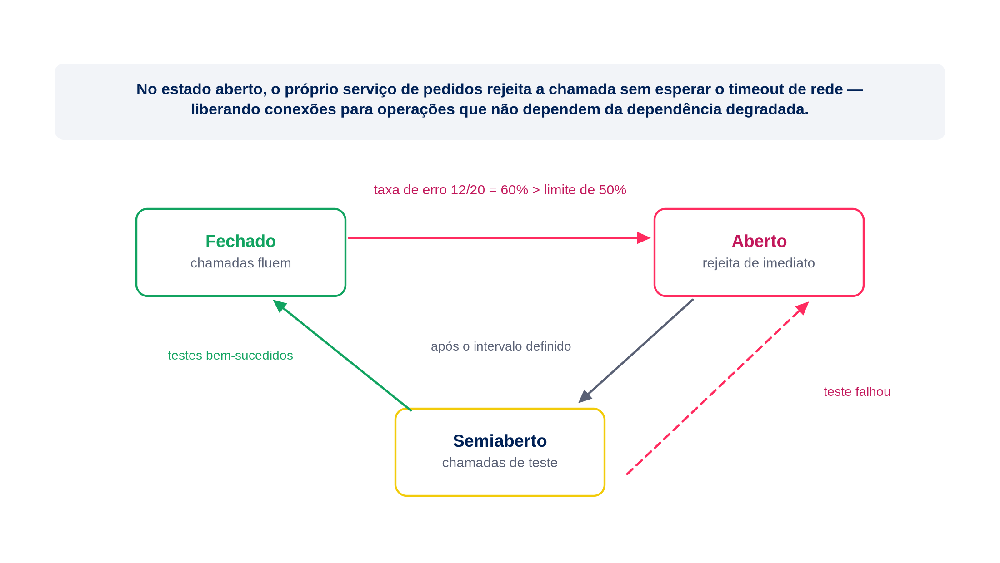

> **Figura 12 — Estados do circuit breaker.** Fonte: elaboração própria — Afonso Cesar Lelis Brandão, *Distributed Systems Engineering*, 2026 (CC BY 4.0). **Texto alternativo:** Diagrama de máquina de estados mostra o disjuntor alternando entre fechado, aberto e semiaberto, com as condições de transição indicadas em cada seta.

### *Bulkhead* e degradação graciosa

O padrão ***bulkhead*** (anteparo) aplica, de forma estrutural, o princípio de isolamento discutido anteriormente: recursos (conexões, threads, filas) são particionados por dependência ou por criticidade, para que o esgotamento de recursos destinado a uma dependência não afete as demais. Se o serviço de pedidos reservar um conjunto de conexões exclusivo para chamadas ao provedor de pagamento, separado do conjunto usado para consultas, a lentidão do pagamento esgota apenas seu próprio compartimento — o nome do padrão evoca os anteparos que isolam compartimentos de um navio, permitindo que ele continue flutuando mesmo com um compartimento alagado.

**Degradação graciosa** é a decisão de continuar oferecendo uma versão reduzida do serviço quando uma dependência não essencial falha, em vez de falhar por completo. Se o serviço de recomendação de produtos estiver indisponível, a página de checkout da NexaOrder pode simplesmente omitir as recomendações e prosseguir com a compra, em vez de bloquear o cliente. A degradação graciosa exige que a equipe classifique, de antemão, quais dependências são essenciais para a operação principal e quais são acessórias — uma decisão de produto tanto quanto de engenharia.

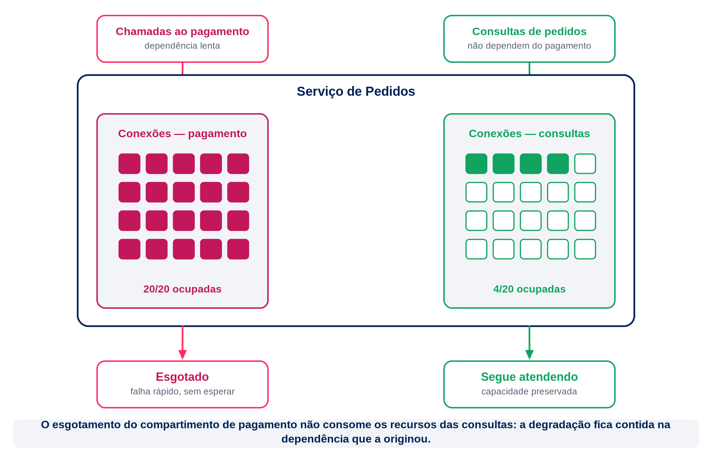

> **Figura 13 — Anteparos de recursos por dependência (bulkhead).** Fonte: elaboração própria — Afonso Cesar Lelis Brandão, *Distributed Systems Engineering*, 2026 (CC BY 4.0). **Texto alternativo:** Diagrama mostra o serviço de pedidos dividido em dois compartimentos de recursos isolados, um para chamadas de pagamento e outro para consultas, ilustrando o padrão bulkhead.

### Objetivos de confiabilidade

Todas as técnicas apresentadas nesta aula — detectores de falha, isolamento, disjuntores, anteparos, degradação graciosa — servem a um objetivo mensurável, não a uma aspiração vaga de “o sistema não pode cair”. Definir, como a Aula 1 já indicou ao calcular disponibilidade, um objetivo explícito (por exemplo, 99,9% de disponibilidade no fluxo de criação de pedidos) estabelece um orçamento de indisponibilidade tolerável e permite decidir quando investir mais em resiliência e quando o nível já alcançado é suficiente. Esse tema será retomado com profundidade na Unidade 4, ao tratar de indicadores e objetivos de nível de serviço; por ora, basta reconhecer que resiliência sem um objetivo declarado tende a se tornar um investimento sem critério de parada.

### Atividade prática

Realize uma análise de modos de falha do fluxo de criação de pedidos da NexaOrder (pedidos → estoque → pagamento → expedição).

1. Para cada uma das quatro etapas, liste ao menos um modo de falha plausível (parada, omissão ou temporização).
2. Para cada modo de falha listado, descreva o efeito observável pelas etapas vizinhas caso nenhuma proteção seja aplicada.
3. Proponha, para cada modo de falha, ao menos uma proteção entre as apresentadas nesta aula: *timeout* ajustado, *circuit breaker*, *bulkhead* ou degradação graciosa.
4. Identifique qual etapa, se indisponível, deveria acionar degradação graciosa (a operação prossegue de forma reduzida) e qual deveria interromper o fluxo por completo, justificando a diferença com base na criticidade de negócio.
5. Estime, para uma das etapas, um objetivo de disponibilidade razoável e o orçamento de indisponibilidade correspondente em minutos por mês.

Apresente o resultado em uma tabela simples: etapa, modo de falha, efeito sem proteção, proteção proposta.

### Transição para a Unidade 2

Esta unidade tratou da comunicação, da ordenação de eventos e das falhas que afetam processos individuais dentro da NexaOrder. Um fio comum atravessa as quatro aulas: componentes autônomos, conectados por uma rede imperfeita, podem discordar temporariamente sobre o estado do sistema, e o projeto precisa prever essa discordância em vez de negá-la.

A Unidade 2 desloca essa mesma pergunta para os dados. Se o estoque e o pagamento podem observar eventos concorrentes, como réplicas de um mesmo dado devem ser mantidas consistentes entre si? Se uma partição de rede pode isolar dois grupos de nós, como o sistema deve se comportar sem violar suas garantias mais importantes? E quando múltiplos nós precisam concordar sobre um único fato — por exemplo, qual reserva de estoque é válida —, que mecanismos garantem esse acordo mesmo diante de falhas? As próximas quatro aulas tratarão de replicação, particionamento, o teorema CAP e algoritmos de consenso, usando a mesma NexaOrder como fio condutor.

### Síntese da aula

- Falhas se classificam em parada, omissão, temporização e comportamento arbitrário; a maioria dos incidentes cotidianos pertence às três primeiras categorias.
- Detectores de falha são estimativas sujeitas a falsos positivos e falsos negativos, não certezas.
- Particionamento de rede isola grupos de componentes que continuam funcionando individualmente, criando risco de divergência de estado (*split-brain*).
- Redundância sem isolamento não impede que a degradação de uma dependência se propague para partes não relacionadas do sistema.
- *Circuit breaker*, *bulkhead* e degradação graciosa são padrões complementares de contenção de falha.
- Objetivos de confiabilidade explícitos orientam quando investir mais em resiliência e quando o nível alcançado já é suficiente.

### Roteiro da Videoaula 4 — “Um serviço lento não é um serviço fora do ar: contendo o colapso em cascata”

O roteiro falado completo, com narração pronta para gravação, marcações de edição e fontes, está no arquivo `roteiros_20min.md` desta unidade, encerrando a Unidade 1 e conectando-a à Unidade 2.

### Referências da aula

- CHANDRA, Tushar Deepak; TOUEG, Sam. Unreliable failure detectors for reliable distributed systems. **Journal of the ACM**, v. 43, n. 2, p. 225-267, 1996. DOI: 10.1145/226643.226647.
- COULOURIS, George et al. *Distributed Systems: Concepts and Design*. 5. ed. Boston: Addison-Wesley, 2011.
- TANENBAUM, Andrew S.; VAN STEEN, Maarten. *Distributed Systems*. 4. ed. [S. l.]: distributed-systems.net, 2023.

## Atividades, síntese e material complementar

### Quiz não avaliativo

**Questão 1.** Considere as afirmações sobre a diferença entre uma chamada de função local e uma chamada remota entre serviços de um sistema distribuído, como o fluxo pedidos-estoque da NexaOrder. Assinale a alternativa que descreve corretamente uma diferença relevante para o projeto do sistema.

a. Uma chamada remota é sempre mais rápida que uma chamada local, pois pode ser paralelizada pela rede.
b. Uma chamada remota nunca deve usar *timeout*, pois isso mascara falhas reais.
*c. Uma chamada remota pode falhar sem que o processo remoto tenha falhado, exigindo tratamento explícito de ambiguidade entre mensagem perdida, processamento lento e resposta perdida.
d. Uma chamada remota garante, por padrão, que a operação será executada exatamente uma vez.
e. Uma chamada remota elimina a necessidade de contratos de interface, pois o protocolo de rede já define o formato dos dados.

*Feedback conceitual:* a alternativa correta é a “c”. Como discutido na Aula 1, uma chamada remota introduz uma ambiguidade estrutural: diante de um silêncio ou de um erro, o solicitante não consegue distinguir, apenas pela ausência de resposta, entre mensagem perdida, processamento em andamento, resposta perdida ou falha real do destino. Essa ambiguidade não existe em uma chamada local e exige mecanismos como idempotência, correlação e *retries* cuidadosos, temas aprofundados na Aula 2.

**Questão 2.** Um serviço da NexaOrder implementa um disjuntor (*circuit breaker*) para chamadas ao provedor de pagamento, com limite de 50% de falhas em uma janela de 20 chamadas. Após a abertura do disjuntor, as chamadas seguintes são rejeitadas imediatamente por um intervalo definido, até uma nova tentativa em estado semiaberto. Qual é o principal benefício desse comportamento em relação a continuar tentando normalmente a cada requisição?

a. Ele garante que o provedor de pagamento nunca mais falhará durante o intervalo de abertura.
b. Ele elimina completamente a necessidade de definir um valor de *timeout* para a chamada.
*c. Ele evita desperdiçar recursos do próprio serviço em chamadas com alta probabilidade de falhar, liberando capacidade para operações não relacionadas ao pagamento.
d. Ele converte automaticamente a comunicação síncrona com o provedor em comunicação assíncrona.
e. Ele impede que qualquer cliente humano perceba que houve uma falha no provedor de pagamento.

*Feedback conceitual:* a alternativa correta é a “c”. Como discutido na Aula 4, o valor do disjuntor não está em impedir a falha da dependência — algo fora do controle do serviço solicitante —, mas em parar de investir recursos (conexões, threads, tempo) em chamadas com alta probabilidade de falhar, isolando o impacto da degradação e preservando capacidade para operações que não dependem do componente afetado.

### Atividade Avaliativa Individual (AAI)

**Enunciado:** a NexaOrder decide reformular o fluxo de criação de pedidos: hoje ele é totalmente síncrono e encadeado (pedidos → estoque → pagamento → expedição); a equipe avalia migrar para um modelo orientado a eventos. Considerando os conceitos estudados na Unidade 1 — comunicação síncrona e assíncrona, ordenação de eventos e relógios lógicos, e modelos de falha —, elabore uma resposta dissertativa (entre 300 e 500 palavras) que:

a. explique pelo menos dois riscos concretos do fluxo síncrono atual, usando conceitos da unidade;
b. proponha o desenho do fluxo orientado a eventos, indicando quais reações devem ser síncronas e quais assíncronas, com justificativa;
c. explique como a equipe deveria lidar com eventos concorrentes que cheguem fora de ordem;
d. descreva pelo menos duas proteções de resiliência (entre *timeout*, *retry* com *backoff*/*jitter*, idempotência, *circuit breaker*, *bulkhead*, degradação graciosa) que o novo desenho deveria incorporar, e por quê.

**Resposta esperada (modelo de resposta):**

Uma resposta completa deve, no mínimo, conter os elementos abaixo, admitindo formulações distintas desde que tecnicamente corretas.

(a) Riscos do fluxo síncrono atual: (i) a latência percebida pelo cliente soma as latências de pedidos, estoque, pagamento e expedição, tornando o sistema tão lento quanto sua etapa mais lenta; (ii) a indisponibilidade ou lentidão de qualquer etapa — por exemplo, o provedor de pagamento — propaga-se para as etapas anteriores, podendo indisponibilizar todo o fluxo, inclusive operações não relacionadas à etapa afetada, caso não haja isolamento de recursos.

(b) Fluxo orientado a eventos: o serviço de pedidos publica `PedidoCriado` e devolve imediatamente um status de processamento ao cliente. O estoque reage e publica `EstoqueReservado`; o pagamento só é acionado depois dessa reserva e publica `PagamentoAprovado`; a expedição só começa após a aprovação e publica `PedidoEnviado`. Eventos de falha devem interromper a sequência ou acionar compensações. Reações sem dependência entre si, como auditoria ou recomendação, podem ocorrer em paralelo. Uma etapa pode permanecer síncrona se o cliente precisar de confirmação imediata para decidir o próximo passo, mas etapas cujo resultado pode ser comunicado posteriormente são candidatas à assincronia sem eliminar suas pré-condições de negócio.

(c) Eventos concorrentes fora de ordem: como não existe relógio global, a resposta deve reconhecer que dois eventos relacionados ao mesmo pedido (por exemplo, um cancelamento de reserva e uma aprovação de pagamento) podem ser concorrentes, isto é, nenhum causou o outro. A equipe não deve confiar em carimbos de hora físicos para decidir a ordem; deve usar relógios lógicos ou vetoriais para identificar causalidade quando existir, e definir explicitamente uma política de negócio para resolver os casos em que os eventos são de fato concorrentes (por exemplo, priorizar sempre o cancelamento, ou suspender o pedido para revisão).

(d) Proteções de resiliência: a resposta deve descrever ao menos duas entre: *timeout* definido deliberadamente para cada espera remota, evitando reter recursos indefinidamente; *retry* limitado por orçamento, com *backoff* exponencial e *jitter*, apenas para falhas transitórias e operações seguras ou idempotentes; idempotência (por exemplo, uma chave criada antes da primeira tentativa e reutilizada nas retentativas do mesmo pedido); *circuit breaker* para deixar de chamar um provedor com alta taxa de falha; *bulkhead* para isolar recursos dedicados a cada dependência; e degradação graciosa para dependências não essenciais. A justificativa deve relacionar cada proteção ao risco correspondente identificado no item (a).

Respostas que apenas descrevam os conceitos sem aplicá-los ao cenário da NexaOrder, ou que proponham eliminar toda comunicação síncrona sem justificativa, devem ser consideradas incompletas.

### Síntese da unidade

- Um sistema distribuído é definido pela pluralidade de componentes autônomos que se coordenam por mensagens, não pela distância física entre eles.
- Toda decisão de distribuição deve conectar requisito, mecanismo, compromisso e evidência, evitando adotar tecnologia por tendência.
- Comunicação síncrona soma latências e propaga indisponibilidade; comunicação assíncrona reduz esse acoplamento ao custo de maior complexidade de rastreamento.
- Contratos de interface, formatos de serialização e evolução de esquema precisam suportar produtores e consumidores implantados em momentos diferentes.
- Retentativas são adequadas apenas a falhas transitórias, dentro de um orçamento; operações com efeitos colaterais também exigem idempotência, e *backoff* com *jitter* reduz a sincronização das novas tentativas.
- Não existe relógio global: relógios lógicos e vetoriais permitem raciocinar sobre causalidade e identificar eventos genuinamente concorrentes.
- Falhas parciais, particionamento de rede e detectores imperfeitos exigem padrões de contenção como *circuit breaker*, *bulkhead* e degradação graciosa.
- Toda estratégia de resiliência deve estar ligada a um objetivo de confiabilidade explícito, não a uma aspiração indefinida de disponibilidade total.

### Material complementar

#### Direto da Fonte

**Texto provocativo:** Você já sabe que uma chamada remota pode falhar sem que o destino tenha falhado. Mas o que acontece quando a rede atrasa, o relógio da máquina anda para trás e o processo é suspenso pelo coletor de lixo — tudo ao mesmo tempo? Este capítulo reúne exatamente os três fenômenos estudados nesta unidade e mostra, com casos reais de produção, por que eles não podem ser tratados como exceções raras.

**Referência:** KLEPPMANN, Martin. *Designing Data-Intensive Applications*. Sebastopol: O'Reilly Media, 2017. Capítulo 8 — "The Trouble with Distributed Systems".

**Link de acesso:** disponível na Biblioteca Virtual da instituição.

**Aula indicada:** Aula 2, após "Timeouts, retries, backoff e jitter".

#### Para Mergulhar no Assunto

**Texto provocativo:** As garantias de consistência e disponibilidade prometidas nos manuais dos bancos de dados resistem a uma partição de rede real? O projeto Jepsen submete sistemas amplamente usados a partições, desvio de relógio e falhas de processo, e publica os resultados. É o contraponto empírico às garantias teóricas — e uma leitura desconfortável para quem confia apenas na documentação do fornecedor.

**Referência:** KINGSBURY, Kyle. *Jepsen*: distributed systems safety research. [S. l.], 2013-. Blog técnico.

**Link de acesso:** <https://jepsen.io/>. Acesso em: 30 jul. 2026.

**Aula indicada:** Aula 4, após "Particionamento de rede".

#### Podcast

**Texto provocativo:** Antes de abrir qualquer diagrama de arquitetura, vale entender por que os quatro problemas centrais de um sistema distribuído — armazenamento, computação, tempo e comunicação — aparecem juntos. Esta palestra usa uma cafeteria fictícia como fio condutor, do mesmo modo que esta disciplina usa a NexaOrder, e é a melhor porta de entrada para o vocabulário da unidade.

**Referência:** BERGLUND, Tim. *Distributed Systems in One Lesson*. [S. l.: s. n.], 2017. 1 vídeo (49 min). Publicado pelo canal GOTO Conferences.

**Link de acesso:** <https://www.youtube.com/watch?v=Y6Ev8GIlbxc>. Acesso em: 30 jul. 2026.

**Trecho obrigatório:** 00:00–45:00 (45 minutos), dentro do limite institucional de curadoria.

**Aula indicada:** Aula 1, após "Por que distribuir?".

#### Artigo científico

**Texto provocativo:** Este é o artigo que fundou o raciocínio sobre tempo em sistemas distribuídos. Em poucas páginas, Lamport mostra que a pergunta "qual evento aconteceu primeiro?" não tem resposta absoluta, e propõe a solução — a relação *happened-before* e os relógios lógicos — que você aplicou na Aula 3. Ler o original mostra o quanto de um problema prático de 1978 continua determinando decisões de projeto hoje.

**Referência:** LAMPORT, Leslie. Time, clocks, and the ordering of events in a distributed system. *Communications of the ACM*, v. 21, n. 7, p. 558-565, jul. 1978. DOI: 10.1145/359545.359563.

**Link de acesso:** <https://doi.org/10.1145/359545.359563>. Acesso em: 30 jul. 2026.

**Aula indicada:** Aula 3, após "Relógios lógicos de Lamport".
