# Questionário — Unidade 1

- **Disciplina:** Portos, Aeroportos e Ferrovias
- **Professor-conteudista:** Afonso Cesar Lelis Brandão

## Orientações

- **20 questões** padrão ENADE: **10 asserção-razão** + **10 de interpretação**.
- Cada questão tem **5 alternativas (a–e)**; a correta é prefixada por `*` (ex.: `*c. ...`).
- Distribuição da alternativa correta: rotação **a, b, c, d, e, a, b, c, d, e...** (4 questões para cada letra).

---

## Questões

### Questão 1 (Asserção-Razão)

> **Asserção I:** Em transportes de longas distâncias e grandes volumes, como o escoamento de granéis agrícolas, o modal ferroviário tende a apresentar custo total de transporte inferior ao rodoviário.
>
> **porque**
>
> **Razão II:** O custo por tonelada-quilômetro do modal ferroviário (cerca de R\$ 0,06/t·km) é significativamente menor que o do rodoviário (cerca de R\$ 0,18/t·km), de modo que, fixadas distância e massa, a ferrovia gera custo total mais baixo.

A respeito dessas asserções, assinale a opção correta:

*a. As asserções I e II são proposições verdadeiras, e a II é uma justificativa correta da I.
b. As asserções I e II são proposições verdadeiras, mas a II não é uma justificativa correta da I.
c. A asserção I é uma proposição verdadeira, e a II é uma proposição falsa.
d. A asserção I é uma proposição falsa, e a II é uma proposição verdadeira.
e. As asserções I e II são proposições falsas.

### Questão 2 (Asserção-Razão)

> **Asserção I:** O custo logístico do Brasil representa cerca de 12% a 13% do PIB, percentual superior ao de países desenvolvidos, que giram em torno de 8%.
>
> **porque**
>
> **Razão II:** A multimodalidade caracteriza-se pelo uso de mais de um modal na mesma viagem sob um único documento de transporte e um único responsável, o Operador de Transporte Multimodal (OTM).

A respeito dessas asserções, assinale a opção correta:

a. As asserções I e II são proposições verdadeiras, e a II é uma justificativa correta da I.
*b. As asserções I e II são proposições verdadeiras, mas a II não é uma justificativa correta da I.
c. A asserção I é uma proposição verdadeira, e a II é uma proposição falsa.
d. A asserção I é uma proposição falsa, e a II é uma proposição verdadeira.
e. As asserções I e II são proposições falsas.

### Questão 3 (Asserção-Razão)

> **Asserção I:** Em projetos de infraestrutura de transportes, projetar a obra apenas para a demanda atual é um erro, pois o crescimento da demanda ao longo da vida útil deve ser estimado por crescimento composto.
>
> **porque**
>
> **Razão II:** No modelo de quatro etapas de previsão de demanda, a primeira etapa, denominada "divisão modal", é responsável por estimar quantas viagens são produzidas e atraídas por cada zona.

A respeito dessas asserções, assinale a opção correta:

a. As asserções I e II são proposições verdadeiras, e a II é uma justificativa correta da I.
b. As asserções I e II são proposições verdadeiras, mas a II não é uma justificativa correta da I.
*c. A asserção I é uma proposição verdadeira, e a II é uma proposição falsa.
d. A asserção I é uma proposição falsa, e a II é uma proposição verdadeira.
e. As asserções I e II são proposições falsas.

### Questão 4 (Asserção-Razão)

> **Asserção I:** Na terraplenagem, "aterro" é a operação de remover material onde o terreno natural está acima do greide de projeto, como ocorre ao seccionar um morro.
>
> **porque**
>
> **Razão II:** Equilibrar corte e aterro, com o reaproveitamento do material escavado, reduz a necessidade de empréstimos e bota-foras e diminui o custo do transporte de terra, um dos itens mais caros da terraplenagem.

A respeito dessas asserções, assinale a opção correta:

a. As asserções I e II são proposições verdadeiras, e a II é uma justificativa correta da I.
b. As asserções I e II são proposições verdadeiras, mas a II não é uma justificativa correta da I.
c. A asserção I é uma proposição verdadeira, e a II é uma proposição falsa.
*d. A asserção I é uma proposição falsa, e a II é uma proposição verdadeira.
e. As asserções I e II são proposições falsas.

### Questão 5 (Asserção-Razão)

> **Asserção I:** O modal aéreo é o principal responsável pelo transporte de cargas no Brasil, respondendo por mais de 40% da matriz, graças ao seu baixo custo por tonelada transportada.
>
> **porque**
>
> **Razão II:** O ensaio CBR (Índice de Suporte Califórnia) serve exclusivamente para classificar rochas e não tem qualquer relação com o dimensionamento de pavimentos.

A respeito dessas asserções, assinale a opção correta:

a. As asserções I e II são proposições verdadeiras, e a II é uma justificativa correta da I.
b. As asserções I e II são proposições verdadeiras, mas a II não é uma justificativa correta da I.
c. A asserção I é uma proposição verdadeira, e a II é uma proposição falsa.
d. A asserção I é uma proposição falsa, e a II é uma proposição verdadeira.
*e. As asserções I e II são proposições falsas.

### Questão 6 (Asserção-Razão)

> **Asserção I:** O licenciamento ambiental costuma ser o maior gargalo de prazo em grandes obras de ferrovia e porto, podendo levar anos para ser concluído.
>
> **porque**
>
> **Razão II:** O licenciamento ambiental é um processo conduzido por órgãos como o IBAMA, estruturado em três licenças sequenciais — Licença Prévia (LP), Licença de Instalação (LI) e Licença de Operação (LO) —, exigindo o EIA/RIMA para grandes obras antes de autorizar a viabilidade e a localização.

A respeito dessas asserções, assinale a opção correta:

*a. As asserções I e II são proposições verdadeiras, e a II é uma justificativa correta da I.
b. As asserções I e II são proposições verdadeiras, mas a II não é uma justificativa correta da I.
c. A asserção I é uma proposição verdadeira, e a II é uma proposição falsa.
d. A asserção I é uma proposição falsa, e a II é uma proposição verdadeira.
e. As asserções I e II são proposições falsas.

### Questão 7 (Asserção-Razão)

> **Asserção I:** O pavimento flexível, com revestimento em concreto asfáltico, é o mais comum nas rodovias brasileiras.
>
> **porque**
>
> **Razão II:** A manutenção preventiva de pavimentos, feita antes da falha, é mais barata que a manutenção corretiva, de modo que adiar a prevenção tende a multiplicar o custo futuro da intervenção.

A respeito dessas asserções, assinale a opção correta:

a. As asserções I e II são proposições verdadeiras, e a II é uma justificativa correta da I.
*b. As asserções I e II são proposições verdadeiras, mas a II não é uma justificativa correta da I.
c. A asserção I é uma proposição verdadeira, e a II é uma proposição falsa.
d. A asserção I é uma proposição falsa, e a II é uma proposição verdadeira.
e. As asserções I e II são proposições falsas.

### Questão 8 (Asserção-Razão)

> **Asserção I:** Em ferrovias, o traçado exige rampas suaves (tipicamente de 1% a 2%) e curvas com raios amplos, restrições mais severas do que as adotadas em rodovias.
>
> **porque**
>
> **Razão II:** O número N, usado no dimensionamento de pavimentos, representa o peso bruto total de um único veículo em toneladas, sendo independente da repetição de cargas ao longo da vida útil.

A respeito dessas asserções, assinale a opção correta:

a. As asserções I e II são proposições verdadeiras, e a II é uma justificativa correta da I.
b. As asserções I e II são proposições verdadeiras, mas a II não é uma justificativa correta da I.
*c. A asserção I é uma proposição verdadeira, e a II é uma proposição falsa.
d. A asserção I é uma proposição falsa, e a II é uma proposição verdadeira.
e. As asserções I e II são proposições falsas.

### Questão 9 (Asserção-Razão)

> **Asserção I:** A intermodalidade e a multimodalidade são sinônimos, pois ambas usam um único documento de transporte e um único responsável por toda a cadeia de deslocamento da carga.
>
> **porque**
>
> **Razão II:** Na intermodalidade há documentos de transporte separados para cada trecho, enquanto na multimodalidade há um único documento sob responsabilidade de um Operador de Transporte Multimodal — sendo, portanto, conceitos distintos.

A respeito dessas asserções, assinale a opção correta:

a. As asserções I e II são proposições verdadeiras, e a II é uma justificativa correta da I.
b. As asserções I e II são proposições verdadeiras, mas a II não é uma justificativa correta da I.
c. A asserção I é uma proposição verdadeira, e a II é uma proposição falsa.
*d. A asserção I é uma proposição falsa, e a II é uma proposição verdadeira.
e. As asserções I e II são proposições falsas.

### Questão 10 (Asserção-Razão)

> **Asserção I:** A drenagem é dispensável em projetos de infraestrutura de transportes, pois a água acumulada aumenta a resistência do solo e prolonga a vida útil do pavimento.
>
> **porque**
>
> **Razão II:** O diagrama de massas, também chamado de curva de Bruckner, é a ferramenta utilizada para dimensionar a vazão dos dispositivos de drenagem superficial e profunda de uma via.

A respeito dessas asserções, assinale a opção correta:

a. As asserções I e II são proposições verdadeiras, e a II é uma justificativa correta da I.
b. As asserções I e II são proposições verdadeiras, mas a II não é uma justificativa correta da I.
c. A asserção I é uma proposição verdadeira, e a II é uma proposição falsa.
d. A asserção I é uma proposição falsa, e a II é uma proposição verdadeira.
*e. As asserções I e II são proposições falsas.

### Questão 11 (Interpretação)

**Estímulo:**

> A matriz de transportes brasileira distribui-se aproximadamente assim: rodoviário ~61%, ferroviário ~21%, aquaviário ~14%, dutoviário ~4% e aéreo <1%. Nos Estados Unidos, a ferrovia responde por cerca de um terço das cargas (em tonelada-quilômetro). O Brasil, país de dimensões continentais, herdou do rodoviarismo dos anos 1950 uma forte dependência do caminhão.

A leitura mais alinhada aos dados é:

*a. A matriz brasileira é desequilibrada e concentrada na rodovia, em desacordo com a vocação de um país continental, que privilegiaria modais de alta capacidade (ferrovia e hidrovia) para grandes volumes e longas distâncias.
b. A matriz brasileira é equilibrada, com participação semelhante entre rodovias, ferrovias e hidrovias.
c. O modal ferroviário é o predominante no Brasil, superando a rodovia em participação.
d. O modal aéreo lidera o transporte de cargas no país por sua alta capacidade.
e. A dependência do caminhão é uma vantagem competitiva, pois reduz o custo logístico nacional.

### Questão 12 (Interpretação)

**Estímulo:**

> Uma cooperativa transporta soja de Sorriso (MT) até o Porto de Santos (SP), a cerca de 2.000 km, num volume de 1.000 toneladas. Os custos médios são de R\$ 0,18/t·km no rodoviário e R\$ 0,06/t·km no ferroviário. O custo total segue .

Sobre a comparação de custos, a leitura **mais adequada** é:

a. O transporte rodoviário custa R\$ 120.000 e o ferroviário R\$ 360.000, sendo a rodovia mais barata.
*b. O transporte rodoviário custa R\$ 360.000 e o ferroviário R\$ 120.000, gerando uma economia de R\$ 240.000 (cerca de 66,7%) ao se optar pela ferrovia.
c. Os dois modais apresentam custo total idêntico, pois a distância e a massa são as mesmas.
d. A economia ao usar ferrovia é inferior a 10%, sendo irrelevante para a decisão.
e. O custo ferroviário supera o rodoviário porque o trem percorre mais quilômetros.

### Questão 13 (Interpretação)

**Estímulo:**

> Um aeroporto regional movimentou 800.000 passageiros em 2025, com crescimento anual estimado em 5%. A projeção de demanda usa crescimento composto: 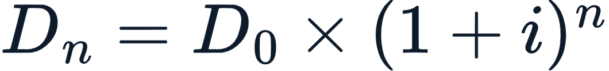, e considera-se 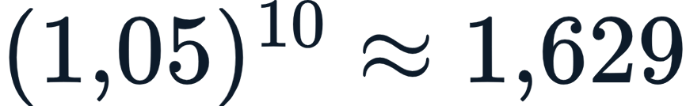.

A demanda projetada para 2035 (10 anos depois) e sua leitura **mais bem suportada** é:

a. Cerca de 840.000 passageiros, pois o crescimento de 5% incide uma única vez sobre o valor inicial.
b. Cerca de 1.200.000 passageiros, calculados por crescimento linear de 5% ao ano.
*c. Cerca de 1.303.000 passageiros (crescimento de ~63%), valor que define se o terminal atual aguenta ou se precisará ser ampliado.
d. Cerca de 4.000.000 passageiros, pois 5% ao ano em 10 anos quintuplica a demanda.
e. Exatamente 800.000 passageiros, pois a demanda permanece estável no horizonte de projeto.

### Questão 14 (Interpretação)

**Estímulo:**

> Calcula-se o volume de um aterro de seção trapezoidal: base superior , altura , taludes  nos dois lados, ao longo de um trecho de . A base inferior é  e a área da seção é 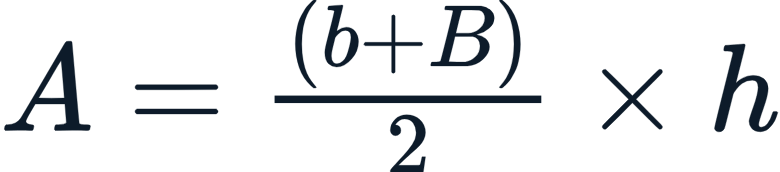.

O volume do aterro nesse trecho é:

a. 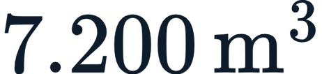, obtido multiplicando a base superior pela altura e pelo comprimento.
b. 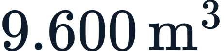, considerando apenas a base superior como área média.
c. , somando as áreas dos dois taludes ao corpo do aterro.
*d. , pois ,  e .
e. 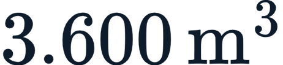, dividindo a área da seção pela metade do comprimento.

### Questão 15 (Interpretação)

**Estímulo:**

> Um pavimento suporta  repetições do eixo padrão antes de falhar. A via recebe 1.200 veículos pesados por dia, cada um equivalente a 1,5 eixo padrão. As repetições anuais são  e a vida útil é 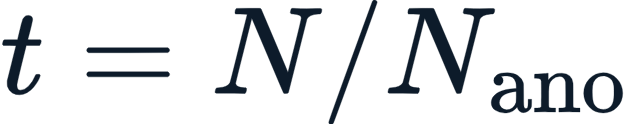.

A conclusão **mais bem suportada** pelos dados é:

a. O pavimento dura cerca de 50 anos, pois o número N suportado é muito elevado.
b. A vida útil independe do número de veículos, dependendo apenas da espessura inicial.
c. O pavimento dura exatamente 10 anos, atendendo automaticamente ao prazo de projeto.
d. A repetição de carga é irrelevante; só o peso de cada eixo define a durabilidade.
*e. O pavimento atinge o fim da vida estrutural em cerca de 7,6 anos; se o projeto exigir mais, será preciso reforçar as camadas ou usar materiais mais resistentes.

### Questão 16 (Interpretação)

**Estímulo:**

> "Uma ferrovia mal planejada vira 'ferrovia fantasma'; um aeroporto superdimensionado vira 'elefante branco'." Antes de uma obra de infraestrutura nascer, avalia-se a viabilidade com indicadores como VPL, TIR e relação Benefício/Custo (B/C), além do estudo de demanda e do licenciamento ambiental.

A leitura mais alinhada ao texto é:

*a. O planejamento e os estudos de viabilidade (VPL, TIR, B/C) servem para separar obra útil de desperdício, evitando subdimensionamento (congestionamento precoce) e superdimensionamento (capital ocioso).
b. A decisão de construir deve basear-se apenas na intuição do gestor, sem estudos formais.
c. O VPL negativo indica que o projeto cria valor e deve ser priorizado.
d. O licenciamento ambiental é dispensável quando o VPL é positivo.
e. "Elefante branco" descreve uma obra subdimensionada que satura antes de inaugurar.

### Questão 17 (Interpretação)

**Estímulo:**

> Os ensaios geotécnicos clássicos incluem granulometria (tamanhos das partículas), limites de Atterberg (LL e LP), compactação Proctor (umidade ótima e densidade máxima) e CBR (Índice de Suporte Califórnia).

Sobre a função do ensaio CBR, a leitura correta é:

a. O CBR mede apenas a distribuição dos tamanhos das partículas do solo.
*b. O CBR mede a capacidade do solo de resistir à penetração e é a principal entrada para o dimensionamento do pavimento.
c. O CBR define a umidade ótima e a densidade máxima de compactação do solo.
d. O CBR determina os limites de liquidez e plasticidade de solos finos.
e. O CBR não tem relação com o comportamento do solo, servindo só para classificar agregados graúdos.

### Questão 18 (Interpretação)

**Estímulo:**

A tabela relaciona infraestruturas e suas cargas típicas de referência:

| Infraestrutura | Carga típica de referência |
| --- | --- |
| Rodovia | Eixo padrão de 8,2 t (80 kN) |
| Ferrovia | Carga por eixo de 25 a 32,5 t |
| Aeroporto | Trem de pouso com centenas de toneladas distribuídas |

A leitura **mais coerente** com a tabela é:

a. As três infraestruturas usam a mesma carga de referência, o eixo de 8,2 t.
b. A rodovia impõe ao pavimento a maior carga por eixo entre os três modais.
*c. As cargas variam fortemente entre os modais, e por isso o dimensionamento do pavimento precisa considerar tanto a carga por eixo quanto a repetição (número N) de cada caso.
d. A carga do aeroporto é a menor, pois está distribuída por todo o trem de pouso.
e. A ferrovia, por ter cargas menores que a rodovia, dispensa estruturas robustas.

### Questão 19 (Interpretação)

**Estímulo:**

> Uma cooperativa produz 600.000 t de grãos por ano e hoje as transporta por caminhão até o Porto de Santos, a 900 km. Avalia-se construir um ramal ferroviário. Custos médios: R\$ 0,18/t·km (rodovia) e R\$ 0,06/t·km (ferrovia), com .

A economia anual de transporte ao migrar todo o volume para a ferrovia é aproximadamente:

a. R\$ 32,4 milhões, equivalente ao próprio custo ferroviário anual.
b. R\$ 97,2 milhões, equivalente ao custo rodoviário anual, sem economia líquida.
c. R\$ 16,2 milhões, correspondendo a uma redução de cerca de 10%.
*d. R\$ 64,8 milhões (R\$ 97,2 milhões − R\$ 32,4 milhões), uma redução de aproximadamente 66,7%, que ainda deve ser confrontada com o custo de construção do ramal.
e. Não há economia, pois a ferrovia é mais cara por tonelada-quilômetro que a rodovia.

### Questão 20 (Interpretação)

**Estímulo:**

> "Construir é metade do trabalho; manter é a outra metade." A curva de degradação de pavimentos mostra que cada R\$ 1 economizado em manutenção preventiva pode custar de R\$ 4 a R\$ 5 em correção futura.

A leitura mais alinhada ao texto é:

a. A manutenção corretiva é sempre mais barata que a preventiva, por ser feita após a falha.
b. Adiar a manutenção preventiva não altera o custo total da via ao longo da vida útil.
c. A construção é a única etapa relevante; a manutenção pode ser indefinidamente postergada sem prejuízo.
d. Gestão de pavimentos é tema apenas operacional, sem relação com a gestão de recursos públicos.
*e. A manutenção preventiva, embora exija desembolso antecipado, evita custos muito maiores no futuro, sendo, no fundo, uma forma de gestão eficiente do dinheiro público.

---

## Feedbacks

### Questão 1

- **a.** *Correta!* Ambas as proposições são verdadeiras e a II justifica a I. Como o custo por t·km da ferrovia (R\$ 0,06) é cerca de um terço do rodoviário (R\$ 0,18), fixadas distância e massa, o custo total ferroviário é menor — exatamente o motivo pelo qual a ferrovia vence o caminhão em grandes volumes e longas distâncias.
- **b.** Incorreta. A Razão **justifica** diretamente a Asserção, pois o menor custo unitário é a causa do menor custo total.
- **c.** Incorreta. A Razão é verdadeira: os custos unitários citados são compatíveis com os da Aula 1.
- **d.** Incorreta. A Asserção é verdadeira: a ferrovia é vocacionada a grandes volumes e longas distâncias.
- **e.** Incorreta. Ambas as proposições são verdadeiras.

### Questão 2

- **a.** Incorreta. As duas proposições são verdadeiras, mas a Razão não justifica a Asserção.
- **b.** *Correta!* As duas proposições são individualmente verdadeiras — o custo logístico brasileiro fica em ~12-13% do PIB (contra ~8% em países desenvolvidos) e a multimodalidade de fato usa documento único sob um OTM. Porém, a definição de multimodalidade não explica o **valor** do custo logístico; são informações independentes.
- **c.** Incorreta. A Razão é verdadeira: a definição de multimodalidade está correta.
- **d.** Incorreta. A Asserção é verdadeira: o "Custo Brasil" gira em torno de 12-13% do PIB.
- **e.** Incorreta. Ambas são verdadeiras.

### Questão 3

- **a.** Incorreta. A Razão é falsa.
- **b.** Incorreta. A Razão é falsa.
- **c.** *Correta!* A Asserção é verdadeira: projetar só para a demanda de hoje satura a obra, sendo necessário o crescimento composto. A Razão é falsa: estimar viagens produzidas e atraídas por zona é a etapa de **geração de viagens**, não de "divisão modal" (que define qual modal cada viagem usará).
- **d.** Incorreta. A Asserção é verdadeira.
- **e.** Incorreta. A Asserção é verdadeira.

### Questão 4

- **a.** Incorreta. A Asserção é falsa.
- **b.** Incorreta. A Asserção é falsa.
- **c.** Incorreta. A Razão é verdadeira.
- **d.** *Correta!* A Asserção é falsa: remover material onde o terreno está acima do greide é **corte (escavação)**, não aterro — aterro é adicionar material onde o terreno está abaixo do greide. A Razão é verdadeira: equilibrar corte e aterro reduz empréstimos, bota-foras e o caro transporte de terra.
- **e.** Incorreta. A Razão é verdadeira.

### Questão 5

- **a.** Incorreta. Ambas são falsas.
- **b.** Incorreta. Ambas são falsas.
- **c.** Incorreta. A Razão também é falsa.
- **d.** Incorreta. A Asserção também é falsa.
- **e.** *Correta!* As duas proposições são falsas. O modal aéreo responde por **menos de 1%** da carga (e é o mais caro), não por mais de 40% — quem domina a matriz é a rodovia (~61%). E o CBR (Índice de Suporte Califórnia) **mede a capacidade de suporte do solo** e é entrada fundamental do dimensionamento de pavimentos, não um ensaio de classificação de rochas.

### Questão 6

- **a.** *Correta!* Ambas verdadeiras e a II justifica a I. O licenciamento é, de fato, o maior gargalo de prazo em ferrovias e portos, e a Razão explica **por que**: trata-se de um processo sequencial (LP, LI, LO) conduzido por órgãos como o IBAMA, que exige EIA/RIMA para grandes obras — etapas que naturalmente consomem anos.
- **b.** Incorreta. A Razão justifica diretamente a Asserção.
- **c.** Incorreta. A Razão é verdadeira: a sequência LP → LI → LO está correta.
- **d.** Incorreta. A Asserção é verdadeira.
- **e.** Incorreta. Ambas são verdadeiras.

### Questão 7

- **a.** Incorreta. As duas proposições são verdadeiras, mas a Razão não justifica a Asserção.
- **b.** *Correta!* As duas proposições são verdadeiras: o pavimento flexível (asfalto) é realmente o mais comum nas rodovias brasileiras; e a manutenção preventiva é, de fato, mais barata que a corretiva. No entanto, o tipo de pavimento predominante **não é explicado** pela economia da prevenção — são fatos independentes.
- **c.** Incorreta. A Razão é verdadeira.
- **d.** Incorreta. A Asserção é verdadeira.
- **e.** Incorreta. Ambas são verdadeiras.

### Questão 8

- **a.** Incorreta. A Razão é falsa.
- **b.** Incorreta. A Razão é falsa.
- **c.** *Correta!* A Asserção é verdadeira: ferrovias exigem rampas suaves (≈1-2%) e curvas amplas, pois o trem não sobe ladeira nem faz curva fechada como o caminhão. A Razão é falsa: o número N representa o **número equivalente de passagens do eixo padrão** ao longo da vida útil (ou seja, depende da repetição), não o peso de um único veículo.
- **d.** Incorreta. A Asserção é verdadeira.
- **e.** Incorreta. A Asserção é verdadeira.

### Questão 9

- **a.** Incorreta. A Asserção é falsa.
- **b.** Incorreta. A Asserção é falsa.
- **c.** Incorreta. A Razão é verdadeira.
- **d.** *Correta!* A Asserção é falsa: intermodalidade e multimodalidade **não** são sinônimos. A Razão é verdadeira e descreve corretamente a diferença — na intermodalidade há documentos separados por trecho; na multimodalidade há documento único sob um OTM.
- **e.** Incorreta. A Razão é verdadeira.

### Questão 10

- **a.** Incorreta. Ambas são falsas.
- **b.** Incorreta. Ambas são falsas.
- **c.** Incorreta. A Razão também é falsa.
- **d.** Incorreta. A Asserção também é falsa.
- **e.** *Correta!* As duas proposições são falsas. A drenagem é **essencial**, pois a água encharca o solo, reduz sua resistência e desfaz o pavimento — é a principal causa de patologias precoces. E o diagrama de massas (curva de Bruckner) serve para **equilibrar volumes de corte e aterro**, não para dimensionar a vazão da drenagem (que parte do estudo hidrológico).

### Questão 11

- **a.** *Correta!* O texto evidencia uma matriz concentrada na rodovia (~61%), incompatível com a vocação de um país continental, que deveria privilegiar ferrovia e hidrovia para grandes volumes e longas distâncias.
- **b.** Incorreta. Os dados mostram desequilíbrio, não equilíbrio entre os modais.
- **c.** Incorreta. A rodovia, e não a ferrovia, predomina no Brasil.
- **d.** Incorreta. O modal aéreo responde por menos de 1% da carga.
- **e.** Incorreta. A dependência do caminhão **encarece** a logística (Custo Brasil), não a reduz.

### Questão 12

- **a.** Incorreta. Os valores estão invertidos:  (rodovia) e  (ferrovia).
- **b.** *Correta!* Aplicando : rodovia = R\$ 360.000 e ferrovia = R\$ 120.000, gerando economia de R\$ 240.000, ou cerca de 66,7% a favor da ferrovia.
- **c.** Incorreta. Embora distância e massa sejam iguais, o custo unitário difere, levando a custos totais distintos.
- **d.** Incorreta. A economia é de ~66,7%, muito superior a 10%.
- **e.** Incorreta. O custo ferroviário é menor, não maior; ambos percorrem a mesma distância de 2.000 km.

### Questão 13

- **a.** Incorreta. Aplicar o crescimento uma única vez ignora o efeito composto ao longo dos 10 anos.
- **b.** Incorreta. Esse valor pressupõe crescimento linear; o fenômeno é composto.
- **c.** *Correta!*  passageiros (cerca de +63%), valor que determina se o terminal aguenta ou precisará ser ampliado.
- **d.** Incorreta. O fator 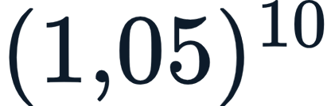 é ~1,629, não 5; a demanda não quintuplica.
- **e.** Incorreta. Com crescimento de 5% ao ano, a demanda não permanece estável.

### Questão 14

- **a.** Incorreta. Não se multiplica simplesmente a base superior pela altura; a seção é trapezoidal e exige a base inferior.
- **b.** Incorreta. Usar só a base superior subestima a área média da seção.
- **c.** Incorreta. Os taludes já estão incorporados ao cálculo da base inferior; não se somam áreas separadas dessa forma.
- **d.** *Correta!* ; 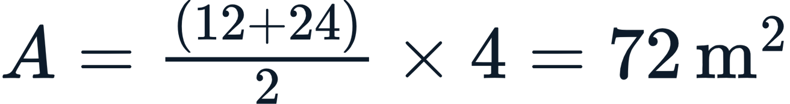; .
- **e.** Incorreta. O volume é a área pelo comprimento total (200 m), não pela metade.

### Questão 15

- **a.** Incorreta. A vida útil resulta de 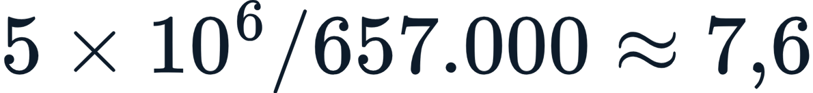 anos, não 50.
- **b.** Incorreta. A vida útil depende diretamente da solicitação (veículos × fator de equivalência).
- **c.** Incorreta. Sem reforço, a vida estrutural fica em ~7,6 anos, abaixo de 10.
- **d.** Incorreta. A repetição de carga (número N) é justamente o que mais solicita o pavimento.
- **e.** *Correta!*  e 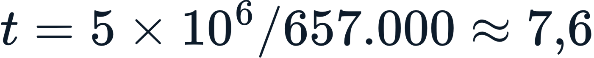 anos; para atender prazos maiores, reforça-se a espessura ou usam-se materiais mais resistentes.

### Questão 16

- **a.** *Correta!* O texto associa planejamento e indicadores de viabilidade (VPL, TIR, B/C) à separação entre obra útil e desperdício, evitando tanto o subdimensionamento quanto o superdimensionamento.
- **b.** Incorreta. A decisão deve basear-se em estudos formais, não em intuição.
- **c.** Incorreta. VPL positivo (não negativo) é que indica criação de valor.
- **d.** Incorreta. O licenciamento ambiental é etapa obrigatória, independentemente do VPL.
- **e.** Incorreta. "Elefante branco" é uma obra **superdimensionada**, com capacidade ociosa.

### Questão 17

- **a.** Incorreta. A distribuição dos tamanhos das partículas é medida pela **granulometria**.
- **b.** *Correta!* O CBR mede a resistência do solo à penetração (capacidade de suporte) e é a principal entrada para o dimensionamento do pavimento.
- **c.** Incorreta. Umidade ótima e densidade máxima são determinadas pelo ensaio de **compactação (Proctor)**.
- **d.** Incorreta. Limites de liquidez e plasticidade são os **limites de Atterberg**.
- **e.** Incorreta. O CBR está diretamente ligado ao comportamento do solo e ao projeto do pavimento.

### Questão 18

- **a.** Incorreta. As cargas de referência são distintas em cada infraestrutura.
- **b.** Incorreta. A rodovia tem a menor carga por eixo (8,2 t) entre os exemplos da tabela.
- **c.** *Correta!* As cargas variam fortemente entre rodovia, ferrovia e aeroporto; por isso o dimensionamento deve considerar tanto a carga por eixo quanto a repetição (número N) de cada situação.
- **d.** Incorreta. O trem de pouso de aeronaves distribui centenas de toneladas — carga elevada, não a menor.
- **e.** Incorreta. A ferrovia tem cargas por eixo **maiores** que a rodovia (25 a 32,5 t), exigindo estruturas robustas.

### Questão 19

- **a.** Incorreta. R\$ 32,4 milhões é o custo ferroviário anual, não a economia.
- **b.** Incorreta. R\$ 97,2 milhões é o custo rodoviário anual; a economia é a diferença entre os dois custos.
- **c.** Incorreta. A redução é de ~66,7%, não de 10%.
- **d.** *Correta!* Rodovia: 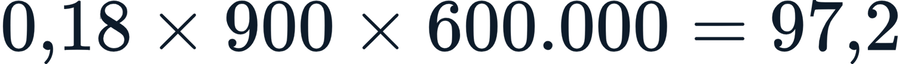 milhões; ferrovia: 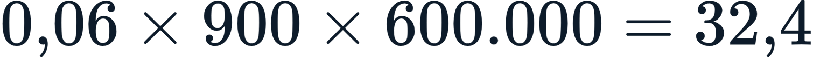 milhões; economia = R\$ 64,8 milhões (~66,7%), que ainda precisa ser confrontada com o custo de construção do ramal.
- **e.** Incorreta. A ferrovia é mais barata por t·km, gerando economia expressiva.

### Questão 20

- **a.** Incorreta. A corretiva é mais cara que a preventiva (R\$ 4 a R\$ 5 contra R\$ 1).
- **b.** Incorreta. Adiar a prevenção multiplica o custo total ao longo da vida útil.
- **c.** Incorreta. A manutenção é metade do trabalho e não pode ser postergada indefinidamente.
- **d.** Incorreta. Gestão de pavimentos é, no fundo, gestão de dinheiro público.
- **e.** *Correta!* A prevenção, embora exija desembolso antecipado, evita custos muito maiores adiante — a curva de degradação mostra que cada R\$ 1 economizado em prevenção pode custar R\$ 4 a R\$ 5 em correção; trata-se de gestão eficiente de recursos públicos.
