# Questionário — Unidade 3

- **Disciplina:** Portos, Aeroportos e Ferrovias
- **Professor-conteudista:** Afonso Cesar Lelis Brandão

## Orientações

- **20 questões** padrão ENADE: **10 asserção-razão** + **10 de interpretação**.
- Cada questão tem **5 alternativas (a–e)**; a correta é prefixada por `*` (ex.: `*c. ...`).
- Distribuição da alternativa correta: rotação **a, b, c, d, e, a, b, c, d, e...** (4 questões para cada letra).

---

## Questões

### Questão 1 (Asserção-Razão)

> **Asserção I:** O A-CDM (Airport Collaborative Decision Making), apoiado por algoritmos AMAN/DMAN com inteligência artificial, reduz os *holdings* (esperas em órbita) e o atraso total ao substituir o "primeiro a pedir, primeiro a sair" por uma sequência de pousos e decolagens pré-calculada.
>
> **porque**
>
> **Razão II:** O sequenciamento ótimo de pousos e decolagens é um problema combinatório que cresce de forma fatorial com o número de aeronaves, de modo que técnicas de pesquisa operacional e IA aprendem políticas que minimizam atraso total e consumo de combustível, espaçando as chegadas no limite mínimo de separação.

A respeito dessas asserções, assinale a opção correta:

*a. As asserções I e II são proposições verdadeiras, e a II é uma justificativa correta da I.
b. As asserções I e II são proposições verdadeiras, mas a II não é uma justificativa correta da I.
c. A asserção I é uma proposição verdadeira, e a II é uma proposição falsa.
d. A asserção I é uma proposição falsa, e a II é uma proposição verdadeira.
e. As asserções I e II são proposições falsas.

### Questão 2 (Asserção-Razão)

> **Asserção I:** A regulação da aviação civil no Brasil organiza-se em camadas, com a OACI definindo padrões mundiais no Anexo 14 e a ANAC internalizando-os por meio do RBAC 154.
>
> **porque**
>
> **Razão II:** A OACI é uma agência da ONU sediada em Montreal, responsável por publicar os Anexos à Convenção de Chicago.

A respeito dessas asserções, assinale a opção correta:

a. As asserções I e II são proposições verdadeiras, e a II é uma justificativa correta da I.
*b. As asserções I e II são proposições verdadeiras, mas a II não é uma justificativa correta da I.
c. A asserção I é uma proposição verdadeira, e a II é uma proposição falsa.
d. A asserção I é uma proposição falsa, e a II é uma proposição verdadeira.
e. As asserções I e II são proposições falsas.

### Questão 3 (Asserção-Razão)

> **Asserção I:** No método ACN-PCN da OACI, uma aeronave pode operar livremente em um pavimento quando o seu ACN é menor ou igual ao PCN do pavimento.
>
> **porque**
>
> **Razão II:** O ACN (Aircraft Classification Number) é uma propriedade do pavimento que expressa a sua capacidade de suporte, enquanto o PCN (Pavement Classification Number) é uma propriedade da aeronave que mede o efeito que ela causa.

A respeito dessas asserções, assinale a opção correta:

a. As asserções I e II são proposições verdadeiras, e a II é uma justificativa correta da I.
b. As asserções I e II são proposições verdadeiras, mas a II não é uma justificativa correta da I.
*c. A asserção I é uma proposição verdadeira, e a II é uma proposição falsa.
d. A asserção I é uma proposição falsa, e a II é uma proposição verdadeira.
e. As asserções I e II são proposições falsas.

### Questão 4 (Asserção-Razão)

> **Asserção I:** A designação numérica de uma pista (por exemplo, 09 e 27) é definida pela direção das vias de acesso terrestre ao aeroporto.
>
> **porque**
>
> **Razão II:** A pista é orientada segundo o vento predominante, pois aeronaves pousam e decolam contra o vento, e a designação numérica vem do azimute magnético dividido por 10 e arredondado.

A respeito dessas asserções, assinale a opção correta:

a. As asserções I e II são proposições verdadeiras, e a II é uma justificativa correta da I.
b. As asserções I e II são proposições verdadeiras, mas a II não é uma justificativa correta da I.
c. A asserção I é uma proposição verdadeira, e a II é uma proposição falsa.
*d. A asserção I é uma proposição falsa, e a II é uma proposição verdadeira.
e. As asserções I e II são proposições falsas.

### Questão 5 (Asserção-Razão)

> **Asserção I:** O pavimento flexível (asfáltico) é sempre a melhor escolha para os pátios de aeronaves, pois trabalha por flexão e suporta cargas estáticas prolongadas melhor do que qualquer outro tipo.
>
> **porque**
>
> **Razão II:** O pavimento rígido de concreto é inadequado para áreas de estacionamento de aeronaves, já que se deforma facilmente sob carga estática e tem custo de execução desprezível.

A respeito dessas asserções, assinale a opção correta:

a. As asserções I e II são proposições verdadeiras, e a II é uma justificativa correta da I.
b. As asserções I e II são proposições verdadeiras, mas a II não é uma justificativa correta da I.
c. A asserção I é uma proposição verdadeira, e a II é uma proposição falsa.
d. A asserção I é uma proposição falsa, e a II é uma proposição verdadeira.
*e. As asserções I e II são proposições falsas.

### Questão 6 (Asserção-Razão)

> **Asserção I:** O Plano Diretor aeroportuário é um documento de planejamento de longo prazo, com horizonte de cerca de 20 anos, que orienta toda a expansão física do aeroporto.
>
> **porque**
>
> **Razão II:** Ao projetar a demanda futura, definir fases de obras, reservar áreas para pistas, pátios e terminais e proteger o entorno, o Plano Diretor evita o erro de construir hoje um terminal onde a pista precisará crescer amanhã.

A respeito dessas asserções, assinale a opção correta:

*a. As asserções I e II são proposições verdadeiras, e a II é uma justificativa correta da I.
b. As asserções I e II são proposições verdadeiras, mas a II não é uma justificativa correta da I.
c. A asserção I é uma proposição verdadeira, e a II é uma proposição falsa.
d. A asserção I é uma proposição falsa, e a II é uma proposição verdadeira.
e. As asserções I e II são proposições falsas.

### Questão 7 (Asserção-Razão)

> **Asserção I:** O código de referência da OACI combina um número (1 a 4), ligado ao comprimento de pista de referência da aeronave, e uma letra (A a F), ligada à envergadura e à bitola do trem de pouso.
>
> **porque**
>
> **Razão II:** O Aeroporto Internacional de Guarulhos (GRU) é o maior do Brasil e movimentou mais de 40 milhões de passageiros em anos recentes.

A respeito dessas asserções, assinale a opção correta:

a. As asserções I e II são proposições verdadeiras, e a II é uma justificativa correta da I.
*b. As asserções I e II são proposições verdadeiras, mas a II não é uma justificativa correta da I.
c. A asserção I é uma proposição verdadeira, e a II é uma proposição falsa.
d. A asserção I é uma proposição falsa, e a II é uma proposição verdadeira.
e. As asserções I e II são proposições falsas.

### Questão 8 (Asserção-Razão)

> **Asserção I:** As saídas rápidas (rapid exit taxiways), com ângulos de cerca de 30°, permitem que a aeronave deixe a pista sem reduzir tanto a velocidade, liberando a pista mais cedo para o próximo pouso.
>
> **porque**
>
> **Razão II:** As taxiways são tão largas quanto as pistas de pouso e decolagem e são projetadas para que as aeronaves circulem entre pista e pátio em altas velocidades.

A respeito dessas asserções, assinale a opção correta:

a. As asserções I e II são proposições verdadeiras, e a II é uma justificativa correta da I.
b. As asserções I e II são proposições verdadeiras, mas a II não é uma justificativa correta da I.
*c. A asserção I é uma proposição verdadeira, e a II é uma proposição falsa.
d. A asserção I é uma proposição falsa, e a II é uma proposição verdadeira.
e. As asserções I e II são proposições falsas.

### Questão 9 (Asserção-Razão)

> **Asserção I:** Em um terminal de passageiros, os fluxos de embarque e desembarque podem se cruzar livremente, pois isso aumenta a eficiência do uso do espaço.
>
> **porque**
>
> **Razão II:** O segredo de um bom terminal é separar e ordenar os fluxos; por isso muitos aeroportos adotam pavimentos diferentes (chegadas embaixo, partidas em cima) justamente para que esses fluxos não se cruzem.

A respeito dessas asserções, assinale a opção correta:

a. As asserções I e II são proposições verdadeiras, e a II é uma justificativa correta da I.
b. As asserções I e II são proposições verdadeiras, mas a II não é uma justificativa correta da I.
c. A asserção I é uma proposição verdadeira, e a II é uma proposição falsa.
*d. A asserção I é uma proposição falsa, e a II é uma proposição verdadeira.
e. As asserções I e II são proposições falsas.

### Questão 10 (Asserção-Razão)

> **Asserção I:** A carga aérea, por movimentar grandes volumes de peso no comércio mundial, é o segmento mais barato por quilograma transportado e dispensa qualquer estrutura especializada no aeroporto.
>
> **porque**
>
> **Razão II:** O método FAA de dimensionamento de pavimentos, implementado no FAARFIELD, ignora o mix de tráfego e a fadiga acumulada, considerando apenas a aeronave mais leve que opera no aeroporto.

A respeito dessas asserções, assinale a opção correta:

a. As asserções I e II são proposições verdadeiras, e a II é uma justificativa correta da I.
b. As asserções I e II são proposições verdadeiras, mas a II não é uma justificativa correta da I.
c. A asserção I é uma proposição verdadeira, e a II é uma proposição falsa.
d. A asserção I é uma proposição falsa, e a II é uma proposição verdadeira.
*e. As asserções I e II são proposições falsas.

### Questão 11 (Interpretação)

**Estímulo:**

> Na hora-pico, a imigração de um aeroporto recebe chegadas aleatórias (Poisson) à taxa  passageiros/hora, e cada guichê processa  passageiros/hora. Modela-se o sistema como uma fila **M/M/c**, em que a utilização é 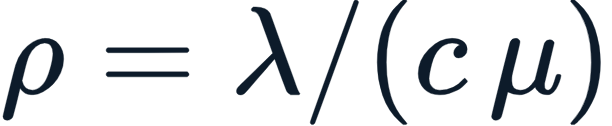 e a fila só é estável quando .

Quantos guichês são, no mínimo, teoricamente necessários, e por que se costuma dimensionar com mais do que esse mínimo?

*a. São necessários **7 guichês** (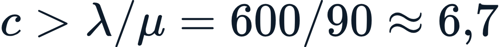); como com  a utilização é 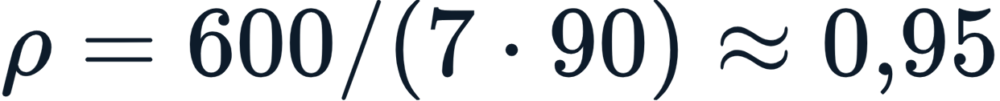 — alta demais —, dimensiona-se com folga ( ou , ).
b. Bastam **2 guichês**, pois 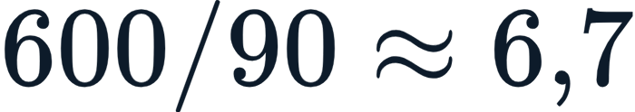 deve ser dividido pela metade para obter o número de filas.
c. São necessários **600 guichês**, um para cada passageiro da hora-pico, garantindo .
d. Com **7 guichês** a utilização fica , o que é ideal: quanto mais próximo de , menor a fila e o tempo de espera.
e. O número de guichês é irrelevante, pois na fila M/M/c o tempo de espera não depende da utilização .

### Questão 12 (Interpretação)

**Estímulo:**

> Uma pista possui PCN **60/F/B/X/T**. Três aeronaves desejam operar, com os seguintes valores de ACN para subleito categoria B e pavimento flexível: Embraer E195 (ACN 28), Boeing 737-800 (ACN 47) e Boeing 767-300 (ACN 68).

Considerando a regra do método ACN-PCN, qual leitura é **mais adequada**?

a. As três aeronaves operam livremente, pois todos os ACN são inferiores a 100.
*b. O E195 e o 737-800 operam livremente (); o 767-300, com , fica em operação restrita, pois excede a capacidade do pavimento.
c. Apenas o 767-300 opera livremente, pois quanto maior o ACN, mais segura é a operação.
d. Nenhuma das aeronaves pode operar, pois o PCN 60 só admite ACN igual a zero.
e. As letras F/B/X/T do PCN tornam irrelevante a comparação numérica entre ACN e PCN.

### Questão 13 (Interpretação)

**Estímulo:**

A tabela resume a divisão conceitual de um aeroporto:

| Aspecto | Lado ar | Lado terra |
| --- | --- | --- |
| O que abrange | Pistas, taxiways, pátios | Terminal, estacionamento, vias de acesso |
| Quem circula | Aeronaves, veículos de apoio | Passageiros, acompanhantes, veículos urbanos |
| Fronteira | Restrita, controlada | Pública |

Onde se localiza tipicamente a fronteira entre o lado ar e o lado terra de um aeroporto?

a. Na pista de pouso e decolagem, que separa fisicamente os dois domínios.
b. No pátio de aeronaves, acessível livremente ao público em geral.
*c. No canal de inspeção de segurança (raio-X, detector de metais) no terminal e na cerca operacional no perímetro.
d. No estacionamento de longa permanência, onde os passageiros deixam seus veículos.
e. Na torre de controle, que é o único ponto de contato entre passageiros e aeronaves.

### Questão 14 (Interpretação)

**Estímulo:**

> Um aeroporto regional movimenta hoje 800.000 passageiros/ano e cresce a uma taxa de 6% ao ano. A projeção de crescimento geométrico é 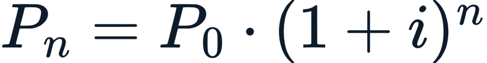, e adota-se que a hora-pico de projeto (HPP) corresponde a  do movimento anual.

Aplicando a projeção para 10 anos, com 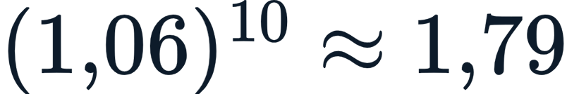, a demanda anual projetada e a hora-pico de projeto serão, aproximadamente:

a.  passageiros/ano e 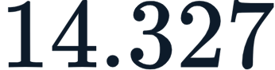 passageiros na hora-pico.
b.  passageiros/ano e  passageiros na hora-pico, pois a demanda permanece estável.
c.  passageiros/ano e  passageiros na hora-pico, somando 6% por ano linearmente.
*d.  passageiros/ano e  passageiros na hora-pico.
e.  passageiros/ano, mas a hora-pico não pode ser estimada a partir do movimento anual.

### Questão 15 (Interpretação)

**Estímulo:**

> "Um Boeing 777 totalmente carregado pesa cerca de  e toca a pista a mais de . A carga não chega ao pavimento como um peso único: ela se distribui pelo trem de pouso, que pode ter múltiplas rodas em arranjos como dual, dual tandem ou dual tandem duplo."

Que conclusão é **mais bem suportada** pelo texto?

a. Quanto mais rodas tem o trem de pouso, maior é a pressão concentrada em cada ponto do pavimento.
b. O peso total da aeronave é aplicado integralmente em um único ponto da pista.
c. A pressão dos pneus é irrelevante para o dimensionamento das camadas do pavimento.
d. Aeronaves leves e pesadas solicitam o pavimento exatamente da mesma forma.
*e. Aumentar o número de rodas distribui melhor a carga e reduz a pressão por roda, atenuando o esforço pontual sobre o pavimento.

### Questão 16 (Interpretação)

**Estímulo:**

> A IATA, em seu Airport Development Reference Manual (ADRM), define três faixas de nível de serviço (LoS): over-design (superdimensionado, com espaço ocioso e custo alto), optimum (ótimo, com conforto e custo equilibrados) e sub-optimum (subdimensionado, com aglomeração e filas).

Qual faixa deve ser adotada como **alvo de projeto** de um terminal de passageiros?

*a. Optimum, pois equilibra conforto do passageiro e custo da obra.
b. Over-design, pois quanto mais espaço ocioso, melhor o aproveitamento do investimento.
c. Sub-optimum, pois aglomeração e filas indicam alta produtividade do terminal.
d. Qualquer faixa, pois o nível de serviço não influencia o dimensionamento do terminal.
e. Over-design no embarque e sub-optimum no desembarque, alternando as faixas por área.

### Questão 17 (Interpretação)

**Estímulo:**

> Uma pista de pouso e decolagem está alinhada segundo um azimute magnético de . A designação numérica de pista é obtida dividindo-se o azimute por 10 e arredondando; os dois sentidos de uma mesma pista sempre diferem de 18.

Como deve ser designada essa pista em seus dois sentidos?

a. Pistas 09 e 09, pois ambos os sentidos recebem o mesmo número.
*b. Pistas 09 e 27, pois  e o sentido oposto  corresponde a 27.
c. Pistas 93 e 27, usando o azimute completo de um lado e o reduzido do outro.
d. Pistas 18 e 36, pois os sentidos sempre diferem de 18 a partir do norte.
e. Pistas 09L e 09R, pois toda pista isolada recebe as letras left e right.

### Questão 18 (Interpretação)

**Estímulo:**

> "Para pousar com segurança em baixa visibilidade, a aeronave conta com auxílios à navegação. O ILS fornece guiamento de eixo (localizer) e de rampa de descida (glide slope) por rádio, com categorias CAT I, II e III. O PAPI usa luzes ao lado da pista, em vermelho/branco, para indicar visualmente se o avião está alto, baixo ou na rampa correta."

A leitura mais correta do texto é:

a. ILS e PAPI são o mesmo sistema, ambos baseados exclusivamente em luzes visuais.
b. O PAPI fornece guiamento por rádio em baixa visibilidade, dispensando o ILS.
*c. O ILS guia a aproximação por rádio (eixo e rampa), permitindo pousos em baixa visibilidade, enquanto o PAPI dá indicação visual da rampa por luzes — sistemas distintos e complementares.
d. O ILS só funciona com boa visibilidade, sendo inútil em aproximações por instrumentos.
e. As categorias CAT I, II e III referem-se ao número de rodas do trem de pouso da aeronave.

### Questão 19 (Interpretação)

**Estímulo:**

> Dimensione a área do saguão de embarque para uma hora-pico de 600 passageiros. Adote: tempo médio de permanência de 40 minutos; fator de acompanhantes de 1,3; e área por pessoa de 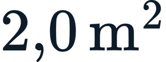 (nível de serviço ótimo da IATA). A ocupação simultânea de passageiros é .

Qual é, aproximadamente, a área útil necessária para o saguão?

a. 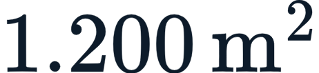, multiplicando os 600 passageiros diretamente pela área por pessoa.
b. 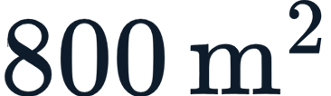, ignorando o tempo de permanência e os acompanhantes.
c. 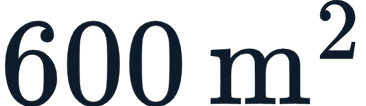, considerando  por passageiro da hora-pico.
*d. 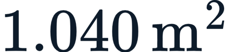, pois , com acompanhantes  pessoas, e 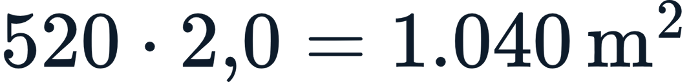.
e. 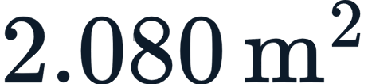, dobrando a área por pessoa para garantir folga máxima.

### Questão 20 (Interpretação)

**Estímulo:**

> "Pavimentos aeroportuários exigem manutenção rigorosa, pois um defeito pode gerar FOD (Foreign Object Debris) — fragmentos que, sugados por turbinas, causam acidentes graves. As inspeções usam o índice PCI (Pavement Condition Index), de 0 a 100, que classifica o pavimento de 'falho' a 'excelente' a partir do levantamento visual de defeitos."

A leitura mais alinhada ao texto é:

a. O FOD é um benefício operacional, pois fragmentos soltos melhoram a aderência dos pneus.
b. A manutenção de pavimentos é dispensável, já que turbinas filtram qualquer detrito automaticamente.
c. Um PCI próximo de 0 indica pavimento em excelente estado e sem necessidade de intervenção.
d. O PCI substitui o método ACN-PCN na avaliação da capacidade estrutural do pavimento.
*e. A manutenção rigorosa, monitorada pelo PCI, é essencial para evitar a geração de FOD, que pode causar acidentes graves ao ser sugado por turbinas.

---

## Feedbacks

### Questão 1

- **a.** *Correta!* Ambas verdadeiras e a II justifica a I. O A-CDM com AMAN/DMAN e IA realmente reduz *holdings* e atraso ao impor uma sequência pré-calculada, e a Razão explica diretamente o porquê: como o sequenciamento é um problema combinatório de crescimento fatorial, a pesquisa operacional e a IA aprendem políticas que minimizam atraso e combustível, espaçando as chegadas no limite mínimo de separação.
- **b.** Incorreta. A Razão justifica sim a Asserção, pois apresenta a causa (a natureza combinatória do problema e o objetivo de minimizar atraso/combustível) do ganho do A-CDM.
- **c.** Incorreta. A Razão é verdadeira: o sequenciamento de pousos e decolagens é de fato combinatório/fatorial e é atacado por PO e IA para minimizar atraso e consumo.
- **d.** Incorreta. A Asserção é verdadeira: o A-CDM (TOBT/TSAT + AMAN/DMAN) substitui o "primeiro a pedir, primeiro a sair" e corta *holdings* e atraso.
- **e.** Incorreta. Ambas são verdadeiras.

### Questão 2

- **a.** Incorreta. As duas proposições são verdadeiras, mas a II não justifica a I.
- **b.** *Correta!* Ambas são verdadeiras: a regulação realmente se organiza em camadas (OACI → ANAC/RBAC 154), e a OACI é de fato uma agência da ONU em Montreal. Porém, a Razão apenas descreve a OACI, não explica por que a regulação se organiza em camadas — são informações independentes.
- **c.** Incorreta. A Razão é verdadeira.
- **d.** Incorreta. A Asserção é verdadeira.
- **e.** Incorreta. Ambas são verdadeiras.

### Questão 3

- **a.** Incorreta. A Razão é falsa, pois inverte as definições de ACN e PCN.
- **b.** Incorreta. A Razão é falsa.
- **c.** *Correta!* A Asserção é verdadeira (opera-se livremente quando ). A Razão é falsa: o ACN é propriedade da **aeronave** (efeito sobre o pavimento) e o PCN é propriedade do **pavimento** (capacidade de suporte) — a alternativa as troca.
- **d.** Incorreta. A Asserção é verdadeira.
- **e.** Incorreta. A Asserção é verdadeira.

### Questão 4

- **a.** Incorreta. A Asserção é falsa.
- **b.** Incorreta. A Asserção é falsa.
- **c.** Incorreta. A Razão é verdadeira.
- **d.** *Correta!* A Asserção é falsa: a designação não vem das vias de acesso, mas do azimute magnético. A Razão é verdadeira: a pista se orienta pelo vento predominante e a numeração resulta do azimute magnético dividido por 10.
- **e.** Incorreta. A Razão é verdadeira.

### Questão 5

- **a.** Incorreta. Ambas são falsas.
- **b.** Incorreta. Ambas são falsas.
- **c.** Incorreta. A Razão também é falsa.
- **d.** Incorreta. A Asserção também é falsa.
- **e.** *Correta!* As duas proposições são falsas. Quem trabalha por flexão e é ideal para pátios (carga estática prolongada) é o pavimento **rígido** de concreto, não o flexível. E o pavimento rígido **não** se deforma facilmente sob carga estática nem tem custo desprezível — ao contrário, é mais durável, porém mais caro e lento de executar.

### Questão 6

- **a.** *Correta!* Ambas verdadeiras e a II justifica a I. O Plano Diretor é de fato um instrumento de longo prazo (~20 anos), e a Razão explica exatamente por quê: ao projetar demanda, fasear obras e reservar áreas, ele evita conflitos de uso do solo como construir terminal onde a pista crescerá.
- **b.** Incorreta. A Razão justifica diretamente a Asserção.
- **c.** Incorreta. A Razão é verdadeira.
- **d.** Incorreta. A Asserção é verdadeira.
- **e.** Incorreta. Ambas são verdadeiras.

### Questão 7

- **a.** Incorreta. A Razão não justifica a Asserção.
- **b.** *Correta!* As duas proposições são verdadeiras: o código de referência combina mesmo número (1–4) e letra (A–F), e GRU é de fato o maior aeroporto do Brasil com mais de 40 milhões de passageiros. Mas o dado sobre GRU não explica a estrutura do código de referência — são fatos independentes.
- **c.** Incorreta. A Razão é verdadeira.
- **d.** Incorreta. A Asserção é verdadeira.
- **e.** Incorreta. Ambas são verdadeiras.

### Questão 8

- **a.** Incorreta. A Razão é falsa.
- **b.** Incorreta. A Razão é falsa.
- **c.** *Correta!* A Asserção é verdadeira: saídas rápidas a 30° liberam a pista mais cedo. A Razão é falsa: as taxiways são **mais estreitas** que a pista e projetadas para **baixa** velocidade, não para altas velocidades.
- **d.** Incorreta. A Asserção é verdadeira.
- **e.** Incorreta. A Asserção é verdadeira.

### Questão 9

- **a.** Incorreta. A Asserção é falsa.
- **b.** Incorreta. A Asserção é falsa.
- **c.** Incorreta. A Razão é verdadeira.
- **d.** *Correta!* A Asserção é falsa: os fluxos de embarque e desembarque **não devem** se cruzar. A Razão é verdadeira: separar e ordenar fluxos é justamente o segredo do bom terminal, daí o uso de pavimentos distintos para chegadas e partidas.
- **e.** Incorreta. A Razão é verdadeira.

### Questão 10

- **a.** Incorreta. Ambas são falsas.
- **b.** Incorreta. Ambas são falsas.
- **c.** Incorreta. A Razão também é falsa.
- **d.** Incorreta. A Asserção também é falsa.
- **e.** *Correta!* As duas proposições são falsas. A carga aérea move pouco peso, mas alto **valor**, e exige estrutura especializada (TECA, câmaras frias, ULD) — não é o segmento mais barato por quilograma. E o método FAA/FAARFIELD **considera** o mix de tráfego completo, converte-o em decolagens equivalentes e acumula dano por fadiga ao longo de ~20 anos — não usa apenas a aeronave mais leve.

### Questão 11

- **a.** *Correta!* O mínimo teórico vem de 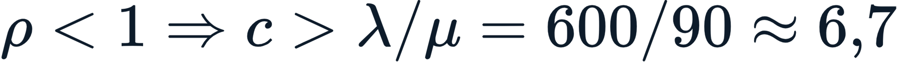, ou seja,  guichês. Como com  a utilização é 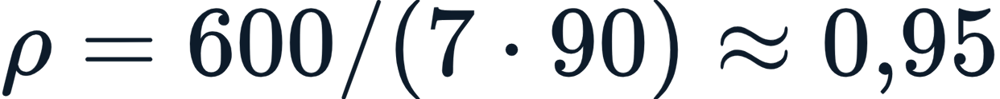 — alta demais, com fila longa e instável —, dimensiona-se com folga ( ou , 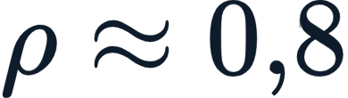).
- **b.** Incorreta. Não se divide 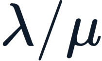 pela metade; o número de guichês precisa satisfazer 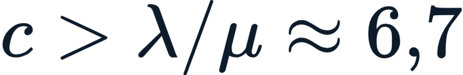, logo  no mínimo.
- **c.** Incorreta. Não é necessário um guichê por passageiro; basta  que torne 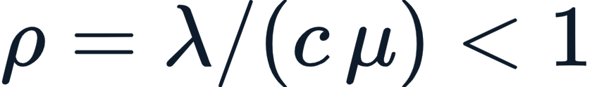, ou seja, .
- **d.** Incorreta. Utilização próxima de  é **ruim**: à medida que , a fila e o tempo de espera **explodem** de forma não linear, por isso  é alta demais.
- **e.** Incorreta. Na fila M/M/c o tempo de espera depende fortemente de : cresce de forma não linear quando  se aproxima de .

### Questão 12

- **a.** Incorreta. A regra não é "ACN < 100", e sim  (= 60).
- **b.** *Correta!* E195 (28) e 737-800 (47) têm  e operam livremente; o 767-300 (68) excede o PCN 60, ficando em operação restrita.
- **c.** Incorreta. Quanto **maior** o ACN, mais a aeronave agride o pavimento; ACN alto não significa operação mais segura.
- **d.** Incorreta. PCN 60 admite todas as aeronaves com ACN até 60, não apenas ACN igual a zero.
- **e.** Incorreta. As letras qualificam a comparação (tipo, subleito, pressão, método), mas a comparação numérica ACN × PCN continua válida e essencial.

### Questão 13

- **a.** Incorreta. A pista pertence ao lado ar; não é a fronteira entre lado ar e lado terra.
- **b.** Incorreta. O pátio é lado ar, restrito e controlado, não acessível ao público.
- **c.** *Correta!* A fronteira é o canal de inspeção de segurança (raio-X/detector de metais) no terminal e a cerca operacional no perímetro do aeroporto.
- **d.** Incorreta. O estacionamento é parte do lado terra, não a fronteira entre os dois domínios.
- **e.** Incorreta. A torre de controle não é a fronteira lado ar/lado terra.

### Questão 14

- **a.** Incorreta. A demanda projetada está correta, mas a HPP de  de  é , e não 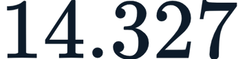.
- **b.** Incorreta. A demanda cresce; não permanece em 800.000.
- **c.** Incorreta. O crescimento é geométrico (composto), não linear; o valor correto é .
- **d.** *Correta!*  passageiros/ano, e a HPP  passageiros na hora-pico.
- **e.** Incorreta. A hora-pico é justamente estimada como uma fração () do movimento anual.

### Questão 15

- **a.** Incorreta. É o oposto: mais rodas **reduzem** a pressão por ponto.
- **b.** Incorreta. O peso se distribui pelo trem de pouso, não em um único ponto.
- **c.** Incorreta. A pressão dos pneus (que pode passar de ) afeta as camadas superficiais e é relevante ao dimensionamento.
- **d.** Incorreta. Aeronaves de pesos e configurações diferentes solicitam o pavimento de formas distintas.
- **e.** *Correta!* Quanto mais rodas no trem de pouso, mais distribuída a carga e menor a pressão por roda, atenuando o esforço pontual sobre o pavimento.

### Questão 16

- **a.** *Correta!* O nível optimum é o alvo de projeto, pois equilibra conforto do passageiro e custo da obra.
- **b.** Incorreta. Over-design gera espaço ocioso e custo alto — não é o alvo.
- **c.** Incorreta. Sub-optimum significa aglomeração e filas (desconforto), não alta produtividade.
- **d.** Incorreta. O nível de serviço influencia diretamente o dimensionamento (área por passageiro, tempos de espera).
- **e.** Incorreta. Não se alternam faixas dessa forma; o alvo de projeto é o nível optimum.

### Questão 17

- **a.** Incorreta. Os dois sentidos de uma pista têm números diferentes, separados por 18.
- **b.** *Correta!* ; o sentido oposto 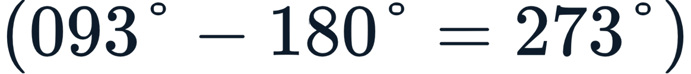 dá . Logo, pistas 09 e 27.
- **c.** Incorreta. A designação usa o azimute dividido por 10 (arredondado), não o azimute completo.
- **d.** Incorreta. 09 e 27 já diferem de 18; 18 e 36 corresponderiam a outra orientação ().
- **e.** Incorreta. As letras L/R só são usadas quando há pistas **paralelas**, não em pista isolada.

### Questão 18

- **a.** Incorreta. ILS e PAPI são sistemas distintos; o ILS é por rádio e o PAPI é visual.
- **b.** Incorreta. O PAPI é visual e não substitui o ILS em baixa visibilidade.
- **c.** *Correta!* O ILS guia por rádio (localizer e glide slope), permitindo pousos em baixa visibilidade; o PAPI dá indicação visual da rampa por luzes vermelho/branco — sistemas distintos e complementares.
- **d.** Incorreta. O ILS é justamente o auxílio que viabiliza aproximações por instrumentos em baixa visibilidade.
- **e.** Incorreta. CAT I, II e III referem-se à categoria de precisão/visibilidade da aproximação, não a rodas do trem de pouso.

### Questão 19

- **a.** Incorreta. Não se multiplica os 600 diretamente: deve-se usar a ocupação simultânea (tempo de permanência) e os acompanhantes.
- **b.** Incorreta. Ignora o fator de acompanhantes (1,3) e usa a ocupação simultânea de forma incompleta.
- **c.** Incorreta. A área por pessoa adotada (nível ótimo) é , não 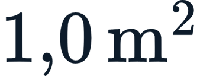, e a ocupação não é de 600.
- **d.** *Correta!* ; com acompanhantes  pessoas; área 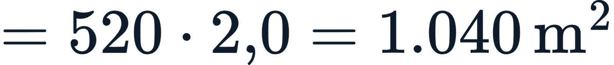.
- **e.** Incorreta. A área por pessoa adotada é 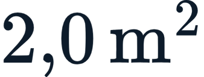 (nível ótimo); dobrá-la não corresponde ao enunciado.

### Questão 20

- **a.** Incorreta. FOD é um risco grave, não um benefício; fragmentos soltos não melhoram aderência.
- **b.** Incorreta. A manutenção é essencial; turbinas não filtram detritos — ao contrário, sugam-nos com risco de acidente.
- **c.** Incorreta. No PCI (0 a 100), valores próximos de 0 indicam pavimento "falho", e próximos de 100, "excelente".
- **d.** Incorreta. O PCI avalia a **condição** (defeitos) do pavimento; não substitui o ACN-PCN, que trata da capacidade estrutural.
- **e.** *Correta!* A manutenção rigorosa, monitorada pelo PCI, é essencial para evitar a geração de FOD, que, sugado por turbinas, pode causar acidentes graves.
