# Unidade 3 — Aeroportos

- **Disciplina:** Portos, Aeroportos e Ferrovias
- **Conteudista:** Afonso Cesar Lelis Brandão
- **Videoaulas desta unidade:** 9 a 12

## Aula 9 — Sistema aeroportuário e planejamento de aeroportos

Um aeroporto não é apenas uma pista com um prédio ao lado. É um sistema complexo de engenharia que precisa receber, em segurança e com fluidez, milhões de pessoas por ano, aeronaves que pesam até 575 toneladas e cargas que abastecem economias inteiras. O Aeroporto de Guarulhos (GRU), o maior do Brasil, movimentou mais de 40 milhões de passageiros em anos recentes — número equivalente a quase toda a população do Canadá passando por um único complexo. Nesta aula você vai entender como esse sistema é organizado, quem o regula, e como o engenheiro civil participa do seu planejamento, do plano diretor à divisão entre lado ar e lado terra.

### O sistema de aviação civil

O transporte aéreo é um **sistema integrado** composto por quatro grandes elementos que precisam funcionar em harmonia: a **aeronave**, o **espaço aéreo** (rotas e controle de tráfego), o **aeroporto** (infraestrutura de solo) e o **usuário** (passageiro ou carga). O aeroporto é o nó físico onde o transporte aéreo toca o solo — é o ponto de transição entre o modo aéreo e os demais modos (rodoviário, ferroviário, metroviário).

No Brasil, esse sistema é gigantesco: são mais de 2.500 aeródromos cadastrados, dos quais cerca de 500 públicos. Os 10 maiores concentram a maior parte do tráfego — uma característica típica de redes aéreas, organizadas em **hubs** (centros concentradores como GRU e Brasília) e **spokes** (aeroportos regionais que alimentam os hubs).

### Classificação de aeroportos

Aeroportos são classificados sob vários critérios. Os principais:

- **Por natureza do tráfego:** doméstico ou internacional (estes com alfândega, imigração e vigilância sanitária).
- **Por função na rede:** hub, regional, executivo ou de carga.
- **Pelo "código de referência" da OACI/ICAO:** combina um **número** (1 a 4), ligado ao comprimento de pista de referência da aeronave, e uma **letra** (A a F), ligada à envergadura e à bitola do trem de pouso. Por exemplo, um aeroporto **4E** atende aeronaves de grande porte como o Boeing 777; **4F** atende o Airbus A380 (envergadura de até ).

O código de referência (OACI, Anexo 14 / RBAC 154) é definido por duas tabelas:

| Número | Comprimento de pista de referência |
| --- | --- |
| **1** |  |
| **2** |  a  |
| **3** |  a  |
| **4** |  |

| Letra | Envergadura | Exemplo de aeronave |
| --- | --- | --- |
| **A** |  | aviação geral leve |
| **B** |  a  | ATR 72, E145 |
| **C** |  a  | A320, B737 |
| **D** |  a  | B767 |
| **E** |  a  | B777, B787 |
| **F** |  a  | A380 |

Essa codificação é decisiva no projeto: ela define larguras de pista, distâncias de segurança, raios de curva de taxiway e dimensões de pátio.

### Órgãos reguladores (ANAC, OACI)

A regulação tem três camadas:

1. **OACI/ICAO** (Organização da Aviação Civil Internacional) — agência da ONU sediada em Montreal. Publica os **Anexos** à Convenção de Chicago; o mais relevante para o engenheiro é o **Anexo 14 — Aeródromos**, que define padrões geométricos, de pavimento e de segurança operacional.
2. **ANAC** (Agência Nacional de Aviação Civil) — órgão regulador brasileiro criado em 2005. Edita os **RBAC** (Regulamentos Brasileiros da Aviação Civil), com destaque para o **RBAC 154** (projeto de aeródromos), que internaliza o Anexo 14 da OACI. A ANAC também certifica aeródromos públicos e fiscaliza a conformidade das obras.
3. **Operadores e gestores** — a **Infraero** (empresa pública federal) administra dezenas de aeroportos regionais e de médio porte. Os principais hubs foram concedidos à iniciativa privada a partir de 2012: GRU Airport (Guarulhos), Aeroportos Brasil Viracopos (Campinas/VCP), Aeroportos do Sudeste (Congonhas/CGH, Brasília/BSB, entre outros) e grupos como CCR e Flughafen Zürich. O **DECEA** (Departamento de Controle do Espaço Aéreo, vinculado à Aeronáutica) gerencia as rotas, o controle de tráfego aéreo e a publicação do **AIP Brasil** (Aeronautical Information Publication), onde constam PCN de pistas e dados técnicos de cada aeródromo.

### Otimização dinâmica do tráfego aéreo (A-CDM e IA)

Planejar a infraestrutura é metade do problema; a outra metade é **operá-la em tempo real** com a maior fluidez possível. É aqui que entra a camada digital do sistema aéreo. O paradigma operacional consolidado mundialmente é o **A-CDM (Airport Collaborative Decision Making)**: uma plataforma de **decisão colaborativa** em que operador do aeroporto, companhias aéreas, *handlers* (serviço de solo), controle de tráfego (DECEA) e o gestor de rede (no Brasil, o CGNA) compartilham, em tempo real, dados precisos de cada voo. O coração do A-CDM é o **TOBT/TSAT** — o *Target Off-Block Time* (horário-alvo de calço fora) e o *Target Start-up Approval Time* (horário-alvo de autorização de partida) —, que substituem o caótico "primeiro a pedir, primeiro a sair" por uma **sequência de partida pré-calculada**.

Sobre essa base de dados operam dois algoritmos de **sequenciamento**:

- **AMAN (Arrival Manager):** ordena os pousos, calculando para cada aeronave em rota um horário-alvo de toque (*Target Landing Time*) que espaça as chegadas no limite mínimo de separação, evitando "esperas em órbita" (*holdings*) que queimam combustível.
- **DMAN (Departure Manager):** ordena as decolagens, integrando restrições de *slot* da rede, capacidade da pista e tempo de táxi.

A **integração AMAN-DMAN** (com o A-SMGCS, que vigia a superfície) permite otimizar pousos e decolagens na **mesma pista** simultaneamente. O problema de sequenciamento é combinatório e cresce de forma fatorial com o número de aeronaves, e por isso é hoje atacado por técnicas de **pesquisa operacional e inteligência artificial** — programação inteira mista, algoritmos genéticos e, na fronteira da pesquisa, **aprendizado por reforço multiagente**, que aprende políticas de sequenciamento que minimizam atraso total e consumo de combustível. O ganho não é trivial: ao reduzir o táxi e os *holdings*, o A-CDM corta diretamente atraso, custo e **emissões de ** — um vetor explícito da agenda **ESG** do setor.

### Plano diretor aeroportuário

O **Plano Diretor** (PDIR) é o documento de planejamento de longo prazo (horizonte de 20 anos) que orienta toda a expansão física do aeroporto. Ele projeta a **demanda** futura, define as fases de obras, reserva áreas para pistas, pátios e terminais, e protege o entorno (zoneamento de ruído e de altura de obstáculos). Um bom plano diretor evita o erro clássico de construir um terminal hoje no lugar onde a pista precisará crescer amanhã. É um trabalho multidisciplinar em que o engenheiro civil dialoga com economistas, meteorologistas e urbanistas.

### Lado ar e lado terra

A divisão conceitual mais importante de um aeroporto é entre dois mundos:

| Aspecto | Lado ar (*airside*) | Lado terra (*landside*) |
| --- | --- | --- |
| **O que abrange** | Pistas, taxiways, pátios, áreas de manobra | Terminal de passageiros, estacionamento, vias de acesso |
| **Quem circula** | Aeronaves, veículos de apoio | Passageiros, acompanhantes, veículos urbanos |
| **Fronteira** | Restrita, controlada (segurança) | Pública |
| **Disciplina dominante** | Geometria e pavimentos pesados | Arquitetura e fluxos de pessoas |

A fronteira entre eles é o **canal de inspeção de segurança** (raio-X, detector de metais) no terminal e a cerca operacional no perímetro. As Aulas 10 e 11 tratam do lado ar; a Aula 12, do lado terra.

### Segurança perimetral inteligente por fibra óptica (DAS)

O perímetro de um aeroporto pode ter dezenas de quilômetros de cerca a proteger contra intrusão de pessoas e de fauna. A vigilância clássica — patrulhas e câmeras fixas — não cobre essa extensão com a densidade necessária. A tecnologia que mudou esse jogo é o **DAS (Distributed Acoustic Sensing — sensoriamento acústico distribuído)**, que transforma um **cabo de fibra óptica comum**, enterrado junto à cerca, em uma cadeia de milhares de "microfones virtuais".

O princípio é a **reflectometria óptica no domínio do tempo coerente (C-OTDR)**: um pulso de laser é injetado na fibra e, a cada instante, mede-se a luz **retroespalhada** (efeito de *Rayleigh backscattering*). Qualquer vibração no solo — passos, escavação, alguém cortando ou escalando a cerca, um veículo se aproximando — deforma microscopicamente a fibra e altera a fase da luz retroespalhada naquele trecho. Como a luz viaja a uma velocidade conhecida, o **tempo de retorno do eco localiza o evento** ao longo do cabo com resolução de poucos metros. Sistemas comerciais cobrem tipicamente até – por unidade interrogadora, com resolução espacial de  a . Sobre o sinal acústico, algoritmos de **classificação (machine learning)** distinguem a "assinatura" de um intruso humano da de um animal, da chuva ou do vento — reduzindo alarmes falsos. As vantagens estruturais: a fibra é **passiva** (não precisa de energia no campo, não atrai raios) e **imune a interferência eletromagnética**.

#### Exemplo numérico: localização de uma intrusão por DAS

Um interrogador DAS monitora um perímetro com fibra de índice de refração . Um pico acústico é detectado e o eco retorna  após o pulso. A que distância da central está o ponto de intrusão? A luz percorre a fibra à velocidade 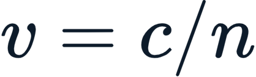, e o pulso faz o **caminho de ida e volta** ():

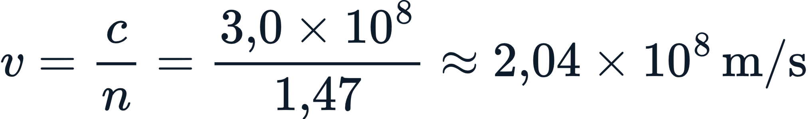

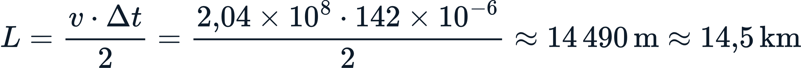

O sistema aponta a intrusão no **km ** do perímetro. Se a resolução espacial do equipamento é de , a equipe de segurança é despachada para um trecho de cerca bem definido — em vez de varrer 14 km de perímetro às cegas.

### Exemplo numérico: demanda de passageiros

Um aeroporto regional movimenta hoje **800.000 passageiros/ano** e cresce a uma taxa de **6% ao ano**. Quantos passageiros são esperados em **10 anos**? Usamos a projeção de crescimento geométrico:

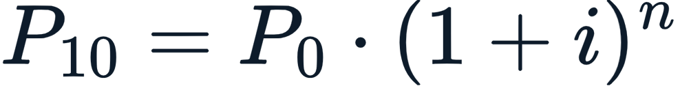

Com ,  e :

Para dimensionar o terminal, porém, não usamos o total anual, mas a **hora-pico de projeto (HPP)** — tipicamente entre  e  do movimento anual. Adotando :

É esse número — e não o anual — que dita o tamanho dos balcões de check-in e dos saguões.

### Atividade prática

Escolha um aeroporto que você conhece (pode ser Congonhas, Galeão ou o aeroporto da sua cidade). Pesquise no site da ANAC ou do operador: (1) o movimento anual de passageiros dos últimos 5 anos; (2) o código de referência OACI; (3) se possui plano diretor publicado. Em seguida, projete a demanda para daqui a 10 anos usando a taxa média histórica e estime a hora-pico de projeto. O terminal atual comportaria essa demanda?

### Pontos-chave

- O aeroporto é o **nó de solo** de um sistema aéreo integrado (aeronave + espaço aéreo + aeroporto + usuário), organizado em hubs e spokes.
- A **OACI** define padrões mundiais (Anexo 14); a **ANAC** os internaliza no Brasil via **RBAC 154**.
- O **código de referência** (número 1–4 + letra A–F) traduz o porte das aeronaves em parâmetros de projeto.
- O **plano diretor** planeja a expansão por 20 anos e protege áreas e o entorno.
- A divisão **lado ar × lado terra** organiza todo o projeto aeroportuário.
- O **A-CDM** (com AMAN/DMAN e IA de sequenciamento) otimiza pousos e decolagens em tempo real, cortando atraso, combustível e emissões — a camada digital da operação.
- A **segurança perimetral por DAS** usa fibra óptica como milhares de microfones virtuais, localizando intrusões em todo o perímetro pelo tempo de retorno do eco.

### Para saber mais

- **ANAC — RBAC 154 (Projeto de Aeródromos):** https://www.gov.br/anac/pt-br/assuntos/regulados/aeroportos-e-aerodromos/cadastro-publico/normas-do-setor/rbac-154
- **ICAO — Annex 14, Aerodromes:** https://www.icao.int/
- **HORONJEFF, R. et al.** *Planning and Design of Airports*. McGraw-Hill.
- **EUROCONTROL — Airport Collaborative Decision-Making (A-CDM):** https://www.eurocontrol.int/concept/airport-collaborative-decision-making
- **Wikipedia — Aeroporto Internacional de São Paulo/Guarulhos:** https://pt.wikipedia.org/wiki/Aeroporto_Internacional_de_S%C3%A3o_Paulo/Guarulhos

## Aula 9 — Roteiro da Videoaula 9: "Sistema aeroportuário e planejamento de aeroportos"

**Duração: 7 a 10 minutos**

### 1. Abertura (0:00 – 0:40)

> "Olá! Imagine que você precisa receber, em um único dia, mais de cem mil pessoas, centenas de aviões e milhares de toneladas de carga — com segurança absoluta. Esse é o desafio de um aeroporto. Na aula de hoje, vamos abrir a caixa-preta do sistema aeroportuário: quem regula, como se planeja e como o engenheiro civil entra nessa história."

### 2. Desenvolvimento — parte 1 (0:40 – 4:00)

> "O transporte aéreo é um sistema com quatro peças: a aeronave, o espaço aéreo, o aeroporto e o usuário. O aeroporto é onde tudo toca o chão. No Brasil temos mais de 2.500 aeródromos, mas poucos concentram o tráfego — é a lógica de hubs, como Guarulhos, e spokes, os regionais que os alimentam. E todo aeroporto é classificado: pela natureza do tráfego, pela função na rede, e principalmente pelo código de referência da OACI, que combina um número de 1 a 4 com uma letra de A a F. Esse código não é burocracia: ele define a largura da pista, as distâncias de segurança, o raio das curvas. Um aeroporto 4F atende o A380; um 4E atende o 777."

### 3. Desenvolvimento — parte 2 (4:00 – 7:00)

> "Quem manda nas regras? Três camadas. No topo, a OACI, agência da ONU, que publica o Anexo 14, a bíblia do projeto de aeródromos. No Brasil, a ANAC traduz isso no RBAC 154 — é esse o documento que você vai consultar na vida profissional. E há ainda o DECEA, que cuida do espaço aéreo, e os operadores: Infraero e as concessionárias privadas. Acima de tudo isso paira o Plano Diretor, que projeta a demanda e organiza a expansão por 20 anos. Sem plano diretor, o aeroporto constrói um terminal hoje onde a pista vai precisar crescer amanhã. Mas planejar é só metade: a outra metade é operar em tempo real. Hoje isso se faz com o A-CDM, uma plataforma em que aeroporto, companhias, handlers e controle compartilham dados de cada voo. Sobre ela rodam dois algoritmos — o AMAN, que ordena os pousos, e o DMAN, que ordena as decolagens —, cada vez mais com inteligência artificial. Sequenciar pousos e decolagens é um problema combinatório enorme, e a IA aprende a minimizar atraso, combustível e emissões."

### 4. Desenvolvimento — parte 3 (7:00 – 9:30)

> "Agora a divisão mais importante de todas: lado ar e lado terra. Lado ar é pista, taxiway, pátio — o mundo das aeronaves, restrito e controlado. Lado terra é o terminal, o estacionamento, as vias — o mundo das pessoas, público. A fronteira entre eles é o canal de inspeção de segurança no terminal e a cerca lá no perímetro. E proteger dezenas de quilômetros de cerca é um desafio: a solução moderna é o DAS, sensoriamento acústico distribuído. Um cabo de fibra óptica enterrado vira milhares de microfones virtuais. Alguém escala a cerca, a vibração deforma a fibra, e o tempo que o eco de luz leva para voltar diz exatamente em que metro do perímetro está o intruso. E como dimensionamos a infraestrutura? Pela demanda. Um aeroporto de 800 mil passageiros crescendo 6% ao ano chega a 1,4 milhão em dez anos. Mas o que dimensiona o terminal é a hora-pico de projeto — cerca de 0,04% do anual, uns 570 passageiros na hora cheia."

### 5. Encerramento (9:00 – 10:00)

> "Recapitulando: o aeroporto é o nó de solo de um sistema aéreo; a OACI e a ANAC ditam as regras pelo Anexo 14 e pelo RBAC 154; o plano diretor organiza o futuro por 20 anos; e tudo se divide entre lado ar e lado terra. Na próxima aula, vamos descer ao lado ar e entender a engenharia das pistas, dos pátios e da geometria aeroportuária — por que uma pista tem aquele número pintado nela e como se calcula o seu comprimento. Até lá!"

---

## Aula 10 — Lado ar: pistas, pátios e geometria aeroportuária

A pista é o coração do lado ar — a faixa de pavimento onde a aeronave acelera de zero a mais de  na decolagem, ou dissipa essa energia toda no pouso. Mas o lado ar é muito mais que a pista: é um conjunto coreografado de pistas, taxiways e pátios em que cada metro, cada ângulo e cada distância seguem normas rígidas da OACI. Nesta aula, você vai entender por que uma pista recebe um número pintado em sua cabeceira, como se decide seu comprimento, e como os auxílios à navegação permitem pousos seguros mesmo com visibilidade quase nula.

### Pistas de pouso e decolagem

A **pista** (*runway*) é uma área retangular destinada ao pouso e à decolagem. Suas dimensões dependem do código de referência: pistas de código 4 (as maiores) têm tipicamente ** de largura** e comprimentos entre  e . A pista é cercada por **faixas de segurança** (laterais e nas pontas, as *RESA — Runway End Safety Areas*), que absorvem eventuais saídas de pista. Aeroportos grandes podem ter pistas **paralelas** (como Guarulhos) para aumentar a capacidade, ou pistas que se cruzam.

### Taxiways e pátios

As **taxiways** (pistas de táxi) conectam a pista aos pátios. São mais estreitas que a pista e projetadas para baixa velocidade. Uma boa rede de taxiways tem **saídas rápidas** (*rapid exit taxiways*), com ângulos de 30°, que permitem à aeronave deixar a pista sem reduzir tanto a velocidade — liberando a pista mais rápido para o próximo pouso.

O **pátio** (*apron* ou *ramp*) é onde as aeronaves estacionam para embarque, desembarque, abastecimento e manutenção. Cada posição de estacionamento é um *gate*. O pátio precisa de espaço generoso: uma posição para um A320 ocupa cerca de , mais as faixas de circulação dos veículos de apoio.

### Geometria e orientação de pista

A pista é orientada segundo a direção do **vento predominante** — aviões pousam e decolam contra o vento, o que reduz a velocidade em relação ao solo e encurta a corrida. A **designação numérica** da pista vem do seu azimute magnético dividido por 10 e arredondado. Uma pista alinhada a  vira pista **09** de um lado e **27** do outro (sentido oposto, ). Os dois números de uma mesma pista sempre diferem de 18. Quando há pistas paralelas, acrescentam-se letras: **09L** (*left*), **09C** (*center*, em pistas triplas) e **09R** (*right*).

O alinhamento ótimo é definido pela **rosa dos ventos**, que cruza dados de direção e intensidade do vento. A OACI exige que a pista atenda a um **coeficiente de utilização de pelo menos 95%** — ou seja, o vento de través (*crosswind*) deve estar dentro do limite tolerável em pelo menos 95% do tempo.

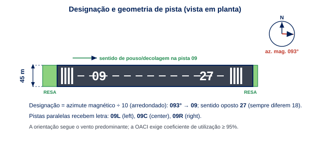

### Comprimento de pista e desempenho

O comprimento de pista é talvez o cálculo mais crítico do projeto. Parte-se do **comprimento básico** exigido pela aeronave-crítica em condições padrão (nível do mar, , pista horizontal) e aplicam-se **fatores de correção**, porque condições reais reduzem o desempenho do avião:

- **Altitude:** o ar rarefeito reduz a sustentação e o empuxo. Acrescenta-se **7% a cada ** de elevação.
- **Temperatura:** ar quente é menos denso. Acrescenta-se **1% a cada ** acima da temperatura padrão do local.
- **Rampa (declividade):** acrescenta-se **10% a cada 1%** de rampa ascendente efetiva.

### Auxílios à navegação aérea

Para pousar com segurança em qualquer condição, a aeronave conta com auxílios:

- **ILS (Instrument Landing System):** fornece guiamento de eixo (*localizer*) e de rampa de descida (*glide slope*) por rádio, permitindo aproximações em baixa visibilidade. Categorias CAT I, II e III (esta com pouso quase cego).
- **PAPI (Precision Approach Path Indicator):** luzes ao lado da pista que indicam visualmente se o avião está alto, baixo ou na rampa correta (vermelho/branco).
- **Balizamento luminoso:** luzes de cabeceira (verdes), de fim de pista (vermelhas) e de eixo.
- **VOR e GNSS (GPS):** auxílios de navegação em rota e aproximação.

### Exemplo numérico: comprimento de pista

Uma aeronave exige comprimento básico de **** em condições padrão. O aeroporto está a **** de altitude, com temperatura de referência **** e rampa de ****. A temperatura padrão ao nível do mar é , mas decresce  a cada ; a , a padrão local é .

**Correção de altitude** ( por ):

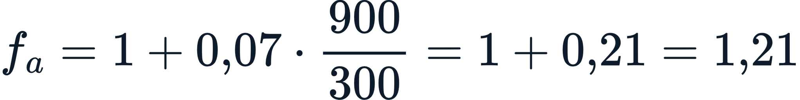

**Correção de temperatura** ( por  acima da padrão local; excesso ):

**Correção de rampa** ( por ):

O comprimento corrigido é o produto:

As condições adversas exigiram quase ** a mais** que o comprimento básico — uma diferença que pode inviabilizar operações de aeronaves grandes em aeroportos de altitude e clima quente.

### Atividade prática

Pegue os dados de duas aeronaves comerciais (por exemplo, um Embraer E195 e um Boeing 737 MAX) nos manuais ou em fontes confiáveis. Para um aeroporto fictício a  de altitude,  de temperatura de referência e  de rampa, calcule o comprimento de pista corrigido necessário para cada uma. Qual aeronave é a "crítica" (a que exige mais pista)? É ela que define o projeto.

### Pontos-chave

- A **pista** é dimensionada pelo código de referência; pistas código 4 têm cerca de  de largura.
- **Taxiways** conectam pista e pátio; saídas rápidas a 30° liberam a pista mais cedo.
- A **designação numérica** vem do azimute magnético /10; pistas paralelas recebem L/R.
- O **comprimento de pista** parte do básico e recebe correções de **altitude (7% por 300 m), temperatura (1% por °C) e rampa (10% por 1%)**.
- **ILS, PAPI e balizamento** garantem aproximação e pouso seguros mesmo em baixa visibilidade.

### Para saber mais

- **ICAO — Annex 14, Vol. I (Aerodrome Design and Operations):** https://www.icao.int/
- **FAA — AC 150/5300-13 (Airport Design):** https://www.faa.gov/airports/
- **ASHFORD, N.; MUMAYIZ, S.; WRIGHT, P.** *Airport Engineering: Planning, Design, and Development of 21st Century Airports*. Wiley.
- **Wikipedia — Runway:** https://en.wikipedia.org/wiki/Runway

## Aula 10 — Roteiro da Videoaula 10: "Lado ar: pistas, pátios e geometria aeroportuária"

**Duração: 7 a 10 minutos**

### 1. Abertura (0:00 – 0:40)

> "Você já reparou no número pintado na cabeceira de uma pista? Ou já se perguntou por que algumas pistas são enormes e outras curtas? Hoje vamos entrar no lado ar do aeroporto — o mundo das aeronaves — e desvendar a engenharia das pistas, dos pátios e dos auxílios que permitem pousar quase no escuro."

### 2. Desenvolvimento — parte 1 (0:40 – 4:00)

> "O lado ar tem três peças: pistas, taxiways e pátios. A pista é onde o avião acelera ou freia — código 4, uns 45 metros de largura, comprimento que varia muito. As taxiways são as ruas que ligam a pista ao pátio; as boas têm saídas rápidas a 30 graus, que liberam a pista mais cedo para o próximo pouso. E o pátio é o estacionamento das aeronaves, onde elas embarcam, abastecem, fazem manutenção. Cada posição é um gate, e ocupa muito espaço — uma posição de A320 são uns 50 por 40 metros."

### 3. Desenvolvimento — parte 2 (4:00 – 7:00)

> "Agora aquele número da pista. Ele vem do azimute magnético dividido por dez. Uma pista a 93 graus é a pista 09 de um lado e 27 do outro — sempre diferem de 18. E por que a pista aponta para aquela direção? Pelo vento. Avião pousa e decola contra o vento, e a OACI exige que a pista sirva em pelo menos 95% do tempo. Quando há duas paralelas, viram 09 Left e 09 Right. Tudo isso sai da rosa dos ventos, que cruza direção e intensidade."

### 4. Desenvolvimento — parte 3 (7:00 – 9:00)

> "E o comprimento? É o cálculo mais crítico. Parte do comprimento básico da aeronave em condições padrão e recebe três correções: altitude, mais 7% a cada 300 metros; temperatura, mais 1% por grau acima da padrão; e rampa, mais 10% por ponto percentual. Vejam o exemplo: uma pista de 2.400 metros básicos, num aeroporto a 900 metros de altitude e 30 graus, salta para quase 3.800 metros. São 1.400 metros a mais só por causa do calor e da altitude! E para pousar com segurança, entram os auxílios: o ILS guia o avião por rádio, o PAPI mostra com luzes se ele está alto ou baixo, e o balizamento ilumina a pista."

### 5. Encerramento (9:00 – 10:00)

> "Resumindo: a pista nasce do código de referência e do vento; as taxiways e o pátio completam o lado ar; o comprimento se corrige por altitude, temperatura e rampa; e o ILS, o PAPI e o balizamento garantem o pouso seguro. Mas como esse pavimento aguenta um avião de centenas de toneladas pousando sobre ele milhares de vezes? Essa é a aula de pavimentos aeroportuários — a nossa próxima. Te espero!"

---

## Aula 11 — Pavimentos aeroportuários e dimensionamento

Um Boeing 777 totalmente carregado pesa cerca de **** e toca a pista a mais de , transmitindo ao pavimento cargas concentradas dezenas de vezes maiores que as de um caminhão rodoviário. Multiplique isso por milhares de pousos por ano, e você entende por que pavimentos aeroportuários são uma especialidade própria da engenharia civil. Nesta aula, você vai aprender como as cargas das aeronaves chegam ao pavimento, como o engenheiro garante a compatibilidade entre avião e pista pelo método **ACN-PCN**, e como se dimensiona um pavimento aeroportuário pelo método da **FAA**.

### Cargas das aeronaves

A carga de uma aeronave não chega ao pavimento como um peso único: ela se distribui pelo **trem de pouso**. Um avião grande tem o peso dividido entre o trem de nariz e os trens principais, e cada trem principal pode ter múltiplas rodas em arranjos como *dual* (duas rodas), *dual tandem* (quatro rodas em duas filas) ou *dual tandem duplo* (o A380 tem trens com até seis rodas). Quanto mais rodas, mais distribuída a carga e menor a pressão por roda. Dois parâmetros importam:

- A **carga por roda**, que define o esforço pontual.
- A **pressão dos pneus**, que pode passar de  (14 atmosferas) e afeta as camadas superficiais.

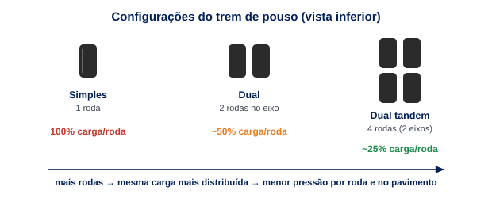

### O método ACN-PCN

Como saber se um avião pode operar em determinada pista sem danificá-la? A OACI criou um sistema simples e universal: o **ACN-PCN**.

- **ACN (Aircraft Classification Number):** número que expressa o efeito relativo de uma aeronave sobre o pavimento, para uma dada categoria de resistência do subleito. Cada aeronave tem seu ACN tabelado pelo fabricante.
- **PCN (Pavement Classification Number):** número que expressa a capacidade de suporte do pavimento.

A regra de ouro: **uma aeronave pode operar livremente se **. Se o ACN for maior, a operação é restrita ou proibida.

O PCN é publicado como um código de cinco partes, por exemplo **PCN 80/F/A/W/T**:

| Posição | Significado | Exemplo |
| --- | --- | --- |
| Número | Capacidade numérica | 80 |
| Tipo de pavimento | F = flexível, R = rígido | F |
| Resistência do subleito | A (alta) a D (baixa) | A |
| Pressão de pneu admissível | W (alta) a Z (limitada) | W |
| Método de avaliação | T = técnica, U = uso | T |

### Pavimentos flexíveis e rígidos em aeroportos

Como nas rodovias, há duas grandes famílias:

- **Pavimento flexível** (asfáltico): camadas de revestimento betuminoso sobre base e sub-base granulares. Distribui a carga gradualmente; mais fácil de reparar; comum em taxiways e pistas. Sofre com **deformação permanente** (afundamento de trilha de roda) sob altas temperaturas e cargas pesadas.
- **Pavimento rígido** (concreto de cimento Portland): placas de concreto que trabalham por **flexão**, distribuindo a carga em grande área. Mais durável, ideal para **pátios** (onde aeronaves ficam paradas, abastecidas, sob carga estática prolongada) e cabeceiras. Mais caro e lento de executar.

É comum um mesmo aeroporto combinar os dois: pista flexível, pátio rígido.

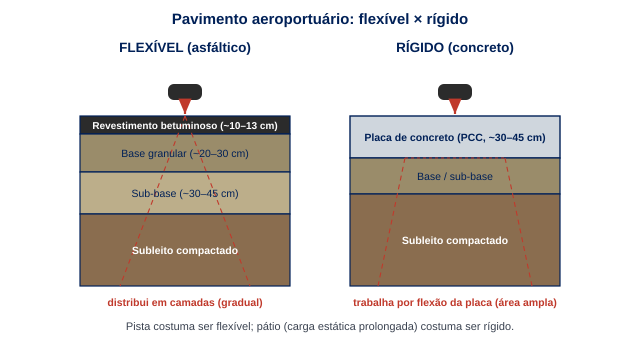

### Dimensionamento (método FAA)

O método mais usado mundialmente é o da **FAA** (administração da aviação dos EUA), hoje implementado no software **FAARFIELD**, baseado em mecânica de pavimentos (teoria de camadas elásticas e elementos finitos). O dimensionamento considera:

1. O **mix de tráfego** — todas as aeronaves que vão operar, com seus pesos e número de pousos anuais.
2. A conversão de todas elas em **decolagens anuais equivalentes** de uma aeronave de projeto.
3. A resistência do subleito (medida pelo **CBR** em flexíveis ou pelo **módulo de reação ** em rígidos).
4. O **período de projeto** (tipicamente 20 anos).

O resultado é a espessura de cada camada. O conceito-chave é a **acumulação de dano por fadiga**: cada passagem de aeronave consome uma fração da vida do pavimento.

### Manutenção de pavimentos

Pavimentos aeroportuários exigem manutenção rigorosa, pois um defeito pode gerar **FOD** (*Foreign Object Debris*) — fragmentos que, sugados por turbinas, causam acidentes graves. As inspeções usam o índice **PCI (Pavement Condition Index)**, de 0 a 100, que classifica o pavimento de "falho" a "excelente" a partir do levantamento visual de defeitos (trincas, panelas, escamação). A manutenção pode ser preventiva (selagem de trincas, *grooving* para drenagem) ou de reabilitação (recapeamento, reconstrução).

### Exemplo numérico: relação PCN × ACN

Uma pista tem **PCN 60/F/B/X/T**. Três aeronaves desejam operar, com os seguintes ACN (para subleito categoria B, pavimento flexível):

| Aeronave | ACN | ? | Situação |
| --- | --- | --- | --- |
| Embraer E195 | 28 |  ✔ | Operação livre |
| Boeing 737-800 | 47 |  ✔ | Operação livre |
| Boeing 767-300 | 68 |  ✘ | Operação restrita |

O B767-300, com , **excede a capacidade** em:

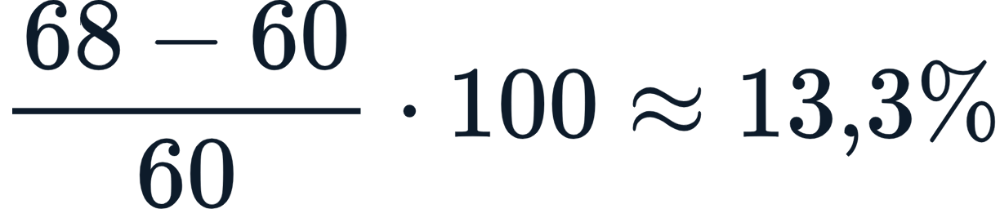

Operações eventuais (poucos pousos por ano) podem ser autorizadas sob critério do operador, mas o uso regular aceleraria a fadiga do pavimento. Para liberar essa aeronave de forma plena, seria preciso **reforçar o pavimento** até elevar o PCN a pelo menos 68.

### Pausa para reflexão (Desafio)

Pense no seguinte dilema de engenharia e gestão: um aeroporto regional com pista **PCN 50** recebe uma proposta de uma companhia para operar uma rota lucrativa com uma aeronave de **ACN 62**. Reforçar a pista custaria  milhões e levaria 8 meses, com fechamento parcial. O operador pode (a) recusar a rota, (b) autorizar operações restritas (poucas frequências) monitorando o pavimento, ou (c) investir no reforço. Quais variáveis você colocaria na balança — receita da rota, vida útil residual do pavimento, risco de FOD, custo de oportunidade do fechamento? Não há resposta única: justifique a sua.

### Atividade prática

Consulte a publicação de informações aeronáuticas (AIP Brasil, do DECEA) ou cartas de aeródromo e anote o **PCN** de dois aeroportos brasileiros. Em seguida, busque os valores de **ACN** de três aeronaves comuns na malha nacional (E195, A320neo, B737 MAX). Monte uma tabela cruzando ACN × PCN e identifique quais aeronaves operam livremente e quais teriam restrição em cada aeroporto.

### Pontos-chave

- A carga da aeronave chega ao pavimento pelo **trem de pouso**; mais rodas = carga mais distribuída.
- O método **ACN-PCN** é a regra universal de compatibilidade: opera-se livremente se ****.
- O **PCN** é um código de 5 partes (número/tipo/subleito/pressão/método).
- Pavimentos **flexíveis** dominam pistas; **rígidos** dominam pátios (carga estática prolongada).
- O dimensionamento **FAA (FAARFIELD)** converte o tráfego em decolagens equivalentes e acumula dano por fadiga ao longo de ~20 anos.

### Para saber mais

- **FAA — AC 150/5320-6 (Airport Pavement Design) e FAARFIELD:** https://www.faa.gov/airports/engineering/pavement_design/
- **ICAO — ACN-PCN Method (Doc 9157, Aerodrome Design Manual, Part 3 — Pavements):** https://www.icao.int/
- **YODER, E. J.; WITCZAK, M. W.** *Principles of Pavement Design*. Wiley.
- **Wikipedia — Pavement classification number:** https://en.wikipedia.org/wiki/Pavement_classification_number

## Aula 11 — Roteiro da Videoaula 11: "Pavimentos aeroportuários e dimensionamento"

**Duração: 7 a 10 minutos**

### 1. Abertura (0:00 – 0:40)

> "Um Boeing 777 pesa 350 toneladas e pousa a mais de 250 quilômetros por hora. Agora imagine isso acontecendo milhares de vezes por ano, sempre no mesmo pavimento. Como é que o concreto e o asfalto aguentam? Hoje a gente entra na engenharia dos pavimentos aeroportuários — e descobre o método que decide se um avião pode ou não pousar numa pista."

### 2. Desenvolvimento — parte 1 (0:40 – 4:00)

> "Primeiro, como a carga chega ao pavimento. Não é um peso só: ela se reparte pelo trem de pouso. O trem de nariz, os trens principais, cada um com várias rodas — dual, dual tandem, e por aí vai. Quanto mais rodas, mais a carga se distribui e menor a pressão em cada ponto. E entram dois parâmetros: a carga por roda e a pressão dos pneus, que pode passar de 14 atmosferas. É essa combinação que castiga o pavimento."

### 3. Desenvolvimento — parte 2 (4:00 – 7:00)

> "Agora o coração da aula: o método ACN-PCN. A OACI criou dois números. O ACN mede o quanto a aeronave agride o pavimento. O PCN mede o quanto o pavimento aguenta. A regra é simples: se o ACN é menor ou igual ao PCN, o avião opera livremente. Se é maior, a operação é restrita. O PCN vem num código de cinco partes — número, tipo de pavimento, resistência do subleito, pressão de pneu, método de avaliação. Vejam o exemplo: numa pista PCN 60, o E195 com ACN 28 e o 737 com ACN 47 operam à vontade. Mas o 767, com ACN 68, excede em 13% — operação restrita."

### 4. Desenvolvimento — parte 3 (7:00 – 9:00)

> "E como se projeta esse pavimento? Há duas famílias: o flexível, de asfalto, que domina as pistas e se deforma sob calor; e o rígido, de concreto, que trabalha por flexão e é ideal para os pátios, onde o avião fica parado e carregado por horas. O método mais usado é o da FAA, hoje no software FAARFIELD: ele pega todo o mix de tráfego, converte em decolagens equivalentes, considera o subleito e o período de 20 anos, e calcula a espessura de cada camada — sempre pensando em fadiga, porque cada pouso consome um pedacinho da vida da pista. E nunca esqueçam da manutenção: uma trinca vira FOD, e FOD sugado por uma turbina é tragédia."

### 5. Encerramento (9:00 – 10:00)

> "Fechando: a carga vem pelo trem de pouso; o ACN-PCN decide a compatibilidade; pavimento flexível para pista, rígido para pátio; e o método FAA dimensiona pela fadiga acumulada em 20 anos. Pensem no desafio que deixei: vale a pena reforçar uma pista por 40 milhões para ganhar uma rota? Na próxima aula, atravessamos a fronteira e vamos para o lado terra — terminais de passageiros, fluxos e carga aérea. Te espero!"

---

## Aula 12 — Lado terra: terminais de passageiros e carga aérea

Se o lado ar é o domínio das aeronaves, o lado terra é o domínio das **pessoas**. O terminal de passageiros é o cartão de visitas do aeroporto e a parte que o público enxerga: filas de check-in, esteiras de bagagem, lojas, salas de embarque, controles de segurança. Projetar um terminal é coreografar fluxos de milhares de pessoas por hora, evitando gargalos e garantindo conforto. Nesta aula, que fecha a Unidade 3, você vai entender como se organiza o **TPS**, como se medem os **níveis de serviço** da IATA, como funciona a **carga aérea** e como o aeroporto se conecta à cidade.

### O terminal de passageiros (TPS)

O **Terminal de Passageiros (TPS)** é a edificação que processa o passageiro entre o acesso terrestre e a aeronave. Existem diferentes **configurações arquitetônicas**:

- **Linear/frontal:** terminal reto com aeronaves estacionadas à frente (simples, bom para aeroportos médios).
- **Píer (*finger*):** corredores que avançam para o pátio, com gates nas laterais (GRU usa).
- **Satélite:** um corpo central conectado a edifícios-satélite por túneis ou *people movers*.
- **Transporter:** sem contato direto; ônibus levam o passageiro até a aeronave (econômico, comum em low-cost).

### Fluxos de passageiros e de bagagem

O segredo de um bom terminal é separar e ordenar os fluxos. O **fluxo de embarque (saída)** segue uma sequência clássica:

O **fluxo de desembarque (chegada)** percorre o caminho inverso, somando, nos voos internacionais, a **imigração** e a **alfândega**. Esses fluxos **não devem se cruzar** — daí o uso de pavimentos diferentes (chegadas embaixo, partidas em cima, em muitos aeroportos).

Paralelamente corre o **fluxo de bagagem**, processado por um sistema automatizado (BHS — *Baggage Handling System*) que leva as malas do check-in à aeronave (saída) e da aeronave à esteira de restituição (chegada), com triagem por raio-X e leitura de etiquetas.

### Níveis de serviço (IATA)

A **IATA** (associação internacional das companhias aéreas) publica, no *Airport Development Reference Manual* (ADRM), padrões de dimensionamento baseados em **níveis de serviço** e em **áreas por passageiro** e **tempos de espera**. O conceito atual de **LoS (Level of Service)** define três faixas:

| Nível | Significado | Espaço/conforto |
| --- | --- | --- |
| **Over-design** | Superdimensionado | Espaço ocioso, custo alto |
| **Optimum** | Ótimo | Conforto e custo equilibrados (alvo de projeto) |
| **Sub-optimum** | Subdimensionado | Aglomeração, filas, desconforto |

Por exemplo, a área recomendada para um passageiro na sala de embarque em nível ótimo gira em torno de ** a 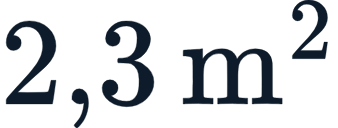 por pessoa**, e o tempo de fila no check-in deve ficar abaixo de poucos minutos. Como referência de projeto (IATA ADRM, nível ótimo — ordem de grandeza):

| Ambiente | Área por passageiro (ótimo) | Espera de referência |
| --- | --- | --- |
| Saguão de check-in |  | fila  poucos minutos |
| Inspeção de segurança |  |  |
| Sala de embarque (gate) |  | permanência  |
| Restituição de bagagem |  |  tempo de chegada das malas |

### Simulação preditiva de fluxos de passageiros (IA)

Dimensionar um saguão por área-por-passageiro (como faremos no exemplo numérico) é o método estático clássico. Mas o terminal é um **sistema dinâmico**: as pessoas chegam em rajadas (um voo de 300 lugares despeja seus passageiros na imigração de uma só vez), formam filas, são atendidas e seguem adiante. Para projetar e operar terminais modernos, a engenharia usa **modelos de simulação** que preveem onde e quando os gargalos vão se formar.

Há duas grandes famílias de modelos:

- **Teoria de filas:** cada estação de serviço (check-in, inspeção, imigração) é modelada como uma fila. Um balcão de imigração com  guichês idênticos, chegadas aleatórias (Poisson) à taxa  e atendimento à taxa  por guichê é um sistema **M/M/c**. A teoria fornece, em fórmula fechada, o tempo médio de espera e o tamanho da fila — e, crucialmente, mostra que à medida que a **utilização** 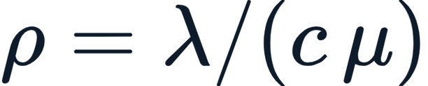 se aproxima de , a fila **explode de forma não linear**. É por isso que um pequeno aumento de demanda na hora-pico vira uma fila gigantesca.
- **Modelos baseados em agentes (ABM):** cada passageiro é um "agente" de software com características próprias (velocidade, bagagem, se é família, se vai à loja) que se move pela planta do terminal. Rodando milhares de agentes, simula-se o terminal inteiro e medem-se tamanho de fila, tempo de permanência e ocupação instantânea de cada ambiente — algo que a fórmula fechada não captura.

A camada de **inteligência artificial** entra de dois modos. Primeiro, na **previsão de picos**: modelos de *machine learning* aprendem com o histórico de voos, antecedência de chegada dos passageiros, dia da semana e sazonalidade para **prever a curva de chegada** ao terminal hora a hora. Segundo, na **otimização operacional**: alimentado por essa previsão e por câmeras que contam pessoas nas filas em tempo real, o sistema recomenda **abrir ou fechar guichês de check-in e canais de inspeção dinamicamente**, mantendo o tempo de espera dentro do nível de serviço-alvo da IATA sem superdimensionar a equipe. É o mesmo raciocínio do A-CDM da Aula 9, agora aplicado às pessoas em vez das aeronaves: dados em tempo real alimentando uma decisão de alocação de recursos.

#### Mini-exemplo (fila M/M/c): quantos guichês na imigração?

Na hora-pico,  passageiros/hora chegam à imigração e cada guichê processa  passageiros/hora. Para a fila ser **estável**, a utilização precisa ficar abaixo de 1: é necessário  tal que 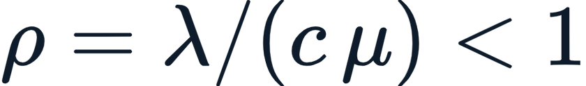, ou seja, . O mínimo teórico é **7 guichês**, mas com  a utilização é  — alta demais, e a fila ainda seria longa e instável. Por isso, na prática, dimensiona-se com **folga** ( ou , ) — exatamente a margem que a simulação preditiva ajuda a calibrar para cada hora do dia.

### Terminal de carga aérea

A carga aérea move mercadorias de **alto valor e urgência** (eletrônicos, fármacos, peças, perecíveis). Embora represente uma fração do peso do comércio mundial, responde por parcela expressiva do **valor**. O **TECA (Terminal de Carga)** processa importação e exportação, com áreas alfandegadas, câmaras frias, armazéns e a interface com aeronaves cargueiras ou os porões de aviões de passageiros (*belly cargo*). Hubs de carga como Viracopos (Campinas) são estratégicos para a economia. A carga é unitizada em **ULD (Unit Load Devices)** — contêineres e paletes próprios para o formato dos porões.

### Acessos e integração modal

Um aeroporto só funciona se as pessoas chegam a ele. O **acesso terrestre** precisa absorver a hora-pico de passageiros somada a acompanhantes e funcionários. As soluções incluem:

- **Vias e meios-fios (*curbside*)** dimensionados para embarque/desembarque de veículos.
- **Estacionamentos** rotativos e de longa permanência.
- **Transporte público:** ônibus, BRT e, idealmente, **conexão ferroviária/metroviária** (como o trem que liga GRU à malha da CPTM). A integração modal reduz congestionamento e é tendência mundial.

### Monitoramento visual inteligente de pátios e pistas (visão computacional)

Voltando por um instante ao lado ar — mas agora com olhar digital: o pátio e a pista são ambientes de **risco altíssimo**, e a vigilância humana não dá conta de monitorá-los continuamente. A tecnologia que está se consolidando é a **visão computacional** — câmeras de alta resolução (ópticas, térmicas, às vezes apoiadas por radar e LiDAR) cujo vídeo é processado por redes neurais de **detecção de objetos**, da família **YOLO** (*You Only Look Once*) e dos *vision transformers*. Três aplicações são centrais:

- **Detecção de FOD (*Foreign Object Debris*):** lembre da Aula 11 — um parafuso ou fragmento de pavimento sugado por uma turbina causa acidentes graves. Sistemas de câmeras instaladas ao longo da pista (ou drones de inspeção) detectam automaticamente um objeto estranho, classificam-no e **localizam-no com precisão**, emitindo alerta para a torre em **menos de 10 segundos** — contra os longos minutos de uma inspeção manual ("*runway walk*"). Aeroportos como Narita (Tóquio) e Schiphol (Amsterdã) já operam FOD detection fixo.
- **Detecção de intrusão:** complementando o DAS de perímetro (Aula 9), a visão computacional detecta pessoas, veículos ou **fauna** (o risco de colisão com aves e mamíferos, o *wildlife strike*) invadindo a área operacional.
- **Rastreamento (*tracking*) de pátio:** o sistema acompanha aeronaves e veículos de apoio no pátio, alimentando o **A-SMGCS** e o A-CDM com a posição real de cada ator — útil para evitar conflitos de solo e medir tempos de *turnaround*.

#### Exemplo numérico: cobertura de câmeras na pista

Uma pista de  deve ser monitorada por câmeras fixas para detecção de FOD. Cada câmera tem alcance útil de detecção confiável de **** ao longo do eixo. Quantas câmeras são necessárias por borda da pista?

Cobrindo as **duas bordas**, são  câmeras. Suponha que cada câmera entregue  quadros por segundo e a rede neural precise de  por quadro para inferência: a taxa máxima de processamento por câmera é  — **abaixo** dos  gerados. Conclusão de engenharia: ou se reduz a taxa de amostragem para  (suficiente para FOD estático), ou se usa *hardware* de borda mais potente (GPU/Jetson) para não perder quadros. É a típica negociação entre cobertura, latência e custo computacional de um sistema de visão em tempo real.

### Exemplo numérico: dimensionamento de saguão

Dimensione a área do **saguão de embarque** para uma hora-pico de **600 passageiros**. Adotamos: tempo médio de permanência de **40 minutos**, fator de acompanhantes de **1,3** (cada passageiro traz, em média, 0,3 acompanhante) e área por pessoa de **** (nível de serviço ótimo da IATA).

Primeiro, o número de pessoas **simultaneamente presentes** no saguão. Se 600 passageiros chegam ao longo da hora e cada um permanece 40 min ( da hora), a ocupação simultânea de passageiros é:

Somando os acompanhantes:

Aplicando a área por pessoa:

O saguão de embarque precisa de aproximadamente **** úteis para atender ao nível de serviço ótimo. Se o conforto-alvo fosse reduzido para /pessoa (subótimo), a área cairia para  — economia de obra ao custo de mais aglomeração.

### Atividade prática

Visite (presencialmente ou pelo Google Maps/Street View) um terminal de passageiros e identifique sua **configuração arquitetônica** (linear, píer, satélite ou transporter). Depois, percorra mentalmente o fluxo de embarque e marque onde estão os pontos de potencial gargalo (check-in, segurança, embarque). Por fim, dimensione a área de saguão necessária para uma hora-pico estimada usando o método do exemplo. Compare com o que você observou: o terminal parece super, sub ou bem dimensionado?

### Pontos-chave

- O **TPS** processa o passageiro entre acesso e aeronave; configurações: linear, píer, satélite, transporter.
- Os **fluxos** de embarque e desembarque (e o de bagagem, via BHS) **não devem se cruzar**.
- A **IATA (ADRM)** define **níveis de serviço** (over/optimum/sub) por área-por-passageiro e tempo de espera.
- A **simulação preditiva** (filas M/M/c + modelos de agentes + IA de previsão de picos) antecipa gargalos e dimensiona dinamicamente check-in, inspeção e imigração.
- A **visão computacional** (redes YOLO) monitora pátios e pistas: detecção de FOD em <10 s, intrusão/fauna e rastreamento de solo, alimentando o A-SMGCS.
- A **carga aérea** (TECA, ULD) move pouco peso mas alto valor; hubs como Viracopos são estratégicos.
- O **acesso terrestre** e a **integração modal** (trem/metrô) são essenciais para o aeroporto funcionar.

### Para saber mais

- **IATA — Airport Development Reference Manual (ADRM):** https://www.iata.org/en/publications/store/airport-development-reference-manual/
- **ANAC — Infraestrutura aeroportuária:** https://www.gov.br/anac/pt-br/assuntos/regulados/aeroportos-e-aerodromos/cadastro-publico/normas-do-setor/rbac-154
- **HORONJEFF, R. et al.** *Planning and Design of Airports* (cap. sobre terminais). McGraw-Hill.
- **MDPI — A Review of Foreign Object Debris Detection on Airport Runways: Sensors and Algorithms:** https://www.mdpi.com/2072-4292/17/2/225
- **Wikipedia — Airport terminal:** https://en.wikipedia.org/wiki/Airport_terminal

### O que você verá na próxima unidade

Encerramos os aeroportos e, na **Unidade 4 — Ferrovias**, voltamos ao chão para percorrer trilhos. Você vai conhecer a história e a geometria da via férrea (bitola, superelevação, traçado), a **superestrutura** (trilhos, dormentes, lastro) e a **infraestrutura** ferroviária, o **material rodante** e a tração, e os sistemas de **sinalização e operação**, com olhar para o cenário brasileiro — das ferrovias de carga (Carajás, malha da Rumo) aos trens urbanos e ao debate sobre alta velocidade. Se nos aeroportos a palavra-chave foi *desempenho da aeronave*, nas ferrovias será *capacidade e eficiência energética* do modo mais econômico para grandes volumes em longas distâncias.

## Aula 12 — Roteiro da Videoaula 12: "Lado terra: terminais de passageiros e carga aérea"

**Duração: 7 a 10 minutos**

### 1. Abertura (0:00 – 0:40)

> "Atravessamos a fronteira do aeroporto. Saímos do mundo das aeronaves e entramos no mundo das pessoas: o lado terra. É aqui que você faz check-in, passa pela segurança, espera o embarque. Hoje vamos entender como se projeta um terminal de passageiros, como se mede a qualidade do atendimento e como funciona a carga aérea."

### 2. Desenvolvimento — parte 1 (0:40 – 4:00)

> "O terminal de passageiros, o TPS, processa você entre o acesso terrestre e o avião. Há vários formatos: o linear, simples; o píer, com aqueles corredores que avançam para o pátio, como em Guarulhos; o satélite, com edifícios conectados por túneis; e o transporter, em que um ônibus te leva até o avião. E o coração do projeto é o fluxo: embarque vai do acesso ao check-in, à segurança, ao embarque, ao avião; desembarque é o caminho inverso, com imigração e alfândega nos internacionais. A regra de ouro: os fluxos não podem se cruzar. E paralelo a tudo isso corre a bagagem, no sistema automatizado BHS."

### 3. Desenvolvimento — parte 2 (4:00 – 7:00)

> "Como saber se o terminal está bem dimensionado? A IATA criou os níveis de serviço, no manual ADRM. Três faixas: superdimensionado, que desperdiça dinheiro; ótimo, o alvo, com conforto e custo equilibrados; e subdimensionado, com filas e aglomeração. Tudo medido em metros quadrados por passageiro e tempo de espera. Na sala de embarque, o ótimo gira em torno de 2 metros quadrados por pessoa. Mas medir por área é o método estático. O terminal é dinâmico: as pessoas chegam em rajadas, formam filas, são atendidas. Por isso usamos simulação. Teoria de filas: cada balcão é uma fila M/M/c, e quando a utilização chega perto de 100%, a fila explode de forma não linear. E modelos de agentes, em que cada passageiro é um software que anda pela planta. Por cima, a inteligência artificial prevê a curva de chegada hora a hora e recomenda abrir ou fechar guichês em tempo real — o mesmo A-CDM da aula 9, agora aplicado às pessoas. E tem ainda a carga aérea: o TECA processa importação e exportação, em ULDs, aqueles contêineres dos porões. Pouco peso, muito valor. Viracopos é um hub de carga estratégico para o Brasil."

### 4. Desenvolvimento — parte 3 (7:00 – 9:30)

> "Vamos dimensionar um saguão pelo método estático. Hora-pico de 600 passageiros, cada um ficando 40 minutos, com acompanhantes e 2 metros quadrados por pessoa. Quem está simultaneamente no saguão? 600 vezes 40 sobre 60, dá 400 passageiros. Com acompanhantes, vezes 1,3, são 520 pessoas. Vezes 2 metros quadrados: 1.040 metros quadrados de saguão. E o aeroporto precisa que as pessoas cheguem a ele: por isso o acesso terrestre e a integração modal — meio-fio, estacionamento, ônibus e, o ideal, trem ou metrô, como a conexão de Guarulhos com a CPTM. Antes de fechar, um salto digital de volta ao lado ar: a visão computacional. Câmeras com redes neurais, da família YOLO, vigiam pista e pátio. Detectam um FOD — aquele fragmento que pode destruir uma turbina — em menos de 10 segundos, contra minutos de uma inspeção a pé. Detectam intrusão e fauna invadindo a pista. E rastreiam aeronaves e veículos no pátio, alimentando o A-CDM. Uma pista de 3 quilômetros, com câmeras de 250 metros de alcance, pede 12 câmeras por borda."

### 5. Encerramento (9:30 – 10:30)

> "Fechamos a Unidade 3. Você agora entende o aeroporto inteiro: o sistema e o planejamento, o lado ar com pistas e geometria, os pavimentos e o ACN-PCN, e o lado terra com terminais, fluxos e carga aérea — tudo atravessado pela camada digital, do A-CDM à simulação de filas e à visão computacional que torna o aeroporto inteligente. Na próxima unidade descemos ao chão — mas sobre trilhos. Ferrovias: o modo mais eficiente para mover muito volume por longas distâncias. Te espero lá!"

---

## Quiz não avaliativo

### Questão 1

Sobre o sistema **ACN-PCN** usado para avaliar a compatibilidade entre aeronaves e pavimentos aeroportuários, assinale a alternativa **correta**:

- [ ] a. Uma aeronave pode operar livremente em uma pista somente quando o seu ACN for **maior** que o PCN do pavimento.
- [x] b. Uma aeronave opera livremente quando ; o ACN mede o efeito da aeronave sobre o pavimento e o PCN mede a capacidade de suporte do pavimento.
- [ ] c. O ACN é uma propriedade do pavimento, e o PCN é uma propriedade da aeronave.
- [ ] d. O método ACN-PCN substitui o cálculo de comprimento de pista e dispensa o conhecimento das cargas do trem de pouso.

**Resposta correta:** `b`

**Feedback:** A alternativa (b) descreve corretamente a regra universal da OACI: opera-se livremente quando o ACN da aeronave é menor ou igual ao PCN do pavimento. A (a) inverte a regra (ACN maior significa operação restrita ou proibida). A (c) troca as definições: o ACN é da aeronave e o PCN é do pavimento. A (d) é falsa — ACN-PCN trata de capacidade estrutural do pavimento, não de comprimento de pista, e depende justamente das cargas do trem de pouso.

### Questão 2

A respeito do **comprimento de pista** e suas correções, assinale a alternativa **correta**:

- [ ] a. O comprimento de pista independe da altitude e da temperatura do aeroporto.
- [ ] b. Em altitudes elevadas e temperaturas altas, o comprimento de pista necessário **diminui**, pois o ar quente facilita a decolagem.
- [x] c. Parte-se do comprimento básico e aplicam-se fatores de correção; aumenta-se cerca de 7% a cada  de altitude, 1% por  acima da temperatura padrão local e 10% a cada 1% de rampa.
- [ ] d. A orientação da pista segue a direção da via de acesso ao aeroporto, e não a do vento predominante.

**Resposta correta:** `c`

**Feedback:** A alternativa (c) resume corretamente o método de correção do comprimento de pista. A (a) e a (b) estão erradas: ar rarefeito (altitude) e ar quente (temperatura) reduzem a sustentação e o empuxo, exigindo **mais** pista, não menos. A (d) é falsa — a pista se orienta pelo **vento predominante**, pois as aeronaves pousam e decolam contra o vento.

---

## Atividade Verificadora (AAI — Atividade Avaliativa Individual)

**Pergunta:**

> Um município de porte médio possui um aeroporto regional com **pista de ** e **PCN 45/F/B/X/T**, hoje operando apenas aeronaves turboélice e jatos regionais. A prefeitura, em parceria com uma concessionária, deseja **atrair voos diretos para um hub internacional**, o que exigiria operar aeronaves narrow-body de maior porte (por exemplo, um Boeing 737 MAX com ACN próximo de 55 e comprimento básico de pista de cerca de  em condições padrão). O aeroporto está a ** de altitude**, com temperatura de referência de **** e rampa desprezível.
>
> Como engenheiro(a) responsável, estruture um parecer técnico em três partes:
>
> 1. **Lado ar — pista:** o comprimento atual é suficiente? Calcule o comprimento corrigido necessário e indique se há necessidade de alongamento.
> 2. **Pavimento — ACN/PCN:** a pista suporta estruturalmente a nova aeronave? O que precisaria ser feito?
> 3. **Lado terra:** que adequações o terminal e os acessos exigiriam para absorver o novo fluxo internacional?

**Resposta esperada:**

> Uma resposta de qualidade desenvolve as três frentes com cálculos e raciocínio de engenharia.
>
> **(1) Comprimento de pista:** a partir do básico de , aplica-se a correção de altitude ( por ): . Para a temperatura, a padrão local a  é cerca de , então o excesso é , dando . Rampa desprezível (). O comprimento corrigido é . Conclusão: a pista de  é **insuficiente**; seria necessário alongá-la em mais de  (ou impor restrição de peso/payload à aeronave). A resposta deve reconhecer altitude e calor como fatores críticos.
>
> **(2) Pavimento:** com , a aeronave **excede** a capacidade estrutural em cerca de ; operação regular não é permitida sem **reforço do pavimento** para elevar o PCN a pelo menos 55 (recapeamento/reconstrução de camadas), ou operações eventuais restritas com monitoramento por PCI. Deve mencionar o risco de fadiga acelerada.
>
> **(3) Lado terra:** voos internacionais exigem **áreas alfandegadas** (imigração, alfândega, vigilância sanitária), ampliação do TPS e dos saguões para a nova hora-pico (dimensionada por nível de serviço IATA), separação rigorosa de fluxos chegada/partida, e reforço de acessos/estacionamento e, idealmente, transporte público.
>
> A excelência da resposta está em **integrar as três dimensões** (não basta a pista ser longa se o pavimento não aguenta, nem adianta o lado ar se o terminal não processa internacional) e em **quantificar** ao menos o comprimento corrigido e a folga ACN-PCN, terminando com uma recomendação realista (investir em fases, priorizar pista + pavimento e depois terminal, considerar parceria/concessão).

---

## Material complementar

### Direto da fonte — livro da Biblioteca Virtual

> Este é o livro de referência mundial em planejamento e projeto de aeroportos e o que mais se aproxima do coração da Unidade 3. Horonjeff e colaboradores percorrem exatamente a trilha das nossas quatro aulas: o sistema e o planejamento aeroportuário, a geometria do lado ar, os pavimentos e o ACN-PCN, e o projeto de terminais de passageiros e carga. É a leitura definitiva para aprofundar cada cálculo que vimos.

- **Nome do livro:** *Planning and Design of Airports* (5ª edição)
- **Capítulo:** Capítulos sobre *Airport System Planning*, *Geometric Design of the Airfield* e *Airport Terminals*
- **Organizador:** Robert Horonjeff, Francis X. McKelvey, William J. Sproule, Seth B. Young
- **Editora:** McGraw-Hill Education
- **Link de acesso (BV):** https://plataforma.bvirtual.com.br/
- **Aula em que entra:** Aulas 9 a 12

### Para mergulhar no assunto

> Recomendo a série documental **"Megaestruturas / Megastructures"** (National Geographic), em especial os episódios sobre grandes aeroportos como o de Hong Kong (Chek Lap Kok) e Dubai. Mostram, em escala real, a engenharia de pistas, pátios e terminais que estudamos — útil para visualizar como os conceitos se materializam em obras gigantescas. Trechos estão disponíveis no YouTube.

- **Link(s):** https://www.youtube.com/watch?v=NXeI7Bfg5rY
- **Aula em que entra:** Aulas 9 e 12

### Podcast (curadoria, até 45 min)

> O canal **Aviões e Músicas**, de Lito Sousa, é uma das maiores referências brasileiras em aviação no YouTube. Os vídeos sobre infraestrutura aeroportuária, pistas e operações ajudam a fixar os conceitos das aulas com linguagem acessível e exemplos do dia a dia da aviação brasileira.

- **Nome do podcast/canal:** Aviões e Músicas (Lito Sousa)
- **Tema recomendado:** Como funciona uma pista de aeroporto / infraestrutura aeroportuária
- **Link:** https://www.youtube.com/@AvioeseMusicas (YouTube)
- **Aula em que entra:** Aulas 9 e 10

### Artigo científico

> Artigo de estado da arte sobre **revestimentos asfálticos de pavimentos aeroportuários**: revisa as misturas empregadas em pistas e taxiways (concreto asfáltico Marshall com ranhuras, *stone mastic asphalt*), os esforços impostos pelas aeronaves e os principais mecanismos de defeito do pavimento flexível. Complementa a Aula 11 ao aprofundar o dimensionamento e a manutenção da camada de revestimento.

- **Link:** https://doi.org/10.1016/j.ijprt.2017.07.008 (DOI)
- **Aula em que entra:** Aula 11
- **Referência bibliográfica do artigo no formato ABNT:**
  > WHITE, Greg. **State of the art: asphalt for airport pavement surfacing**. *International Journal of Pavement Research and Technology*, v. 11, n. 1, p. 77-98, jan. 2018.
