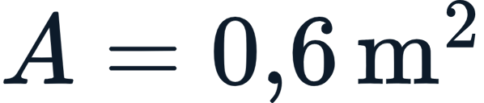
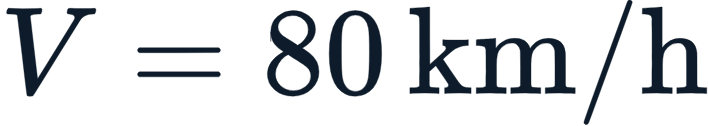
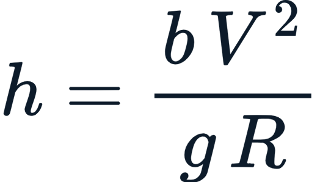
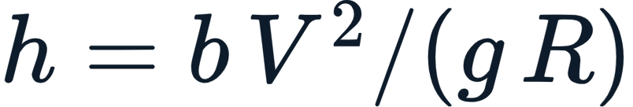
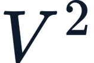
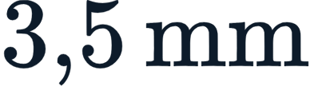

# Questionário — Unidade 4

- **Disciplina:** Portos, Aeroportos e Ferrovias
- **Professor-conteudista:** Afonso Cesar Lelis Brandão

## Orientações

- **20 questões** padrão ENADE: **10 asserção-razão** + **10 de interpretação**.
- Cada questão tem **5 alternativas (a–e)**; a correta é prefixada por `*` (ex.: `*c. ...`).
- Distribuição da alternativa correta: rotação **a, b, c, d, e, a, b, c, d, e...** (4 questões para cada letra).

---

## Questões

### Questão 1 (Asserção-Razão)

> **Asserção I:** A bitola é a distância entre as faces internas dos dois trilhos de uma via e define com quais outras ferrovias o material rodante pode circular diretamente.
>
> **porque**
>
> **Razão II:** Quando trilhos de bitolas diferentes se encontram, o trem não passa direto: exige transbordo de carga, o que eleva os custos logísticos e torna a falta de padronização um gargalo da malha brasileira.

A respeito dessas asserções, assinale a opção correta:

*a. As asserções I e II são proposições verdadeiras, e a II é uma justificativa correta da I.
b. As asserções I e II são proposições verdadeiras, mas a II não é uma justificativa correta da I.
c. A asserção I é uma proposição verdadeira, e a II é uma proposição falsa.
d. A asserção I é uma proposição falsa, e a II é uma proposição verdadeira.
e. As asserções I e II são proposições falsas.

### Questão 2 (Asserção-Razão)

> **Asserção I:** A ferrovia é o modal mais eficiente para mover grandes volumes em médias e longas distâncias, consumindo menos combustível por tonelada-quilômetro do que o caminhão.
>
> **porque**
>
> **Razão II:** A ANTT — Agência Nacional de Transportes Terrestres, criada em 2001, é o órgão responsável por fiscalizar os contratos de concessão e garantir o direito de passagem entre as concessionárias.

A respeito dessas asserções, assinale a opção correta:

a. As asserções I e II são proposições verdadeiras, e a II é uma justificativa correta da I.
*b. As asserções I e II são proposições verdadeiras, mas a II não é uma justificativa correta da I.
c. A asserção I é uma proposição verdadeira, e a II é uma proposição falsa.
d. A asserção I é uma proposição falsa, e a II é uma proposição verdadeira.
e. As asserções I e II são proposições falsas.

### Questão 3 (Asserção-Razão)

> **Asserção I:** O lastro é a camada de brita graduada sobre a qual se assentam os dormentes e tem, entre outras funções, distribuir a carga, drenar a água da chuva e travar a grade contra deslocamentos.
>
> **porque**
>
> **Razão II:** O lastro é a camada inferior da via permanente, situada diretamente sobre o subleito natural, e dispensa qualquer camada intermediária de proteção entre ele e o solo.

A respeito dessas asserções, assinale a opção correta:

a. As asserções I e II são proposições verdadeiras, e a II é uma justificativa correta da I.
b. As asserções I e II são proposições verdadeiras, mas a II não é uma justificativa correta da I.
*c. A asserção I é uma proposição verdadeira, e a II é uma proposição falsa.
d. A asserção I é uma proposição falsa, e a II é uma proposição verdadeira.
e. As asserções I e II são proposições falsas.

### Questão 4 (Asserção-Razão)

> **Asserção I:** A superlargura é a elevação do trilho externo em relação ao interno nas curvas, com a finalidade exclusiva de compensar a força centrífuga que atua sobre o trem.
>
> **porque**
>
> **Razão II:** Como o truque (conjunto de rodeiros) é rígido, em curvas de raio pequeno ele tende a "travar"; alargar levemente a bitola facilita a inscrição do veículo na curva e reduz o desgaste do friso contra o trilho.

A respeito dessas asserções, assinale a opção correta:

a. As asserções I e II são proposições verdadeiras, e a II é uma justificativa correta da I.
b. As asserções I e II são proposições verdadeiras, mas a II não é uma justificativa correta da I.
c. A asserção I é uma proposição verdadeira, e a II é uma proposição falsa.
*d. A asserção I é uma proposição falsa, e a II é uma proposição verdadeira.
e. As asserções I e II são proposições falsas.

### Questão 5 (Asserção-Razão)

> **Asserção I:** Em ferrovias de carga pesada não há limite prático para a inclinação das rampas, pois a aderência entre roda e trilho de aço é muito alta e permite rebocar grandes cargas em qualquer aclive.
>
> **porque**
>
> **Razão II:** O contato aço-aço oferece elevada resistência ao rolamento, o que torna a ferrovia o modal menos eficiente em consumo de energia por tonelada-quilômetro.

A respeito dessas asserções, assinale a opção correta:

a. As asserções I e II são proposições verdadeiras, e a II é uma justificativa correta da I.
b. As asserções I e II são proposições verdadeiras, mas a II não é uma justificativa correta da I.
c. A asserção I é uma proposição verdadeira, e a II é uma proposição falsa.
d. A asserção I é uma proposição falsa, e a II é uma proposição verdadeira.
*e. As asserções I e II são proposições falsas.

### Questão 6 (Asserção-Razão)

> **Asserção I:** O Trilho Longo Soldado (TLS) elimina as juntas entre barras de trilho, reduzindo desgaste, ruído e manutenção.
>
> **porque**
>
> **Razão II:** Ao suprimir as juntas, o TLS deixa de ter folgas para acomodar a dilatação térmica, exigindo controle por meio do tensionamento aplicado na soldagem.

A respeito dessas asserções, assinale a opção correta:

*a. As asserções I e II são proposições verdadeiras, e a II é uma justificativa correta da I.
b. As asserções I e II são proposições verdadeiras, mas a II não é uma justificativa correta da I.
c. A asserção I é uma proposição verdadeira, e a II é uma proposição falsa.
d. A asserção I é uma proposição falsa, e a II é uma proposição verdadeira.
e. As asserções I e II são proposições falsas.

### Questão 7 (Asserção-Razão)

> **Asserção I:** No Brasil, o transporte ferroviário é predominantemente de carga, e o transporte de passageiros de longa distância praticamente desapareceu.
>
> **porque**
>
> **Razão II:** A primeira ferrovia brasileira foi inaugurada em 1854 por Irineu Evangelista de Sousa, o Barão de Mauá, no Rio de Janeiro.

A respeito dessas asserções, assinale a opção correta:

a. As asserções I e II são proposições verdadeiras, e a II é uma justificativa correta da I.
*b. As asserções I e II são proposições verdadeiras, mas a II não é uma justificativa correta da I.
c. A asserção I é uma proposição verdadeira, e a II é uma proposição falsa.
d. A asserção I é uma proposição falsa, e a II é uma proposição verdadeira.
e. As asserções I e II são proposições falsas.

### Questão 8 (Asserção-Razão)

> **Asserção I:** O aparelho de mudança de via (AMV) é o dispositivo que permite a um trem passar de uma via para outra, sendo a peça mais complexa da superestrutura ferroviária.
>
> **porque**
>
> **Razão II:** O número do desvio (ex.: 1:8, 1:10) do AMV é inversamente proporcional à suavidade da curva, de modo que quanto maior o número, mais fechada é a curva e menor a velocidade admitida no desvio.

A respeito dessas asserções, assinale a opção correta:

a. As asserções I e II são proposições verdadeiras, e a II é uma justificativa correta da I.
b. As asserções I e II são proposições verdadeiras, mas a II não é uma justificativa correta da I.
*c. A asserção I é uma proposição verdadeira, e a II é uma proposição falsa.
d. A asserção I é uma proposição falsa, e a II é uma proposição verdadeira.
e. As asserções I e II são proposições falsas.

### Questão 9 (Asserção-Razão)

> **Asserção I:** Em uma via singela, a capacidade de transporte é tão alta quanto na via dupla, porque os trens podem circular em ambos os sentidos simultaneamente ao longo de todo o trecho.
>
> **porque**
>
> **Razão II:** O licenciamento garante que apenas um trem ocupe um bloco de via por vez, porque o trem não consegue parar rapidamente e dois trens não podem ocupar o mesmo trecho ao mesmo tempo.

A respeito dessas asserções, assinale a opção correta:

a. As asserções I e II são proposições verdadeiras, e a II é uma justificativa correta da I.
b. As asserções I e II são proposições verdadeiras, mas a II não é uma justificativa correta da I.
c. A asserção I é uma proposição verdadeira, e a II é uma proposição falsa.
*d. A asserção I é uma proposição falsa, e a II é uma proposição verdadeira.
e. As asserções I e II são proposições falsas.

### Questão 10 (Asserção-Razão)

> **Asserção I:** No ETCS/ERTMS, o Nível 1 já opera em bloqueio móvel e dispensa os sinais laterais, enquanto o Nível 3 mantém o bloqueio fixo com sinalização ao lado da via.
>
> **porque**
>
> **Razão II:** A principal vantagem do CBTC sobre o ETCS é a interoperabilidade: todo equipamento CBTC é padronizado e compatível entre fabricantes, ao passo que o ETCS depende de protocolos proprietários de cada fornecedor.

A respeito dessas asserções, assinale a opção correta:

a. As asserções I e II são proposições verdadeiras, e a II é uma justificativa correta da I.
b. As asserções I e II são proposições verdadeiras, mas a II não é uma justificativa correta da I.
c. A asserção I é uma proposição verdadeira, e a II é uma proposição falsa.
d. A asserção I é uma proposição falsa, e a II é uma proposição verdadeira.
*e. As asserções I e II são proposições falsas.

### Questão 11 (Interpretação)

**Estímulo:**

> "Considere um trem-tipo de minério com 200 vagões, cada um com capacidade útil de 100 t. Se a ferrovia operar 20 trens por dia em determinado sentido, a capacidade diária chega a 400 000 t/dia. Para mover esse mesmo volume, um único caminhão bitrem (≈ 40 t) precisaria de 10 000 viagens diárias."

A leitura mais alinhada ao estímulo é:

*a. Um único corredor ferroviário pode substituir dezenas de milhares de viagens diárias de caminhão, o que evidencia por que a ferrovia é insubstituível em corredores de exportação de granéis.
b. O caminhão é mais eficiente que a ferrovia para o transporte de granéis em corredores de exportação.
c. A capacidade diária da ferrovia depende apenas do número de vagões, sendo independente do número de trens operados.
d. A comparação demonstra que ferrovia e rodovia têm capacidades equivalentes para granéis.
e. O dado mostra que a ferrovia só é vantajosa para o transporte de passageiros, não de carga.

### Questão 12 (Interpretação)

**Estímulo:**

A tabela resume as bitolas em uso no Brasil:

| Tipo de bitola | Distância | Onde predomina |
| --- | --- | --- |
| Larga |  | EFVM, EFC, malhas de minério |
| Métrica |  | maior parte da malha histórica |
| Padrão |  | novos projetos, alta velocidade, metrôs |

Uma concessionária precisa fazer trens de uma malha **métrica** circularem em um trecho de bitola **larga** sem realizar transbordo. A solução técnica mais adequada é:

a. Reduzir a velocidade dos trens da malha métrica ao entrar no trecho de bitola larga.
*b. Assentar um terceiro trilho no trecho, criando uma bitola mista que permita a circulação de veículos de bitolas diferentes na mesma via.
c. Aumentar a superelevação das curvas para compensar a diferença de bitola.
d. Substituir os dormentes de concreto por dormentes de madeira em todo o trecho.
e. Converter a operação para via singela, pois assim a diferença de bitola deixa de existir.

### Questão 13 (Interpretação)

**Estímulo:**

> A cadeia de transmissão de esforços na via permanente é: roda → trilho → fixação → dormente → lastro → sublastro → plataforma (subleito). Cada elemento espalha a carga sobre uma área maior que o anterior. É o mesmo princípio de uma sapata de fundação, mas em movimento contínuo.

A leitura correta dessa cadeia é:

a. Cada elemento concentra progressivamente a carga, reduzindo a área de contato até o subleito.
b. A função da via permanente é manter a carga concentrada na roda até a chegada ao subleito.
*c. A via permanente reduz progressivamente a pressão sobre cada camada, distribuindo a carga concentrada da roda até um nível que o solo natural suporte.
d. O dormente recebe a carga diretamente da roda, dispensando o trilho e a fixação.
e. O sublastro é o primeiro elemento a receber a carga, antes do trilho.

### Questão 14 (Interpretação)

**Estímulo:**

> Uma roda transmite carga vertical de  ao trilho. Pela rigidez do conjunto, essa carga distribui-se por 5 dormentes consecutivos. Cada dormente de concreto apoia-se sobre uma área de contato com o lastro de .

A pressão média transmitida ao lastro por dormente é:

a. , porque toda a carga da roda recai sobre um único dormente.
b. , dividindo diretamente a carga da roda pela área de contato.
c. , considerando a carga total dividida apenas por 3 dormentes.
*d. , pois cada dormente recebe  e .
e. , igualando a pressão à reação por dormente em kN.

### Questão 15 (Interpretação)

**Estímulo:**

> Para uma curva de raio , percorrida a , em bitola larga , a superelevação teórica de equilíbrio resulta em , calculada por . Na prática, a superelevação é limitada (tipicamente a ~160 mm em bitola larga).

A conclusão mais bem sustentada pelo estímulo é:

a. A superelevação teórica independe da velocidade do trem e do raio da curva.
b. A superelevação cresce linearmente com a velocidade e cresce com o aumento do raio.
c. Na prática, adota-se sempre a superelevação teórica integral, sem limite máximo.
d. A superelevação diminui quando a velocidade aumenta e o raio diminui.
*e. A superelevação teórica cresce com o quadrado da velocidade e diminui com o raio; quando excede o limite prático (~160 mm em bitola larga), a diferença é absorvida como insuficiência de superelevação admitida em projeto.

### Questão 16 (Interpretação)

**Estímulo:**

> "A roda ferroviária não é cilíndrica: tem perfil cônico e um friso interno. A conicidade faz o rodeiro se autocentrar na via — em curva, a roda externa rola num diâmetro maior e a interna num diâmetro menor, compensando o caminho mais longo do trilho externo."

A leitura mais coerente com o estímulo é:

*a. O perfil cônico da roda permite o autocentramento do rodeiro e compensa a diferença de percurso entre os trilhos externo e interno em curva, enquanto o friso atua como última linha de defesa contra o descarrilamento.
b. O friso da roda é o responsável pelo autocentramento, e a conicidade serve apenas para reduzir o ruído em curvas.
c. A roda cônica obriga os dois rodeiros a percorrerem exatamente a mesma distância na curva, eliminando qualquer diferença de caminho.
d. O perfil cônico é irrelevante para a dinâmica do veículo, sendo apenas uma característica estética da roda.
e. A roda externa rola num diâmetro menor que a interna, o que provoca o autocentramento.

### Questão 17 (Interpretação)

**Estímulo:**

> Uma cidade precisa escolher um modal de transporte urbano sobre trilhos. As opções consideradas são: metrô (alta capacidade, via segregada), trem metropolitano (superfície, estações espaçadas), VLT (capacidade intermediária, compartilha o espaço urbano, menor custo de implantação) e monotrilho (sobre viga elevada, ocupa pouco espaço no solo).

Para um corredor com **demanda intermediária**, **restrição de orçamento de implantação** e necessidade de **compartilhar a via com o tráfego urbano**, o modal mais adequado é:

a. Metrô, pela alta capacidade e via totalmente segregada.
*b. VLT (Veículo Leve sobre Trilhos), por oferecer capacidade intermediária, menor custo de implantação e capacidade de compartilhar o espaço urbano.
c. Trem metropolitano de superfície, por exigir grandes malhas e estações espaçadas.
d. Trem de alta velocidade (TAV), por operar acima de 250 km/h em via dedicada.
e. Monotrilho, por ser obrigatório em qualquer corredor com restrição de orçamento.

### Questão 18 (Interpretação)

**Estímulo:**

> "O grão sai da fazenda em caminhão, segue de ferrovia até o porto, é embarcado em navio para exportação; a carga de alto valor e urgência vai de avião. Cada modal faz o que sabe fazer melhor — o navio e a ferrovia para volume e distância, o avião para velocidade, o caminhão para a capilaridade do 'último quilômetro'."

A leitura mais alinhada ao estímulo é:

a. Os modais competem entre si, e o engenheiro deve escolher um único modal para todo o fluxo logístico.
b. O caminhão é dispensável quando há ferrovia e porto disponíveis.
*c. A logística competitiva é intermodal: cada modal cumpre a função em que é mais eficiente, e o engenheiro de transportes deve pensar o sistema como um todo integrado.
d. O modal aéreo deve ser usado para escoar grandes volumes de granéis, por ser o mais barato por tonelada.
e. A ferrovia substitui completamente o porto e o navio no escoamento da produção para exportação.

### Questão 19 (Interpretação)

**Estímulo:**

> Até a década de 1990, a malha ferroviária brasileira era operada pela estatal RFFSA. A partir de 1996, o setor foi desestatizado via concessões. Em 2021, o novo marco das ferrovias (Lei 14.273/2021) criou o regime de autorização, permitindo que empresas construam e operem ferrovias privadas sem licitação.

A interpretação correta sobre a evolução institucional do setor é:

a. O regime de autorização recriou o monopólio estatal da RFFSA sobre toda a malha.
b. As concessões de 1996 mantiveram a operação integralmente sob controle direto da União.
c. A Lei 14.273/2021 extinguiu a ANTT e transferiu a regulação às próprias concessionárias.
*d. O setor passou da estatal RFFSA para concessões privadas (1996) e, depois, ganhou o regime de autorização (2021), buscando destravar investimentos em um modal historicamente subdimensionado.
e. O regime de autorização tornou obrigatória a licitação prévia para qualquer ferrovia privada.

### Questão 20 (Interpretação)

**Estímulo:**

> Num trecho de minério com fluxo de , uma trinca interna torna-se detectável ao ultrassom com  e leva  para evoluir do tamanho detectável até a fratura. Para garantir pelo menos duas inspeções dentro dessa janela (fator de segurança 2), adota-se , o que, ao fluxo de , corresponde a  dias entre auscultações.

A leitura mais coerente com o estímulo é:

a. O intervalo de inspeção é fixado em tempo de calendário, sendo indiferente à tonelagem bruta que circula no trecho.
b. Como a janela de crescimento da trinca é de , basta inspecionar a cada  para que toda fratura seja detectada a tempo.
c. O ultrassom (defectoscopia) só detecta trincas já visíveis na superfície do boleto, de modo que a inspeção periódica é dispensável.
d. O exemplo descreve manutenção corretiva, em que a via é auscultada somente após a quebra do trilho.
*e. O gêmeo digital alimentado por IoT habilita a manutenção preditiva: medindo o avanço da fadiga e usando a tonelagem acumulada (MGT) como relógio do dano, define-se  (~15 dias) para flagrar a trinca antes da fratura e maximizar a disponibilidade da via.

---

## Feedbacks

### Questão 1

- **a.** *Correta!* Ambas verdadeiras e a II justifica a I. A bitola realmente define a compatibilidade do material rodante; e a Razão explica diretamente **por que** a bitola é tão importante — o encontro de bitolas diferentes obriga transbordo e encarece a logística, confirmando o papel central da padronização.
- **b.** Incorreta. A Razão **justifica** diretamente a Asserção: é a consequência logística da bitola que explica sua importância.
- **c.** Incorreta. A Razão é verdadeira — a falta de padronização de bitolas é, de fato, um gargalo da malha brasileira.
- **d.** Incorreta. A Asserção é verdadeira — bitola é a distância entre as faces internas dos trilhos.
- **e.** Incorreta. Ambas são verdadeiras.

### Questão 2

- **a.** Incorreta. A Razão não justifica a Asserção — tratam de temas distintos (eficiência energética vs. regulação).
- **b.** *Correta!* As duas proposições são individualmente verdadeiras: a ferrovia é de fato o modal mais eficiente para volume em longa distância; e a ANTT, criada em 2001, é de fato o órgão regulador. Mas a Razão (II) trata de **regulação institucional**, não explica a **eficiência energética** do modal — são informações independentes.
- **c.** Incorreta. A Razão é verdadeira — a ANTT foi criada em 2001 e regula concessões e direito de passagem.
- **d.** Incorreta. A Asserção é verdadeira — a alta eficiência por t·km é uma característica reconhecida da ferrovia.
- **e.** Incorreta. Ambas são verdadeiras.

### Questão 3

- **a.** Incorreta. A Razão é falsa.
- **b.** Incorreta. A Razão é falsa.
- **c.** *Correta!* A Asserção (I) é verdadeira: o lastro distribui carga, drena, amortece e trava a grade. A Razão (II) é falsa: o lastro **não** se apoia diretamente sobre o subleito — entre eles existe o **sublastro**, camada intermediária que protege o subleito da contaminação e melhora o suporte.
- **d.** Incorreta. A Asserção é verdadeira.
- **e.** Incorreta. A Asserção é verdadeira.

### Questão 4

- **a.** Incorreta. A Asserção é falsa — o que ela descreve é a superelevação, não a superlargura.
- **b.** Incorreta. A Asserção é falsa.
- **c.** Incorreta. A Razão é verdadeira.
- **d.** *Correta!* A Asserção (I) é falsa: a definição apresentada (elevação do trilho externo para compensar a força centrífuga) corresponde à **superelevação**, não à superlargura. A Razão (II) descreve corretamente a **superlargura**: o alargamento da bitola em curvas fechadas para facilitar a inscrição do truque rígido e reduzir o desgaste do friso.
- **e.** Incorreta. A Razão é verdadeira.

### Questão 5

- **a.** Incorreta. Ambas são falsas.
- **b.** Incorreta. Ambas são falsas.
- **c.** Incorreta. A Razão também é falsa.
- **d.** Incorreta. A Asserção também é falsa.
- **e.** *Correta!* As duas proposições são falsas. A aderência aço-aço é **baixa**, e por isso ferrovias de carga buscam rampas suaves (frequentemente abaixo de 1%): rampas íngremes limitam drasticamente a carga rebocável. E o contato aço-aço dá **baixa** resistência ao rolamento — justamente o que torna a ferrovia **muito eficiente** em consumo de energia por t·km, e não o contrário.

### Questão 6

- **a.** *Correta!* Ambas verdadeiras e a II justifica a I. O TLS realmente elimina juntas, reduzindo desgaste, ruído e manutenção; e a Razão explica diretamente o efeito colateral disso — sem juntas para acomodar a dilatação térmica, é preciso controlá-la por tensionamento na soldagem. A justificativa é direta e correta.
- **b.** Incorreta. A Razão justifica diretamente a Asserção.
- **c.** Incorreta. A Razão é verdadeira — o controle da dilatação por tensionamento é exigência real do TLS.
- **d.** Incorreta. A Asserção é verdadeira.
- **e.** Incorreta. Ambas são verdadeiras.

### Questão 7

- **a.** Incorreta. A Razão não justifica a Asserção.
- **b.** *Correta!* As duas proposições são verdadeiras: a ferrovia brasileira é de fato predominantemente de carga, com o transporte de passageiros de longa distância praticamente extinto; e a primeira ferrovia foi inaugurada em 1854 pelo Barão de Mauá. Porém, a Razão (II), um fato **histórico**, não explica a **predominância atual da carga** — são informações independentes, sem relação de causa.
- **c.** Incorreta. A Razão é verdadeira — a data de 1854 e a autoria do Barão de Mauá estão corretas.
- **d.** Incorreta. A Asserção é verdadeira.
- **e.** Incorreta. Ambas são verdadeiras.

### Questão 8

- **a.** Incorreta. A Razão é falsa.
- **b.** Incorreta. A Razão é falsa.
- **c.** *Correta!* A Asserção (I) é verdadeira: o AMV permite a troca de via e é a peça mais complexa da superestrutura. A Razão (II) é falsa: a relação está **invertida** — quanto **maior** o número do desvio (ex.: 1:10 frente a 1:8), **mais suave** é a curva e **maior** a velocidade admitida no desvio, e não o oposto.
- **d.** Incorreta. A Asserção é verdadeira.
- **e.** Incorreta. A Asserção é verdadeira.

### Questão 9

- **a.** Incorreta. A Asserção é falsa.
- **b.** Incorreta. A Asserção é falsa.
- **c.** Incorreta. A Razão é verdadeira.
- **d.** *Correta!* A Asserção (I) é falsa: na via singela um só sentido circula por vez, e os trens se cruzam apenas em pátios, o que **reduz muito** a capacidade frente à via dupla. A Razão (II) é verdadeira: o licenciamento garante que apenas um trem ocupe um bloco por vez, justamente porque o trem freia devagar e dois trens não podem dividir o mesmo trecho.
- **e.** Incorreta. A Razão é verdadeira.

### Questão 10

- **a.** Incorreta. Ambas são falsas.
- **b.** Incorreta. Ambas são falsas.
- **c.** Incorreta. A Razão também é falsa.
- **d.** Incorreta. A Asserção também é falsa.
- **e.** *Correta!* As duas proposições são falsas, com os papéis **invertidos**. Na Asserção (I): no ETCS, é o **Nível 1** que mantém **bloqueio fixo** com sinalização lateral (autorização por *eurobalises* no leito), e é o **Nível 3** que caminha para o **bloqueio móvel**, dependendo da integridade do trem informada a bordo — exatamente o contrário do que afirma a proposição. Na Razão (II): a vantagem da padronização/interoperabilidade é do **ETCS** (todo equipamento ETCS é compatível entre fabricantes), enquanto o **CBTC** usa **protocolos proprietários** por fabricante — novamente o oposto do enunciado.

### Questão 11

- **a.** *Correta!* O estímulo mostra que 400 000 t/dia por ferrovia equivalem a 10 000 viagens de caminhão, evidenciando que um único corredor ferroviário substitui dezenas de milhares de viagens rodoviárias — daí a ferrovia ser insubstituível em corredores de exportação de granéis.
- **b.** Incorreta. Os números mostram o oposto: a ferrovia é muito mais eficiente que o caminhão em volume.
- **c.** Incorreta. A capacidade diária depende do número de trens **e** da carga por trem (20 trens × 20 000 t).
- **d.** Incorreta. As capacidades não são equivalentes — a ferrovia supera amplamente a rodovia.
- **e.** Incorreta. O exemplo trata justamente do transporte de carga (minério), não de passageiros.

### Questão 12

- **a.** Incorreta. Reduzir a velocidade não resolve a incompatibilidade física entre bitolas.
- **b.** *Correta!* A bitola mista, obtida pelo assentamento de um terceiro trilho, permite que veículos de bitolas diferentes circulem no mesmo trecho sem transbordo — exatamente a solução descrita no conteúdo da Aula 13.
- **c.** Incorreta. A superelevação trata da força centrífuga em curvas, não da diferença de bitolas.
- **d.** Incorreta. O material do dormente não altera a bitola da via.
- **e.** Incorreta. A via singela diz respeito a sentido de circulação e capacidade, não à compatibilidade de bitolas.

### Questão 13

- **a.** Incorreta. A cadeia **espalha** a carga (aumenta a área), não a concentra.
- **b.** Incorreta. A função é justamente o oposto — distribuir a carga, não mantê-la concentrada.
- **c.** *Correta!* Cada elemento da cadeia (trilho → fixação → dormente → lastro → sublastro → subleito) espalha a carga sobre uma área maior que o anterior, reduzindo progressivamente a pressão até um nível que o solo natural suporte — o princípio central da via permanente.
- **d.** Incorreta. O dormente recebe a carga **através** do trilho e da fixação, não diretamente da roda.
- **e.** Incorreta. O sublastro está na base da cadeia, não no topo — o trilho é o primeiro a receber a carga da roda.

### Questão 14

- **a.** Incorreta. A carga não recai sobre um único dormente; distribui-se por 5.
- **b.** Incorreta. Não se divide a carga total da roda diretamente pela área de um dormente.
- **c.** Incorreta. O enunciado especifica 5 dormentes, não 3.
- **d.** *Correta!* Cada dormente recebe ; a pressão no lastro é , valor seguro frente à resistência típica de um lastro bem confinado.
- **e.** Incorreta. Confunde a reação por dormente (em kN) com a pressão (em kPa), sem dividir pela área.

### Questão 15

- **a.** Incorreta. A superelevação teórica depende diretamente de  e de  pela fórmula .
- **b.** Incorreta. A superelevação cresce com o **quadrado** da velocidade e **diminui** com o aumento do raio.
- **c.** Incorreta. Existe limite prático (~160 mm em bitola larga); não se adota a superelevação teórica integral.
- **d.** Incorreta. É o oposto: a superelevação aumenta quando  cresce e quando  diminui.
- **e.** *Correta!* A superelevação teórica cresce com  e cai com ; quando o valor calculado excede o limite prático (~160 mm em bitola larga), a parcela não compensada é admitida em projeto como **insuficiência de superelevação**, exatamente como mostra o exemplo numérico da Aula 15.

### Questão 16

- **a.** *Correta!* O perfil cônico promove o autocentramento e resolve a diferença de percurso entre o trilho externo (maior diâmetro de rolamento) e o interno na curva; o friso funciona como última linha de defesa contra o descarrilamento — leitura fiel ao estímulo.
- **b.** Incorreta. É a **conicidade** que promove o autocentramento; o friso é defesa contra descarrilamento.
- **c.** Incorreta. Os trilhos externo e interno têm comprimentos diferentes na curva; a conicidade compensa essa diferença, não a elimina.
- **d.** Incorreta. O perfil cônico é central para a dinâmica do rodeiro, não meramente estético.
- **e.** Incorreta. Na curva, a roda **externa** rola num diâmetro **maior**, e a interna num diâmetro menor.

### Questão 17

- **a.** Incorreta. O metrô é indicado para grandes fluxos e via segregada, não para demanda intermediária com restrição de orçamento e compartilhamento viário.
- **b.** *Correta!* O VLT oferece capacidade intermediária, menor custo de implantação e compartilha o espaço urbano — atendendo exatamente às três restrições do caso, conforme descrito na Aula 16.
- **c.** Incorreta. O trem metropolitano exige malhas maiores e estações espaçadas, não compartilhamento do tráfego urbano.
- **d.** Incorreta. O TAV opera acima de 250 km/h em via dedicada, incompatível com a demanda e o orçamento descritos.
- **e.** Incorreta. O monotrilho não é obrigatório em corredores com restrição de orçamento; sua vantagem é ocupar pouco espaço no solo.

### Questão 18

- **a.** Incorreta. O texto reforça que os modais **se complementam**, não competem, e que o sistema combina vários modais.
- **b.** Incorreta. O caminhão é essencial para a capilaridade do "último quilômetro".
- **c.** *Correta!* A leitura central é a intermodalidade: cada modal cumpre a função em que é mais eficiente (navio/ferrovia para volume e distância, avião para velocidade, caminhão para capilaridade), e o engenheiro deve pensar o sistema integrado.
- **d.** Incorreta. O modal aéreo é indicado para carga de alto valor e urgência, não para granéis de baixo valor por tonelada.
- **e.** Incorreta. A ferrovia se conecta ao porto e ao navio; não os substitui na exportação.

### Questão 19

- **a.** Incorreta. O regime de autorização **não** recriou monopólio estatal; ao contrário, ampliou a participação privada.
- **b.** Incorreta. As concessões de 1996 transferiram a operação a operadores **privados**, não à União.
- **c.** Incorreta. A Lei 14.273/2021 não extinguiu a ANTT, que segue como reguladora do setor.
- **d.** *Correta!* A trajetória é: RFFSA estatal → concessões privadas em 1996 → regime de autorização em 2021, todos passos voltados a destravar investimentos em um modal historicamente subdimensionado.
- **e.** Incorreta. O regime de autorização justamente **dispensa** a licitação para ferrovias privadas.

### Questão 20

- **a.** Incorreta. O intervalo é definido por **tonelagem acumulada** () e só depois convertido em dias; é o fluxo (MGT/ano) que governa cada quantos dias se inspeciona.
- **b.** Incorreta. Inspecionar a cada  daria **uma só** ausculta na janela de crescimento; adota-se fator de segurança 2, logo , garantindo **pelo menos duas** inspeções antes da fratura.
- **c.** Incorreta. A defectoscopia por ultrassom detecta justamente **trincas internas** que **não** aparecem na superfície (menor defeito confiável ~); por isso a ausculta periódica é essencial.
- **d.** Incorreta. O estímulo descreve manutenção **preditiva** (intervir antes da falha, guiado pelo dado), não corretiva — esta consertaria só após a quebra do trilho.
- **e.** *Correta!* O gêmeo digital alimentado por sensores IoT mede o avanço da fadiga e usa a tonelagem acumulada (MGT) como "relógio" do dano: com  e fator de segurança 2, , que a  equivale a ~15 dias entre auscultações — flagrando a trinca antes da fratura e maximizando a disponibilidade da via, exatamente o exemplo numérico da Aula 14.
