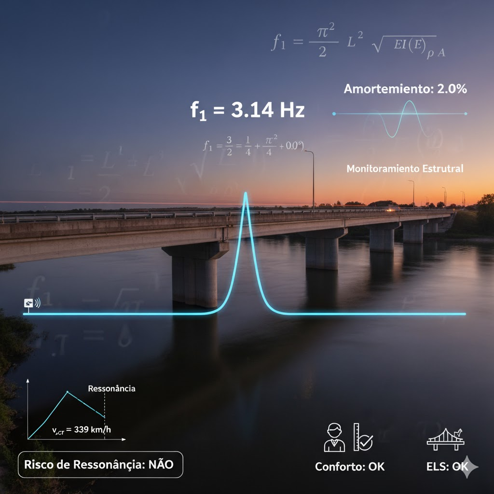

# Aula 10: Vibrações e Frequência Natural

## Objetivos da Aula

Ao final desta aula, o aluno será capaz de:
- Estimar a frequência natural e parâmetros dinâmicos de pontes
- Avaliar amplificação dinâmica e conforto (aceleração)
- Discutir risco de ressonância e sensibilidade a parâmetros
- Aplicar critérios de projeto recomendados (3–10 Hz)

## Estudo de Caso

Ponte rodoviária de vão único ($L = 30\,\mathrm{m}$) em concreto armado. Calcular a frequência natural fundamental, analisar o amortecimento típico e verificar o risco de ressonância com o tráfego, incluindo critérios de conforto e ELS.

Dados do projeto:

- Vão: $L = 30\,\mathrm{m}$
- Seção: retangular $b \times h = 0{,}5 \times 1{,}8\,\mathrm{m}$
- Massa específica: $\rho = 2500\,\mathrm{kg/m^3}$
- Módulo de elasticidade: $E = 30000\,\mathrm{MPa}$
- Amortecimento: $\xi = 2{,}0\%$

### Esquema do caso

Leitura do esquema:

- Ponte em vibração livre
- Modo fundamental de vibração
- Frequência natural e período
- Amortecimento estrutural

## Conceitos principais

### Modelo de Viga Biapoiada

**Equação diferencial**:
$$EI \frac{\partial^4 w}{\partial x^4} + \rho A \frac{\partial^2 w}{\partial t^2} = 0$$

**Solução para modo fundamental**:
$$w(x,t) = A \sin\left(\frac{\pi x}{L}\right) \sin(\omega_1 t)$$

**Frequência natural**:
$$\omega_1 = \frac{\pi^2}{L^2} \sqrt{\frac{EI}{\rho A}}$$

### Frequência Natural Fundamental

**Fórmula aproximada**:
$$f_1 = \frac{\pi}{2L^2} \sqrt{\frac{EI}{m}}$$

Onde:

- $E$ = módulo de elasticidade
- $I$ = momento de inércia
- $m$ = massa por unidade de comprimento
- $L$ = vão da ponte

**Período natural**:
$$T_1 = \frac{1}{f_1}$$

### Amortecimento Estrutural

**Coeficiente de amortecimento**:
$$\xi = \frac{c}{2m\omega_1}$$

Onde:

- $c$ = coeficiente de amortecimento
- $m$ = massa
- $\omega_1$ = frequência natural

**Valores típicos**:

- Concreto armado: $\xi = 2{,}0\%$
- Concreto protendido: $\xi = 1{,}5\%$
- Estruturas metálicas: $\xi = 1{,}0\%$

### Critério de Ressonância

**Razão de frequências**:
$$\frac{f_{exc}}{f_1} = \frac{v}{L \cdot f_1}$$

Onde:

- $v$ = velocidade do veículo
- $L$ = vão da ponte
- $f_1$ = frequência natural

**Limite de ressonância**:
$$\frac{f_{exc}}{f_1} < 0{,}5 \text{ ou } > 2{,}0$$

## Exemplo de cálculo do case

### 1) Propriedades da Seção

**Área da seção**:
$$A = b \times h = 0{,}5 \times 1{,}8 = 0{,}9\,\mathrm{m^2}$$

**Momento de inércia**:
$$I = \frac{b h^3}{12} = \frac{0{,}5 \times 5{,}832}{12} = 0{,}243\,\mathrm{m^4}$$

**Massa por unidade de comprimento**:
$$m = \rho A = 2500 \times 0{,}9 = 2250\,\mathrm{kg/m}$$

### 2) Cálculo da Frequência Natural

**Frequência fundamental**:
$$f_1 = \frac{\pi}{2L^2} \sqrt{\frac{EI}{m}}$$

$$f_1 = \frac{\pi}{2 \times 30^2} \sqrt{\frac{30000 \times 10^6 \times 0{,}243}{2250}}$$

$$f_1 = \frac{\pi}{1800} \sqrt{\frac{7{,}29 \times 10^9}{2250}} = \frac{\pi}{1800} \sqrt{3{,}24 \times 10^6}$$

$$f_1 = \frac{\pi}{1800} \times 1800 = \pi = 3{,}14\,\mathrm{Hz}$$

**Período natural**:
$$T_1 = \frac{1}{f_1} = \frac{1}{3{,}14} = 0{,}32\,\mathrm{s}$$

### 3) Análise de Amortecimento

**Coeficiente de amortecimento**:
$$\xi = 2{,}0\% = 0{,}02$$

**Frequência amortecida**:
$$f_d = f_1 \sqrt{1 - \xi^2} = 3{,}14 \sqrt{1 - 0{,}02^2} = 3{,}14 \sqrt{0{,}9996} = 3{,}14\,\mathrm{Hz}$$

**Diferença**: $f_d \approx f_1$ (amortecimento baixo)

### 4) Verificação de Ressonância

**Velocidade crítica**:
$$v_{cr} = L \cdot f_1 = 30 \times 3{,}14 = 94{,}2\,\mathrm{m/s} = 339{,}1\,\mathrm{km/h}$$

**Velocidades típicas**:

- $v = 60\,\mathrm{km/h} = 16{,}7\,\mathrm{m/s}$
- $v = 80\,\mathrm{km/h} = 22{,}2\,\mathrm{m/s}$
- $v = 100\,\mathrm{km/h} = 27{,}8\,\mathrm{m/s}$

**Razões de frequência**:
$$\frac{f_{exc}}{f_1} = \frac{v}{L \cdot f_1} = \frac{v}{94{,}2}$$

- $v = 60\,\mathrm{km/h}$: $\frac{f_{exc}}{f_1} = \frac{16{,}7}{94{,}2} = 0{,}18 < 0{,}5$ ✓
- $v = 80\,\mathrm{km/h}$: $\frac{f_{exc}}{f_1} = \frac{22{,}2}{94{,}2} = 0{,}24 < 0{,}5$ ✓
- $v = 100\,\mathrm{km/h}$: $\frac{f_{exc}}{f_1} = \frac{27{,}8}{94{,}2} = 0{,}30 < 0{,}5$ ✓

**Resultado**: Sem risco de ressonância para velocidades típicas.

### 5) Análise de Conforto

**Aceleração máxima**:
$$a_{\max} = \omega_1^2 A_{\max}$$

Onde $A_{\max}$ é a amplitude máxima de vibração.

**Limite de conforto**:
$$a_{\max} \leq 0{,}5\,\mathrm{m/s^2}$$

**Para $A_{\max} = 0{,}01\,\mathrm{m}$**:
$$a_{\max} = (2\pi \times 3{,}14)^2 \times 0{,}01 = 39{,}4 \times 0{,}01 = 0{,}39\,\mathrm{m/s^2} < 0{,}5\,\mathrm{m/s^2}$$

Condição atendida (✓).

### 6) Verificação de ELS

**Flecha dinâmica**:
$$a_{din} = a_{est} \times \beta$$

Onde $\beta$ é o fator de amplificação dinâmica.

**Fator de amplificação**:
$$\beta = \frac{1}{\sqrt{(1 - r^2)^2 + (2\xi r)^2}}$$

Onde $r = \frac{f_{exc}}{f_1}$.

**Para $v = 80\,\mathrm{km/h}$**:
$$r = 0{,}24$$

$$\beta = \frac{1}{\sqrt{(1 - 0{,}24^2)^2 + (2 \times 0{,}02 \times 0{,}24)^2}}$$

$$\beta = \frac{1}{\sqrt{(1 - 0{,}058)^2 + (0{,}0096)^2}} = \frac{1}{\sqrt{0{,}887 + 0{,}0001}} = \frac{1}{0{,}942} = 1{,}06$$

**Flecha estática**:
$$a_{est} = \frac{5}{384} \frac{qL^4}{EI} = \frac{5}{384} \frac{5{,}0 \times 30^4}{30000 \times 0{,}243} = \frac{5}{384} \frac{405000}{7290} = 0{,}072\,\mathrm{m}$$

**Flecha dinâmica**:
$$a_{din} = 0{,}072 \times 1{,}06 = 0{,}076\,\mathrm{m}$$

**Verificação**:
$$a_{din} = 0{,}076\,\mathrm{m} < a_{lim} = \frac{L}{250} = \frac{30}{250} = 0{,}12\,\mathrm{m}$$

Condição atendida (✓).

### 7) Análise de Sensibilidade

**Variação da rigidez**:

- $E = 25000\,\mathrm{MPa}$: $f_1 = 2{,}87\,\mathrm{Hz}$
- $E = 30000\,\mathrm{MPa}$: $f_1 = 3{,}14\,\mathrm{Hz}$
- $E = 35000\,\mathrm{MPa}$: $f_1 = 3{,}39\,\mathrm{Hz}$

**Variação da massa**:

- $m = 2000\,\mathrm{kg/m}$: $f_1 = 3{,}35\,\mathrm{Hz}$
- $m = 2250\,\mathrm{kg/m}$: $f_1 = 3{,}14\,\mathrm{Hz}$
- $m = 2500\,\mathrm{kg/m}$: $f_1 = 2{,}98\,\mathrm{Hz}$

**Variação do vão**:

- $L = 25\,\mathrm{m}$: $f_1 = 4{,}52\,\mathrm{Hz}$
- $L = 30\,\mathrm{m}$: $f_1 = 3{,}14\,\mathrm{Hz}$
- $L = 35\,\mathrm{m}$: $f_1 = 2{,}31\,\mathrm{Hz}$

### 8) Critérios de Projeto

**Frequência mínima recomendada**:
$$f_1 \geq 3{,}0\,\mathrm{Hz}$$

**Verificação**:
$$f_1 = 3{,}14\,\mathrm{Hz} > 3{,}0\,\mathrm{Hz}$$

Condição atendida (✓).

**Frequência máxima recomendada**:
$$f_1 \leq 10{,}0\,\mathrm{Hz}$$

**Verificação**:
$$f_1 = 3{,}14\,\mathrm{Hz} < 10{,}0\,\mathrm{Hz}$$

Condição atendida (✓).

## Interpretação dos Resultados

- Faixa 3–10 Hz equilibra conforto e afastamento de excitações típicas.
- β próximo de 1 fora da ressonância; cresce rapidamente quando r → 1.
- Aceleração de serviço é um critério direto de conforto do usuário.
- Rigidez e massa têm efeitos opostos em f_1; ajustes são via EI e m.

## Metodologia de Análise

1. Estimar f_1 (modelo equivalente) e ξ; calcular ω e T.
2. Obter r = f_exc/f_1 e β(r, ξ); avaliar a_max e limites de conforto.
3. Analisar sensibilidade: variação de E, m, L e seus efeitos em f_1.
4. Checar critérios de projeto: f_1 mínima e máxima recomendadas.
5. Indicar medidas: aumentar rigidez, reduzir massa, amortecimento adicional.

## Exercícios Propostos

- Para L=25 m, E=30 GPa, m=2200 kg/m, estime f_1 e a_max.
- Avalie o efeito de dobrar ξ em β para r=0,3 e r=0,8.
- Proponha ajustes de EI para elevar f_1 de 2,8 Hz para 3,2 Hz.

### 9) Monitoramento Estrutural

**Parâmetros a monitorar**:

- Frequência natural
- Amortecimento
- Amplitudes de vibração
- Acelerações

**Frequência de medição**:

- Inspeção inicial: medição completa
- Inspeção periódica: verificação de frequência
- Monitoramento contínuo: amplitudes e acelerações

## Erros comuns (evite)

- Ignorar os efeitos de ressonância
- Não considerar o amortecimento
- Subestimar a importância da frequência natural
- Não verificar os critérios de conforto

## Encaminhamentos

- Pratique o cálculo de frequências para diferentes seções
- Analise os efeitos de ressonância em estruturas flexíveis
- Próxima aula: patologias estruturais
