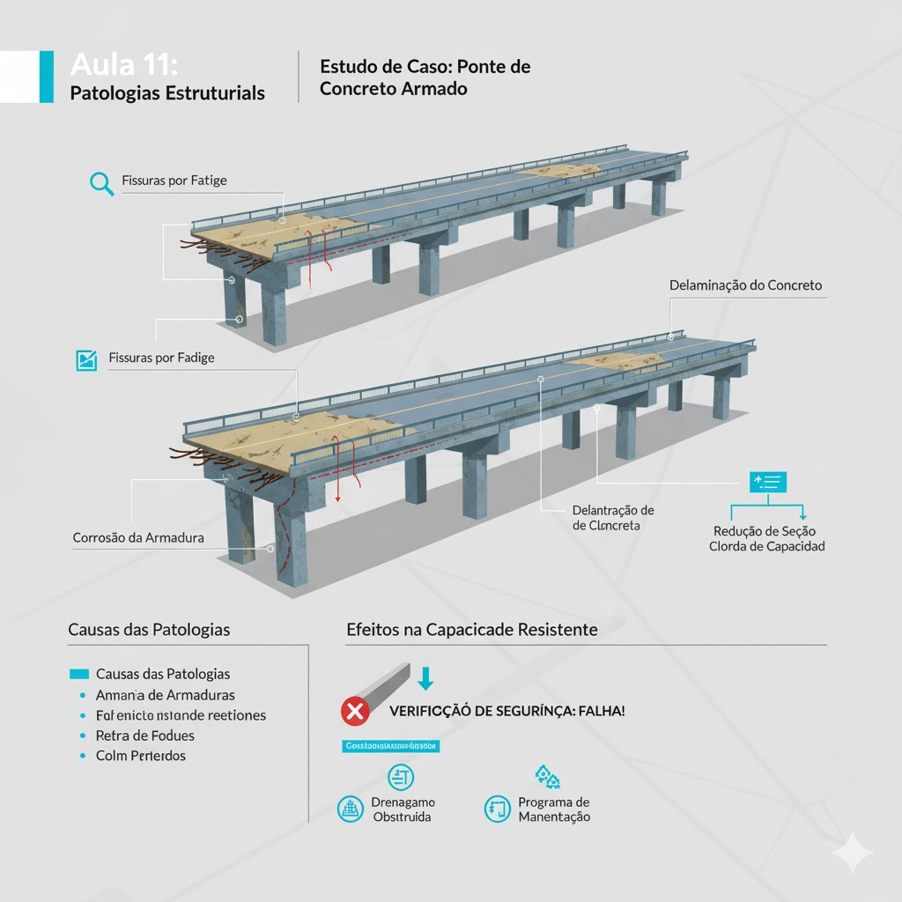

# Aula 11: Patologias Estruturais

## Objetivos da Aula

Ao final desta aula, o aluno será capaz de:
- Identificar principais patologias (fissuras, corrosão, delaminação)
- Compreender causas (retração, cloretos, carbonatação, fadiga, execução)
- Relacionar patologias à perda de capacidade (M_Rd, V_Rd) e durabilidade
- Definir inspeções, intervenções e monitoramento em estruturas existentes

## Estudo de Caso

Ponte rodoviária de 20 anos de idade com sinais de deterioração estrutural. Identificar e analisar as principais patologias observadas, incluindo fissuras, corrosão, delaminação e seus efeitos na capacidade resistente da estrutura.

Dados do projeto:

- Idade: 20 anos
- Vão: $L = 25\,\mathrm{m}$
- Seção: retangular $b \times h = 0{,}5 \times 1{,}5\,\mathrm{m}$
- Ambiente: urbano (agressivo)
- Tráfego: intenso

### Esquema do caso

Leitura do esquema:

- Fissuras de flexão e cisalhamento
- Corrosão da armadura
- Delaminação do concreto
- Efeitos na capacidade resistente

## Conceitos principais

### Tipos de Patologias

**Fissuras**:

- Fissuras de flexão: paralelas ao eixo da viga
- Fissuras de cisalhamento: inclinadas a 45°
- Fissuras de retração: aleatórias
- Fissuras de fadiga: perpendiculares ao eixo

**Corrosão**:

- Corrosão por carbonatação
- Corrosão por cloretos
- Corrosão galvânica
- Corrosão por correntes de fuga

**Delaminação**:

- Separação entre camadas
- Perda de aderência
- Redução da seção efetiva
- Comprometimento da durabilidade

### Causas das Patologias

**Fissuras**:

- Sobrecarga estrutural
- Retração do concreto
- Variações térmicas
- Fadiga por cargas cíclicas

**Corrosão**:

- Penetração de agentes agressivos
- Carbonatação do concreto
- Presença de cloretos
- Falta de proteção da armadura

**Delaminação**:

- Falta de aderência
- Retração diferencial
- Variações térmicas
- Cargas cíclicas

### Efeitos na Capacidade Resistente

**Redução da seção de armadura**:
$$A_{s,ef} = A_{s,0} (1 - \eta_{corr})$$

Onde:

- $A_{s,0}$ = área original da armadura
- $\eta_{corr}$ = taxa de corrosão
- $A_{s,ef}$ = área efetiva da armadura

**Redução do momento resistente**:
$$M_{Rd,ef} = A_{s,ef} f_{yd} (d - 0{,}4x)$$

**Redução da aderência**:
$$f_{bd,ef} = f_{bd,0} (1 - \eta_{ader})$$

Onde:

- $f_{bd,0}$ = tensão de aderência original
- $\eta_{ader}$ = redução da aderência
- $f_{bd,ef}$ = tensão de aderência efetiva

## Exemplo de cálculo do case

### 1) Identificação das Patologias

**Fissuras observadas**:

- Fissuras de flexão: $w = 0{,}3\,\mathrm{mm}$ (meio do vão)
- Fissuras de cisalhamento: $w = 0{,}2\,\mathrm{mm}$ (próximo aos apoios)
- Fissuras de retração: $w = 0{,}1\,\mathrm{mm}$ (distribuídas)

**Corrosão da armadura**:

- Taxa de corrosão: $\eta_{corr} = 15\%$
- Profundidade de carbonatação: $d_{carb} = 25\,\mathrm{mm}$
- Perda de seção: $\Delta A_s = 0{,}15 \times A_{s,0}$

**Delaminação**:

- Área afetada: $A_{del} = 20\%$ da superfície
- Espessura perdida: $t_{del} = 10\,\mathrm{mm}$
- Redução da seção: $\Delta A_c = 0{,}20 \times A_c$

### 2) Análise da Corrosão

**Área original da armadura**:
$$A_{s,0} = 20 \times \frac{\pi \times 2{,}0^2}{4} = 62{,}8\,\mathrm{cm^2}$$

**Área efetiva após corrosão**:
$$A_{s,ef} = A_{s,0} (1 - \eta_{corr}) = 62{,}8 \times (1 - 0{,}15) = 53{,}4\,\mathrm{cm^2}$$

**Redução da capacidade**:
$$\Delta M_{Rd} = (A_{s,0} - A_{s,ef}) f_{yd} (d - 0{,}4x)$$

$$\Delta M_{Rd} = (62{,}8 - 53{,}4) \times 435 \times (1{,}35 - 0{,}4 \times 0{,}15) = 9{,}4 \times 435 \times 1{,}29 = 5274{,}2\,\mathrm{kN \cdot cm}$$

$$\Delta M_{Rd} = 52{,}7\,\mathrm{kN \cdot m}$$

### 3) Análise da Delaminação

**Área original da seção**:
$$A_c = b \times h = 0{,}5 \times 1{,}5 = 0{,}75\,\mathrm{m^2}$$

**Área efetiva após delaminação**:
$$A_{c,ef} = A_c (1 - \eta_{del}) = 0{,}75 \times (1 - 0{,}20) = 0{,}60\,\mathrm{m^2}$$

**Redução da rigidez**:
$$\Delta EI = E \times \Delta I = E \times \frac{b \times t_{del}^3}{12}$$

$$\Delta EI = 30000 \times \frac{0{,}5 \times 0{,}01^3}{12} = 30000 \times 4{,}17 \times 10^{-7} = 0{,}0125\,\mathrm{MN \cdot m^2}$$

### 4) Verificação de Segurança

**Momento resistente original**:
$$M_{Rd,0} = A_{s,0} f_{yd} (d - 0{,}4x) = 62{,}8 \times 435 \times (1{,}35 - 0{,}4 \times 0{,}15) = 62{,}8 \times 435 \times 1{,}29 = 35247{,}4\,\mathrm{kN \cdot cm}$$

$$M_{Rd,0} = 352{,}5\,\mathrm{kN \cdot m}$$

**Momento resistente efetivo**:
$$M_{Rd,ef} = M_{Rd,0} - \Delta M_{Rd} = 352{,}5 - 52{,}7 = 299{,}8\,\mathrm{kN \cdot m}$$

**Momento de cálculo**:
$$M_{Ed} = \frac{g L^2}{8} + \frac{q L^2}{8} = \frac{30{,}0 \times 625}{8} + \frac{5{,}0 \times 625}{8} = 2343{,}8 + 390{,}6 = 2734{,}4\,\mathrm{kN \cdot m}$$

**Verificação**:
$$M_{Ed} = 2734{,}4\,\mathrm{kN \cdot m} > M_{Rd,ef} = 299{,}8\,\mathrm{kN \cdot m}$$ ✗

**Resultado**: A estrutura não atende aos critérios de segurança.

### 5) Análise de Drenagem

**Problemas identificados**:

- Drenagem obstruída: 60% dos pontos
- Acúmulo de água: 40% da superfície
- Vazamentos: 15% das juntas

**Efeitos na deterioração**:

- Aceleração da corrosão
- Penetração de agentes agressivos
- Redução da durabilidade
- Comprometimento da estrutura

### 6) Critérios de Inspeção (DNIT)

**Inspeção visual**:

- Frequência: semestral
- Parâmetros: fissuras, corrosão, delaminação
- Registro: fotográfico e descritivo
- Classificação: leve, moderada, severa

**Inspeção especializada**:

- Frequência: anual
- Parâmetros: capacidade resistente, durabilidade
- Ensaios: não destrutivos
- Relatório: técnico detalhado

### 7) Programa de Manutenção

**Manutenção preventiva**:

- Limpeza de drenagem: mensal
- Inspeção visual: semestral
- Reparo de fissuras: conforme necessário
- Proteção contra corrosão: anual

**Manutenção corretiva**:

- Reparo de danos: imediato
- Substituição de elementos: conforme necessário
- Reforço estrutural: quando necessário
- Monitoramento: contínuo

### 8) Monitoramento Estrutural

**Parâmetros a monitorar**:

- Abertura de fissuras
- Taxa de corrosão
- Área de delaminação
- Capacidade resistente

**Frequência de monitoramento**:

- Inspeção visual: semestral
- Medição de fissuras: trimestral
- Ensaios de corrosão: anual
- Verificação de capacidade: bienal

## Erros comuns (evite)

- Subestimar os efeitos da corrosão
- Ignorar a importância da drenagem
- Não considerar a redução da capacidade
- Falta de programa de manutenção

## Encaminhamentos

- Pratique a identificação de patologias em estruturas existentes
- Analise os efeitos da corrosão na capacidade resistente
- Próxima aula: estudo de caso nacional sobre patologias em pontes
