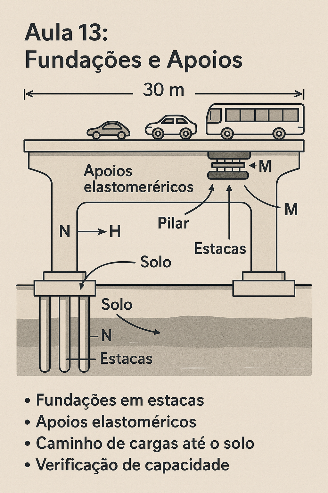

# Aula 13: Fundações e Apoios

## Objetivos da Aula

Ao final desta aula, o aluno será capaz de:

- Mapear o caminho de cargas até o solo e esforços nos apoios
- Estimar capacidade de estacas (ponta/atrito) e dimensionar blocos
- Verificar apoios elastoméricos (σ_c, τ, deslocamentos)
- Avaliar estabilidade local (tombamento) e compatibilizar deslocamentos

## Estudo de Caso

Ponte rodoviária de vão único ($L = 30\,\mathrm{m}$) com fundações em estacas e apoios elastoméricos. Dimensionar as fundações para as reações da superestrutura, verificar a capacidade das estacas e dimensionar os apoios para os esforços transmitidos.

Dados do projeto:

- Vão: $L = 30\,\mathrm{m}$
- Reação máxima: $R = 1200\,\mathrm{kN}$
- Reação mínima: $R = 800\,\mathrm{kN}$
- Deslocamento horizontal: $\Delta H = 50\,\mathrm{mm}$
- Solo: argila mole ($N_{SPT} = 5$)

### Esquema do caso

Leitura do esquema:

- Fundações em estacas
- Apoios elastoméricos
- Caminho de cargas até o solo
- Verificação de capacidade

## Conceitos principais

### Caminho de Cargas até o Solo

**Trajetória das cargas**:

1. Cargas móveis → tabuleiro → vigas principais
2. Vigas principais → apoios → pilares
3. Pilares → blocos de fundação → estacas
4. Estacas → solo de fundação

**Esforços transmitidos**:

- Força vertical: $N$ (compressão)
- Força horizontal: $H$ (cisalhamento)
- Momento: $M$ (flexão)

### Tensões de Contato

**Tensão no solo**:
$$\sigma = \frac{N}{A} \pm \frac{M}{W}$$

Onde:

- $N$ = força vertical
- $A$ = área de contato
- $M$ = momento
- $W$ = módulo de resistência

**Verificação**:
$$\sigma \leq \sigma_{adm}$$

Onde $\sigma_{adm}$ é a tensão admissível do solo.

### Capacidade de Estaca

**Capacidade por ponta**:
$$Q_p = A_p \times q_p$$

Onde:

- $A_p$ = área da ponta da estaca
- $q_p$ = tensão de ponta

**Capacidade por atrito**:
$$Q_f = A_f \times f_s$$

Onde:

- $A_f$ = área lateral da estaca
- $f_s$ = tensão de atrito lateral

**Capacidade total**:
$$Q_{total} = Q_p + Q_f$$

### Apoios Elastoméricos

**Função**:

- Transmitir cargas verticais
- Permitir deslocamentos horizontais
- Absorver rotações
- Isolar vibrações

**Esforços transmitidos**:

- Força vertical: $N$
- Força horizontal: $H$
- Momento: $M$

## Exemplo de cálculo do case

### 1) Dimensionamento das Fundações

**Reação máxima**:
$$R_{\max} = 1200\,\mathrm{kN}$$

**Reação mínima**:
$$R_{\min} = 800\,\mathrm{kN}$$

**Reação média**:
$$R_{méd} = \frac{R_{\max} + R_{\min}}{2} = \frac{1200 + 800}{2} = 1000\,\mathrm{kN}$$

### 2) Dimensionamento das Estacas

**Capacidade por ponta**:
$$Q_p = A_p \times q_p = \frac{\pi \times 0{,}4^2}{4} \times 200 = 0{,}126 \times 200 = 25{,}2\,\mathrm{kN}$$

**Capacidade por atrito**:
$$Q_f = A_f \times f_s = \pi \times 0{,}4 \times 15 \times 15 = 18{,}85 \times 15 = 282{,}8\,\mathrm{kN}$$

**Capacidade total**:
$$Q_{total} = Q_p + Q_f = 25{,}2 + 282{,}8 = 308{,}0\,\mathrm{kN}$$

**Número de estacas**:
$$n = \frac{R_{\max}}{Q_{total}} = \frac{1200}{308{,}0} = 3{,}9 \approx 4 \text{ estacas}$$

**Verificação**:
$$4 \times 308{,}0 = 1232{,}0\,\mathrm{kN} > 1200{,}0\,\mathrm{kN}$$

Condição atendida (✓).

## Interpretação dos Resultados

- A capacidade por atrito frequentemente domina em solos de baixa resistência.
- Tensões nos apoios devem respeitar limites de material e deslocamentos admissíveis.
- Estabilidade ao tombamento confere reserva contra ações horizontais.
- O detalhamento dos apoios influencia desempenho e manutenção.

## Metodologia de Cálculo

1. Estimar R_max/min e distribuir por estacas (Q_p, Q_f) → n.
2. Dimensionar bloco: área para σ ≤ σ_adm e peso próprio contribuindo.
3. Verificar apoios: σ_c, τ e deslocamentos (ΔH, ΔV) vs limites.
4. Avaliar estabilidade (M_res/M_tomb) e definir dispositivos.
5. Integrar com a superestrutura (compatibilidade de deslocamentos).

## Exercícios Propostos

- Para N_total=1500 kN e σ_adm=350 kPa, dimensione A_b e compare soluções.
- Com H=0,1N, verifique τ e proponha dimensões de apoio alternativas.
- Explore o efeito de aumentar o diâmetro das estacas em Q_total e n.

### 3) Dimensionamento do Bloco

**Dimensões do bloco**:

- Comprimento: $L_b = 2{,}0\,\mathrm{m}$
- Largura: $B_b = 2{,}0\,\mathrm{m}$
- Altura: $H_b = 1{,}0\,\mathrm{m}$

**Área do bloco**:
$$A_b = L_b \times B_b = 2{,}0 \times 2{,}0 = 4{,}0\,\mathrm{m^2}$$

**Volume do bloco**:
$$V_b = A_b \times H_b = 4{,}0 \times 1{,}0 = 4{,}0\,\mathrm{m^3}$$

**Peso do bloco**:
$$P_b = \gamma_{concreto} \times V_b = 25 \times 4{,}0 = 100{,}0\,\mathrm{kN}$$

**Carga total**:
$$N_{total} = R_{\max} + P_b = 1200{,}0 + 100{,}0 = 1300{,}0\,\mathrm{kN}$$

### 4) Verificação de Tensões

**Tensão no solo**:
$$\sigma = \frac{N_{total}}{A_b} = \frac{1300{,}0}{4{,}0} = 325{,}0\,\mathrm{kPa}$$

**Tensão admissível**:
$$\sigma_{adm} = 400{,}0\,\mathrm{kPa}$$

**Verificação**:
$$\sigma = 325{,}0\,\mathrm{kPa} < \sigma_{adm} = 400{,}0\,\mathrm{kPa}$$

Condição atendida (✓).

### 5) Dimensionamento dos Apoios

**Força vertical**:
$$N = R_{\max} = 1200{,}0\,\mathrm{kN}$$

**Força horizontal**:
$$H = 0{,}1 \times N = 0{,}1 \times 1200{,}0 = 120{,}0\,\mathrm{kN}$$

**Momento**:
$$M = H \times h_{apoio} = 120{,}0 \times 0{,}3 = 36{,}0\,\mathrm{kN \cdot m}$$

### 6) Verificação dos Apoios

**Tensão de compressão**:
$$\sigma_c = \frac{N}{A_{apoio}} = \frac{1200{,}0}{0{,}6 \times 0{,}4} = \frac{1200{,}0}{0{,}24} = 5000{,}0\,\mathrm{kPa}$$

**Tensão admissível**:
$$\sigma_{c,adm} = 10000{,}0\,\mathrm{kPa}$$

**Verificação**:
$$\sigma_c = 5000{,}0\,\mathrm{kPa} < \sigma_{c,adm} = 10000{,}0\,\mathrm{kPa}$$

Condição atendida (✓).

**Tensão de cisalhamento**:
$$\tau = \frac{H}{A_{apoio}} = \frac{120{,}0}{0{,}24} = 500{,}0\,\mathrm{kPa}$$

**Tensão admissível**:
$$\tau_{adm} = 1000{,}0\,\mathrm{kPa}$$

**Verificação**:
$$\tau = 500{,}0\,\mathrm{kPa} < \tau_{adm} = 1000{,}0\,\mathrm{kPa}$$

Condição atendida (✓).

### 7) Verificação de Deslocamentos

**Deslocamento horizontal**:
$$\Delta H = 50{,}0\,\mathrm{mm}$$

**Deslocamento admissível**:
$$\Delta H_{adm} = 100{,}0\,\mathrm{mm}$$

**Verificação**:
$$\Delta H = 50{,}0\,\mathrm{mm} < \Delta H_{adm} = 100{,}0\,\mathrm{mm}$$

Condição atendida (✓).

**Deslocamento vertical**:
$$\Delta V = \frac{N}{K_v} = \frac{1200{,}0}{50000} = 0{,}024\,\mathrm{m} = 24{,}0\,\mathrm{mm}$$

**Deslocamento admissível**:
$$\Delta V_{adm} = 50{,}0\,\mathrm{mm}$$

**Verificação**:
$$\Delta V = 24{,}0\,\mathrm{mm} < \Delta V_{adm} = 50{,}0\,\mathrm{mm}$$

Condição atendida (✓).

### 8) Análise de Estabilidade

**Momento de tombamento**:
$$M_{tomb} = H \times h_{bloco} = 120{,}0 \times 1{,}0 = 120{,}0\,\mathrm{kN \cdot m}$$

**Momento resistente**:
$$M_{res} = N \times \frac{L_b}{2} = 1300{,}0 \times \frac{2{,}0}{2} = 1300{,}0\,\mathrm{kN \cdot m}$$

**Coeficiente de segurança**:
$$\gamma = \frac{M_{res}}{M_{tomb}} = \frac{1300{,}0}{120{,}0} = 10{,}8$$

**Verificação**:
$$\gamma = 10{,}8 > 2{,}0$$

Condição atendida (✓).

### 9) Detalhamento das Fundações

**Estacas**:

- Diâmetro: $\phi = 0{,}4\,\mathrm{m}$
- Comprimento: $L = 15{,}0\,\mathrm{m}$
- Número: 4 estacas
- Espaçamento: $s = 1{,}0\,\mathrm{m}$

**Bloco**:

- Dimensões: $2{,}0 \times 2{,}0 \times 1{,}0\,\mathrm{m}$
- Concreto: $f_{ck} = 25\,\mathrm{MPa}$
- Armadura: $\phi 12{,}5\,\mathrm{mm}$ c/ $20\,\mathrm{cm}$

**Apoios**:

- Dimensões: $0{,}6 \times 0{,}4 \times 0{,}3\,\mathrm{m}$
- Material: elastômero
- Rigidez vertical: $K_v = 50000\,\mathrm{kN/m}$
- Rigidez horizontal: $K_h = 5000\,\mathrm{kN/m}$

## Erros comuns (evite)

- Não considerar o peso próprio do bloco
- Ignorar os deslocamentos horizontais
- Subestimar a capacidade das estacas
- Não verificar a estabilidade do bloco

## Encaminhamentos

- Pratique o dimensionamento para diferentes tipos de solo
- Analise os efeitos dos deslocamentos na superestrutura
- Próxima aula: interação solo-estrutura e recalques
