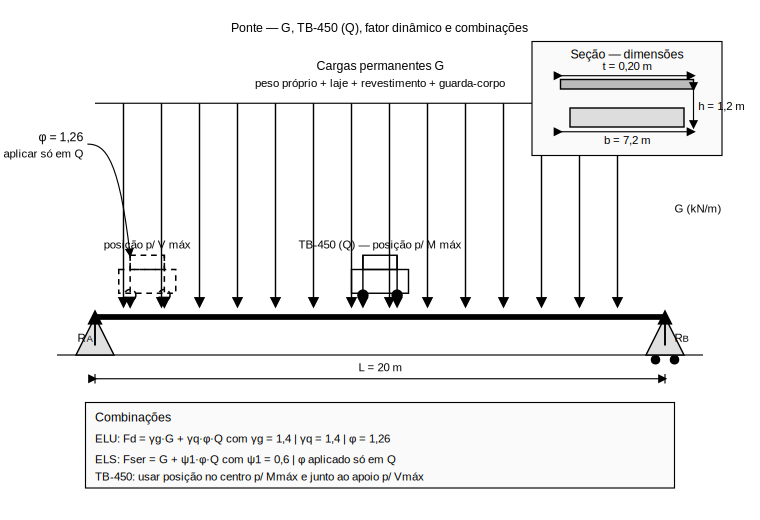

# Aula 3: Cargas Permanentes e Móveis (NBR 7188)

## Objetivos da Aula

Ao final desta aula, o aluno será capaz de:
- Identificar e quantificar cargas permanentes (G) e móveis (Q)
- Calcular e aplicar corretamente o fator dinâmico (NBR 7188)
- Montar combinações ELU/ELS com os coeficientes normativos
- Posicionar criticamente a TB-450 para M_max e V_max

## Estudo de Caso

Ponte rodoviária de vão único ($L = 20\,\mathrm{m}$) em concreto armado. Determinar as cargas de projeto segundo a NBR 7188:2022, incluindo cargas permanentes, carga móvel TB-450, fator dinâmico de impacto e combinações ELU/ELS para dimensionamento da viga principal.

Dados do projeto:

- Vão: $L = 20\,\mathrm{m}$
- Largura da pista: $b = 7{,}2\,\mathrm{m}$ (2 faixas)
- Altura da viga: $h = 1{,}2\,\mathrm{m}$
- Espessura da laje: $t = 0{,}2\,\mathrm{m}$

### Esquema do caso

Leitura do esquema:

- Cargas permanentes: peso próprio, revestimento, guarda-corpo
- Carga móvel TB-450: posicionamento crítico
- Fator dinâmico: aplicação nas cargas móveis
- Combinações: ELU e ELS

## Conceitos principais

### Cargas Permanentes (G)

**Peso Próprio da Estrutura**

- Viga principal: $\gamma_{\text{concreto}} = 25\,\mathrm{kN/m^3}$
- Laje do tabuleiro: espessura $t = 0{,}2\,\mathrm{m}$
- Cálculo: $g_1 = \gamma \times A_{\text{seção}}$

**Revestimento e Pavimentação**

- Camada de asfalto: $g_2 = 2{,}0\,\mathrm{kN/m^2}$
- Impermeabilização: $g_3 = 0{,}5\,\mathrm{kN/m^2}$
- Total: $g_{\text{rev}} = 2{,}5\,\mathrm{kN/m^2}$

**Guarda-corpo e Equipamentos**

- Guarda-corpo metálico: $g_4 = 1{,}0\,\mathrm{kN/m}$
- Equipamentos (drenagem, sinalização): $g_5 = 0{,}5\,\mathrm{kN/m}$
- Total: $g_{\text{eq}} = 1{,}5\,\mathrm{kN/m}$

### Carga Móvel TB-450 (Q)

**Características do Veículo**

- Peso total: $450\,\mathrm{kN}$
- 6 eixos: 2 eixos simples + 4 eixos duplos
- Distribuição: $75\,\mathrm{kN}$ por eixo simples, $75\,\mathrm{kN}$ por eixo duplo

**Carga Distribuída Equivalente**

- Valor: $q = 5{,}0\,\mathrm{kN/m^2}$
- Aplicação: sobre a largura útil da pista
- Redução: não aplicável para vãos $L < 30\,\mathrm{m}$

### Fator Dinâmico de Impacto

**Conceito**
O fator dinâmico considera os efeitos dinâmicos do tráfego sobre a estrutura, amplificando as cargas estáticas.

**Cálculo (NBR 7188:2022)**
$$\varphi = 1{,}4 - 0{,}007 \times L$$

Para $L = 20\,\mathrm{m}$:
$$\varphi = 1{,}4 - 0{,}007 \times 20 = 1{,}26$$

**Aplicação**

- Aplicado apenas às cargas móveis
- Não se aplica às cargas permanentes
- Valor mínimo: $\varphi = 1{,}0$

### Combinações de Cargas

**Estado Limite Último (ELU)**
$$F_d = \gamma_g G + \gamma_q \varphi Q$$

Onde:

- $\gamma_g = 1{,}4$ (cargas permanentes)
- $\gamma_q = 1{,}4$ (cargas móveis)
- $\varphi = 1{,}26$ (fator dinâmico)

**Estado Limite de Serviço (ELS)**
$$F_{ser} = G + \psi_1 \varphi Q$$

Onde:

- $\psi_1 = 0{,}6$ (coeficiente de redução para ELS)

## Exemplo de cálculo do case

### 1) Cargas Permanentes

**Peso próprio da viga**:
$$g_1 = 25 \times (1{,}2 \times 0{,}4) = 12{,}0\,\mathrm{kN/m}$$

**Peso próprio da laje**:
$$g_2 = 25 \times (0{,}2 \times 7{,}2) = 36{,}0\,\mathrm{kN/m}$$

**Revestimento**:
$$g_3 = 2{,}5 \times 7{,}2 = 18{,}0\,\mathrm{kN/m}$$

**Guarda-corpo e equipamentos**:
$$g_4 = 1{,}5 \times 2 = 3{,}0\,\mathrm{kN/m}$$

**Carga permanente total**:
$$G = g_1 + g_2 + g_3 + g_4 = 12{,}0 + 36{,}0 + 18{,}0 + 3{,}0 = 69{,}0\,\mathrm{kN/m}$$

### 2) Carga Móvel TB-450

**Carga distribuída**:
$$q = 5{,}0\,\mathrm{kN/m^2}$$

**Carga por metro linear**:
$$Q = q \times b = 5{,}0 \times 7{,}2 = 36{,}0\,\mathrm{kN/m}$$

### 3) Fator Dinâmico

$$\varphi = 1{,}4 - 0{,}007 \times 20 = 1{,}26$$

### 4) Combinações de Cargas

**ELU - Momento máximo**:
$$M_{Ed} = \frac{\gamma_g G L^2}{8} + \frac{\gamma_q \varphi Q L^2}{8}$$

$$M_{Ed} = \frac{1{,}4 \times 69{,}0 \times 400}{8} + \frac{1{,}4 \times 1{,}26 \times 36{,}0 \times 400}{8}$$

$$M_{Ed} = 4830 + 3175{,}2 = 8005{,}2\,\mathrm{kN \cdot m}$$

**ELU - Cortante máximo**:
$$V_{Ed} = \frac{\gamma_g G L}{2} + \frac{\gamma_q \varphi Q L}{2}$$

$$V_{Ed} = \frac{1{,}4 \times 69{,}0 \times 20}{2} + \frac{1{,}4 \times 1{,}26 \times 36{,}0 \times 20}{2}$$

$$V_{Ed} = 966 + 635{,}0 = 1601{,}0\,\mathrm{kN}$$

**ELS - Momento de serviço**:
$$M_{ser} = \frac{G L^2}{8} + \frac{\psi_1 \varphi Q L^2}{8}$$

$$M_{ser} = \frac{69{,}0 \times 400}{8} + \frac{0{,}6 \times 1{,}26 \times 36{,}0 \times 400}{8}$$

$$M_{ser} = 3450 + 1360{,}8 = 4810{,}8\,\mathrm{kN \cdot m}$$

### 5) Posicionamento Crítico TB-450

**Para momento máximo**:

- Posicionar o veículo no centro do vão
- Considerar a carga distribuída em todo o vão
- Aplicar o fator dinâmico

**Para cortante máximo**:

- Posicionar o veículo próximo ao apoio
- Considerar a carga distribuída em todo o vão
- Aplicar o fator dinâmico

### 6) Verificações Importantes

**Coeficientes de segurança**:

- $\gamma_g = 1{,}4$ (cargas permanentes)
- $\gamma_q = 1{,}4$ (cargas móveis)
- $\psi_1 = 0{,}6$ (redução para ELS)

**Fator dinâmico**:

- Valor calculado: $\varphi = 1{,}26$
- Valor mínimo: $\varphi = 1{,}0$
- Aplicação: apenas nas cargas móveis

## Interpretação dos Resultados

- $\varphi$ aumenta a parcela de Q, elevando M e V sobretudo em vãos curtos.
- Em ELS, $\psi_1$ reduz efeitos de serviço para evitar superestimações.
- Posições críticas da TB-450 diferem para M e V; diagramas devem refletir isso.
- G domina efeitos de longo prazo; Q domina envelopes de esforço para dimensionar.

## Metodologia de Cálculo

1. Quantificar G por componentes (peso próprio, revestimento, acessórios).
2. Determinar Q (TB-450): distribuída e por eixos sobre a largura útil.
3. Calcular $\varphi$ e aplicar somente sobre Q.
4. Montar ELU/ELS com $\gamma_g, \gamma_q, \psi_1$ e extrair M_max, V_max.
5. Definir posicionamento crítico para cada esforço e conferir limites.

## Exercícios Propostos

- Para L=15 m e L=35 m, calcule $\varphi$ e compare M_Ed e V_Ed.
- Para b=9,6 m (3 faixas), estime Q por metro e compare com b=7,2 m.
- Indique o posicionamento da TB-450 que maximiza V no apoio e justifique.

## Erros comuns (evite)

- Aplicar o fator dinâmico às cargas permanentes
- Usar coeficientes de segurança incorretos nas combinações
- Não considerar o posicionamento crítico do veículo TB-450
- Confundir combinações ELU e ELS

## Encaminhamentos

- Pratique o cálculo de cargas para diferentes tipologias estruturais
- Analise o efeito do fator dinâmico em vãos de diferentes tamanhos
- Próxima aula: estudo de caso nacional sobre fadiga em pontes
