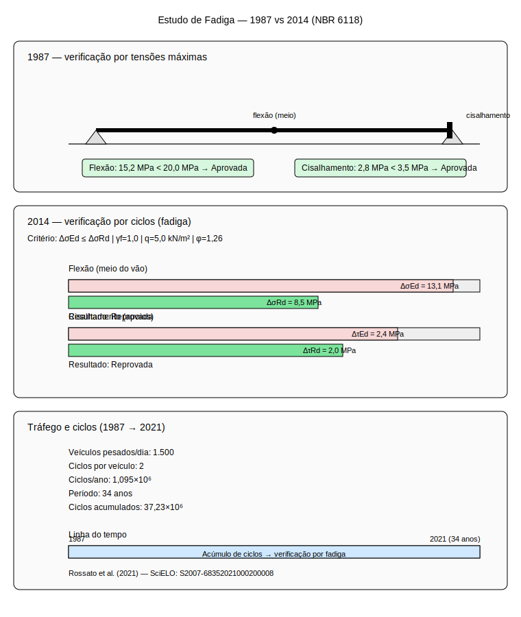

# Aula 4: Estudo de Caso Nacional – Fadiga em Ponte de Concreto

## Objetivos da Aula

Ao final desta aula, o aluno será capaz de:
- Compreender os mecanismos de fadiga em estruturas de concreto armado
- Comparar critérios de projeto de diferentes épocas normativas
- Analisar o impacto de cargas cíclicas em estruturas existentes
- Identificar sinais de deterioração por fadiga em pontes
- Aplicar metodologias de reavaliação estrutural conforme normas atuais

---

## 1. Introdução à Fadiga em Estruturas

### 1.1 Conceito de Fadiga

A **fadiga** é o processo de deterioração progressiva de um material submetido a cargas cíclicas variáveis, mesmo que inferiores à sua resistência última. Em estruturas de concreto armado, manifesta-se através de:

- **Trincas de flexão** em regiões de momento máximo
- **Trincas de cisalhamento** em regiões de cortante elevado
- **Deterioração da aderência** aço-concreto
- **Corrosão acelerada** da armadura

### 1.2 Mecanismos de Dano

**Cargas cíclicas** produzem:
- **Amplitude de tensão** ($\Delta\sigma = \sigma_{max} - \sigma_{min}$)
- **Número de ciclos** ($N$) durante a vida útil
- **Acúmulo de dano** por ciclo de tensão

### 1.3 Critérios Normativos

**NBR 6118:1980 (critérios antigos)**:
- Verificação baseada em tensões máximas
- Coeficiente de segurança $\gamma_f = 1,5$
- Abordagem simplificada

**NBR 6118:2014 (critérios atuais)**:
- Verificação baseada em amplitude de tensão
- Coeficiente de segurança $\gamma_f = 1,0$
- Análise por acúmulo de dano

---

## 2. Contexto do Estudo de Caso

### 2.1 A Ponte Analisada

**Características da estrutura**:
- **Localização**: Ponte rodoviária brasileira
- **Período de projeto**: 1987 (normas anteriores)
- **Reavaliação**: 2021 (NBR 6118:2014)
- **Vão**: $L = 25\,\mathrm{m}$ (viga de concreto armado)
- **Tráfego**: intenso, com predominância de veículos pesados

### 2.2 Problema Identificado

A ponte apresentava sinais visíveis de deterioração após 34 anos de serviço:
- Trincas longitudinais na região de flexão
- Evidências de corrosão na armadura
- Deslocamentos verticais acima do esperado

O estudo comparou os critérios originais de projeto (1987) com as normas atuais para identificar deficiências no dimensionamento à fadiga.

### 2.3 Referência do Estudo
**Artigo:** Rossato et al. — Verificação de segurança à fadiga de ponte projetada em 1987 conforme NBR 6118 (2014), 2021
**Link:** https://www.scielo.org.mx/scielo.php?pid=S2007-68352021000200008&script=sci_arttext&tlng=pt

---

## 3. Esquema Ilustrativo do Estudo

### Esquema do caso (SVG)

**Leitura do esquema**:
- Comparação entre normas de 1987 e 2014
- Critérios de verificação de fadiga
- Margem de segurança e ciclos de tráfego
- Resultados da análise

---

## 4. Análise Detalhada dos Critérios

### 4.1 Regiões Críticas Identificadas

#### 1) Região de Flexão (Meio do Vão)
**Tensões calculadas**:
- Tensão máxima: $\sigma_{\max} = 15{,}2\,\mathrm{MPa}$
- Tensão mínima: $\sigma_{\min} = 2{,}1\,\mathrm{MPa}$
- Amplitude de tensão: $\Delta\sigma = 13{,}1\,\mathrm{MPa}$

**Análise de 1987**:
- Tensão admissível: $\sigma_{adm} = 20{,}0\,\mathrm{MPa}$
- Verificação: $15{,}2 < 20{,}0$ ✓ (aprovada)

**Análise de 2014**:
- Limite de fadiga: $\Delta\sigma_{Rd} = 8{,}5\,\mathrm{MPa}$
- Verificação: $13{,}1 > 8{,}5$ ✗ (reprovada)

#### 2) Região de Cisalhamento (Próximo aos Apoios)
**Tensões calculadas**:
- Tensão máxima: $\tau_{\max} = 2{,}8\,\mathrm{MPa}$
- Tensão mínima: $\tau_{\min} = 0{,}4\,\mathrm{MPa}$
- Amplitude de tensão: $\Delta\tau = 2{,}4\,\mathrm{MPa}$

**Análise de 1987**:
- Tensão admissível: $\tau_{adm} = 3{,}5\,\mathrm{MPa}$
- Verificação: $2{,}8 < 3{,}5$ ✓ (aprovada)

**Análise de 2014**:
- Limite de fadiga: $\Delta\tau_{Rd} = 2{,}0\,\mathrm{MPa}$
- Verificação: $2{,}4 > 2{,}0$ ✗ (reprovada)

### 4.2 Comparação de Premissas

#### Cargas de Projeto
**1987**:
- Carga móvel: $q = 3{,}0\,\mathrm{kN/m^2}$
- Fator dinâmico: $\varphi = 1{,}2$
- Combinação: $F_d = 1{,}4G + 1{,}4 \times 1{,}2Q$

**2014**:
- Carga móvel: $q = 5{,}0\,\mathrm{kN/m^2}$ (NBR 7188)
- Fator dinâmico: $\varphi = 1{,}26$
- Combinação: $F_d = 1{,}4G + 1{,}4 \times 1{,}26Q$

#### Coeficientes de Segurança
**1987**:
- Flexão: $\gamma_f = 1{,}5$
- Cisalhamento: $\gamma_f = 1{,}5$
- Fadiga: não considerada especificamente

**2014**:
- Flexão: $\gamma_f = 1{,}4$
- Cisalhamento: $\gamma_f = 1{,}4$
- Fadiga: $\gamma_f = 1{,}0$ (específico)

### 4.3 Análise de Ciclos e Margem de Segurança

#### Tráfego observado:
- Veículos pesados/dia: $N = 1500$
- Ciclos por veículo: $n = 2$ (ida e volta)
- Ciclos totais/ano: $N_{ano} = 1500 \times 2 \times 365 = 1{,}095 \times 10^6$

#### Ciclos acumulados (34 anos):
$$N_{total} = 1{,}095 \times 10^6 \times 34 = 37{,}23 \times 10^6 \text{ ciclos}$$

#### Verificação de Fadiga (NBR 6118:2014)
**Para flexão**:
$$\Delta\sigma_{Rd} = \frac{\Delta\sigma_{Rk}}{\gamma_f} = \frac{8{,}5}{1{,}0} = 8{,}5\,\mathrm{MPa}$$

**Verificação**:
$$\Delta\sigma_{Ed} = 13{,}1\,\mathrm{MPa} > \Delta\sigma_{Rd} = 8{,}5\,\mathrm{MPa}$$

**Margem de Segurança**:
$$MS = \frac{\Delta\sigma_{Rd}}{\Delta\sigma_{Ed}} = \frac{8{,}5}{13{,}1} = 0{,}65$$

**Interpretação**: A ponte opera com 35% de sobrecarga em relação aos critérios de fadiga.

---

## 5. Conexão com Aulas Anteriores

### 5.1 Relação com Aula 1 (Esforços Internos)
- Os esforços calculados na Aula 1 são a base para a análise de fadiga
- Momento máximo: $M_{\max} = 180\,\mathrm{kN \cdot m}$ (caso da Aula 1)
- Cortante máximo: $V_{\max} = 105\,\mathrm{kN}$ (caso da Aula 1)

### 5.2 Relação com Aula 2 (Tipologias)
- A viga simplesmente apoiada é a tipologia mais suscetível à fadiga
- Sistemas hiperestáticos (vigas contínuas) têm melhor comportamento à fadiga
- Trajetórias de carga influenciam a distribuição de tensões

### 5.3 Relação com Aula 3 (Cargas)
- As cargas móveis são a principal causa da fadiga
- Fator dinâmico amplifica os efeitos de fadiga
- Combinações de carga devem considerar a variabilidade temporal

---

## 6. Lições Aprendidas e Recomendações

### 6.1 Evolução Normativa
- Normas de 1987: enfoque em tensões máximas
- Normas de 2014: enfoque em ciclos de tensão
- Necessidade de reavaliação de estruturas antigas

### 6.2 Critérios de Projeto
- Fadiga deve ser considerada desde o projeto inicial
- Verificação por ciclos é mais rigorosa que por tensões máximas
- Coeficientes de segurança específicos para fadiga

### 6.3 Manutenção e Inspeção
- Estruturas antigas podem não atender critérios atuais
- Necessidade de programa de inspeção específico para fadiga
- Monitoramento de trincas e deterioração

### 6.4 Recomendações Práticas

**Para Projetos Novos**:
- Considerar fadiga desde o dimensionamento inicial
- Usar critérios da NBR 6118:2014
- Prever inspeções periódicas

**Para Estruturas Existentes**:
- Reavaliar conforme critérios atuais
- Implementar programa de monitoramento
- Considerar reforços se necessário

---

## 7. Conclusões

O estudo demonstra a importância da evolução normativa e a necessidade de reavaliação de estruturas antigas. A ponte analisada, que atendia aos critérios de 1987, não atende aos critérios atuais de fadiga, evidenciando a necessidade de atualização dos métodos de verificação e manutenção das estruturas existentes.

**Principais achados**:
- Deficiência de 35% nos critérios de fadiga
- Necessidade de reforço estrutural
- Importância da inspeção periódica
- Evolução dos critérios normativos

---

## 8. Referências e Leitura Complementar

### 8.1 Referências do Estudo
- **Artigo Principal**: Rossato et al. — Verificação de segurança à fadiga de ponte projetada em 1987 conforme NBR 6118 (2014), 2021
- **Link**: https://www.scielo.org.mx/scielo.php?pid=S2007-68352021000200008&script=sci_arttext&tlng=pt

### 8.2 Normas Relacionadas
- NBR 6118:2014 - Projeto de estruturas de concreto - Procedimento
- NBR 7188:2022 - Carga móvel rodoviária e de pedestres em pontes
- NBR 8800:2008 - Projeto de estruturas de aço e de estruturas mistas

### 8.3 Literatura Recomendada
- HIBBELER, R. C. *Resistência dos Materiais*. 7ª ed. São Paulo: Pearson, 2010.
- SUSSEKIND, J. C. *Curso de Análise Estrutural*. 8ª ed. São Paulo: Globo, 1994.
- COLLINS, M. P.; MITCHELL, D. *Prestressed Concrete Structures*. Prentice Hall, 1991.