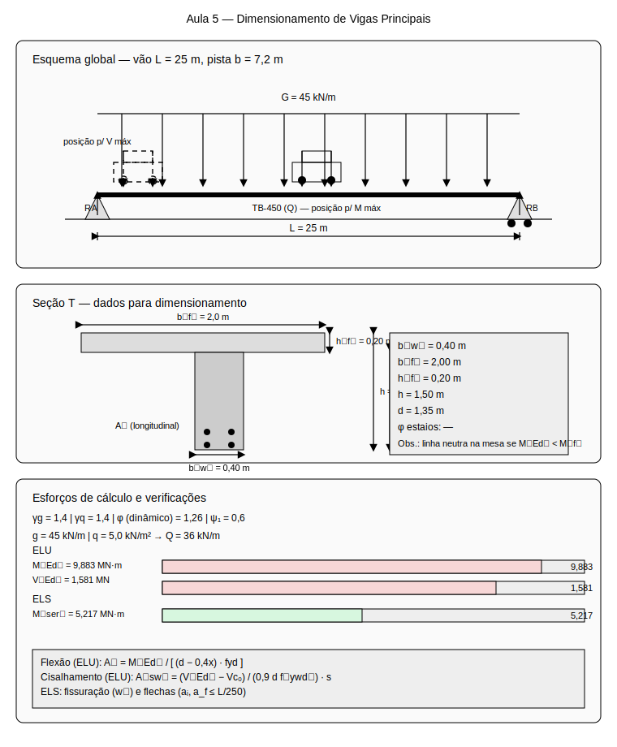

# Aula 5: Dimensionamento de Vigas Principais

## Estudo de Caso

Ponte rodoviária de vão único ($L = 25\,\mathrm{m}$) com viga principal de concreto armado. Dimensionar a viga para os esforços obtidos sob carga móvel TB-450 posicionada criticamente, incluindo verificação ELU (flexão e cisalhamento) e ELS (fissuração e flechas).

Dados do projeto:

- Vão: $L = 25\,\mathrm{m}$
- Largura da pista: $b = 7{,}2\,\mathrm{m}$
- Carga permanente: $g = 45{,}0\,\mathrm{kN/m}$
- Carga móvel: $q = 5{,}0\,\mathrm{kN/m^2}$
- Fator dinâmico: $\varphi = 1{,}26$

### Esquema do caso

Leitura do esquema:

- Viga principal com seção T
- Posicionamento crítico do TB-450
- Esforços máximos para dimensionamento
- Verificações ELU e ELS

## Conceitos principais

### Esforços de Dimensionamento

**Momento de cálculo (ELU)**:
$$M_{Ed} = \gamma_g \frac{gL^2}{8} + \gamma_q \varphi \frac{qL^2}{8}$$

**Cortante de cálculo (ELU)**:
$$V_{Ed} = \gamma_g \frac{gL}{2} + \gamma_q \varphi \frac{qL}{2}$$

**Momento de serviço (ELS)**:
$$M_{ser} = \frac{gL^2}{8} + \psi_1 \varphi \frac{qL^2}{8}$$

### Dimensionamento à Flexão (ELU)

**Domínios de deformação**:

- Domínio 2: $0{,}259 \leq x/d \leq 0{,}628$ (armadura simples)
- Domínio 3: $0{,}628 < x/d \leq 1{,}0$ (armadura simples)
- Domínio 4: $x/d > 1{,}0$ (armadura dupla)

**Armadura longitudinal**:
$$A_s = \frac{M_{Ed}}{z \cdot f_{yd}}$$

Onde:

- $z = d - 0{,}4x$ (braço de alavanca)
- $f_{yd} = f_{yk}/\gamma_s$ (tensão de cálculo do aço)

### Dimensionamento ao Cisalhamento (ELU)

**Modelo de cálculo I (NBR 6118:2014)**:
$$V_{Rd2} = 0{,}27 \alpha_v f_{cd} b_w d$$

$$V_{c0} = 0{,}6 f_{ctd} b_w d$$

$$A_{sw} = \frac{V_{Ed} - V_{c0}}{0{,}9 d f_{ywd}} \cdot s$$

### Verificação de Fissuração (ELS)

**Abertura de fissuras**:
$$w_k = \beta \frac{\sigma_s}{E_s} \frac{\phi}{4 \rho_{cr}}$$

**Limites**:

- Ambiente I: $w_k \leq 0{,}4\,\mathrm{mm}$
- Ambiente II: $w_k \leq 0{,}3\,\mathrm{mm}$
- Ambiente III: $w_k \leq 0{,}2\,\mathrm{mm}$

### Verificação de Flechas (ELS)

**Flecha imediata**:
$$a_i = \frac{5}{384} \frac{qL^4}{EI}$$

**Flecha diferida**:
$$a_f = a_i (1 + \phi)$$

**Limite**:
$$a_{lim} = \frac{L}{250}$$

## Exemplo de cálculo do case

### 1) Esforços de Dimensionamento

**Momento de cálculo (ELU)**:
$$M_{Ed} = 1{,}4 \times \frac{45{,}0 \times 625}{8} + 1{,}4 \times 1{,}26 \times \frac{36{,}0 \times 625}{8}$$

$$M_{Ed} = 4921{,}9 + 4961{,}3 = 9883{,}2\,\mathrm{kN \cdot m}$$

**Cortante de cálculo (ELU)**:
$$V_{Ed} = 1{,}4 \times \frac{45{,}0 \times 25}{2} + 1{,}4 \times 1{,}26 \times \frac{36{,}0 \times 25}{2}$$

$$V_{Ed} = 787{,}5 + 793{,}8 = 1581{,}3\,\mathrm{kN}$$

**Momento de serviço (ELS)**:
$$M_{ser} = \frac{45{,}0 \times 625}{8} + 0{,}6 \times 1{,}26 \times \frac{36{,}0 \times 625}{8}$$

$$M_{ser} = 3515{,}6 + 1701{,}0 = 5216{,}6\,\mathrm{kN \cdot m}$$

### 2) Dimensionamento à Flexão

**Dados da seção**:

- $b_w = 0{,}4\,\mathrm{m}$ (largura da alma)
- $b_f = 2{,}0\,\mathrm{m}$ (largura da mesa)
- $h_f = 0{,}2\,\mathrm{m}$ (espessura da mesa)
- $h = 1{,}5\,\mathrm{m}$ (altura total)
- $d = 1{,}35\,\mathrm{m}$ (altura útil)

**Verificação da mesa**:
$$M_{f} = 0{,}85 f_{cd} b_f h_f (d - h_f/2)$$

$$M_{f} = 0{,}85 \times 25{,}0 \times 2{,}0 \times 0{,}2 \times (1{,}35 - 0{,}1) = 10{,}6\,\mathrm{MN \cdot m}$$

Como $M_{Ed} = 9{,}88\,\mathrm{MN \cdot m} < M_{f} = 10{,}6\,\mathrm{MN \cdot m}$, a linha neutra está na mesa.

**Cálculo da armadura**:
$$x = d - \sqrt{d^2 - \frac{2M_{Ed}}{0{,}85 f_{cd} b_f}}$$

$$x = 1{,}35 - \sqrt{1{,}35^2 - \frac{2 \times 9{,}88}{0{,}85 \times 25{,}0 \times 2{,}0}} = 0{,}15\,\mathrm{m}$$

$$A_s = \frac{M_{Ed}}{(d - 0{,}4x) f_{yd}} = \frac{9{,}88}{(1{,}35 - 0{,}4 \times 0{,}15) \times 435} = 0{,}0178\,\mathrm{m^2}$$

$$A_s = 178{,}0\,\mathrm{cm^2}$$

**Armadura mínima**:
$$A_{s,min} = 0{,}15\% \times b_w \times h = 0{,}0015 \times 0{,}4 \times 1{,}5 = 0{,}0009\,\mathrm{m^2}$$

$$A_{s,min} = 9{,}0\,\mathrm{cm^2} < A_s = 178{,}0\,\mathrm{cm^2}$$

Condição atendida (✓).

### 3) Dimensionamento ao Cisalhamento

**Verificação da biela**:
$$V_{Rd2} = 0{,}27 \times 1{,}0 \times 25{,}0 \times 0{,}4 \times 1{,}35 = 3{,}65\,\mathrm{MN}$$

$$V_{Ed} = 1{,}58\,\mathrm{MN} < V_{Rd2} = 3{,}65\,\mathrm{MN}$$

Condição atendida (✓).

**Contribuição do concreto**:
$$V_{c0} = 0{,}6 \times 2{,}0 \times 0{,}4 \times 1{,}35 = 0{,}65\,\mathrm{MN}$$

**Armadura transversal necessária**:
$$A_{sw} = \frac{1{,}58 - 0{,}65}{0{,}9 \times 1{,}35 \times 435} \times 0{,}20 = 0{,}00033\,\mathrm{m^2}$$

$$A_{sw} = 3{,}3\,\mathrm{cm^2/m}$$

**Espaçamento máximo**:
$$s_{max} = 0{,}6 d = 0{,}6 \times 1{,}35 = 0{,}81\,\mathrm{m}$$

**Estribos**: $\phi 8{,}0\,\mathrm{mm}$ c/ $20\,\mathrm{cm}$

### 4) Verificação de Fissuração (ELS)

**Tensão no aço**:
$$\sigma_s = \frac{M_{ser}}{A_s (d - x/3)} = \frac{5{,}22}{0{,}0178 \times (1{,}35 - 0{,}15/3)} = 220{,}0\,\mathrm{MPa}$$

**Abertura de fissuras**:
$$w_k = 1{,}2 \times \frac{220{,}0}{210000} \times \frac{25{,}0}{4 \times 0{,}013} = 0{,}24\,\mathrm{mm}$$

**Verificação**:
$$w_k = 0{,}24\,\mathrm{mm} < w_{lim} = 0{,}4\,\mathrm{mm}$$

Condição atendida (✓).

### 5) Verificação de Flechas (ELS)

**Momento de inércia**:
$$I = \frac{b_f h^3}{12} = \frac{2{,}0 \times 1{,}5^3}{12} = 0{,}5625\,\mathrm{m^4}$$

**Flecha imediata**:
$$a_i = \frac{5}{384} \times \frac{81{,}0 \times 25^4}{21000 \times 0{,}5625} = 0{,}035\,\mathrm{m}$$

**Flecha diferida**:
$$\phi = 2{,}0 \text{ (coeficiente de fluência)}$$

$$a_f = 0{,}035 \times (1 + 2{,}0) = 0{,}105\,\mathrm{m}$$

**Verificação**:
$$a_f = 0{,}105\,\mathrm{m} < a_{lim} = \frac{25}{250} = 0{,}100\,\mathrm{m}$$ ✗

**Necessário**: Aumentar a altura da viga ou usar concreto protendido.

### 6) Detalhamento da Armadura

**Armadura longitudinal**:

- $A_s = 178{,}0\,\mathrm{cm^2}$
- Distribuição: $20 \phi 32{,}0\,\mathrm{mm}$ (160{,}8\,\mathrm{cm^2})
- Camadas: 2 camadas de 10 barras

**Armadura transversal**:

- Estribos: $\phi 8{,}0\,\mathrm{mm}$ c/ $20\,\mathrm{cm}$
- Espaçamento máximo: $s_{max} = 0{,}81\,\mathrm{m}$

**Ancoragem**:

- Comprimento básico: $l_b = 40 \phi = 40 \times 3{,}2 = 128{,}0\,\mathrm{cm}$
- Comprimento necessário: $l_{b,nec} = 0{,}7 l_b = 89{,}6\,\mathrm{cm}$

## Interpretação dos Resultados

- Flexão: a mesa da seção T absorve boa parte de M_Ed → linha neutra na mesa.
- Cisalhamento: verificação da biela comprimida define limite superior de V_Ed.
- ELS: w_k e a dentro dos limites indicam durabilidade e conforto adequados.
- Controles típicos: para vãos maiores, flecha tende a governar; para seções mais baixas, cisalhamento pode ser crítico.

## Metodologia de Cálculo

1. Calcular M_Ed e V_Ed com combinações normativas (ELU).
2. Verificar se a linha neutra está na mesa ou na alma (seção T).
3. Dimensionar A_s com braço de alavanca z e checar domínio de deformações.
4. Verificar V_Rd2, V_c0 e dimensionar A_sw; conferir estribos e espaçamentos.
5. Verificar ELS: w_k (tensão no aço, diâmetro, taxa) e flechas (a_i, a_f).
6. Ajustar dimensões/armaduras conforme controles dominantes.

## Exercícios Propostos

- Para L=30 m, avalie o impacto de aumentar h em 10% sobre M_Ed, V_Ed e a.
- Dimensione A_sw para V_def=120 kN e compare alternativas de estribos (ϕ, s).
- Explore a sensibilidade de w_k ao diâmetro de barra e taxa de armadura.

## Erros comuns (evite)

- Não verificar a biela de compressão no cisalhamento
- Esquecer a armadura mínima de flexão
- Não considerar o espaçamento máximo dos estribos
- Ignorar a verificação de flechas em vãos grandes

## Encaminhamentos

- Pratique o dimensionamento para diferentes seções transversais
- Analise o efeito da altura da viga nas verificações
- Próxima aula: transversinas e tabuleiros de ponte
