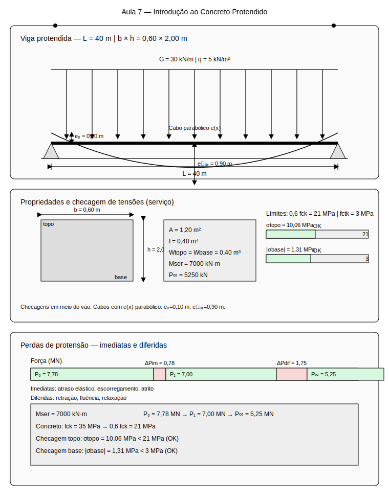

# Aula 7: Introdução ao Concreto Protendido

## Estudo de Caso
Ponte rodoviária de vão único ($L = 40\,\mathrm{m}$) em concreto protendido. Dimensionar a força de protensão e excentricidade do cabo para atender às verificações de tensões em serviço, considerando perdas imediatas e diferidas.

Dados do projeto:
- Vão: $L = 40\,\mathrm{m}$
- Seção: retangular $b \times h = 0{,}6 \times 2{,}0\,\mathrm{m}$
- Carga permanente: $g = 30{,}0\,\mathrm{kN/m}$
- Carga móvel: $q = 5{,}0\,\mathrm{kN/m^2}$
- Concreto: $f_{ck} = 35\,\mathrm{MPa}$

### Esquema do caso (SVG)

Leitura do esquema:
- Viga protendida com cabo parabólico
- Excentricidade variável ao longo do vão
- Tensões de protensão e cargas externas
- Verificação de tensões em serviço

## Conceitos principais

### Pré-tração vs Pós-tração

**Pré-tração**:
- Cabos tensionados antes da concretagem
- Aplicação: elementos pré-fabricados
- Vantagens: controle de qualidade, industrialização
- Limitações: vãos limitados, geometria fixa

**Pós-tração**:
- Cabos tensionados após a concretagem
- Aplicação: pontes, edifícios, estruturas especiais
- Vantagens: flexibilidade geométrica, vãos grandes
- Limitações: complexidade construtiva, manutenção

### Perdas de Protensão

**Perdas Imediatas**:
- Atraso elástico: $\Delta P_{el} = \alpha_p \sigma_{c,p}$
- Escorregamento: $\Delta P_{esc} = \frac{E_p A_p \Delta l}{L}$
- Atrito: $\Delta P_{atr} = P_0 (1 - e^{-\mu \alpha})$

**Perdas Diferidas**:
- Retração: $\Delta P_{ret} = \varepsilon_{cs} E_p A_p$
- Fluência: $\Delta P_{flu} = \phi \sigma_{c,p} E_p A_p$
- Relaxação: $\Delta P_{rel} = \psi P_0$

### Traçado do Cabo

**Excentricidade**:
- Função da geometria da estrutura
- Consideração das tensões admissíveis
- Otimização da força de protensão

**Cabo parabólico**:
$$e(x) = e_0 + \frac{4(e_{\max} - e_0)}{L^2} x (L - x)$$

Onde:
- $e_0$ = excentricidade nos apoios
- $e_{\max}$ = excentricidade máxima (meio do vão)

### Verificação de Tensões

**Tensão no topo**:
$$\sigma_{topo} = \frac{N_p}{A} - \frac{M_p}{W_{topo}} + \frac{M_{ext}}{W_{topo}}$$

**Tensão na base**:
$$\sigma_{base} = \frac{N_p}{A} + \frac{M_p}{W_{base}} - \frac{M_{ext}}{W_{base}}$$

**Limites**:
- Compressão: $\sigma_c \leq 0{,}6 f_{ck}$
- Tração: $\sigma_t \leq f_{ctk}$

## Exemplo de cálculo do case

### 1) Esforços de Cálculo

**Momento de serviço**:
$$M_{ser} = \frac{g L^2}{8} + \frac{q L^2}{8} = \frac{30{,}0 \times 1600}{8} + \frac{5{,}0 \times 1600}{8} = 6000 + 1000 = 7000\,\mathrm{kN \cdot m}$$

**Cortante de serviço**:
$$V_{ser} = \frac{g L}{2} + \frac{q L}{2} = \frac{30{,}0 \times 40}{2} + \frac{5{,}0 \times 40}{2} = 600 + 100 = 700\,\mathrm{kN}$$

### 2) Propriedades da Seção

**Área da seção**:
$$A = b \times h = 0{,}6 \times 2{,}0 = 1{,}2\,\mathrm{m^2}$$

**Momento de inércia**:
$$I = \frac{b h^3}{12} = \frac{0{,}6 \times 8{,}0}{12} = 0{,}4\,\mathrm{m^4}$$

**Módulos de resistência**:
$$W_{topo} = W_{base} = \frac{I}{h/2} = \frac{0{,}4}{1{,}0} = 0{,}4\,\mathrm{m^3}$$

### 3) Dimensionamento da Protensão

**Excentricidade máxima**:
$$e_{\max} = \frac{h}{2} - 0{,}1 = 1{,}0 - 0{,}1 = 0{,}9\,\mathrm{m}$$

**Excentricidade nos apoios**:
$$e_0 = 0{,}1\,\mathrm{m}$$

**Força de protensão necessária**:
$$P_0 = \frac{M_{ser}}{e_{\max}} = \frac{7000}{0{,}9} = 7777{,}8\,\mathrm{kN}$$

**Área de aço necessária**:
$$A_p = \frac{P_0}{f_{ptk}} = \frac{7777{,}8}{1900} = 4{,}09\,\mathrm{m^2}$$

**Número de cordoalhas**:
$$n = \frac{A_p}{A_{cordoalha}} = \frac{4{,}09}{0{,}0001} = 40{,}9 \approx 41 \text{ cordoalhas}$$

### 4) Perdas de Protensão

**Perdas imediatas**:
- Atraso elástico: $\Delta P_{el} = 0{,}05 P_0 = 0{,}05 \times 7777{,}8 = 388{,}9\,\mathrm{kN}$
- Escorregamento: $\Delta P_{esc} = 0{,}03 P_0 = 0{,}03 \times 7777{,}8 = 233{,}3\,\mathrm{kN}$
- Atrito: $\Delta P_{atr} = 0{,}02 P_0 = 0{,}02 \times 7777{,}8 = 155{,}6\,\mathrm{kN}$

**Perdas imediatas totais**:
$$\Delta P_{im} = 388{,}9 + 233{,}3 + 155{,}6 = 777{,}8\,\mathrm{kN}$$

**Força após perdas imediatas**:
$$P_1 = P_0 - \Delta P_{im} = 7777{,}8 - 777{,}8 = 7000{,}0\,\mathrm{kN}$$

**Perdas diferidas**:
- Retração: $\Delta P_{ret} = 0{,}08 P_1 = 0{,}08 \times 7000{,}0 = 560{,}0\,\mathrm{kN}$
- Fluência: $\Delta P_{flu} = 0{,}12 P_1 = 0{,}12 \times 7000{,}0 = 840{,}0\,\mathrm{kN}$
- Relaxação: $\Delta P_{rel} = 0{,}05 P_1 = 0{,}05 \times 7000{,}0 = 350{,}0\,\mathrm{kN}$

**Perdas diferidas totais**:
$$\Delta P_{dif} = 560{,}0 + 840{,}0 + 350{,}0 = 1750{,}0\,\mathrm{kN}$$

**Força final**:
$$P_{\infty} = P_1 - \Delta P_{dif} = 7000{,}0 - 1750{,}0 = 5250{,}0\,\mathrm{kN}$$

### 5) Verificação de Tensões

**Tensão no topo (meio do vão)**:
$$\sigma_{topo} = \frac{P_{\infty}}{A} - \frac{P_{\infty} e_{\max}}{W_{topo}} + \frac{M_{ser}}{W_{topo}}$$

$$\sigma_{topo} = \frac{5250{,}0}{1{,}2} - \frac{5250{,}0 \times 0{,}9}{0{,}4} + \frac{7000}{0{,}4}$$

$$\sigma_{topo} = 4375{,}0 - 11812{,}5 + 17500 = 10062{,}5\,\mathrm{kPa} = 10{,}06\,\mathrm{MPa}$$

**Tensão na base (meio do vão)**:
$$\sigma_{base} = \frac{P_{\infty}}{A} + \frac{P_{\infty} e_{\max}}{W_{base}} - \frac{M_{ser}}{W_{base}}$$

$$\sigma_{base} = \frac{5250{,}0}{1{,}2} + \frac{5250{,}0 \times 0{,}9}{0{,}4} - \frac{7000}{0{,}4}$$

$$\sigma_{base} = 4375{,}0 + 11812{,}5 - 17500 = -1312{,}5\,\mathrm{kPa} = -1{,}31\,\mathrm{MPa}$$

### 6) Verificação dos Limites

**Limite de compressão**:
$$\sigma_c \leq 0{,}6 f_{ck} = 0{,}6 \times 35 = 21{,}0\,\mathrm{MPa}$$

**Verificação**:
$$\sigma_{topo} = 10{,}06\,\mathrm{MPa} < 21{,}0\,\mathrm{MPa}$$ ✓

**Limite de tração**:
$$\sigma_t \leq f_{ctk} = 3{,}0\,\mathrm{MPa}$$

**Verificação**:
$$|\sigma_{base}| = 1{,}31\,\mathrm{MPa} < 3{,}0\,\mathrm{MPa}$$ ✓

### 7) Otimização da Protensão

**Força mínima necessária**:
$$P_{min} = \frac{M_{ser}}{e_{\max}} = \frac{7000}{0{,}9} = 7777{,}8\,\mathrm{kN}$$

**Força máxima admissível**:
$$P_{max} = \frac{0{,}6 f_{ck} A}{1 + \frac{e_{\max}}{h/2}} = \frac{0{,}6 \times 35 \times 1{,}2}{1 + \frac{0{,}9}{1{,}0}} = 13{,}26\,\mathrm{MN}$$

**Força adotada**:
$$P_0 = 7777{,}8\,\mathrm{kN} < P_{max} = 13260{,}0\,\mathrm{kN}$$ ✓

### 8) Detalhamento

**Cordoalhas**:
- Número: 41 cordoalhas $\phi 12{,}7\,\mathrm{mm}$
- Força por cordoalha: $P_{cordoalha} = 190{,}0\,\mathrm{kN}$
- Força total: $P_0 = 41 \times 190{,}0 = 7790{,}0\,\mathrm{kN}$

**Traçado do cabo**:
- Excentricidade máxima: $e_{\max} = 0{,}9\,\mathrm{m}$
- Excentricidade nos apoios: $e_0 = 0{,}1\,\mathrm{m}$
- Equação: $e(x) = 0{,}1 + \frac{4 \times 0{,}8}{40^2} x (40 - x)$

**Ancoragem**:
- Comprimento de ancoragem: $l_b = 1{,}0\,\mathrm{m}$
- Bloco de ancoragem: $0{,}6 \times 0{,}6 \times 0{,}3\,\mathrm{m}$

## Erros comuns (evite)

- Não considerar as perdas de protensão
- Ignorar a verificação de tensões em serviço
- Não otimizar a excentricidade do cabo
- Esquecer a verificação dos limites de tensão

## Encaminhamentos

- Pratique o dimensionamento para diferentes traçados de cabo
- Analise o efeito das perdas na eficiência da protensão
- Próxima aula: estudo de caso nacional sobre acidentes estruturais