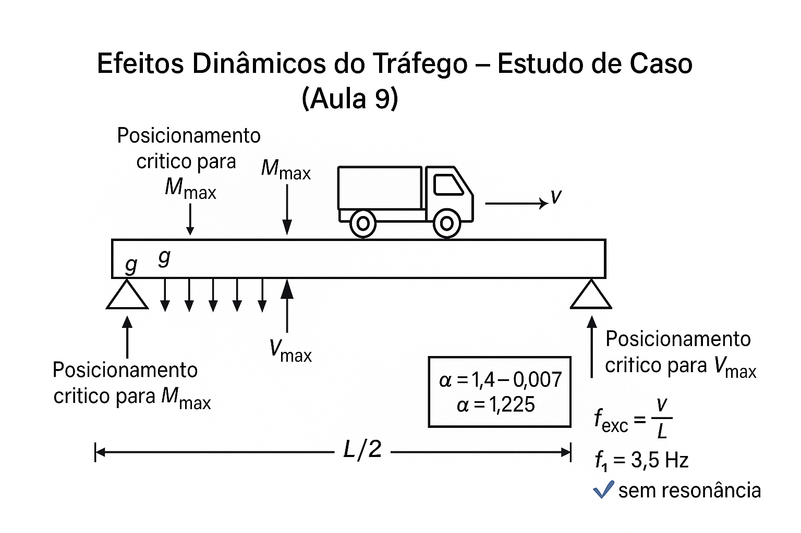

# Aula 9: Ações Dinâmicas e Fator de Impacto

## Objetivos da Aula

Ao final desta aula, o aluno será capaz de:
- Entender a natureza dinâmica das cargas móveis e seus efeitos
- Calcular o fator dinâmico (NBR 7188) e aplicá-lo corretamente
- Comparar esforços estáticos vs dinâmicos e avaliar ressonância
- Posicionar criticamente o veículo para M_max e V_max

## Estudo de Caso

Ponte rodoviária de vão único ($L = 25\,\mathrm{m}$) em concreto armado. Analisar os efeitos dinâmicos do tráfego sobre a estrutura, incluindo o cálculo do fator dinâmico, comparação entre esforços estáticos e dinâmicos, e posicionamento crítico do veículo para $M_{\max}$ e $V_{\max}$.

Dados do projeto:

- Vão: $L = 25\,\mathrm{m}$
- Carga permanente: $g = 35{,}0\,\mathrm{kN/m}$
- Carga móvel: $q = 5{,}0\,\mathrm{kN/m^2}$
- Velocidade do veículo: $v = 80\,\mathrm{km/h}$
- Frequência natural: $f_1 = 3{,}5\,\mathrm{Hz}$

### Esquema do caso

Leitura do esquema:

- Ponte sob carga móvel em movimento
- Efeitos dinâmicos e estáticos
- Posicionamento crítico do veículo
- Fator dinâmico aplicado

## Conceitos principais

### Natureza do Carregamento Móvel

**Características dinâmicas**:

- Cargas variáveis no tempo
- Efeitos de inércia
- Interação veículo-estrutura
- Velocidade de deslocamento

**Variabilidade temporal**:

- Cargas instantâneas
- Efeitos de ressonância
- Amortecimento estrutural
- Frequências naturais

### Conceito de Fator Dinâmico

**Definição**:
$$\varphi = \frac{M_{dinâmico}}{M_{estático}} = \frac{V_{dinâmico}}{V_{estático}}$$

**Fatores influenciadores**:

- Velocidade do veículo
- Frequência natural da estrutura
- Amortecimento
- Rugosidade da pista

**Aplicação prática**:

- Amplificação das cargas estáticas
- Consideração dos efeitos dinâmicos
- Verificação de segurança

### Cálculo do Fator Dinâmico

**Fórmula da NBR 7188:2022**:
$$\varphi = 1{,}4 - 0{,}007 \times L$$

**Para $L = 25\,\mathrm{m}$**:
$$\varphi = 1{,}4 - 0{,}007 \times 25 = 1{,}225$$

**Limitações**:

- Valor mínimo: $\varphi = 1{,}0$
- Valor máximo: $\varphi = 1{,}4$
- Aplicação: apenas cargas móveis

### Posicionamento Crítico

**Para momento máximo**:

- Veículo no centro do vão
- Carga distribuída em todo o vão
- Aplicação do fator dinâmico

**Para cortante máximo**:

- Veículo próximo ao apoio
- Carga distribuída em todo o vão
- Aplicação do fator dinâmico

## Exemplo de cálculo do case

### 1) Esforços Estáticos

**Momento estático**:
$$M_{est} = \frac{g L^2}{8} + \frac{q L^2}{8} = \frac{35{,}0 \times 625}{8} + \frac{5{,}0 \times 625}{8} = 2734{,}4 + 390{,}6 = 3125{,}0\,\mathrm{kN \cdot m}$$

**Cortante estático**:
$$V_{est} = \frac{g L}{2} + \frac{q L}{2} = \frac{35{,}0 \times 25}{2} + \frac{5{,}0 \times 25}{2} = 437{,}5 + 62{,}5 = 500{,}0\,\mathrm{kN}$$

### 2) Fator Dinâmico

**Cálculo**:
$$\varphi = 1{,}4 - 0{,}007 \times 25 = 1{,}225$$

**Verificação**:
$$1{,}0 \leq \varphi = 1{,}225 \leq 1{,}4$$

Condição atendida (✓).

### 3) Esforços Dinâmicos

**Momento dinâmico**:
$$M_{din} = \frac{g L^2}{8} + \varphi \frac{q L^2}{8} = \frac{35{,}0 \times 625}{8} + 1{,}225 \times \frac{5{,}0 \times 625}{8}$$

$$M_{din} = 2734{,}4 + 478{,}5 = 3212{,}9\,\mathrm{kN \cdot m}$$

**Cortante dinâmico**:
$$V_{din} = \frac{g L}{2} + \varphi \frac{q L}{2} = \frac{35{,}0 \times 25}{2} + 1{,}225 \times \frac{5{,}0 \times 25}{2}$$

$$V_{din} = 437{,}5 + 76{,}6 = 514{,}1\,\mathrm{kN}$$

### 4) Comparação Estático vs Dinâmico

**Amplificação do momento**:
$$\Delta M = M_{din} - M_{est} = 3212{,}9 - 3125{,}0 = 87{,}9\,\mathrm{kN \cdot m}$$

**Percentual de amplificação**:
$$\Delta M\% = \frac{\Delta M}{M_{est}} \times 100 = \frac{87{,}9}{3125{,}0} \times 100 = 2{,}8\%$$

**Amplificação do cortante**:
$$\Delta V = V_{din} - V_{est} = 514{,}1 - 500{,}0 = 14{,}1\,\mathrm{kN}$$

**Percentual de amplificação**:
$$\Delta V\% = \frac{\Delta V}{V_{est}} \times 100 = \frac{14{,}1}{500{,}0} \times 100 = 2{,}8\%$$

### 5) Posicionamento Crítico para $M_{\max}$

**Veículo no centro do vão**:

- Carga concentrada: $P = 450\,\mathrm{kN}$
- Carga distribuída: $q = 5{,}0\,\mathrm{kN/m^2}$
- Fator dinâmico: $\varphi = 1{,}225$

**Momento máximo**:
$$M_{\max} = \frac{g L^2}{8} + \varphi \frac{P L}{4} + \varphi \frac{q L^2}{8}$$

$$M_{\max} = \frac{35{,}0 \times 625}{8} + 1{,}225 \times \frac{450 \times 25}{4} + 1{,}225 \times \frac{5{,}0 \times 625}{8}$$

$$M_{\max} = 2734{,}4 + 3445{,}3 + 478{,}5 = 6658{,}2\,\mathrm{kN \cdot m}$$

### 6) Posicionamento Crítico para $V_{\max}$

**Veículo próximo ao apoio**:

- Carga concentrada: $P = 450\,\mathrm{kN}$
- Carga distribuída: $q = 5{,}0\,\mathrm{kN/m^2}$
- Fator dinâmico: $\varphi = 1{,}225$

**Cortante máximo**:
$$V_{\max} = \frac{g L}{2} + \varphi P + \varphi \frac{q L}{2}$$

$$V_{\max} = \frac{35{,}0 \times 25}{2} + 1{,}225 \times 450 + 1{,}225 \times \frac{5{,}0 \times 25}{2}$$

$$V_{\max} = 437{,}5 + 551{,}3 + 76{,}6 = 1065{,}4\,\mathrm{kN}$$

### 7) Efeitos de Ressonância

**Frequência natural da estrutura**:
$$f_1 = 3{,}5\,\mathrm{Hz}$$

**Frequência de excitação**:
$$f_{exc} = \frac{v}{L} = \frac{80/3{,}6}{25} = 0{,}89\,\mathrm{Hz}$$

**Razão de frequências**:
$$\frac{f_{exc}}{f_1} = \frac{0{,}89}{3{,}5} = 0{,}25$$

**Verificação de ressonância**:
$$\frac{f_{exc}}{f_1} = 0{,}25 < 0{,}5$$

Sem ressonância (✓).

### 8) Verificação de Segurança

**Momento de cálculo**:
$$M_{Ed} = \gamma_g \frac{g L^2}{8} + \gamma_q \varphi \frac{q L^2}{8}$$

$$M_{Ed} = 1{,}4 \times \frac{35{,}0 \times 625}{8} + 1{,}4 \times 1{,}225 \times \frac{5{,}0 \times 625}{8}$$

$$M_{Ed} = 3828{,}1 + 669{,}9 = 4498{,}0\,\mathrm{kN \cdot m}$$

**Cortante de cálculo**:
$$V_{Ed} = \gamma_g \frac{g L}{2} + \gamma_q \varphi \frac{q L}{2}$$

$$V_{Ed} = 1{,}4 \times \frac{35{,}0 \times 25}{2} + 1{,}4 \times 1{,}225 \times \frac{5{,}0 \times 25}{2}$$

$$V_{Ed} = 612{,}5 + 107{,}2 = 719{,}7\,\mathrm{kN}$$

## Interpretação dos Resultados

- O acréscimo dinâmico de ~2,8% indica regime longe de ressonância para L=25 m.
- M e V dinâmicos só amplificam a parcela móvel; G permanece estática.
- Critérios de ressonância: manter f_exc/f_1 suficientemente afastado de 1.
- Em verificação de segurança, a combinação com φ garante margem em serviço.

## Metodologia de Cálculo

1. Calcular G e Q; obter φ pela NBR 7188.
2. Avaliar M_est, V_est e aplicar φ apenas à parcela móvel para M_din, V_din.
3. Verificar ressonância: f_exc = v/L e razão f_exc/f_1; conferir amortecimento.
4. Montar combinações ELU/ELS com φ e verificar resultados críticos.
5. Posicionar o veículo para maximizar M ou V conforme o objetivo.

## Exercícios Propostos

- Repita o caso para L=20 m e L=35 m e compare φ e ΔM%.
- Para v=100 km/h e f_1=3,0 Hz, avalie f_exc/f_1 e risco de ressonância.
- Discuta estratégias de mitigação (aumento de f_1, rugosidade, amortecimento).

### 9) Análise de Sensibilidade

**Variação da velocidade**:

- $v = 60\,\mathrm{km/h}$: $\varphi = 1{,}225$ (mesmo valor)
- $v = 100\,\mathrm{km/h}$: $\varphi = 1{,}225$ (mesmo valor)

**Variação do vão**:

- $L = 20\,\mathrm{m}$: $\varphi = 1{,}4 - 0{,}007 \times 20 = 1{,}26$
- $L = 30\,\mathrm{m}$: $\varphi = 1{,}4 - 0{,}007 \times 30 = 1{,}19$

**Variação da frequência natural**:

- $f_1 = 2{,}0\,\mathrm{Hz}$: risco de ressonância
- $f_1 = 5{,}0\,\mathrm{Hz}$: sem risco de ressonância

## Erros comuns (evite)

- Aplicar o fator dinâmico às cargas permanentes
- Não considerar o posicionamento crítico do veículo
- Ignorar os efeitos de ressonância
- Usar coeficientes de segurança incorretos

## Encaminhamentos

- Pratique o cálculo do fator dinâmico para diferentes vãos
- Analise os efeitos de ressonância em estruturas flexíveis
- Próxima aula: vibrações e frequência natural
