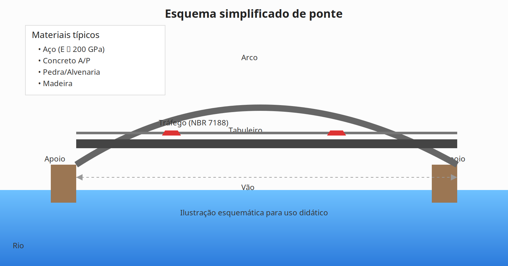

## Aula 1 – História e evolução das pontes; materiais

##### Objetivos da aula
- Reconhecer marcos históricos e tipologias básicas de pontes.
- Identificar materiais usuais (madeira, pedra, aço, concreto A/P) e suas propriedades.
- Relacionar critérios de escolha de material/tipologia com vão, ambiente e construtibilidade.

##### Texto-base da aula

### Visão geral
Pontes conectam pessoas e economias. Nesta aula, apresentamos: panorama histórico, materiais mais usados e critérios básicos para escolher tipologia e material conforme o contexto do projeto.

### Pontos‑chave
- Tipologias evoluem com materiais e métodos construtivos.
- Propriedades mecânicas guiam forma e detalhes.
- Ambiente e durabilidade são decisivos na escolha.
- Normas NBR 7187/7188/6118 estruturam o dimensionamento.

### História em resumo
- Antiguidade: arcos em alvenaria (romanos) exploram compressão para vencer vãos com robustez.
- Revolução Industrial: ferro e aço viabilizam treliças e grandes arcos metálicos.
- Séculos XIX–XX: concreto armado e protendido permitem seções racionais e vãos maiores.
- Atualidade: sistemas estaiados e suspensos para vãos muito longos; compósitos (CFRP/GFRP) em reforço.

### Materiais e aplicações
- Madeira: leve/sustentável; adequada a vãos curtos; proteção contra umidade/biodegradação.
- Pedra/alvenaria: excelente em compressão; aplicação clássica em arcos.
- Aço: alta resistência e ductilidade; atenção a corrosão e fadiga.
- Concreto armado (CA): tração pelas armaduras; verificação em ELU/ELS (NBR 6118).
- Concreto protendido (CP): reduz tração/flechas; considerar perdas imediatas e diferidas.

### Propriedades e fórmulas essenciais
- Lei de Hooke: $\sigma = E\,\varepsilon$.
- Flexão (seção homogênea): $\sigma = \dfrac{M\,y}{I}$.
- Referência: $E\_{aço} \approx 200\,\text{GPa}$; $E\_c$ estimado pela NBR 6118 em função de $f\_{ck}$.

### Critérios de seleção (tipologia/material)
- Vão e esquema: vigas (curtos/médios), arcos/estaiadas/suspensas (longos).
- Ambiente/durabilidade: cloretos, gelo/degelo; cobrimento, proteção e materiais.
- Construtibilidade: acessos, escoramentos, etapas e equipamentos.
- Manutenção/ciclo de vida e inserção urbana/ambiental.

### Exemplo numérico rápido
Objetivo: estimar a tensão de flexão no topo de uma viga‑tabuleiro idealizada como seção retangular.
- Dados: $M = 800\,\text{kN}\cdot\text{m}$; $b = 2{,}50\,\text{m}$; $h = 0{,}25\,\text{m}$; $y = h/2 = 0{,}125\,\text{m}$; $I = \dfrac{b h^3}{12} = \dfrac{2{,}50\cdot0{,}25^3}{12} \approx 0{,}003255\,\text{m}^4$.
- Cálculo: $\sigma = \dfrac{M\,y}{I} = \dfrac{800\times10^3\,\text{N}\cdot\text{m}\times0{,}125\,\text{m}}{0{,}003255\,\text{m}^4} \approx 30{,}7\,\text{MPa}$.
- Leitura: comparar com a resistência de cálculo do concreto e limites de ELS (NBR 6118).

### Figura didática

### Normas relacionadas
- NBR 7187: projeto/execução de pontes de concreto.
- NBR 7188: cargas móveis e efeitos dinâmicos.
- NBR 6118: materiais, ELU/ELS e detalhamento.

### Exemplos clássicos
- Arcos romanos; Iron Bridge (1779); Millau (estaiada); Brooklyn (suspensa).

##### Roteiro breve da videoaula (opcional)
- Abertura (1 min) → História (5–6 min)
- Materiais e propriedades (8 min)
- Critérios + normas (6–7 min) → Encerramento (2 min)

##### Atividade prática
Inventário e classificação de pontes locais
- Identifique 3 pontes na sua região (foto, local, vão estimado, material, tipologia).
- Justifique a classificação em 5–7 linhas por ponte.
- Entregue 1 PDF (1 página/ponte). Dica: use medição no mapa.

##### Links suplementares da Aula 1
- DNIT – Publicações: https://www.gov.br/dnit/pt-br
- ABNT – Catálogo (NBR 6118/7187/7188): https://www.abnt.org.br/
- Iron Bridge (contexto histórico): https://en.wikipedia.org/wiki/The_Iron_Bridge

 
