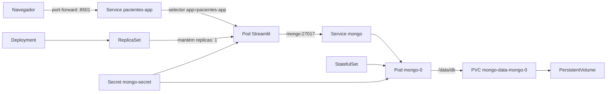

# Aula 3 — mapa dos manifests e demonstração ao vivo

Este guia usa o namespace `aula-pacientes` em todos os comandos. Execute os comandos a partir desta pasta.

## Mapa do caso



Fluxo da requisição:

```text
navegador → port-forward → Service do app → Pod Streamlit
                                               ↓
                                  Service mongo → mongo-0 → PVC
```

## Mapa arquivo por arquivo

| Arquivo | Recurso | O que ensina |
|---|---|---|
| `k8s/namespace.yaml` | Namespace | Isolamento lógico dos objetos da aula |
| `k8s/secret.yaml` | Secret | Injeção de usuário e senha nos containers |
| `k8s/mongo.yaml` | Service headless | DNS interno estável: `mongo` |
| `k8s/mongo.yaml` | StatefulSet | Identidade estável do banco: `mongo-0` |
| `k8s/mongo.yaml` | volumeClaimTemplates | PVC que preserva `/data/db` |
| `k8s/app.yaml` | Deployment | Estado desejado, ReplicaSet, rollout e self-healing |
| `k8s/app.yaml` | Service | Endereço estável para Pods descartáveis |

Labels são a cola entre os objetos:

```text
Deployment ──selector app=pacientes-app──> Pod Streamlit
Service app ─selector app=pacientes-app──> Pod Streamlit

StatefulSet ─selector app=mongo───────────> Pod mongo-0
Service DB ──selector app=mongo───────────> Pod mongo-0
```

O Service não procura um Pod pelo nome: ele procura todos os Pods cujas labels correspondem ao seu selector.

## Preparação

### 1. Verificar ferramentas

```bash
podman --version
podman-compose --version
kubectl version --client
minikube version
```

### 2. Criar o cluster local

Para Podman rootless:

```bash
minikube config set rootless true
minikube start --driver=podman --container-runtime=containerd \
  --cpus=2 --memory=4096
kubectl get nodes
```

Teste previamente essa etapa. Caso a combinação Minikube/Podman rootless apresente erro de artefatos KIC, use uma VM Linux ou outro cluster local já preparado para a aula.

### 3. Construir e carregar a imagem

```bash
podman build -t localhost/aula-pacientes:1.0 .
podman save -o /tmp/aula-pacientes-1.0.tar \
  localhost/aula-pacientes:1.0
minikube image load /tmp/aula-pacientes-1.0.tar
minikube image ls | grep aula-pacientes
```

### 4. Aplicar os manifests

```bash
kubectl apply -f k8s/namespace.yaml
kubectl apply -f k8s/secret.yaml
kubectl apply -f k8s/mongo.yaml
kubectl apply -f k8s/app.yaml

kubectl wait --for=condition=ready pod -l app=mongo \
  -n aula-pacientes --timeout=180s
kubectl wait --for=condition=available deployment/pacientes-app \
  -n aula-pacientes --timeout=180s
kubectl get all,pvc -n aula-pacientes
```

### 5. Abrir o Streamlit

Deixe o comando executando e acesse <http://localhost:8501>:

```bash
kubectl port-forward service/pacientes-app 8501:8501 \
  -n aula-pacientes
```

Cadastre um paciente fictício antes de demonstrar a persistência.

## Demo 1 — trocar um Pod e mostrar self-healing

Esta é a demonstração principal da Aula 3.

No Terminal 1:

```bash
kubectl get pods -n aula-pacientes -w
```

No Terminal 2:

```bash
POD_ANTIGO=$(kubectl get pod -n aula-pacientes \
  -l app=pacientes-app \
  -o jsonpath='{.items[0].metadata.name}')

echo "Pod antigo: $POD_ANTIGO"
kubectl delete pod "$POD_ANTIGO" -n aula-pacientes
```

Confirme a nova identidade:

```bash
kubectl get pods -l app=pacientes-app -n aula-pacientes \
  -o custom-columns='NOME:.metadata.name,INICIO:.status.startTime,FASE:.status.phase'
```

Pontos para narrar:

1. O Deployment declara `replicas: 1`.
2. Ao apagar o Pod, a realidade passa a ser zero réplicas.
3. O ReplicaSet reconcilia realidade e estado desejado.
4. O Pod novo recebe outro nome e IP.
5. O Service volta a encontrá-lo pela label `app=pacientes-app`.

O `port-forward` pode cair durante a troca. Execute-o novamente; isso não significa que o Service perdeu sua identidade dentro do cluster.

## Demo 2 — reiniciar o container sem trocar o Pod

Antes:

```bash
kubectl get pod -l app=pacientes-app -n aula-pacientes \
  -o custom-columns='POD:.metadata.name,RESTARTS:.status.containerStatuses[0].restartCount'
```

Encerre o processo principal:

```bash
kubectl exec deployment/pacientes-app -n aula-pacientes -- \
  sh -c 'kill 1'
```

Consulte novamente. O nome do Pod deve permanecer e `RESTARTS` deve aumentar:

```bash
kubectl get pod -l app=pacientes-app -n aula-pacientes \
  -o custom-columns='POD:.metadata.name,RESTARTS:.status.containerStatuses[0].restartCount'
```

Aqui foi o kubelet que reiniciou um container dentro do mesmo Pod. Na Demo 1, o controlador criou outro Pod.

## Demo 3 — escalar réplicas

```bash
kubectl scale deployment/pacientes-app --replicas=3 \
  -n aula-pacientes
kubectl get pods -l app=pacientes-app -n aula-pacientes -w
```

Mostrar os backends encontrados pelo Service:

```bash
kubectl get endpointslices \
  -l kubernetes.io/service-name=pacientes-app \
  -n aula-pacientes -o wide
```

Voltar para uma réplica:

```bash
kubectl scale deployment/pacientes-app --replicas=1 \
  -n aula-pacientes
```

## Demo 4 — trocar o Pod do Mongo e preservar dados

Depois de cadastrar um paciente fictício:

```bash
kubectl get pod mongo-0 -n aula-pacientes
kubectl get pvc mongo-data-mongo-0 -n aula-pacientes
kubectl delete pod mongo-0 -n aula-pacientes
kubectl get pods -n aula-pacientes -w
```

Aguardar a recuperação:

```bash
kubectl wait --for=condition=ready pod/mongo-0 \
  -n aula-pacientes --timeout=180s
kubectl get pvc mongo-data-mongo-0 -n aula-pacientes
```

Atualize a aplicação: o paciente continua presente porque o Pod novo montou o mesmo PVC. Não apague o PVC nessa demonstração.

## Demo 5 — rollout e rollback

Altere visualmente o título em `main.py` e crie a versão 1.1:

```bash
podman build -t localhost/aula-pacientes:1.1 .
podman save -o /tmp/aula-pacientes-1.1.tar \
  localhost/aula-pacientes:1.1
minikube image load /tmp/aula-pacientes-1.1.tar
```

Atualizar:

```bash
kubectl set image deployment/pacientes-app \
  app=localhost/aula-pacientes:1.1 -n aula-pacientes
kubectl rollout status deployment/pacientes-app -n aula-pacientes
kubectl rollout history deployment/pacientes-app -n aula-pacientes
```

Voltar à versão anterior:

```bash
kubectl rollout undo deployment/pacientes-app -n aula-pacientes
kubectl rollout status deployment/pacientes-app -n aula-pacientes
```

## Observabilidade e diagnóstico

```bash
# Visão geral
kubectl get all,pvc -n aula-pacientes

# Eventos em ordem cronológica
kubectl get events -n aula-pacientes \
  --sort-by='.metadata.creationTimestamp'

# Logs
kubectl logs -f deployment/pacientes-app -n aula-pacientes
kubectl logs mongo-0 -n aula-pacientes --tail=50

# Explicar probes, selectors e eventos
kubectl describe deployment pacientes-app -n aula-pacientes
kubectl describe pod mongo-0 -n aula-pacientes

# Testar o DNS interno mongo a partir do app
kubectl exec deployment/pacientes-app -n aula-pacientes -- \
  python -c "import socket; print(socket.gethostbyname('mongo'))"

# Mostrar controlador responsável por cada Pod
kubectl get pod -n aula-pacientes \
  -o custom-columns='POD:.metadata.name,CONTROLADOR:.metadata.ownerReferences[0].kind,NOME:.metadata.ownerReferences[0].name'
```

## Roteiro rápido para projetar

```bash
# Terminal 1: observação contínua
kubectl get pods -n aula-pacientes -w

# Terminal 2: substituir o Pod do app
kubectl delete pod -l app=pacientes-app -n aula-pacientes

# Escalar e reduzir
kubectl scale deployment/pacientes-app --replicas=3 -n aula-pacientes
kubectl get endpointslices -n aula-pacientes
kubectl scale deployment/pacientes-app --replicas=1 -n aula-pacientes

# Demonstrar a persistência do MongoDB
kubectl delete pod mongo-0 -n aula-pacientes
kubectl wait --for=condition=ready pod/mongo-0 \
  -n aula-pacientes --timeout=180s
kubectl get pvc -n aula-pacientes

# Revisar o que aconteceu
kubectl get events -n aula-pacientes \
  --sort-by='.metadata.creationTimestamp'
```

## Limpeza

Apagar o namespace remove a aplicação e também seu PVC:

```bash
kubectl delete namespace aula-pacientes
minikube stop
```

Para apagar o cluster local inteiro:

```bash
minikube delete
```
