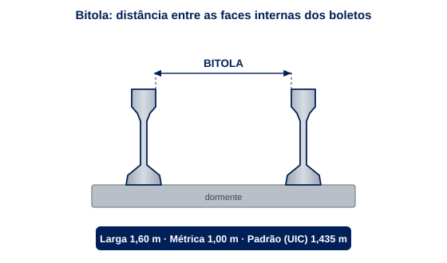

# Unidade 4 — Ferrovias

- **Disciplina:** Portos, Aeroportos e Ferrovias
- **Conteudista:** Afonso Cesar Lelis Brandão
- **Videoaulas desta unidade:** 13 a 16

## Aula 13 — Sistemas ferroviários: panorama, história e bitolas

Imagine um único trem de minério, na Estrada de Ferro Carajás, com mais de 3 km de comprimento, puxando o equivalente a milhares de caminhões. É esse o poder das ferrovias: mover muita carga, por longas distâncias, gastando pouca energia por tonelada transportada. Nesta unidade, fechamos a disciplina entrando no modal sobre trilhos. Hoje você vai entender de onde vem a ferrovia, como é a malha brasileira, o que significa a tal da "bitola" e como o Estado regula esse setor por meio da ANTT. Vamos do zero ao vocabulário profissional do engenheiro ferroviário.

### História e papel das ferrovias

A ferrovia nasceu com a Revolução Industrial. Em 1825, a Stockton & Darlington, na Inglaterra, inaugurou o transporte ferroviário de passageiros com tração a vapor, e em 1830 a Liverpool & Manchester consolidou o modelo. A locomotiva a vapor de George Stephenson, a *Rocket*, virou ícone. No Brasil, a primeira ferrovia foi inaugurada em 1854 por Irineu Evangelista de Sousa, o Barão de Mauá, ligando o porto de Mauá à raiz da Serra de Petrópolis, no Rio de Janeiro. Seguiram-se grandes obras como a São Paulo Railway (1867), que escoava o café do interior paulista até o porto de Santos.

O papel da ferrovia é estratégico: ela é o modal mais eficiente para **grandes volumes em médias e longas distâncias** — minério, grãos, combustíveis, contêineres. Sua eficiência energética é notável: um trem consome muito menos combustível por tonelada-quilômetro (t·km) do que o caminhão. Por isso, países continentais como EUA, Rússia, China e Índia apoiam fortemente sua economia de exportação no transporte ferroviário.


### A malha ferroviária brasileira

A malha ferroviária brasileira tem cerca de 30 mil km de extensão — número modesto para um país continental, fruto de décadas de priorização do rodoviário. A malha se concentra nas regiões Sudeste, Sul e em corredores de exportação. Entre as ferrovias mais relevantes estão:

- **Estrada de Ferro Carajás (EFC):** liga as minas de Carajás (PA) ao Porto de Ponta da Madeira, em São Luís (MA); 892 km em bitola larga, transporta mais de 150 milhões de toneladas de minério de ferro por ano — um dos maiores volumes ferroviários do mundo.
- **Estrada de Ferro Vitória a Minas (EFVM):** liga Minas Gerais ao Porto de Tubarão (ES); 905 km em bitola larga, considerado um dos corredores de minério mais produtivos do planeta; a Vale opera trens com até 330 vagões nesse corredor.
- **Ferrovia Norte-Sul (FNS):** eixo estruturante que corta o país de norte a sul, com mais de 1.700 km entregues e em expansão; integra regiões produtoras de grãos do Centro-Oeste e Norte aos portos do Arco Norte.
- **Rumo Logística (Malha Paulista, Malha Norte, Malha Sul e Malha Centro-Oeste):** maior concessionária ferroviária privada do Brasil, com cerca de 13.000 km de malha; escoam a produção de grãos, açúcar e derivados do Centro-Oeste e do Sul para portos como Santos e Paranaguá. Em 2023, a Rumo movimentou mais de 73 bilhões de t·km úteis.

O grande desafio brasileiro é a **baixa densidade** da malha e a **falta de integração** entre bitolas diferentes, herança histórica de concessões desconexas.

### Bitolas (larga, métrica, mista)

**Bitola** é a distância entre as faces internas dos dois trilhos de uma via. É um parâmetro fundamental: define com que outras ferrovias o material rodante pode circular. No Brasil convivem três situações:

| Tipo de bitola | Distância | Onde predomina |
| --- | --- | --- |
| **Larga** | $1{,}60\,\mathrm{m}$ | EFVM, EFC, malhas de minério e parte do Sudeste |
| **Métrica** | $1{,}00\,\mathrm{m}$ | maior parte da malha histórica brasileira |
| **Padrão (internacional)** | $1{,}435\,\mathrm{m}$ | novos projetos, alta velocidade, metrôs |

Atenção a um detalhe técnico que muita gente erra: a bitola **não** é medida de centro a centro dos trilhos, e sim entre as **faces internas dos boletos** (a $14\,\mathrm{mm}$ abaixo do topo do trilho, pela norma), justamente onde o friso da roda se aproxima.



A **bitola mista** resolve a convivência: assenta-se um terceiro trilho, de modo que veículos de bitolas diferentes circulem no mesmo trecho. A falta de padronização é um gargalo: trens de uma malha métrica não passam diretamente para uma malha larga, exigindo transbordo de carga e elevando custos logísticos.

### Concessões, regulação (ANTT) e o marco de 2021

Até a década de 1990, a malha era operada pela estatal RFFSA (Rede Ferroviária Federal S.A.), que entrou em colapso financeiro e técnico com mais de 30 mil km de via deteriorados. A partir de 1996, o setor foi **desestatizado** via concessões a operadores privados. Quem regula é a **ANTT — Agência Nacional de Transportes Terrestres**, criada em 2001. Cabe à ANTT:

- Fiscalizar contratos de concessão e metas de produção e segurança.
- Estabelecer tarifas-teto e regras de direito de passagem (*trackage rights*) e tráfego mútuo.
- Garantir o **direito de passagem**, em que uma concessionária usa a via de outra mediante remuneração — princípio que combate o monopólio de trechos.

O **novo marco regulatório ferroviário (Lei 14.273/2021)** representou a maior reforma do setor desde as concessões dos anos 1990. Ele criou o regime de **autorização**, permitindo que empresas construam e operem ferrovias privadas sem licitação pública; estabeleceu regras para a coexistência entre o regime de concessão e o de autorização; e abriu caminho para projetos como a Ferrogrão (Sinop/MT a Miritituba/PA) e a ferrovia de integração Centro-Oeste. Desde a sanção da lei, o DNIT recebeu mais de 20 pedidos de autorização, sinalizando o apetite do setor privado pelo modal.

### Transporte de carga e de passageiros

No Brasil, a ferrovia é majoritariamente de **carga**. O transporte ferroviário de passageiros de longa distância praticamente desapareceu — restam trens turísticos e o trem da Vale entre Belo Horizonte e Vitória, popularmente conhecido como "trem da Vale", que em 2023 transportou cerca de 330 mil passageiros. O transporte de passageiros sobre trilhos vive hoje nos sistemas **urbanos**: metrôs (SP, RJ, BH, Fortaleza, Recife, Porto Alegre, Brasília), trens metropolitanos (CPTM-SP e SuperVia-RJ) e VLTs (Rio de Janeiro e Santos), tema da Aula 16.

No mundo, o quadro é diferente: Europa, Japão e China operam vastas redes de passageiros, incluindo trens de alta velocidade. O Brasil é uma exceção pela opção histórica pelo rodoviário e pela aviação em distâncias longas.

### Exemplo numérico: capacidade de transporte

Considere um trem-tipo de minério com $200$ vagões, cada um com capacidade útil de $100\,\mathrm{t}$. A carga por trem é:

$$
C_{\text{trem}} = 200 \times 100\,\mathrm{t} = 20\,000\,\mathrm{t}
$$

Se a ferrovia operar $20$ trens por dia em determinado sentido, a capacidade diária é:

$$
C_{\text{dia}} = 20 \times 20\,000\,\mathrm{t} = 400\,000\,\mathrm{t/dia}
$$

Comparando com o caminhão: um bitrem transporta cerca de $40\,\mathrm{t}$. Para mover as mesmas $400\,000\,\mathrm{t/dia}$ seriam necessários:

$$
N_{\text{caminhões}} = \frac{400\,000}{40} = 10\,000 \text{ viagens/dia}
$$

Ou seja, **um único corredor ferroviário substitui dez mil viagens diárias de caminhão** — o que evidencia por que ferrovias são insubstituíveis em corredores de exportação de granéis.

### Atividade prática

Escolha uma das grandes ferrovias brasileiras (Carajás, Norte-Sul ou Vitória a Minas). Pesquise: (1) qual a bitola adotada; (2) qual carga principal transporta; (3) a qual porto está conectada. Em meia página, explique por que a escolha da bitola faz sentido para aquele tipo de operação e qual seria o impacto se ela tivesse bitola incompatível com o porto.

### Pontos-chave

- A ferrovia surgiu na Revolução Industrial; no Brasil, começou em 1854 com o Barão de Mauá.
- A malha brasileira (~30 mil km) é pequena para o país e concentrada em corredores de exportação; EFC e EFVM, ambas em bitola larga, são referência mundial em transporte de minério.
- **Bitola** é a distância entre trilhos: larga ($1{,}60\,\mathrm{m}$), métrica ($1{,}00\,\mathrm{m}$) e padrão ($1{,}435\,\mathrm{m}$); a falta de padronização é gargalo logístico.
- A **ANTT** regula concessões, tarifas e o direito de passagem desde 2001; a **Lei 14.273/2021** trouxe o regime de autorização e abriu a ferrovia ao investimento privado sem licitação.
- A ferrovia brasileira é predominantemente de carga; a Rumo é a maior concessionária privada (~13.000 km); o transporte de passageiros sobrevive nos sistemas urbanos.

### Para saber mais

- BRINA, Helvecio Lapertosa. *Estradas de Ferro* (vol. 1 e 2). Belo Horizonte: UFMG. Obra de referência clássica da engenharia ferroviária brasileira.
- ANTT — Portal institucional: https://www.gov.br/antt/pt-br
- Wikipedia — Transporte ferroviário no Brasil: https://pt.wikipedia.org/wiki/Transporte_ferrovi%C3%A1rio_no_Brasil

## Aula 13 — Roteiro da Videoaula 13: "Sistemas ferroviários: panorama, história e bitolas"

**Duração: 7 a 10 minutos**

### 1. Abertura (0:00 – 0:35)

> "Olá! Bem-vindo à última unidade da nossa disciplina. Já passamos por portos e aeroportos; agora a gente entra nos trilhos. Quero começar com um número que impressiona: um trem de minério da Carajás pode ter mais de três quilômetros e substituir milhares de caminhões. Essa é a força da ferrovia. Hoje você vai entender a história, a malha brasileira e um conceito que confunde muita gente: a bitola. Vamos lá."

### 2. Desenvolvimento — parte 1 (0:35 – 3:30)

> "A ferrovia nasceu na Inglaterra, em 1825, com a locomotiva a vapor de Stephenson. No Brasil, a primeira ferrovia é de 1854, obra do Barão de Mauá, no Rio de Janeiro. Logo depois vieram a São Paulo Railway, escoando o café para Santos. Por que a ferrovia importa tanto? Porque ela é imbatível para mover grandes volumes a longas distâncias gastando pouca energia por tonelada. Por isso EUA, China, Rússia e Índia apoiam a economia de exportação nos trilhos. No Brasil temos cerca de 30 mil quilômetros de via, concentrados em corredores como Carajás, Vitória a Minas e a Norte-Sul. A EFC e a EFVM, ambas em bitola larga, são referência mundial em minério."

### 3. Desenvolvimento — parte 2 (3:30 – 6:30)

> "Agora o conceito-chave: bitola. Bitola é a distância entre os dois trilhos. Parece detalhe, mas define tudo: que veículos podem circular e com quais ferrovias você se conecta. No Brasil temos três: a bitola larga, de 1,60 metro, usada nas grandes ferrovias de minério; a métrica, de 1 metro, na maior parte da malha histórica; e a padrão internacional, de 1,435 metro, em projetos novos e metrôs. Quando trilhos de bitolas diferentes se encontram, o problema aparece: o trem não passa direto, exige transbordo de carga. A solução elegante é a bitola mista, com um terceiro trilho."

### 4. Desenvolvimento — parte 3 (6:30 – 8:30)

> "Quem cuida disso tudo? A ANTT, a Agência Nacional de Transportes Terrestres, criada em 2001. Na década de 1990 o Brasil privatizou a antiga RFFSA por concessões. A ANTT fiscaliza essas concessões, define tarifas e garante o direito de passagem, que permite uma empresa usar a via de outra pagando por isso. Em 2021, o novo marco das ferrovias criou o regime de autorização: empresas podem construir ferrovias privadas sem licitação. Desde então mais de 20 pedidos foram protocolados. A Rumo, maior concessionária privada, opera cerca de 13 mil quilômetros e movimentou mais de 73 bilhões de t·km úteis só em 2023."

### 5. Encerramento (8:30 – 9:45)

> "Para fechar, um número: um trem-tipo de minério com 200 vagões de 100 toneladas move 20 mil toneladas. Vinte trens por dia dão 400 mil toneladas — o equivalente a dez mil viagens de caminhão. É por isso que corredor de exportação tem que ser ferroviário. Na próxima aula a gente desce no chão da via: trilhos, dormentes, lastro, fixações e os aparelhos de mudança de via. É a superestrutura ferroviária. Te espero!"

---

## Aula 14 — Superestrutura ferroviária: via permanente

Quando você olha uma ferrovia, vê dois trilhos brilhando ao sol. Mas debaixo deles existe um sistema cuidadosamente projetado para suportar cargas brutais — eixos de até $30\,\mathrm{t}$ passando dezenas de vezes por dia — e distribuí-las até o solo sem afundar. Esse conjunto é a **via permanente** ou **superestrutura ferroviária**. Nesta aula você vai conhecer cada componente: trilhos, dormentes, fixações, lastro, sublastro e os aparelhos que permitem ao trem trocar de via. Entender essa anatomia é o que separa quem olha trilhos de quem projeta ferrovias.

### Os componentes da via permanente

A via permanente é dividida em duas grandes partes. A **infraestrutura** é a plataforma terraplenada (cortes, aterros, drenagem) sobre a qual tudo se apoia. A **superestrutura** é o que recebe diretamente a roda do trem e transmite os esforços para baixo. A função do sistema é clara: receber a carga concentrada na roda e **distribuí-la progressivamente**, reduzindo a pressão até um nível que o solo natural suporte.

A cadeia de transmissão de esforços é: roda → trilho → fixação → dormente → lastro → sublastro → plataforma (subleito). Cada elemento espalha a carga sobre uma área maior que o anterior. É o mesmo princípio de uma sapata de fundação, mas em movimento contínuo.


### Trilhos e perfis

O trilho é o elemento que guia e suporta a roda. Seu perfil padrão é o **trilho Vignole** — uma seção em forma de "I" assimétrico com três partes bem definidas: o **boleto** (a cabeça, onde a roda apoia e rola), a **alma** (a nervura vertical que dá altura e rigidez à flexão) e o **patim** (a base larga que se assenta no dormente e espalha a carga).


Trilhos são classificados pela **massa linear**, em quilogramas por metro (kg/m): quanto mais pesada a operação, mais pesado e alto o perfil. Na nomenclatura brasileira **TR-XX**, o número corresponde aproximadamente à massa em kg/m — e a cerca de metade do peso em libras por jarda da norma AREMA (o TR-68, por exemplo, equivale ao perfil norte-americano *136 RE*, de $136\,\mathrm{lb/yd}$). Os perfis padronizados mais usados no Brasil:

| Perfil | Massa linear | Altura (H) | Patim (B) | Boleto | Uso típico |
| --- | --- | --- | --- | --- | --- |
| **TR-37** | $37{,}2\,\mathrm{kg/m}$ | $122{,}2\,\mathrm{mm}$ | $122{,}2\,\mathrm{mm}$ | $62{,}7\,\mathrm{mm}$ | ramais e vias leves |
| **TR-45** | $44{,}6\,\mathrm{kg/m}$ | $127{,}0\,\mathrm{mm}$ | $127{,}0\,\mathrm{mm}$ | $63{,}5\,\mathrm{mm}$ | vias secundárias |
| **TR-57** | $56{,}9\,\mathrm{kg/m}$ | $142{,}8\,\mathrm{mm}$ | $130{,}2\,\mathrm{mm}$ | $65{,}1\,\mathrm{mm}$ | vias principais |
| **TR-68** | $67{,}4\,\mathrm{kg/m}$ | $185{,}7\,\mathrm{mm}$ | $152{,}4\,\mathrm{mm}$ | $74{,}6\,\mathrm{mm}$ | ferrovias pesadas (minério) |

Nas ferrovias pesadas brasileiras — EFC e EFVM — predominam trilhos **TR-68** em TLS, coerentes com a alta tonelagem por eixo (até $32{,}5\,\mathrm{t/eixo}$) praticada nessas linhas. Os trilhos podem ser **soldados** em barras longas (TLS — Trilho Longo Soldado), eliminando as juntas e o característico "tac-tac". Isso reduz desgaste, ruído e manutenção, mas exige cuidado com a **dilatação térmica**: a barra é tensionada e fixada numa *temperatura neutra* de projeto (em torno de $25\text{–}30\,^{\circ}\mathrm{C}$ no Brasil), de modo a não flambar no calor nem romper no frio.

### Material do trilho e normas técnicas

O trilho é forjado em **aço-carbono de microestrutura perlítica**, escolhido pela combinação de resistência ao desgaste e tenacidade. A composição típica fica em torno de **0,60–0,82 % de carbono** e **0,70–1,25 % de manganês**, com silício e controle rígido de enxofre e fósforo. Quanto mais fina e dura a perlita, maior a resistência ao desgaste no boleto — por isso as curvas e as linhas de minério recebem trilhos de **dureza elevada**.

Os graus de aço são definidos por norma. A referência internacional é a **UIC 860** (hoje absorvida pela EN 13674), que classifica os aços pela dureza do boleto: **R260** (~ $260\,\mathrm{HB}$, resistência à tração ~ $880\,\mathrm{MPa}$) para uso geral, e **R350HT** (*head-hardened*, boleto endurecido a ~ $350\,\mathrm{HB}$) para linhas pesadas e curvas fechadas. No padrão norte-americano — o mais adotado no Brasil — a especificação clássica é a **ASTM A1** (*Standard Specification for Carbon Steel Tee Rails*), que cobre trilhos a partir de $60\,\mathrm{lb/yd}$ ($29{,}8\,\mathrm{kg/m}$), complementada pelo **Manual da AREMA, Capítulo 4 (Rail)**, que padroniza os perfis (como o 136 RE = TR-68). As concessionárias brasileiras especificam seus trilhos referenciando essas normas (AREMA/ASTM e UIC), e a inspeção de recebimento segue procedimentos do **DNIT** (*PIM 001 — Trilho para linha férrea*).

### Dormentes e fixações

O **dormente** é a peça transversal que recebe os dois trilhos, mantém a bitola constante e transmite a carga ao lastro. Tipos:

- **Madeira:** tradicional, elástico, fácil de trabalhar, mas demanda manutenção e tem questão ambiental. Ainda usado em trechos secundários da malha concessionada.
- **Concreto protendido:** durável, pesado (bom contra deslocamento lateral), padrão em vias modernas pesadas. A norma ABNT NBR 7590 regula os dormentes de concreto no Brasil.
- **Aço:** usado em situações específicas.

A **fixação** prende o trilho ao dormente. Pode ser **rígida** (tirefão, placa de apoio) ou **elástica** (grampos tipo Pandrol, Deenik), que absorve vibração e mantém a pressão de aperto mesmo com o tempo. A fixação elástica é hoje padrão em vias de alta solicitação.

### Lastro e sublastro

O **lastro** é a camada de brita graduada sobre a qual os dormentes se assentam. Suas funções são múltiplas: distribuir a carga, **drenar** a água da chuva, amortecer impactos, resistir aos deslocamentos longitudinal e lateral da grade (trilhos + dormentes) e permitir o nivelamento (socaria). A brita deve ser angulosa e limpa, para travar entre si. A degradação do lastro — fragmentação dos grãos de brita sob carga repetida — é um dos principais causadores de perda de geometria da via, exigindo manutenção periódica com máquinas de socaria e limpeza.

O **sublastro** é uma camada intermediária, entre o lastro e o subleito, geralmente de material granular bem graduado. Ele protege o subleito da contaminação pela brita, contribui para a drenagem e melhora a capacidade de suporte. Sem bom sublastro e drenagem, a via "bombeia" finos e perde geometria rapidamente.

### Aparelhos de mudança de via (AMV)

O **AMV**, também chamado de aparelho de mudança de via ou *turnout*, é o dispositivo que permite a um trem passar de uma via para outra. É a peça mais complexa da superestrutura. Seus componentes principais:

- **Agulhas (chaves):** trilhos móveis que direcionam a roda.
- **Jacaré (cruzamento):** ponto onde os trilhos se cruzam; há uma pequena descontinuidade que exige reforço (contratrilhos).
- **Contratrilhos:** guiam a roda na passagem pelo jacaré, evitando descarrilamento.

O AMV é caracterizado pelo **número do desvio** (ex.: AMV 1:8, 1:10), que indica a tangente do ângulo do jacaré — quanto maior o número, mais suave a curva e maior a velocidade permitida no desvio. Pátios de manobra e estações são, essencialmente, conjuntos de AMVs.

### Gêmeos digitais e manutenção preditiva da via permanente

Até aqui descrevemos a via como um objeto físico. A engenharia digital acrescenta uma camada nova: o **gêmeo digital** (*digital twin*) da via permanente — uma réplica virtual de um trecho de trilho, dormente e lastro, alimentada **em tempo real** por sensores de **Internet das Coisas (IoT)**. Diferente de um modelo 3D estático, o gêmeo digital "envelhece" junto com a via: a cada passagem de trem ele recebe dados de medição e atualiza o estado estimado de cada componente, permitindo ao engenheiro **visualizar a condição atual, prever a deterioração futura e simular intervenções** sem tocar no ativo físico. Modelos GIS 3D (georreferenciamento tridimensional do traçado e dos ativos) servem de base geométrica para amarrar cada sensor à sua quilometragem exata.

Os sensores típicos instalados na via e no material rodante são:

- **Acelerômetros / sensores de vibração:** medem o comportamento dinâmico da via e do veículo; mudanças no espectro de vibração denunciam perda de geometria, dormente solto ou defeito incipiente no boleto.
- **Extensômetros (*strain gauges*):** medem a deformação (e, por consequência, a tensão) no trilho sob carga — base para estimar o consumo de vida em fadiga.
- **Ultrassom (defectoscopia):** carros-controle e sensores ultrassônicos detectam **trincas internas** no trilho que não aparecem na superfície; o menor defeito detectável de forma confiável é da ordem de $3{,}5\,\mathrm{mm}$ (cerca de 5 % da seção do boleto).
- **Radar de penetração no solo (GPR)** e sensores de umidade: avaliam a contaminação e a drenagem do lastro e do subleito.

O ponto-chave é o **monitoramento de vibrações** e a **detecção precoce de fadiga/trincas**: trilhos sob carga repetida acumulam dano por **fadiga de contato de rolamento** (RCF) e trincas que, se não detectadas, crescem até a **fratura frágil** do trilho — uma das principais causas de descarrilamento por quebra de trilho. Medições de deformação podem antecipar a falha com semanas a meses de antecedência.

Isso muda a **estratégia de manutenção**. Compare as três políticas:

- **Corretiva:** conserta-se só depois da falha. Barata por intervenção, mas com risco e custo de parada altíssimos — inaceitável para um trilho que pode descarrilar um trem.
- **Preventiva:** troca/inspeção em intervalos fixos (por tempo ou por **tonelagem acumulada**, medida em **milhões de toneladas brutas — MGT**). Segura, porém troca componentes ainda bons e gasta janelas de via à toa.
- **Preditiva:** intervém-se **quando o dado indica** que a falha se aproxima. Maximiza a vida útil e a **disponibilidade**, mas exige sensoriamento, conectividade e modelos. Algoritmos de IA combinam severidade do defeito, tonelagem, redundância estrutural e consequência da falha em um **escore de risco dinâmico** que prioriza o trecho a intervir.

A **regra de quando vale a pena** a preditiva: ela se justifica quando o **custo do sensoriamento + análise** é menor que o **valor esperado evitado** — isto é, a redução de probabilidade de falha multiplicada pelo custo de uma falha (parada de via, acidente, multa regulatória) mais o ganho por estender a vida de componentes ainda sadios. Em corredores de minério de alta tonelagem e baixa tolerância a parada, essa conta quase sempre fecha a favor da preditiva.

### Exemplo numérico: intervalo de inspeção por tonelagem e ganho de disponibilidade

Suponha um trecho com fluxo de $T = 150\,\text{MGT/ano}$ (milhões de toneladas brutas por ano). Uma trinca interna torna-se detectável ao ultrassom com $a_0 = 3{,}5\,\mathrm{mm}$ e leva, por modelo de crescimento, **$\Delta = 12\,\mathrm{MGT}$** de tráfego para evoluir do tamanho detectável até o tamanho crítico de fratura. Para garantir **pelo menos duas** inspeções dentro dessa janela (fator de segurança 2), o intervalo de inspeção em tonelagem é:

$$
T_{\text{insp}} = \frac{\Delta}{2} = \frac{12}{2} = 6\,\text{MGT}
$$

Convertendo para tempo, com $150\,\text{MGT/ano}$:

$$
t_{\text{insp}} = \frac{T_{\text{insp}}}{T} = \frac{6}{150}\,\text{ano} = 0{,}04\,\text{ano} \approx 14{,}6\,\text{dias}
$$

Ou seja, a via deve ser auscultada por ultrassom a cada **$\approx 15$ dias**. Agora o **ganho de disponibilidade** da preditiva: imagine que a falha não detectada cause, em média, $H_{\text{corr}} = 8\,\mathrm{h}$ de via interditada (emergência + troca), enquanto a troca **programada** do trilho deteriorado consome só $H_{\text{prev}} = 2\,\mathrm{h}$ numa janela já planejada. Para $N = 10$ defeitos/ano que a preditiva passa a flagrar antes da fratura, o tempo de interdição evitado é:

$$
\Delta H = N\,(H_{\text{corr}} - H_{\text{prev}}) = 10 \times (8 - 2) = 60\,\mathrm{h/ano}
$$

Sobre as $8\,760\,\mathrm{h}$ de um ano, isso eleva a disponibilidade da via em $\dfrac{60}{8\,760} \approx 0{,}68\,\%$ — que, num corredor que move centenas de milhares de toneladas por dia, representa **milhões de toneladas a mais escoadas** e a possível diferença entre cumprir ou não a meta contratual de produção.

### Exemplo numérico: tensão no trilho

Considere uma roda transmitindo uma carga vertical de $P = 150\,\mathrm{kN}$ ao trilho. Suponha que, pela rigidez do conjunto, essa carga seja distribuída por 5 dormentes consecutivos (efeito da viga sobre apoio elástico). A carga média por dormente é:

$$
R_{\text{dormente}} = \frac{150\,\mathrm{kN}}{5} = 30\,\mathrm{kN}
$$

Se cada dormente de concreto distribui essa reação sobre uma área de contato com o lastro de $A = 0{,}6\,\mathrm{m}^2$, a pressão média no lastro é:

$$
\sigma_{\text{lastro}} = \frac{R_{\text{dormente}}}{A} = \frac{30\,\mathrm{kN}}{0{,}6\,\mathrm{m}^2} = 50\,\mathrm{kPa}
$$

Esse valor está bem abaixo da resistência típica de um lastro de brita bem confinado (centenas de kPa). O exemplo mostra o princípio central da via: **espalhar a carga concentrada da roda até que a pressão seja segura para a camada inferior**. Se o trilho fosse mais leve ou o dormente mal apoiado, a carga se concentraria em poucos apoios e a tensão dispararia.

### Atividade prática

Faça um croqui em corte transversal da via permanente, identificando, de cima para baixo: trilho, fixação, dormente, lastro, sublastro e subleito. Ao lado, escreva uma frase com a **função principal** de cada elemento. Depois, escolha um tipo de dormente (madeira, concreto ou aço) e justifique seu uso para uma ferrovia de minério de alta tonelagem.

### Pontos-chave

- A via permanente distribui a carga da roda em cadeia: trilho → fixação → dormente → lastro → sublastro → subleito.
- O **trilho** (perfil Vignole) é classificado pela massa linear; o TLS elimina juntas, mas exige controle de dilatação; nas ferrovias pesadas brasileiras predominam TR-68 em TLS.
- **Dormentes** (madeira, concreto, aço) mantêm a bitola e transferem carga; **fixações** elásticas absorvem vibração.
- O **lastro** distribui carga, drena e trava a grade; o **sublastro** protege o subleito e melhora o suporte.
- O **AMV** (agulhas, jacaré, contratrilhos) permite a troca de via; o número do desvio define a velocidade no ramal.
- O **gêmeo digital** da via, alimentado por **sensores IoT** (acelerômetros, extensômetros, ultrassom/defectoscopia) e amarrado a um modelo **GIS 3D**, permite **monitorar vibrações** e **detectar fadiga/trincas precocemente**, habilitando a **manutenção preditiva** (em vez de corretiva/preventiva) — que vale a pena quando o custo do sensoriamento é menor que a falha evitada mais o ganho de vida útil e disponibilidade.

### Para saber mais

- BRINA, Helvecio Lapertosa. *Estradas de Ferro* — capítulos de via permanente. Belo Horizonte: UFMG.
- STEFFLER, Felipe. *Ferrovias*. São Paulo: Saraiva (Série Eixos). Boa introdução aos componentes da superestrutura.
- Wikipedia — Via férrea: https://pt.wikipedia.org/wiki/Via_f%C3%A9rrea
- *Rail Maintenance, Sensor Systems and Digitalization: A Comprehensive Review* (MDPI, 2025) — sensores, gêmeo digital e manutenção preditiva da via: https://www.mdpi.com/2673-7590/5/3/83

## Aula 14 — Roteiro da Videoaula 14: "Superestrutura ferroviária: via permanente"

**Duração: 7 a 10 minutos**

### 1. Abertura (0:00 – 0:35)

> "Quando você olha uma ferrovia, vê dois trilhos brilhando. Mas a engenharia de verdade está embaixo. Tem um sistema inteiro projetado para aguentar eixos de 30 toneladas passando o dia inteiro sem afundar o solo. Esse sistema é a via permanente. Hoje a gente abre essa anatomia: trilho, dormente, fixação, lastro, sublastro e os aparelhos de mudança de via."

### 2. Desenvolvimento — parte 1 (0:35 – 3:30)

> "Primeiro, a lógica geral. A via permanente existe para fazer uma coisa: pegar a carga concentrada na roda e espalhar até o solo aguentar. A cadeia é roda, trilho, fixação, dormente, lastro, sublastro e plataforma. Cada elemento espalha sobre uma área maior que o anterior. É fundação, só que em movimento. O trilho é o perfil Vignole, com patim, alma e boleto. A gente classifica trilho pela massa por metro: TR-57, TR-68 nas linhas pesadas. Nas ferrovias de minério do Brasil — EFC e EFVM — usam TR-68. E os trilhos modernos são soldados em barras longas, o TLS, que acaba com o tac-tac das juntas."

### 3. Desenvolvimento — parte 2 (3:30 – 6:30)

> "Embaixo do trilho vem o dormente, a peça transversal que segura os dois trilhos e mantém a bitola. Pode ser de madeira, de concreto protendido — padrão nas vias pesadas — ou de aço. E o que prende o trilho ao dormente é a fixação, que hoje é elástica, tipo Pandrol, porque absorve vibração e não afrouxa. Mais abaixo, o lastro: aquela brita angulosa. Ele distribui carga, drena a água da chuva, amortece e trava a grade no lugar. A degradação da brita é o que mais causa perda de geometria da via — por isso existe manutenção periódica com máquinas de socaria. E o sublastro, entre o lastro e o solo, protege o subleito da contaminação e melhora o suporte."

### 4. Desenvolvimento — parte 3 (6:30 – 8:30)

> "A peça mais complexa é o aparelho de mudança de via, o AMV. É ele que deixa o trem trocar de linha. Tem as agulhas, que são trilhos móveis direcionando a roda; o jacaré, que é o cruzamento dos trilhos; e os contratrilhos, que guiam a roda e impedem descarrilamento. A gente caracteriza o AMV pelo número do desvio, tipo 1 para 10. Quanto maior o número, mais suave a curva e mais rápido dá pra passar. Um pátio de manobras é basicamente um monte de AMV."

### 4b. Engenharia digital — via inteligente (8:30 – 10:30)

> "Agora a parte mais nova e mais empolgante: a via que se monitora sozinha. A gente instala sensores IoT na via — acelerômetros para medir vibração, extensômetros para medir a tensão no trilho e ultrassom para achar trinca interna que não se vê na superfície. Tudo isso alimenta em tempo real um gêmeo digital, uma cópia virtual do trecho que envelhece junto com a via real, montada em cima de um modelo GIS 3D. Com isso a gente sai da manutenção corretiva, que só conserta depois de quebrar, e da preventiva, que troca por tempo fixo, para a manutenção preditiva: a gente troca o trilho na hora certa, quando o dado avisa que a trinca está crescendo. A IA dá um escore de risco para cada trecho. Isso evita a quebra de trilho, que é uma das maiores causas de descarrilamento, e ainda aumenta a disponibilidade da via — em corredor de minério, cada hora de via aberta vale ouro."

### 5. Encerramento (10:30 – 11:45)

> "Vamos a um número rápido: uma roda joga 150 quilonewtons no trilho, isso se espalha por uns 5 dormentes, dá 30 kN por dormente. Se cada dormente apoia em 0,6 metro quadrado de lastro, a pressão é 50 quilopascais — tranquilo para a brita. E no digital: se uma trinca leva 12 MGT de tráfego para virar fratura, a gente inspeciona a cada 6 MGT, com fator de segurança 2 — o que, num fluxo de 150 MGT por ano, dá ultrassom a cada quinze dias. Esse é o segredo: espalhar a carga até virar pressão segura, e vigiar a fadiga antes que ela vire acidente. Na próxima aula a gente coloca esse trilho em movimento e em curva: geometria da via, superelevação, rampas e o material rodante. Te espero!"

---

## Aula 15 — Geometria da via férrea e material rodante

Um trem não anda em linha reta o tempo todo — ele sobe rampas, vence curvas e precisa fazer tudo isso sem descarrilar nem jogar a carga (ou os passageiros) para o lado. A **geometria da via** é o conjunto de regras que define como traçar os trilhos no espaço, e o **material rodante** é o que circula sobre eles. Nesta aula você vai entender curvas, superelevação, superlargura, rampas e raios mínimos, além de conhecer locomotivas, vagões e a delicada interação entre roda e trilho. É aqui que a física do movimento encontra o projeto ferroviário.

### Traçado em planta e em perfil

O traçado de uma ferrovia é definido em duas vistas. Em **planta** (vista de cima), a via é composta por **tangentes** (trechos retos) ligadas por **curvas**. Entre a tangente e a curva circular insere-se a **curva de transição** (espiral/clotoide), que faz o raio variar gradualmente do infinito (reta) até o raio da curva, evitando que a força lateral apareça de forma brusca.

Em **perfil** (vista lateral), a via é definida por **rampas** (trechos inclinados) ligadas por **curvas verticais** (concordâncias). A inclinação é expressa em porcentagem ou em metros por mil (‰). A ferrovia é muito sensível à rampa: como a aderência roda-trilho (aço-aço) é baixa, rampas íngremes limitam drasticamente a carga rebocável. Na EFC e na EFVM, a rampa máxima compensada é de apenas $4\,\mathrm{‰}$ em trechos críticos, exatamente para preservar a capacidade de tração dos trens pesados de minério.


### Curvas, superelevação e superlargura

Numa curva, o trem sofre **força centrífuga** que tende a empurrá-lo para fora. Para compensar, eleva-se o trilho externo em relação ao interno: é a **superelevação** (em inglês, *cant*). Ela inclina o veículo para dentro da curva, equilibrando parte da força centrífuga com a componente do peso.

A **superlargura** é o alargamento da bitola nas curvas fechadas. Como o truque (conjunto de rodeiros) é rígido, em curvas de raio pequeno ele "trava"; alargar levemente a bitola facilita a inscrição do veículo na curva e reduz o desgaste do friso da roda contra o trilho.

A curva tem ainda o **raio** como parâmetro central: quanto menor o raio, mais fechada a curva, menor a velocidade admissível e maior o desgaste. Daí a importância dos raios mínimos. A norma ANTT estabelece raios mínimos diferenciados por classe de via: para ferrovias de carga pesada operando em bitola larga, o raio mínimo absoluto é de $300\,\mathrm{m}$, mas o desejável é acima de $700\,\mathrm{m}$.

### Rampas e raios mínimos

O **raio mínimo** é o menor raio de curva admitido no projeto, função da velocidade, da bitola e do tipo de tráfego. Vias de alta velocidade exigem raios enormes (quilômetros); ramais industriais aceitam raios pequenos a baixa velocidade. A ordem de grandeza dos raios desejáveis cresce com o quadrado da velocidade ($R \propto V^2$):

| Velocidade de projeto | Raio mínimo desejável | Aplicação típica |
| --- | --- | --- |
| $40\,\mathrm{km/h}$ | ~ $150\text{–}250\,\mathrm{m}$ | pátios, ramais industriais |
| $80\,\mathrm{km/h}$ | ~ $600\text{–}800\,\mathrm{m}$ | ferrovia de carga (minério/grãos) |
| $120\,\mathrm{km/h}$ | ~ $1\,200\text{–}1\,500\,\mathrm{m}$ | linhas-tronco e trens regionais |
| $\geq 250\,\mathrm{km/h}$ | $> 7\,000\,\mathrm{m}$ | alta velocidade (TAV) |

A **rampa máxima** é a maior inclinação admissível. Em ferrovias de carga pesada, busca-se rampas suaves (frequentemente abaixo de $1\%$, ou seja, $10\,\mathrm{m}$ de subida por km), porque a força de tração disponível é limitada pela aderência. Onde a topografia é severa, recorre-se a soluções como **cremalheira** (trem dentado) ou traçados sinuosos que ganham altura aos poucos.

### Material rodante (locomotivas e vagões)

O **material rodante** é tudo que circula sobre os trilhos:

- **Locomotivas:** fornecem a tração. Predominam as **diesel-elétricas** (motor diesel gera eletricidade que alimenta motores nos eixos) e, em sistemas eletrificados, as **elétricas** (captam energia de catenária ou terceiro trilho). No Brasil, a frota de locomotivas diesel-elétricas da Vale na EFC e EFVM inclui modelos da GE Transportation, com potência acima de $4.000\,\mathrm{HP}$.
- **Vagões:** transportam carga. Há vagões gôndola (minério), hopper (grãos), tanque (líquidos), plataforma (contêineres), entre outros. Os vagões de minério da Vale na EFC têm capacidade de $100\,\mathrm{t}$ úteis cada.
- **Carros:** transportam passageiros.

O componente comum é o **truque** (*bogie*): o conjunto de rodeiros, suspensão e estrutura sobre o qual o veículo se apoia e pivota, permitindo a inscrição em curva.

### Interação roda-trilho

A roda ferroviária não é cilíndrica: tem perfil **cônico** (conicidade típica de $1{:}20$ a $1{:}40$) e um **friso** (flange) interno. A conicidade faz o rodeiro se autocentrar na via — em curva, a roda externa rola num diâmetro maior e a interna num diâmetro menor, compensando o caminho mais longo do trilho externo. O friso é a última linha de defesa contra o descarrilamento, mas seu contato com o trilho gera desgaste e ruído (o "guincho" em curva fechada). O contato aço-aço dá baixa resistência ao rolamento (eficiência energética), mas baixa aderência (limita rampa e frenagem) — o dilema central da tração ferroviária.


### Exemplo numérico: superelevação

Calcule a **superelevação teórica** de uma curva de raio $R = 500\,\mathrm{m}$ percorrida a $V = 80\,\mathrm{km/h}$, em bitola larga $b = 1{,}60\,\mathrm{m}$. A superelevação que equilibra totalmente a força centrífuga é:

$$
h = \frac{b \cdot V^2}{g \cdot R}
$$

Convertendo a velocidade: $V = 80/3{,}6 = 22{,}2\,\mathrm{m/s}$, e $V^2 = 493\,\mathrm{m^2/s^2}$. Com $g = 9{,}81\,\mathrm{m/s^2}$:

$$
h = \frac{1{,}60 \times 493}{9{,}81 \times 500} = \frac{789}{4905} \approx 0{,}161\,\mathrm{m}
$$

Ou seja, $h \approx 161\,\mathrm{mm}$. Na prática, a superelevação é limitada (tipicamente a um máximo de $\approx 160\,\mathrm{mm}$ em bitola larga) por conta dos trens lentos e por conforto/segurança; o restante da compensação fica por conta da **insuficiência de superelevação** admitida em projeto. O cálculo mostra como velocidade e raio governam diretamente a inclinação necessária da via.

### Pausa para reflexão (Desafio)

Você é responsável por um trecho onde trafegam, na mesma via, trens de minério lentos e pesados ($60\,\mathrm{km/h}$) e trens mais leves e rápidos ($100\,\mathrm{km/h}$). A superelevação ideal de cada um é diferente: o trem rápido "pede" mais inclinação; o trem lento, se a superelevação for alta, tende a "cair" para dentro e desgastar o trilho interno. **Como você definiria a superelevação de projeto para atender aos dois?** Pense em superelevação de equilíbrio para uma velocidade intermediária, nos limites de insuficiência e de excesso admitidos, e no impacto sobre desgaste e manutenção.

### Atividade prática

Para uma curva de raio $R = 800\,\mathrm{m}$ e bitola métrica ($1{,}00\,\mathrm{m}$), calcule a superelevação teórica para uma velocidade de $V = 90\,\mathrm{km/h}$ usando $h = \dfrac{b\,V^2}{g\,R}$. Em seguida, discuta: esse valor é exequível na prática? Que ajustes você faria se o limite de superelevação fosse de $120\,\mathrm{mm}$?

### Pontos-chave

- O traçado tem **planta** (tangentes, curvas, transições) e **perfil** (rampas, curvas verticais).
- A **superelevação** compensa a força centrífuga em curva; a **superlargura** facilita a inscrição em curvas fechadas.
- **Raio mínimo** e **rampa máxima** são restrições de projeto; a baixa aderência aço-aço limita rampas em ferrovias de carga; nas linhas pesadas brasileiras a rampa compensada fica abaixo de $4\,\mathrm{‰}$.
- O **material rodante** (locomotivas, vagões, carros) apoia-se em **truques**; a tração é majoritariamente diesel-elétrica; os vagões de minério da Vale chegam a $100\,\mathrm{t}$ úteis.
- A roda **cônica com friso** autocentra o rodeiro; o contato aço-aço dá baixa resistência ao rolamento, mas baixa aderência.

### Para saber mais

- BRINA, Helvecio Lapertosa. *Estradas de Ferro* — capítulos de geometria e traçado. Belo Horizonte: UFMG.
- STEFFLER, Felipe. *Ferrovias*. São Paulo: Saraiva. Material rodante e dinâmica do veículo ferroviário.
- Wikipedia — Ferrovia (geometria da via e bitola): https://pt.wikipedia.org/wiki/Ferrovia

## Aula 15 — Roteiro da Videoaula 15: "Geometria da via férrea e material rodante"

**Duração: 7 a 10 minutos**

### 1. Abertura (0:00 – 0:35)

> "Um trem não vive em linha reta: ele sobe rampa, faz curva e tem que fazer tudo isso sem descarrilar nem derrubar a carga. Hoje a gente entra na geometria da via — curvas, superelevação, rampas, raios — e no material rodante, que é tudo que circula sobre os trilhos. É onde a física do movimento encontra o projeto."

### 2. Desenvolvimento — parte 1 (0:35 – 3:30)

> "O traçado tem duas vistas. Em planta, de cima, a via é feita de retas, que a gente chama de tangentes, ligadas por curvas. E entre a reta e a curva tem a curva de transição, a espiral, que faz o raio diminuir aos poucos, para a força lateral não bater de uma vez. Em perfil, de lado, a via é feita de rampas ligadas por curvas verticais. E aqui um ponto crucial: a ferrovia odeia rampa íngreme, porque o contato aço com aço tem pouca aderência. Nas grandes ferrovias de minério do Brasil, como EFC e EFVM, a rampa compensada não passa de 4 por mil exatamente por isso."

### 3. Desenvolvimento — parte 2 (3:30 – 6:30)

> "Na curva aparece a força centrífuga, jogando o trem para fora. Para compensar, a gente levanta o trilho externo: é a superelevação. Ela inclina o veículo para dentro e equilibra parte dessa força. Em curva fechada também alargamos um pouquinho a bitola, a superlargura, porque o truque é rígido e precisa de folga para entrar na curva sem o friso raspar. E o raio manda em tudo: raio pequeno significa curva fechada, velocidade baixa e desgaste alto. Por isso definimos raio mínimo — em bitola larga o mínimo absoluto é 300 metros, mas o desejável está acima de 700."

### 4. Desenvolvimento — parte 3 (6:30 – 8:30)

> "O material rodante: a locomotiva fornece a tração, em geral diesel-elétrica — as locomotivas da Vale na Carajás têm mais de 4 mil cavalos. Os vagões levam a carga: gôndola para minério, hopper para grão, tanque para líquido. Tudo apoia no truque, que é o conjunto de rodas e suspensão que pivota e deixa o veículo fazer curva. E tem um detalhe lindo de engenharia: a roda do trem é cônica e tem um friso. A conicidade faz o rodeiro se autocentrar e resolver a diferença de caminho entre o trilho de fora e o de dentro na curva. O friso é a defesa final contra descarrilamento."

### 5. Encerramento (8:30 – 9:45)

> "Vamos calcular: curva de raio 500 metros, 80 km/h, bitola larga de 1,60 metro. A superelevação de equilíbrio dá cerca de 161 milímetros. Na prática a gente limita esse valor por segurança e por causa dos trens lentos, e o restante a via 'aceita' como insuficiência de superelevação. Olha como velocidade e raio comandam a inclinação da via. Na próxima e última aula a gente sobe um degrau: operação ferroviária, capacidade, sinalização, e o transporte urbano sobre trilhos — metrô, VLT, alta velocidade — fechando a disciplina. Te espero!"

---

## Aula 16 — Operação ferroviária, transporte urbano e o futuro (projeto integrador)

Chegamos à última aula da disciplina. Já sabemos construir a via e mover o trem; falta entender como **operar** o sistema com segurança e eficiência, e como a ferrovia ressurge nas cidades — no metrô, no VLT, no monotrilho — e no horizonte da alta velocidade. Vamos falar de capacidade, sinalização e licenciamento de trens, transporte urbano sobre trilhos e tendências de futuro. E, no fim, vamos amarrar tudo: portos, aeroportos e ferrovias formam, juntos, a espinha logística de um país. É hora do projeto integrador e do encerramento.

### Operação e capacidade da via

**Capacidade** é o número máximo de trens que um trecho comporta por unidade de tempo. Ela depende do **intervalo mínimo** entre trens (*headway*), do número de vias, da existência de pátios de cruzamento (em via singela) e da homogeneidade de velocidades. Em **via singela** (um só sentido por vez), os trens se cruzam apenas em pátios, o que reduz muito a capacidade; em **via dupla**, cada via tem um sentido, multiplicando a vazão.

A operação busca **máxima ocupação com segurança**: programar partidas, alocar cruzamentos, priorizar trens (um trem rápido alcança um lento) e minimizar tempos parados. Indicadores típicos são a velocidade comercial, o tempo de ciclo do vagão e a disponibilidade da frota. Na EFC, por exemplo, o ciclo de um vagão — da mina ao porto e de volta — é gerenciado em tempo real por um centro de controle de tráfego centralizado (CTC) em São Luís do Maranhão, que comanda mais de 100 AMVs e centenas de sinais ao longo dos 892 km da linha.


### Sinalização e licenciamento de trens

Como o trem não pode parar rápido (frenagem longa), é **proibido** dois trens ocuparem o mesmo trecho ao mesmo tempo. O **licenciamento** é a autorização para um trem ocupar um bloco de via. Sistemas:

- **Bloqueio fixo:** a via é dividida em **seções de bloqueio**; sinais (semáforos ferroviários) indicam se o próximo bloco está livre. Detecção por circuito de via.
- **CBTC (bloqueio móvel):** usado em metrôs modernos; o trem informa sua posição continuamente e o sistema calcula um "bloco" que se move com ele, permitindo *headways* menores.
- **ETCS/ERTMS (padrão europeu):** enquanto o CBTC predomina em metrôs (com protocolos proprietários por fabricante), o **ETCS** (*European Train Control System*), núcleo do **ERTMS**, é o padrão **interoperável** para ferrovias de longa distância e alta velocidade. É organizado em **níveis**: no **Nível 1**, a autorização de movimento chega por balizas (*eurobalises*) no leito, mantendo a sinalização lateral; no **Nível 2**, a autorização vai direto à cabine por rádio (GSM-R/FRMCS), via um **Centro de Bloqueio por Rádio (RBC)**, dispensando os sinais ao lado da via, mas ainda com **bloqueio fixo**; o **Nível 3** caminha para o **bloqueio móvel**, dependendo da integridade do trem informada a bordo, com ganho de capacidade semelhante ao do CBTC. A grande vantagem do ETCS sobre o CBTC é a **padronização**: todo equipamento ETCS é compatível entre fabricantes.
- **CTC (Controle de Tráfego Centralizado):** um centro de controle comanda sinais e AMVs remotamente, com visão de toda a malha.

O objetivo é sempre o mesmo: garantir **distância de segurança** entre trens, automatizando ao máximo a decisão para reduzir erro humano. A tendência da **sinalização inteligente** é digitalizar essa decisão de ponta a ponta — do bloqueio fixo ao bloqueio móvel (CBTC/ETCS Nível 3) — integrando posição, velocidade e estado dos AMVs num só sistema.

### Transporte urbano sobre trilhos (metrô, VLT, monotrilho)

Nas cidades brasileiras, a ferrovia é protagonista do transporte de massa. O Brasil conta com redes em operação em São Paulo, Rio de Janeiro, Belo Horizonte, Fortaleza, Recife, Porto Alegre, Brasília e Salvador, com sistemas em diferentes estágios:

- **Metrô:** trens elétricos de alta capacidade, em via segregada (subterrânea ou elevada); ideal para grandes fluxos. O Metrô de São Paulo — maior do Brasil — opera mais de 100 km e transporta cerca de 4,5 milhões de passageiros/dia em dias úteis. O Metrô do Rio (Metrô Rio) tem 58 km e 41 estações.
- **Trem metropolitano:** opera em superfície, em malhas maiores e estações mais espaçadas. A CPTM-SP opera 273 km e em dias úteis movimenta mais de 1,5 milhão de passageiros. A SuperVia-RJ atende a região metropolitana do Rio de Janeiro com 270 km de malha.
- **VLT (Veículo Leve sobre Trilhos):** bondes modernos que compartilham o espaço urbano; capacidade intermediária, menor custo de implantação. O VLT Carioca (centro e porto maravilha do Rio) e o VLT de Santos são exemplos brasileiros em operação.
- **Monotrilho:** trem sobre uma única viga elevada; ocupa pouco espaço no solo. A Linha 15-Prata em São Paulo é o único monotrilho operacional do Brasil.

A escolha entre eles depende da **demanda** (passageiros por hora por sentido — pphps), do custo de implantação e do espaço urbano disponível. A capacidade cresce do VLT ao metrô:

| Sistema | Capacidade típica (pphps) | Via | Custo relativo de implantação |
| --- | --- | --- | --- |
| **VLT** | $3\,000\text{–}15\,000$ | compartilhada/segregada em superfície | baixo |
| **Monotrilho** | $10\,000\text{–}40\,000$ | viga elevada exclusiva | médio |
| **Trem metropolitano** | $20\,000\text{–}60\,000$ | superfície segregada | médio-alto |
| **Metrô** | $40\,000\text{–}80\,000$ | totalmente segregada (sub/elevada) | alto |

Regra prática de projeto: dimensiona-se o sistema pela **demanda da hora-pico no trecho mais carregado**; superdimensionar encarece a obra, subdimensionar gera superlotação e perda de confiabilidade.

### Trens de alta velocidade

Os **trens de alta velocidade (TAV/HSR)** operam acima de $250\,\mathrm{km/h}$, em via dedicada, com geometria suave (raios grandes), eletrificação e sinalização avançada. Exemplos: Shinkansen (Japão), TGV (França), trens-bala da China (a maior rede do mundo, com mais de 45.000 km de LAV). O **maglev** (levitação magnética) é a fronteira, eliminando o contato roda-trilho. No Brasil, o projeto do TAV Rio–São Paulo–Campinas é discutido há décadas, mas esbarra em custo elevado, topografia e densidade de demanda. A alta velocidade compete diretamente com a aviação em distâncias de 300 a 800 km.

### Tendências e sustentabilidade

A ferrovia é uma das tecnologias mais alinhadas com a **descarbonização**: emite muito menos CO₂ por t·km que o rodoviário e o aéreo. As tendências incluem **eletrificação** das linhas, locomotivas a **bateria** e a **hidrogênio** (trens como o Coradia iLint, em operação na Alemanha), **digitalização** da operação (sensores, manutenção preditiva, *digital twins* da via), e a integração intermodal eficiente com portos. No Brasil, o novo marco regulatório (Lei 14.273/2021) abriu a perspectiva de atrair mais de R$ 100 bilhões em investimentos ferroviários privados na próxima década.

### Engenharia digital aplicada: simulando a capacidade de um pátio

Operar uma ferrovia é, no fundo, um problema de **filas**: trens chegam ao pátio ou ao terminal de descarga, disputam um número limitado de **baias** (servidores) e esperam quando todas estão ocupadas. O engenheiro de transportes moderno apoia suas decisões em ferramentas digitais — **GIS 3D** para modelar a geometria do pátio e dos ativos, **gêmeos digitais** para refletir o estado real da operação, e **simulação** para dimensionar capacidade. Quando as chegadas são aleatórias (processo de Poisson) e os tempos de serviço seguem distribuição exponencial, o sistema é uma **fila M/M/c** (c baias em paralelo), descrita pela **fórmula de Erlang C**.

Os parâmetros são: taxa de chegada $\lambda$ (trens/h), taxa de serviço por baia $\mu$ (trens/h) e número de baias $c$. A **utilização** é $\rho = \dfrac{\lambda}{c\,\mu}$, e o sistema só é estável se $\rho < 1$. O código Python abaixo é **executável** (usa apenas a biblioteca-padrão `math`) e calcula as métricas de desempenho do pátio para diferentes números de baias:

```python
import math

def metricas_mmc(lmbda, mu, c):
    """Metricas de uma fila M/M/c (formula de Erlang C).

    lmbda: taxa de chegada de trens (trens/h)
    mu:    taxa de servico de UMA baia de descarga (trens/h)
    c:     numero de baias de descarga em paralelo (servidores)
    """
    a = lmbda / mu            # intensidade de trafego (em Erlangs)
    rho = a / c              # utilizacao por baia; precisa ser < 1 (estabilidade)
    if rho >= 1:
        raise ValueError("Sistema instavel: utilizacao >= 1 (a fila cresce sem limite).")

    # Probabilidade de o sistema estar vazio (P0)
    soma = sum(a**n / math.factorial(n) for n in range(c))
    termo_c = a**c / (math.factorial(c) * (1 - rho))
    p0 = 1 / (soma + termo_c)

    pwait = termo_c * p0          # P(esperar) — formula de Erlang C
    Lq = pwait * rho / (1 - rho)  # numero medio de trens na fila
    Wq = Lq / lmbda              # tempo medio de espera na fila (h)
    W = Wq + 1 / mu              # tempo medio no sistema = espera + descarga (h)
    return rho, pwait, Lq, Wq, W

# Cenario: chegam em media 3 trens/h; cada baia descarrega 1 trem em 1,2 h
lmbda = 3.0
mu = 1 / 1.2                      # mu = 0,833 trem/h por baia

print("c | utilizacao | P(espera) | fila (trens) | espera (min) | sistema (min)")
for c in (4, 5, 6):
    rho, pwait, Lq, Wq, W = metricas_mmc(lmbda, mu, c)
    print(f"{c} |   {rho:5.2f}    |   {pwait:5.2f}   |    {Lq:6.2f}    |"
          f"   {Wq*60:6.1f}    |   {W*60:6.1f}")
```

A saída é:

```text
c | utilizacao | P(espera) | fila (trens) | espera (min) | sistema (min)
4 |    0.90    |    0.79   |      7.09    |    141.8    |    213.8
5 |    0.72    |    0.41   |      1.06    |     21.1    |     93.1
6 |    0.60    |    0.20   |      0.29    |      5.9    |     77.9
```

**Interpretação.** Com apenas **4 baias** a utilização sobe a $0{,}90$ e o sistema entra em colapso prático: a espera média explode para quase $142\,\mathrm{min}$ por trem — o efeito clássico de operar perto de $100\,\%$, em que pequenas variações geram filas enormes. Acrescentar **uma quinta baia** derruba a espera para $\approx 21\,\mathrm{min}$, e a **sexta** a leva a menos de $6\,\mathrm{min}$. A lição de engenharia é que **capacidade não é linear**: a última fração de utilização custa caríssimo em tempo de espera, e o dimensionamento certo do pátio é o que evita trens parados na linha esperando descarga — gargalo típico na interface ferrovia–porto. Para chegadas com horários (não puramente aleatórias) ou para incluir falhas e manutenção, parte-se deste modelo analítico para uma **simulação de eventos discretos** (ex.: `simpy`) ou para uma **análise de Monte Carlo** de risco, mantendo a mesma lógica de servidores e fila.

### Síntese: integrar portos, aeroportos e ferrovias

Nenhum modal vence sozinho. A logística competitiva é **intermodal**: o grão sai da fazenda em caminhão, segue de **ferrovia** até o **porto**, é embarcado em navio para exportação; a carga de alto valor e urgência vai de **avião**. O engenheiro de transportes pensa o **sistema**: como o pátio ferroviário se conecta ao cais portuário, como o aeroporto se liga à cidade por trilhos, como cada modal faz o que sabe fazer melhor — o navio e a ferrovia para volume e distância, o avião para velocidade, o caminhão para a capilaridade do "último quilômetro".

### Atividade prática (projeto integrador)

Elabore um **plano logístico intermodal** para escoar a produção de grãos de uma região do Centro-Oeste até a exportação. No seu plano, defina: (1) qual **ferrovia** usaria e sua bitola; (2) a qual **porto** ela se conecta e como é a transferência cais–trem; (3) o papel do **caminhão** na coleta inicial; (4) onde, se houver, entra o **modal aéreo**. Justifique cada escolha com base no que aprendeu nas quatro unidades, destacando custo, volume, distância e tempo. Entregue em 1 a 2 páginas, com um croqui do fluxo fazenda → ferrovia → porto → navio.

### Pontos-chave

- **Capacidade** depende de *headway*, número de vias e pátios de cruzamento; via dupla multiplica a vazão; o CTC comanda toda a malha a distância.
- O **licenciamento** garante que só um trem ocupe um bloco; sistemas vão do bloqueio fixo ao **CBTC** (bloqueio móvel) e ao **ETCS/ERTMS** (padrão europeu interoperável, Níveis 1 a 3), além do CTC.
- O transporte urbano sobre trilhos abrange **metrô, trem metropolitano, VLT e monotrilho**, escolhidos pela demanda e pelo espaço; São Paulo tem o maior sistema do Brasil.
- Os **TAV** operam acima de $250\,\mathrm{km/h}$ em via dedicada; o Brasil ainda não tem alta velocidade implantada.
- A **engenharia digital** dimensiona pátios/terminais como **filas M/M/c** (Erlang C) — capacidade não é linear: perto de $100\,\%$ de utilização a espera explode; **GIS 3D** e **gêmeos digitais** apoiam a decisão.
- A ferrovia é estratégica para a **descarbonização** e só atinge seu potencial na **logística intermodal** com portos e aeroportos.

### Para saber mais

- BRINA, Helvecio Lapertosa. *Estradas de Ferro* — operação e tração. Belo Horizonte: UFMG.
- STEFFLER, Felipe. *Ferrovias*. São Paulo: Saraiva. Sistemas urbanos e operação.
- ANTT — Portal institucional: https://www.gov.br/antt/pt-br
- Wikipedia — Trem de alta velocidade: https://pt.wikipedia.org/wiki/Trem_de_alta_velocidade
- ETCS Levels and Modes — Comissão Europeia (Mobility and Transport), referência sobre os níveis ETCS/ERTMS e bloqueio móvel: https://transport.ec.europa.eu/transport-modes/rail/ertms/what-ertms-and-how-does-it-work/etcs-levels-and-modes_en
- Documentação da fila M/M/c / fórmula de Erlang C (MetricGate) — base do exemplo em Python de capacidade de pátio: https://metricgate.com/docs/queueing-theory/

### Encerramento da disciplina

Você chegou ao fim de **Portos, Aeroportos e Ferrovias** — e percorreu, em quatro unidades, toda a espinha logística do transporte de cargas e pessoas.

- Na **Unidade 1**, mergulhamos nos **portos**: o papel do transporte aquaviário, a infraestrutura portuária, cais, terminais, movimentação de contêineres e a operação que conecta o Brasil ao comércio mundial.
- Na **Unidade 2**, estudamos as **obras portuárias e a interface com o mar**: estruturas de acostagem, dragagem, proteção costeira e os desafios de engenharia em ambiente marítimo.
- Na **Unidade 3**, viajamos pelos **aeroportos**: o sistema aeroportuário, pistas e pavimentos aeronáuticos, geometria de pista, capacidade e a integração ar–solo.
- Na **Unidade 4**, fechamos com as **ferrovias**: história e bitolas, a via permanente, a geometria da via e o material rodante, e a operação — incluindo o transporte urbano sobre trilhos e o futuro da mobilidade.

O fio que costura tudo é a **intermodalidade**: porto, aeroporto e ferrovia não competem, se complementam. O engenheiro civil que entende os três passa a enxergar o transporte como um **sistema**, capaz de mover a economia de um país inteiro.

Você sai com **vocabulário técnico** (bitola, superelevação, AMV, lastro, capacidade, intermodalidade), com **ferramentas de cálculo** (capacidade de transporte, tensão na via, superelevação teórica) e com **visão de sistema** para diagnosticar gargalos e propor soluções. Os próximos passos são seus: aprofunde-se com a bibliografia indicada, visite uma operação real (porto, aeroporto ou pátio ferroviário) e leve esse olhar integrado para a prática profissional.

A logística brasileira precisa de engenheiros que conectem os modais. Você terminou esta disciplina desse lado. Boa carreira — e vai longe.

## Aula 16 — Roteiro da Videoaula 16: "Operação ferroviária, transporte urbano e o futuro (projeto integrador)"

**Duração: 7 a 10 minutos**

### 1. Abertura (0:00 – 0:35)

> "Última aula da disciplina! A gente já sabe construir a via e mover o trem. Agora falta o mais importante: operar o sistema com segurança e eficiência, e ver como a ferrovia volta com força nas cidades — metrô, VLT, monotrilho — e na alta velocidade. E no fim a gente amarra tudo: portos, aeroportos e ferrovias formam, juntos, a espinha logística do país."

### 2. Desenvolvimento — parte 1 (0:35 – 3:30)

> "Operação começa por capacidade: quantos trens cabem num trecho por dia. Isso depende do intervalo entre trens, do número de vias e dos pátios de cruzamento. Via singela, um sentido por vez, capacidade baixa; via dupla, cada via num sentido, capacidade muito maior. E como o trem freia devagar, dois trens não podem ocupar o mesmo trecho. Para isso existe o licenciamento: o bloqueio fixo divide a via em seções com sinais; o CBTC, dos metrôs modernos, usa bloqueio móvel e deixa os trens bem mais próximos; e no padrão europeu, interoperável, está o ETCS, dentro do ERTMS, com seus níveis — no Nível 2 a autorização chega na cabine por rádio e some o sinal lateral, e no Nível 3 ele vai para bloqueio móvel, igual à ideia do CBTC, mas padronizado entre fabricantes. E o CTC centraliza o controle de toda a malha — na Estrada de Ferro Carajás, o CTC comanda os 892 km a partir de um único centro em São Luís."

### 3. Desenvolvimento — parte 2 (3:30 – 6:30)

> "Agora a ferrovia na cidade, que é onde o passageiro brasileiro mais usa trilho. Metrô é alta capacidade em via segregada, embaixo ou em cima — só o Metrô de São Paulo carrega mais de 4 milhões de pessoas por dia. Trem metropolitano roda na superfície, malhas grandes, como CPTM com 273 quilômetros e SuperVia no Rio. O VLT é o bonde moderno, compartilha a rua, capacidade média — tem no Rio e em Santos. E o monotrilho corre sobre uma viga elevada, como a Linha 15-Prata em São Paulo. A escolha depende da demanda e do espaço. E no horizonte, o trem de alta velocidade, acima de 250 km/h, que no Brasil ainda é projeto."

### 4. Desenvolvimento — parte 3 (6:30 – 8:30)

> "E o futuro? A ferrovia é craque em sustentabilidade: emite muito menos CO₂ por tonelada-quilômetro que caminhão e avião. As tendências são eletrificação, locomotivas a bateria e a hidrogênio, e digitalização da operação com sensores e manutenção preditiva. E tem a engenharia digital do dia a dia: dimensionar um pátio é resolver um problema de filas. No material da aula tem um código em Python, uma fila M/M/c com a fórmula de Erlang C, que mostra uma coisa contraintuitiva — com 4 baias e utilização de 90 por cento a espera explode para mais de duas horas; basta uma quinta baia e cai para vinte minutos. Capacidade não é linear. Junto com GIS 3D e gêmeo digital, é assim que o engenheiro decide quantas baias o terminal precisa. O novo marco regulatório de 2021 pode atrair mais de 100 bilhões de reais em investimentos ferroviários privados. Mas o ponto que eu quero que vocês guardem é a intermodalidade. O grão sai de caminhão da fazenda, vira ferrovia, chega ao porto e embarca no navio. A carga urgente vai de avião. Cada modal faz o que sabe melhor. O engenheiro pensa o sistema inteiro."

### 5. Encerramento (8:30 – 9:45)

> "E assim a gente fecha Portos, Aeroportos e Ferrovias. Em quatro unidades você passou pelos portos, pelas obras marítimas, pelos aeroportos e pelas ferrovias. Saiu com vocabulário técnico, com fórmulas de capacidade e de superelevação, e com a visão de sistema que conecta os três modais. Agora é com você: pegue a bibliografia, visite uma operação real e leve esse olhar integrado para a prática. A logística brasileira precisa de engenheiros que conectem os modais. Você terminou esta disciplina desse lado. Boa carreira — e vai longe!"

---

## Quiz não avaliativo

### Questão 1

Sobre o conceito de **bitola** ferroviária, assinale a alternativa **correta**:

- [ ] a. Bitola é a distância entre dois dormentes consecutivos ao longo da via.
- [x] b. Bitola é a distância entre as faces internas dos dois trilhos; no Brasil convivem a larga ($1{,}60\,\mathrm{m}$), a métrica ($1{,}00\,\mathrm{m}$) e a padrão ($1{,}435\,\mathrm{m}$).
- [ ] c. Bitola é a massa do trilho por metro linear, expressa em kg/m.
- [ ] d. Bitola é o ângulo de inclinação do trilho externo nas curvas.

**Resposta correta:** `b`

**Feedback:** A bitola é a distância entre as faces internas dos trilhos. A alternativa (a) confunde com o espaçamento de dormentes; a (c) descreve a massa linear do trilho (ex.: TR-57); a (d) descreve a superelevação. A diversidade de bitolas no Brasil (larga, métrica e mista) é um dos gargalos da integração da malha.

### Questão 2

Sobre a **superelevação** em curvas ferroviárias, assinale a alternativa **correta**:

- [ ] a. A superelevação alarga a bitola nas curvas para o truque inscrever-se melhor.
- [ ] b. A superelevação é o trecho reto que liga duas curvas no traçado em planta.
- [x] c. A superelevação é a elevação do trilho externo em relação ao interno, para compensar a força centrífuga; cresce com $V^2$ e diminui com o raio $R$.
- [ ] d. A superelevação é a inclinação longitudinal da via, expressa em porcentagem (rampa).

**Resposta correta:** `c`

**Feedback:** A superelevação eleva o trilho externo para equilibrar a força centrífuga, e pela fórmula $h = \dfrac{b\,V^2}{g\,R}$ ela cresce com o quadrado da velocidade e cai com o raio. A (a) descreve a superlargura; a (b) descreve a tangente; a (d) descreve a rampa (traçado em perfil).

---

## Atividade Verificadora (AAI — Atividade Avaliativa Individual)

**Pergunta:**

> Uma mineradora pretende construir um novo corredor ferroviário de $400\,\mathrm{km}$ para escoar minério de ferro de uma mina até um porto de exportação. A topografia é movimentada e há trechos com curvas fechadas. Você é o(a) engenheiro(a) responsável pelo projeto da via.
>
> Elabore uma resposta dissertativa que aborde:
>
> 1. **Bitola e tipo de via:** que bitola você adotaria e por quê; via singela ou dupla, considerando a capacidade necessária.
> 2. **Superestrutura:** que tipo de trilho (perfil/massa), dormente e fixação seriam adequados a uma operação de alta tonelagem, justificando.
> 3. **Geometria:** como você trataria as curvas fechadas (superelevação, superlargura, raios mínimos) e as rampas, dada a baixa aderência aço-aço.
> 4. **Capacidade:** estime a capacidade diária de transporte para um trem-tipo de $180$ vagões de $100\,\mathrm{t}$ operando $18$ trens/dia, e comente se atende a uma meta de $50$ milhões de toneladas/ano.

**Resposta esperada:**

> Uma resposta de qualidade adota a **bitola larga ($1{,}60\,\mathrm{m}$)**, padrão das ferrovias de minério brasileiras (EFC, EFVM), por oferecer maior estabilidade e capacidade de carga por eixo, e justifica **via dupla** (ou via singela com pátios bem dimensionados) conforme a meta de produção. Para a **superestrutura**, escolhe **trilho pesado** (TR-57 ou TR-68, preferencialmente TLS para reduzir manutenção), **dormente de concreto protendido** (durabilidade e resistência ao deslocamento lateral sob alta tonelagem) e **fixação elástica** (absorve vibração e mantém o aperto). Na **geometria**, propõe **raios o maiores possíveis**, recorrendo a curvas de transição, **superelevação** dimensionada para a velocidade de operação (respeitando o limite de ~160 mm e a insuficiência admitida) e **superlargura** nas curvas fechadas, além de **rampas suaves** (idealmente bem abaixo de 1%) por causa da baixa aderência aço-aço. Na **capacidade**: cada trem move $180 \times 100 = 18\,000\,\mathrm{t}$; com 18 trens/dia, são $324\,000\,\mathrm{t/dia}$; em 350 dias úteis, $\approx 113$ milhões de t/ano — folgadamente acima da meta de 50 milhões, indicando margem para manutenção e variações. A resposta completa conecta as decisões (volume, distância, topografia) e demonstra raciocínio de sistema, não apenas fórmulas isoladas.

---

## Material complementar

### Direto da fonte — livro da Biblioteca Virtual

> Para esta unidade, a leitura essencial é a obra de referência da engenharia ferroviária brasileira. Ela cobre, em linguagem técnica e acessível, exatamente o percurso das Aulas 13 a 16: histórico e bitolas, via permanente, geometria e tração. É o livro que todo engenheiro de transportes deveria ter consultado ao menos uma vez.

- **Nome do livro:** *Ferrovias*
- **Capítulo:** Capítulos de via permanente, geometria e operação ferroviária
- **Organizador:** Felipe Steffler
- **Editora:** Saraiva (Série Eixos)
- **Link de acesso (BV):** https://plataforma.bvirtual.com.br/
- **Aula em que entra:** Aulas 13 a 16

### Para mergulhar no assunto

> Recomendo o documentário **"Estrada de Ferro Carajás"**, sobre uma das maiores e mais eficientes operações ferroviárias de carga do mundo. Ele mostra, na prática, conceitos da unidade — trens gigantescos, bitola larga, via permanente pesada e integração com o porto de Ponta da Madeira. É uma aula visual sobre o que estudamos.

- **Link(s):** https://pt.wikipedia.org/wiki/Estrada_de_Ferro_Caraj%C3%A1s
- **Aula em que entra:** Aula 13

### Podcast (curadoria, até 45 min)

> A aula **"Dimensionamento de Ferrovias — Elementos da via"** (YouTube) apresenta de forma didática os componentes da superestrutura ferroviária — trilhos, dormentes, lastro e AMVs —, ótima para consolidar os conceitos da Aula 14 em formato audiovisual.

- **Nome do podcast/canal:** Dimensionamento de Ferrovias (YouTube)
- **Tema recomendado:** Elementos da via permanente (trilhos, dormentes, lastro, AMV)
- **Link:** https://www.youtube.com/watch?v=kaHDkO4ptHI
- **Aula em que entra:** Aula 14

### Artigo científico

> Este artigo analisa a influência da degradação do agregado (brita) na permeabilidade do lastro ferroviário, tema diretamente ligado à Aula 14. É leitura recomendada para quem quer entender em profundidade o comportamento do lastro sob carga repetida, com base científica publicada na revista Matéria (SciELO Brasil).

- **Link:** https://www.scielo.br/j/rmat/a/B5RYDqqB6SN5cvTjmP6RmCL/ (SciELO)
- **Aula em que entra:** Aula 14
- **Referência bibliográfica do artigo no formato ABNT:**
  > DUTRA, Larissa Rodrigues; LEANDRO, Rodrigo Pires. **Influência da degradação do agregado na permeabilidade de lastros ferroviários**. *Matéria (Rio de Janeiro)*, v. 25, n. 4, 2020. DOI: 10.1590/S1517-707620200004.1177
